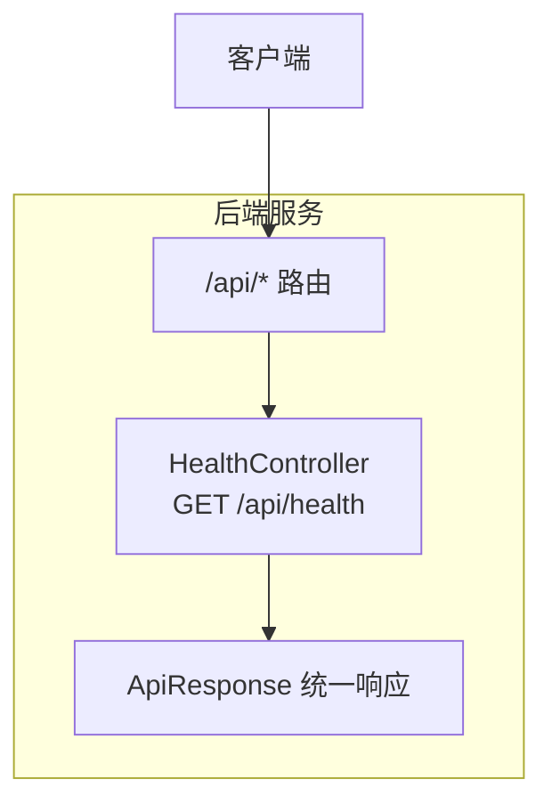
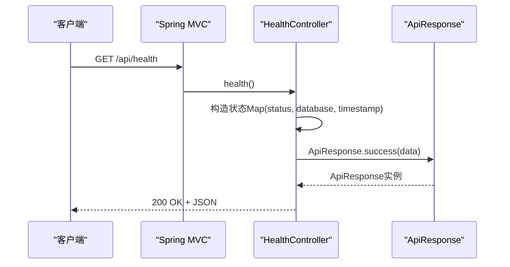
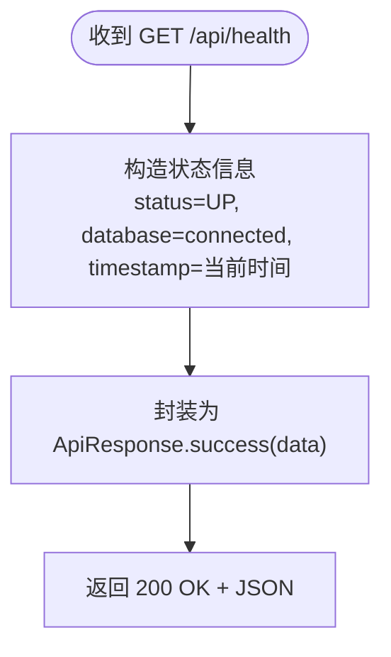
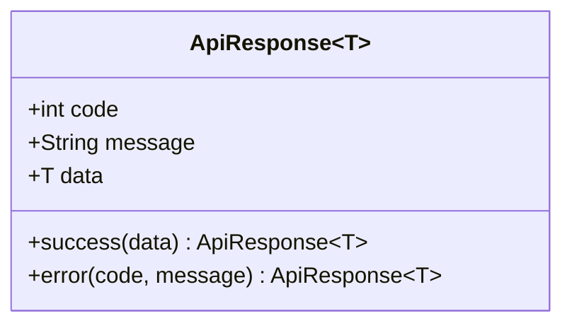
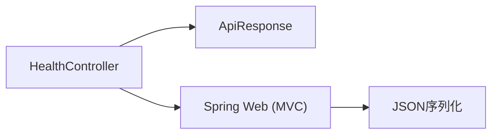

# API接口文档

<cite>
**本文引用的文件**
- [HealthController.java](file://server/src/main/java/com/taskboard/controller/HealthController.java)
- [ApiResponse.java](file://server/src/main/java/com/taskboard/dto/ApiResponse.java)
- [application.properties](file://server/src/main/resources/application.properties)
- [build.gradle.kts](file://server/build.gradle.kts)
- [README.md](file://README.md)
- [HealthControllerTest.java](file://server/src/test/java/com/taskboard/controller/HealthControllerTest.java)
</cite>

## 目录
1. [简介](#简介)
2. [项目结构](#项目结构)
3. [核心组件](#核心组件)
4. [架构总览](#架构总览)
5. [详细组件分析](#详细组件分析)
6. [依赖关系分析](#依赖关系分析)
7. [性能考虑](#性能考虑)
8. [故障排查指南](#故障排查指南)
9. [结论](#结论)
10. [附录](#附录)

## 简介
本接口文档面向TaskBoard RESTful API，重点说明健康检查接口的调用方式、统一响应结构、版本管理策略、错误处理机制以及测试与调试技巧。后端基于Spring Boot 4，所有HTTP响应均通过统一的 ApiResponse<T> 包装，便于前端一致化处理。

## 项目结构
- 后端位于 server 目录，使用 Spring Boot 4 + Gradle Kotlin DSL 构建，默认监听端口 8080，API 前缀为 /api。
- 前端位于 web 目录，开发时通过代理访问后端。
- 数据库采用H2内存数据库，启动时自动初始化schema与数据。

图表来源
- [HealthController.java:14-26](file://server/src/main/java/com/taskboard/controller/HealthController.java#L14-L26)
- [ApiResponse.java:6-26](file://server/src/main/java/com/taskboard/dto/ApiResponse.java#L6-L26)
- [application.properties:1-2](file://server/src/main/resources/application.properties#L1-L2)

章节来源
- [README.md:25-37](file://README.md#L25-L37)
- [application.properties:1-2](file://server/src/main/resources/application.properties#L1-L2)

## 核心组件
- HealthController：提供健康检查端点，返回系统状态信息。
- ApiResponse<T>：统一响应体，包含 code、message、data 三个字段，用于标准化成功与失败响应。

章节来源
- [HealthController.java:14-26](file://server/src/main/java/com/taskboard/controller/HealthController.java#L14-L26)
- [ApiResponse.java:6-26](file://server/src/main/java/com/taskboard/dto/ApiResponse.java#L6-L26)

## 架构总览
请求从客户端进入Spring MVC层，由HealthController处理GET /api/health，构造状态信息并封装到ApiResponse中返回。

图表来源
- [HealthController.java:18-26](file://server/src/main/java/com/taskboard/controller/HealthController.java#L18-L26)
- [ApiResponse.java:20-26](file://server/src/main/java/com/taskboard/dto/ApiResponse.java#L20-L26)

## 详细组件分析

### 健康检查接口（GET /api/health）
- 方法：GET
- URL：/api/health
- 路径前缀：/api（由控制器类级别映射）
- 请求参数：无
- 响应码：200（HTTP状态码）
- 响应体：统一 ApiResponse<T>，其中 data 为 Map<String, String>，包含以下键：
  - status：固定为 UP
  - database：固定为 connected
  - timestamp：当前时间戳字符串

图表来源
- [HealthController.java:18-26](file://server/src/main/java/com/taskboard/controller/HealthController.java#L18-L26)
- [ApiResponse.java:20-26](file://server/src/main/java/com/taskboard/dto/ApiResponse.java#L20-L26)

章节来源
- [HealthController.java:14-26](file://server/src/main/java/com/taskboard/controller/HealthController.java#L14-L26)
- [README.md:50-54](file://README.md#L50-L54)

### 统一响应结构 ApiResponse<T>
- 字段定义：
  - code：整数类型，业务状态码（例如 200 表示成功）
  - message：字符串类型，消息体（例如 Success）
  - data：泛型 T，业务数据载体
- 工厂方法：
  - success(T data)：返回成功响应，code=200，message="Success"
  - error(int code, String message)：返回错误响应，data=null
- 使用约定：
  - 所有HTTP响应均通过 ApiResponse<T> 包装，确保前后端对响应结构的一致性理解

图表来源
- [ApiResponse.java:6-26](file://server/src/main/java/com/taskboard/dto/ApiResponse.java#L6-L26)

章节来源
- [ApiResponse.java:6-53](file://server/src/main/java/com/taskboard/dto/ApiResponse.java#L6-L53)

### API版本管理与向后兼容
- 当前版本策略：
  - 通过URL前缀 /api 进行版本隔离（示例：/api/health）
  - 后续如需升级，可引入 /v1、/v2 等前缀以区分不同大版本
- 向后兼容性建议：
  - 新增可选字段时保持旧客户端可忽略新字段
  - 移除或变更字段需通过新版本路由并提供过渡期
  - 在message或code中明确标识版本变更信息，便于客户端适配

章节来源
- [HealthController.java:14-18](file://server/src/main/java/com/taskboard/controller/HealthController.java#L14-L18)
- [README.md:37-37](file://README.md#L37-L37)

### 错误处理与异常场景
- 当前实现：
  - 健康检查始终返回成功响应，未抛出业务异常
- 通用建议：
  - 使用全局异常处理器将运行时异常转换为 ApiResponse.error(...) 响应
  - 针对参数校验失败、资源不存在、权限不足等场景定义明确的code与message
  - 保持HTTP状态码与业务code的清晰分工：HTTP状态码反映传输层结果，业务code反映应用层语义

章节来源
- [HealthController.java:18-26](file://server/src/main/java/com/taskboard/controller/HealthController.java#L18-L26)
- [ApiResponse.java:20-26](file://server/src/main/java/com/taskboard/dto/ApiResponse.java#L20-L26)

## 依赖关系分析
- HealthController 依赖 ApiResponse 作为响应包装器
- Spring Web 提供MVC路由与JSON序列化能力
- H2数据库配置存在但不影响健康检查接口行为

图表来源
- [HealthController.java:3-7](file://server/src/main/java/com/taskboard/controller/HealthController.java#L3-L7)
- [ApiResponse.java:6-26](file://server/src/main/java/com/taskboard/dto/ApiResponse.java#L6-L26)

章节来源
- [build.gradle.kts:22-31](file://server/build.gradle.kts#L22-L31)
- [application.properties:1-17](file://server/src/main/resources/application.properties#L1-L17)

## 性能考虑
- 健康检查接口为轻量级CPU操作，无外部I/O阻塞，适合高频探测
- 若未来扩展为多组件健康检查（如数据库、缓存），建议异步聚合与超时控制
- 避免在健康检查中执行耗时任务，确保响应时间稳定

[本节为通用指导，不直接分析具体文件]

## 故障排查指南
- 验证接口连通性：
  - 使用curl发起GET请求至 http://localhost:8080/api/health
  - 预期HTTP状态码为200，响应体包含code=200与data.status="UP"
- 单元测试参考：
  - 测试用例断言了HTTP状态码、code与data.status的值，可用于本地回归验证
- 常见问题定位：
  - 若返回非200，检查服务是否启动、端口占用、上下文路径配置
  - 若响应体结构不符，确认Jackson序列化与ApiResponse字段命名

章节来源
- [README.md:50-54](file://README.md#L50-L54)
- [HealthControllerTest.java:29-36](file://server/src/test/java/com/taskboard/controller/HealthControllerTest.java#L29-L36)
- [application.properties:1-2](file://server/src/main/resources/application.properties#L1-L2)

## 结论
TaskBoard后端通过HealthController暴露了简洁的健康检查接口，并以统一的 ApiResponse<T> 规范响应结构。当前版本通过 /api 前缀进行隔离，便于后续演进。建议在后续功能迭代中完善全局异常处理与版本化策略，以提升可维护性与兼容性。

[本节为总结性内容，不直接分析具体文件]

## 附录

### API调用示例
- curl命令
  - 发送GET请求至 http://localhost:8080/api/health
  - 期望返回HTTP 200与包含code、message、data的JSON
- JavaScript客户端示例
  - 使用fetch发起GET请求至 /api/health
  - 解析响应JSON，读取code、message与data字段
  - 根据code判断成功或失败，并在失败时展示message

[本节提供概念性示例，不直接引用代码片段]

### 测试与调试技巧
- 使用MockMvc进行集成测试，断言HTTP状态码与JSON路径
- 结合H2 Console查看数据库状态（如需要）
- 开启SQL日志输出以便观察JPA/Hibernate行为

章节来源
- [HealthControllerTest.java:29-36](file://server/src/test/java/com/taskboard/controller/HealthControllerTest.java#L29-L36)
- [application.properties:12-17](file://server/src/main/resources/application.properties#L12-L17)