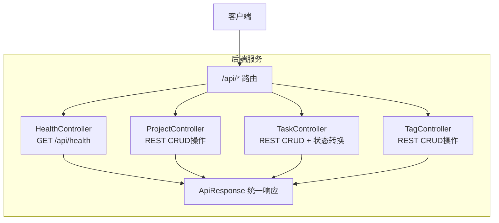
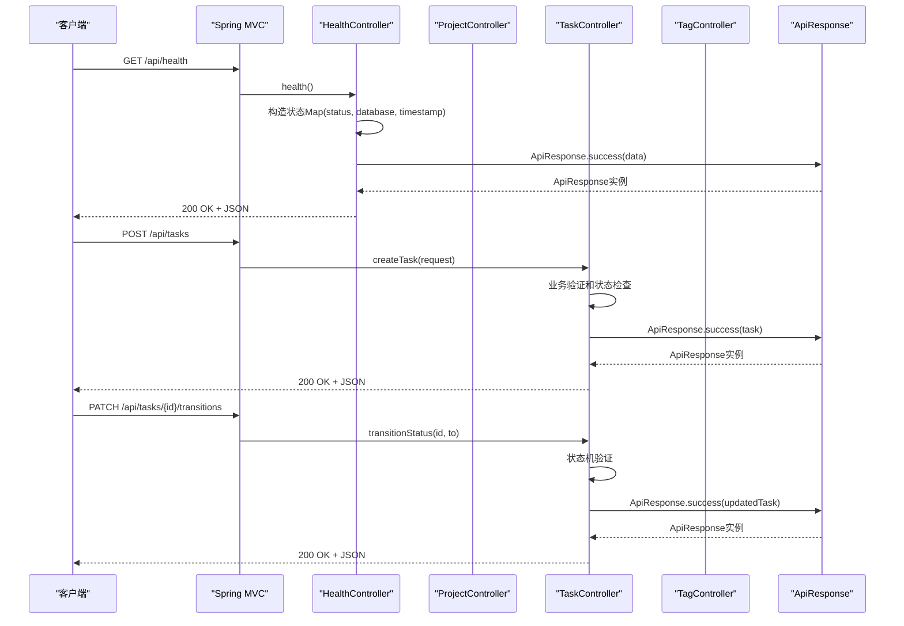
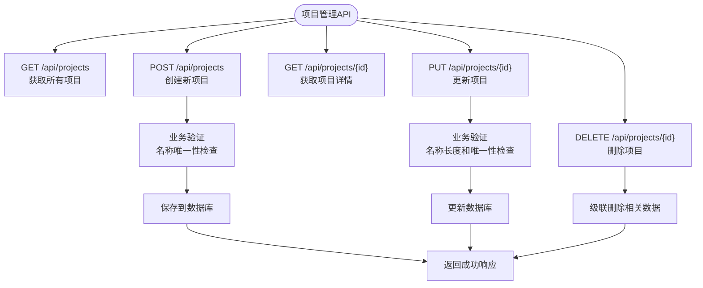
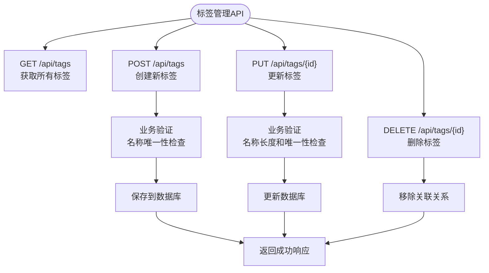
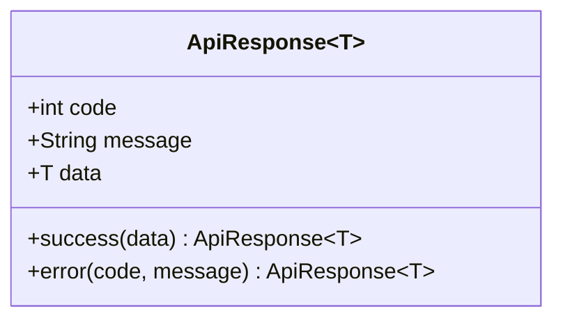
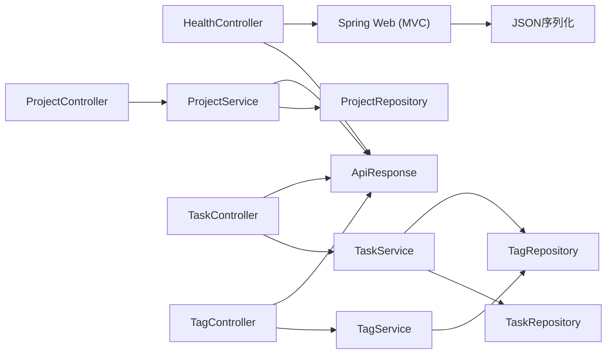

# API接口文档

<cite>
**本文引用的文件**
- [HealthController.java](file://server/src/main/java/com/taskboard/controller/HealthController.java)
- [ProjectController.java](file://server/src/main/java/com/taskboard/controller/ProjectController.java)
- [TaskController.java](file://server/src/main/java/com/taskboard/controller/TaskController.java)
- [TagController.java](file://server/src/main/java/com/taskboard/controller/TagController.java)
- [ApiResponse.java](file://server/src/main/java/com/taskboard/dto/ApiResponse.java)
- [CreateTaskRequest.java](file://server/src/main/java/com/taskboard/dto/CreateTaskRequest.java)
- [UpdateTaskRequest.java](file://server/src/main/java/com/taskboard/dto/UpdateTaskRequest.java)
- [TaskDto.java](file://server/src/main/java/com/taskboard/dto/TaskDto.java)
- [TagDto.java](file://server/src/main/java/com/taskboard/dto/TagDto.java)
- [ProjectService.java](file://server/src/main/java/com/taskboard/service/ProjectService.java)
- [TaskService.java](file://server/src/main/java/com/taskboard/service/TaskService.java)
- [TagService.java](file://server/src/main/java/com/taskboard/service/TagService.java)
- [Project.java](file://server/src/main/java/com/taskboard/entity/Project.java)
- [Task.java](file://server/src/main/java/com/taskboard/entity/Task.java)
- [Tag.java](file://server/src/main/java/com/taskboard/entity/Tag.java)
- [api-contract-v1.yaml](file://docs/architecture/api-contract-v1.yaml)
- [application.properties](file://server/src/main/resources/application.properties)
- [build.gradle.kts](file://server/build.gradle.kts)
- [README.md](file://README.md)
- [HealthControllerTest.java](file://server/src/test/java/com/taskboard/controller/HealthControllerTest.java)
- [ProjectControllerTest.java](file://server/src/test/java/com/taskboard/controller/ProjectControllerTest.java)
</cite>

## 更新摘要
**所做更改**
- 新增任务管理API端点文档（CRUD + 状态转换）
- 新增标签管理API端点文档（RESTful设计模式）
- 扩展统一响应结构说明，包含新的DTO定义
- 添加状态机转换机制说明
- 更新依赖关系分析，包含Task和Tag相关组件
- 完善错误处理机制，包含状态流转异常处理
- 扩展API调用示例，包含任务和标签操作示例

## 目录
1. [简介](#简介)
2. [项目结构](#项目结构)
3. [核心组件](#核心组件)
4. [架构总览](#架构总览)
5. [详细组件分析](#详细组件分析)
6. [依赖关系分析](#依赖关系分析)
7. [性能考虑](#性能考虑)
8. [故障排查指南](#故障排查指南)
9. [结论](#结论)
10. [附录](#附录)

## 简介
本接口文档面向TaskBoard RESTful API，涵盖健康检查接口、项目管理、任务管理和标签管理的完整功能。重点说明API调用方式、统一响应结构、版本管理策略、错误处理机制以及测试与调试技巧。后端基于Spring Boot 4，所有HTTP响应均通过统一的 ApiResponse<T> 包装，便于前端一致化处理。当前实现包含项目管理、任务管理（含状态机转换）和标签管理功能，支持完整的CRUD操作，并遵循OpenAPI v1契约规范。

## 项目结构
- 后端位于 server 目录，使用 Spring Boot 4 + Gradle Kotlin DSL 构建，默认监听端口 8080，API 前缀为 /api。
- 前端位于 web 目录，开发时通过代理访问后端。
- 数据库采用H2内存数据库，启动时自动初始化schema与数据。
- OpenAPI契约定义位于 docs/architecture/api-contract-v1.yaml，规范了所有API端点的行为。



**图表来源**
- [HealthController.java:14-26](file://server/src/main/java/com/taskboard/controller/HealthController.java#L14-L26)
- [ProjectController.java:14-77](file://server/src/main/java/com/taskboard/controller/ProjectController.java#L14-L77)
- [TaskController.java:16-88](file://server/src/main/java/com/taskboard/controller/TaskController.java#L16-L88)
- [TagController.java:14-64](file://server/src/main/java/com/taskboard/controller/TagController.java#L14-L64)
- [ApiResponse.java:6-26](file://server/src/main/java/com/taskboard/dto/ApiResponse.java#L6-L26)

**章节来源**
- [README.md:25-37](file://README.md#L25-L37)
- [application.properties:1-2](file://server/src/main/resources/application.properties#L1-L2)

## 核心组件
- HealthController：提供健康检查端点，返回系统状态信息。
- ProjectController：提供项目管理的RESTful API端点，支持完整的CRUD操作。
- TaskController：提供任务管理的RESTful API端点，支持CRUD操作和状态机转换。
- TagController：提供标签管理的RESTful API端点，支持完整的CRUD操作。
- ApiResponse<T>：统一响应体，包含 code、message、data 三个字段，用于标准化成功与失败响应。
- TaskService：业务逻辑层，处理任务相关的业务规则和状态机验证。
- TagService：业务逻辑层，处理标签相关的业务规则和验证。
- Task实体：JPA实体类，映射数据库task表，支持多对多标签关联。
- Tag实体：JPA实体类，映射数据库tag表。

**章节来源**
- [HealthController.java:14-26](file://server/src/main/java/com/taskboard/controller/HealthController.java#L14-L26)
- [ProjectController.java:14-77](file://server/src/main/java/com/taskboard/controller/ProjectController.java#L14-L77)
- [TaskController.java:16-88](file://server/src/main/java/com/taskboard/controller/TaskController.java#L16-L88)
- [TagController.java:14-64](file://server/src/main/java/com/taskboard/controller/TagController.java#L14-L64)
- [ApiResponse.java:6-26](file://server/src/main/java/com/taskboard/dto/ApiResponse.java#L6-L26)
- [TaskService.java:25-311](file://server/src/main/java/com/taskboard/service/TaskService.java#L25-L311)
- [TagService.java:18-127](file://server/src/main/java/com/taskboard/service/TagService.java#L18-L127)
- [Task.java:11-162](file://server/src/main/java/com/taskboard/entity/Task.java#L11-L162)
- [Tag.java:9-78](file://server/src/main/java/com/taskboard/entity/Tag.java#L9-L78)

## 架构总览
请求从客户端进入Spring MVC层，由相应的Controller处理不同的HTTP请求。健康检查由HealthController处理GET /api/health，项目管理由ProjectController处理RESTful CRUD操作，任务管理由TaskController处理RESTful CRUD和状态转换操作，标签管理由TagController处理RESTful CRUD操作，所有响应都封装到ApiResponse中返回。



**图表来源**
- [HealthController.java:18-26](file://server/src/main/java/com/taskboard/controller/HealthController.java#L18-L26)
- [ProjectController.java:36-44](file://server/src/main/java/com/taskboard/controller/ProjectController.java#L36-L44)
- [TaskController.java:38-43](file://server/src/main/java/com/taskboard/controller/TaskController.java#L38-L43)
- [TaskController.java:70-77](file://server/src/main/java/com/taskboard/controller/TaskController.java#L70-L77)
- [ApiResponse.java:20-26](file://server/src/main/java/com/taskboard/dto/ApiResponse.java#L20-L26)

## 详细组件分析

### 健康检查接口（GET /api/health）
- 方法：GET
- URL：/api/health
- 路径前缀：/api（由控制器类级别映射）
- 请求参数：无
- 响应码：200（HTTP状态码）
- 响应体：统一 ApiResponse<T>，其中 data 为 Map<String, String>，包含以下键：
  - status：固定为 UP
  - database：固定为 connected
  - timestamp：当前时间戳字符串


**图表来源**
- [HealthController.java:18-26](file://server/src/main/java/com/taskboard/controller/HealthController.java#L18-L26)
- [ApiResponse.java:20-26](file://server/src/main/java/com/taskboard/dto/ApiResponse.java#L20-L26)

**章节来源**
- [HealthController.java:14-26](file://server/src/main/java/com/taskboard/controller/HealthController.java#L14-L26)
- [README.md:50-54](file://README.md#L50-L54)

### 项目管理API端点

#### 获取所有项目（GET /api/projects）
- 方法：GET
- URL：/api/projects
- 描述：获取所有项目列表，按创建时间倒序排列
- 请求参数：无
- 响应码：200（HTTP状态码）
- 响应体：ApiResponse<List<Project>>

#### 创建新项目（POST /api/projects）
- 方法：POST
- URL：/api/projects
- 描述：创建新的项目
- 请求参数：
  - name：项目名称（必填）
  - description：项目描述（可选，默认空字符串）
- 响应码：200（HTTP状态码）
- 响应体：ApiResponse<Project>

#### 获取项目详情（GET /api/projects/{id}）
- 方法：GET
- URL：/api/projects/{id}
- 描述：根据ID获取项目详情
- 路径参数：
  - id：项目ID（必填）
- 响应码：200（HTTP状态码），404（项目不存在）
- 响应体：ApiResponse<Project>

#### 更新项目（PUT /api/projects/{id}）
- 方法：PUT
- URL：/api/projects/{id}
- 描述：更新现有项目信息
- 路径参数：
  - id：项目ID（必填）
- 请求参数：
  - name：项目名称（可选）
  - description：项目描述（可选）
- 响应码：200（HTTP状态码），404（项目不存在），409（名称冲突）
- 响应体：ApiResponse<Project>

#### 删除项目（DELETE /api/projects/{id}）
- 方法：DELETE
- URL：/api/projects/{id}
- 描述：删除指定项目（级联删除其下所有任务）
- 路径参数：
  - id：项目ID（必填）
- 响应码：200（HTTP状态码），404（项目不存在）
- 响应体：ApiResponse<Void>



**图表来源**
- [ProjectController.java:27-76](file://server/src/main/java/com/taskboard/controller/ProjectController.java#L27-L76)
- [ProjectService.java:45-115](file://server/src/main/java/com/taskboard/service/ProjectService.java#L45-L115)

**章节来源**
- [ProjectController.java:14-77](file://server/src/main/java/com/taskboard/controller/ProjectController.java#L14-L77)
- [ProjectService.java:15-117](file://server/src/main/java/com/taskboard/service/ProjectService.java#L15-L117)

### 任务管理API端点

#### 获取所有任务（GET /api/tasks）
- 方法：GET
- URL：/api/tasks
- 描述：获取所有任务列表，按创建时间倒序排列
- 请求参数：无
- 响应码：200（HTTP状态码）
- 响应体：ApiResponse<List<TaskDto>>

#### 创建新任务（POST /api/tasks）
- 方法：POST
- URL：/api/tasks
- 描述：创建新的任务
- 请求参数：
  - projectId：所属项目ID（必填）
  - title：任务标题（必填）
  - description：任务描述（可选）
  - status：任务状态（可选，默认TODO）
  - priority：优先级（可选，默认0）
  - dueAt：到期时间（可选，ISO-8601格式）
  - tagIds：关联标签ID列表（可选）
- 响应码：200（HTTP状态码）
- 响应体：ApiResponse<TaskDto>

#### 获取任务详情（GET /api/tasks/{id}）
- 方法：GET
- URL：/api/tasks/{id}
- 描述：根据ID获取任务详情
- 路径参数：
  - id：任务ID（必填）
- 响应码：200（HTTP状态码），404（任务不存在）
- 响应体：ApiResponse<TaskDto>

#### 更新任务（PUT /api/tasks/{id}）
- 方法：PUT
- URL：/api/tasks/{id}
- 描述：更新现有任务信息（不包含状态变更）
- 路径参数：
  - id：任务ID（必填）
- 请求参数：
  - title：任务标题（可选）
  - description：任务描述（可选）
  - priority：优先级（可选）
  - dueAt：到期时间（可选）
  - tagIds：关联标签ID列表（可选）
- 响应码：200（HTTP状态码），404（任务不存在）
- 响应体：ApiResponse<TaskDto>

#### 状态转换（PATCH /api/tasks/{id}/transitions）
- 方法：PATCH
- URL：/api/tasks/{id}/transitions
- 描述：执行任务状态转换，受状态机规则约束
- 路径参数：
  - id：任务ID（必填）
- 查询参数：
  - to：目标状态（必填，枚举值：TODO, IN_PROGRESS, DONE, CLOSED）
- 响应码：200（HTTP状态码），400（非法状态转换），404（任务不存在）
- 响应体：ApiResponse<TaskDto>

#### 删除任务（DELETE /api/tasks/{id}）
- 方法：DELETE
- URL：/api/tasks/{id}
- 描述：删除指定任务（级联删除其TimeLog记录，解除与Tag的关联）
- 路径参数：
  - id：任务ID（必填）
- 响应码：200（HTTP状态码），404（任务不存在）
- 响应体：ApiResponse<Void>

```mermaid
stateDiagram-v2
[*] --> TODO
TODO --> IN_PROGRESS : 合法
IN_PROGRESS --> DONE : 合法
IN_PROGRESS --> TODO : 回退，合法
DONE --> CLOSED : 合法
DONE --> IN_PROGRESS : 重开，合法
CLOSED --> [*]
NOTE : 终态不可修改
```

**图表来源**
- [TaskController.java:29-87](file://server/src/main/java/com/taskboard/controller/TaskController.java#L29-L87)
- [TaskService.java:157-170](file://server/src/main/java/com/taskboard/service/TaskService.java#L157-L170)
- [TaskService.java:248-267](file://server/src/main/java/com/taskboard/service/TaskService.java#L248-L267)

**章节来源**
- [TaskController.java:16-88](file://server/src/main/java/com/taskboard/controller/TaskController.java#L16-L88)
- [TaskService.java:25-311](file://server/src/main/java/com/taskboard/service/TaskService.java#L25-L311)

### 标签管理API端点

#### 获取所有标签（GET /api/tags）
- 方法：GET
- URL：/api/tags
- 描述：获取所有标签列表，按创建时间倒序排列
- 请求参数：无
- 响应码：200（HTTP状态码）
- 响应体：ApiResponse<List<TagDto>>

#### 创建新标签（POST /api/tags）
- 方法：POST
- URL：/api/tags
- 描述：创建新的标签
- 请求参数：
  - name：标签名称（必填，全局唯一）
- 响应码：200（HTTP状态码），409（名称冲突）
- 响应体：ApiResponse<TagDto>

#### 更新标签（PUT /api/tags/{id}）
- 方法：PUT
- URL：/api/tags/{id}
- 描述：更新现有标签信息
- 路径参数：
  - id：标签ID（必填）
- 请求参数：
  - name：标签名称（可选）
- 响应码：200（HTTP状态码），404（标签不存在），409（名称冲突）
- 响应体：ApiResponse<TagDto>

#### 删除标签（DELETE /api/tags/{id}）
- 方法：DELETE
- URL：/api/tags/{id}
- 描述：删除指定标签（仅移除关联，不删除关联的任务）
- 路径参数：
  - id：标签ID（必填）
- 响应码：200（HTTP状态码），404（标签不存在）
- 响应体：ApiResponse<Void>



**图表来源**
- [TagController.java:27-63](file://server/src/main/java/com/taskboard/controller/TagController.java#L27-L63)
- [TagService.java:40-98](file://server/src/main/java/com/taskboard/service/TagService.java#L40-L98)

**章节来源**
- [TagController.java:14-64](file://server/src/main/java/com/taskboard/controller/TagController.java#L14-L64)
- [TagService.java:18-127](file://server/src/main/java/com/taskboard/service/TagService.java#L18-L127)

### 统一响应结构 ApiResponse<T>
- 字段定义：
  - code：整数类型，业务状态码（0表示成功，符合OpenAPI契约规范）
  - message：字符串类型，消息体（例如 "Success"）
  - data：泛型 T，业务数据载体
- 工厂方法：
  - success(T data)：返回成功响应，code=0，message="Success"
  - error(int code, String message)：返回错误响应，data=null
- 使用约定：
  - 所有HTTP响应均通过 ApiResponse<T> 包装，确保前后端对响应结构的一致性理解
  - 成功响应的code字段固定为0，而非HTTP状态码



**图表来源**
- [ApiResponse.java:6-26](file://server/src/main/java/com/taskboard/dto/ApiResponse.java#L6-L26)

**章节来源**
- [ApiResponse.java:6-52](file://server/src/main/java/com/taskboard/dto/ApiResponse.java#L6-L52)

### API版本管理与向后兼容
- 当前版本策略：
  - 通过URL前缀 /api 进行版本隔离（示例：/api/health, /api/projects, /api/tasks, /api/tags）
  - 后续如需升级，可引入 /v1、/v2 等前缀以区分不同大版本
  - OpenAPI契约文件 api-contract-v1.yaml 定义了v1版本的完整规范
- 向后兼容性建议：
  - 新增可选字段时保持旧客户端可忽略新字段
  - 移除或变更字段需通过新版本路由并提供过渡期
  - 在message或code中明确标识版本变更信息，便于客户端适配
  - 保持HTTP状态码与业务code的清晰分工

**章节来源**
- [HealthController.java:14-18](file://server/src/main/java/com/taskboard/controller/HealthController.java#L14-L18)
- [ProjectController.java:14-16](file://server/src/main/java/com/taskboard/controller/ProjectController.java#L14-L16)
- [TaskController.java:16-18](file://server/src/main/java/com/taskboard/controller/TaskController.java#L16-L18)
- [TagController.java:14-16](file://server/src/main/java/com/taskboard/controller/TagController.java#L14-L16)
- [api-contract-v1.yaml:1-5](file://docs/architecture/api-contract-v1.yaml#L1-L5)

### 错误处理与异常场景
- 健康检查：始终返回成功响应，未抛出业务异常
- 项目管理：
  - 参数验证失败：返回400 HTTP状态码，包含具体错误信息
  - 资源不存在：返回404 HTTP状态码
  - 名称冲突：返回409 HTTP状态码（重复的项目名称）
  - 业务规则违反：抛出ResponseStatusException，转换为适当的HTTP状态码
- 任务管理：
  - 参数验证失败：返回400 HTTP状态码，包含具体错误信息
  - 资源不存在：返回404 HTTP状态码
  - 非法状态转换：返回400 HTTP状态码，包含状态转换错误信息
  - 优先级范围无效：返回400 HTTP状态码
  - 业务规则违反：抛出ResponseStatusException，转换为适当的HTTP状态码
- 标签管理：
  - 参数验证失败：返回400 HTTP状态码，包含具体错误信息
  - 资源不存在：返回404 HTTP状态码
  - 名称冲突：返回409 HTTP状态码（重复的标签名称）
  - 业务规则违反：抛出ResponseStatusException，转换为适当的HTTP状态码
- 通用建议：
  - 使用全局异常处理器将运行时异常转换为 ApiResponse.error(...) 响应
  - 针对参数校验失败、资源不存在、权限不足等场景定义明确的code与message
  - 保持HTTP状态码与业务code的清晰分工：HTTP状态码反映传输层结果，业务code反映应用层语义

**章节来源**
- [HealthController.java:18-26](file://server/src/main/java/com/taskboard/controller/HealthController.java#L18-L26)
- [ProjectService.java:45-115](file://server/src/main/java/com/taskboard/service/ProjectService.java#L45-L115)
- [TaskService.java:67-185](file://server/src/main/java/com/taskboard/service/TaskService.java#L67-L185)
- [TagService.java:40-98](file://server/src/main/java/com/taskboard/service/TagService.java#L40-L98)
- [ApiResponse.java:20-26](file://server/src/main/java/com/taskboard/dto/ApiResponse.java#L20-L26)

## 依赖关系分析
- HealthController 依赖 ApiResponse 作为响应包装器
- ProjectController 依赖 ProjectService 处理业务逻辑
- TaskController 依赖 TaskService 处理业务逻辑
- TagController 依赖 TagService 处理业务逻辑
- ProjectService 依赖 ProjectRepository 进行数据持久化
- TaskService 依赖 TaskRepository 和 TagRepository 进行数据持久化
- TagService 依赖 TagRepository 进行数据持久化
- Spring Web 提供MVC路由与JSON序列化能力
- H2数据库配置存在但不影响健康检查接口行为



**图表来源**
- [HealthController.java:3-7](file://server/src/main/java/com/taskboard/controller/HealthController.java#L3-L7)
- [ProjectController.java:3-8](file://server/src/main/java/com/taskboard/controller/ProjectController.java#L3-L8)
- [TaskController.java:3-8](file://server/src/main/java/com/taskboard/controller/TaskController.java#L3-L8)
- [TagController.java:3-7](file://server/src/main/java/com/taskboard/controller/TagController.java#L3-L7)
- [ProjectService.java:3-8](file://server/src/main/java/com/taskboard/service/ProjectService.java#L3-L8)
- [TaskService.java:3-10](file://server/src/main/java/com/taskboard/service/TaskService.java#L3-L10)
- [TagService.java:3-5](file://server/src/main/java/com/taskboard/service/TagService.java#L3-L5)
- [ApiResponse.java:6-26](file://server/src/main/java/com/taskboard/dto/ApiResponse.java#L6-L26)

**章节来源**
- [build.gradle.kts:22-31](file://server/build.gradle.kts#L22-L31)
- [application.properties:1-17](file://server/src/main/resources/application.properties#L1-L17)

## 性能考虑
- 健康检查接口为轻量级CPU操作，无外部I/O阻塞，适合高频探测
- 项目管理接口当前返回全量数据，未实现分页（符合charter要求）
- 任务管理接口当前返回全量数据，未实现分页（符合charter要求）
- 标签管理接口当前返回全量数据，未实现分页（符合charter要求）
- 若未来扩展为多组件健康检查（如数据库、缓存），建议异步聚合与超时控制
- 避免在健康检查中执行耗时任务，确保响应时间稳定
- 项目查询使用ORDER BY created_at DESC排序，注意大数据量时的性能影响
- 任务查询使用ORDER BY created_at DESC排序，注意大数据量时的性能影响
- 标签查询使用ORDER BY created_at DESC排序，注意大数据量时的性能影响
- 任务状态转换操作涉及业务逻辑验证，应避免频繁调用

## 故障排查指南
- 验证接口连通性：
  - 使用curl发起GET请求至 http://localhost:8080/api/health
  - 预期HTTP状态码为200，响应体包含code=0与data.status="UP"
- 项目管理API测试：
  - 测试用例断言了HTTP状态码、code与data的值，可用于本地回归验证
  - 验证项目创建、更新、删除操作的完整性
- 任务管理API测试：
  - 验证任务创建、更新、删除操作的完整性
  - 测试状态转换的合法性，包括合法和非法的状态转换场景
  - 验证任务与标签的多对多关联关系
- 标签管理API测试：
  - 验证标签创建、更新、删除操作的完整性
  - 测试标签名称的唯一性约束
- 常见问题定位：
  - 若返回非200，检查服务是否启动、端口占用、上下文路径配置
  - 若响应体结构不符，确认Jackson序列化与ApiResponse字段命名
  - 项目创建失败时检查名称唯一性约束
  - 项目更新失败时检查名称长度限制（≤64字符）和描述长度限制（≤512字符）
  - 任务创建失败时检查标题长度限制（≤128字符）、描述长度限制（≤1024字符）和优先级范围（0-3）
  - 任务状态转换失败时检查状态机规则的合法性
  - 标签创建失败时检查名称长度限制（≤64字符）和唯一性约束

**章节来源**
- [README.md:50-54](file://README.md#L50-L54)
- [HealthControllerTest.java:29-36](file://server/src/test/java/com/taskboard/controller/HealthControllerTest.java#L29-L36)
- [ProjectControllerTest.java:43-114](file://server/src/test/java/com/taskboard/controller/ProjectControllerTest.java#L43-L114)
- [application.properties:1-2](file://server/src/main/resources/application.properties#L1-L2)

## 结论
TaskBoard后端通过HealthController暴露了简洁的健康检查接口，并通过ProjectController提供了完整的项目管理CRUD功能，通过TaskController提供了任务管理CRUD功能和状态机转换机制，通过TagController提供了标签管理CRUD功能。所有接口均以统一的 ApiResponse<T> 规范响应结构，当前版本通过 /api 前缀进行隔离，便于后续演进。项目实现了完整的业务验证、错误处理和事务管理，符合OpenAPI v1契约规范。建议在后续功能迭代中完善全局异常处理与版本化策略，以提升可维护性与兼容性。

## 附录

### API调用示例
- curl命令
  - 健康检查：`curl http://localhost:8080/api/health`
  - 获取项目列表：`curl http://localhost:8080/api/projects`
  - 创建项目：`curl -X POST http://localhost:8080/api/projects -d "name=测试项目&description=测试描述"`
  - 获取项目详情：`curl http://localhost:8080/api/projects/1`
  - 更新项目：`curl -X PUT http://localhost:8080/api/projects/1 -d "name=更新后的名称"`
  - 删除项目：`curl -X DELETE http://localhost:8080/api/projects/1`
  - 获取任务列表：`curl http://localhost:8080/api/tasks`
  - 创建任务：`curl -X POST http://localhost:8080/api/tasks -d "projectId=1&title=测试任务&description=测试描述&priority=1"`
  - 获取任务详情：`curl http://localhost:8080/api/tasks/1`
  - 更新任务：`curl -X PUT http://localhost:8080/api/tasks/1 -d "title=更新后的任务标题"`
  - 状态转换：`curl -X PATCH http://localhost:8080/api/tasks/1/transitions -d "to=IN_PROGRESS"`
  - 删除任务：`curl -X DELETE http://localhost:8080/api/tasks/1`
  - 获取标签列表：`curl http://localhost:8080/api/tags`
  - 创建标签：`curl -X POST http://localhost:8080/api/tags -d "name=紧急"`
  - 更新标签：`curl -X PUT http://localhost:8080/api/tags/1 -d "name=重要"`
  - 删除标签：`curl -X DELETE http://localhost:8080/api/tags/1`
- JavaScript客户端示例
  - 使用fetch发起GET请求至 /api/health
  - 解析响应JSON，读取code、message与data字段
  - 根据code判断成功或失败（code===0表示成功），并在失败时展示message

### 测试与调试技巧
- 使用MockMvc进行集成测试，断言HTTP状态码与JSON路径
- 结合H2 Console查看数据库状态（如需要）
- 开启SQL日志输出以便观察JPA/Hibernate行为
- 参考ProjectControllerTest中的测试用例了解API的正确用法
- 使用Postman或Swagger UI进行API调试和验证
- 测试任务状态转换时，应覆盖所有合法和非法的状态转换场景
- 测试标签关联时，应验证多对多关系的正确性

**章节来源**
- [HealthControllerTest.java:29-36](file://server/src/test/java/com/taskboard/controller/HealthControllerTest.java#L29-L36)
- [ProjectControllerTest.java:43-114](file://server/src/test/java/com/taskboard/controller/ProjectControllerTest.java#L43-L114)
- [application.properties:12-17](file://server/src/main/resources/application.properties#L12-L17)