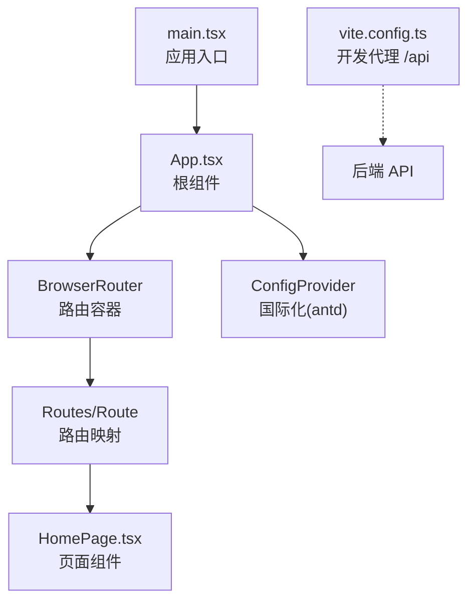
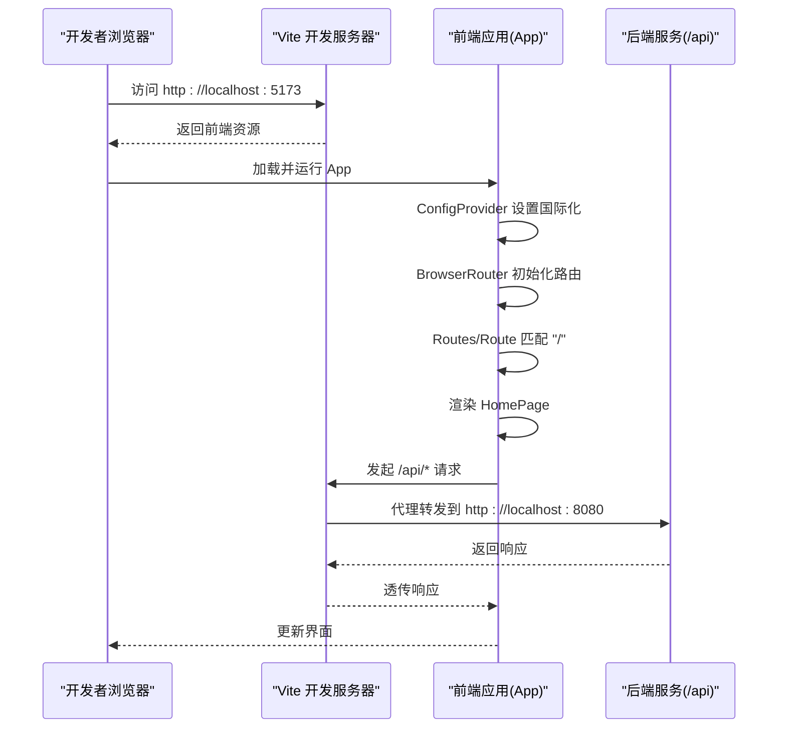
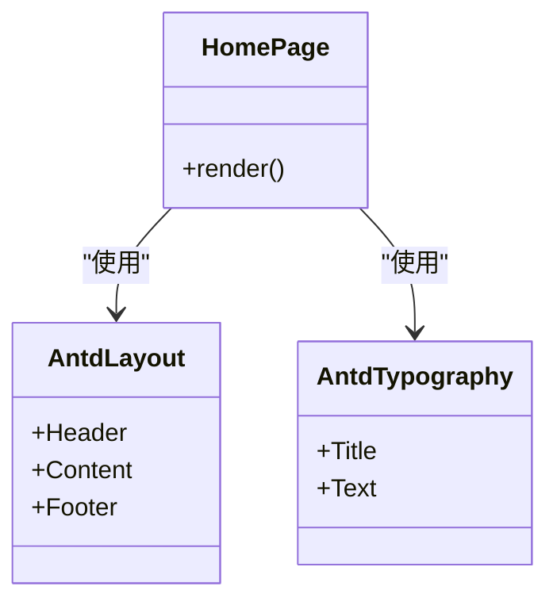
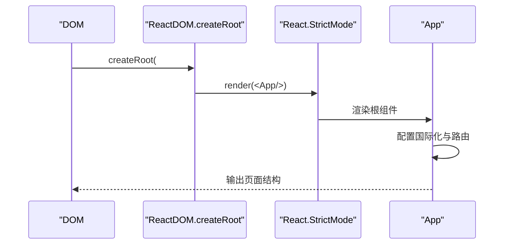
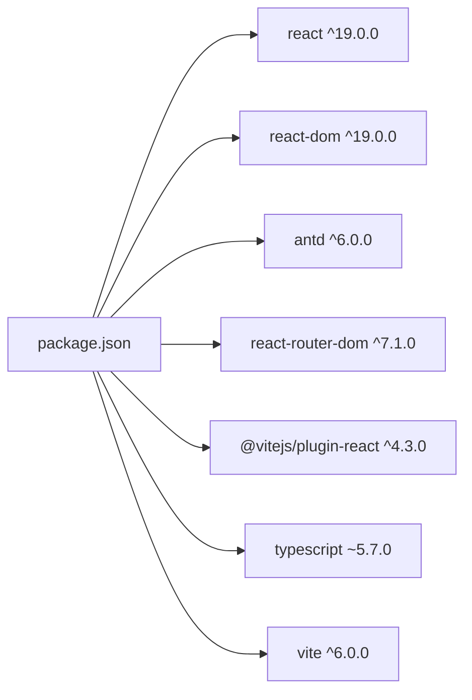

# React应用架构

<cite>
**本文引用的文件**   
- [web/src/App.tsx](file://web/src/App.tsx)
- [web/src/pages/HomePage.tsx](file://web/src/pages/HomePage.tsx)
- [web/src/main.tsx](file://web/src/main.tsx)
- [web/package.json](file://web/package.json)
- [web/vite.config.ts](file://web/vite.config.ts)
- [web/tsconfig.json](file://web/tsconfig.json)
- [web/src/App.css](file://web/src/App.css)
- [README.md](file://README.md)
</cite>

## 目录
1. [简介](#简介)
2. [项目结构](#项目结构)
3. [核心组件](#核心组件)
4. [架构总览](#架构总览)
5. [详细组件分析](#详细组件分析)
6. [依赖关系分析](#依赖关系分析)
7. [性能与优化](#性能与优化)
8. [故障排查指南](#故障排查指南)
9. [结论](#结论)
10. [附录](#附录)

## 简介
本技术文档聚焦TaskBoard前端React应用的现代化架构设计，基于React 19、TypeScript、Vite与Ant Design 6。重点解析App根组件的架构（路由、国际化配置、路由映射）、HomePage页面组件的职责划分与组件化原则，并总结React函数组件、Hooks使用规范、状态管理与组件通信模式，以及代码组织与复用建议。

## 项目结构
前端位于web目录，采用功能目录划分：
- src/main.tsx：应用入口，挂载根组件并启用严格模式
- src/App.tsx：根组件，负责全局国际化与路由配置
- src/pages/HomePage.tsx：首页页面组件，展示基础布局与欢迎信息
- vite.config.ts：开发服务器代理配置，将/api请求转发至后端
- package.json：依赖与脚本定义
- tsconfig.json：TypeScript编译选项
- App.css：全局样式重置



图表来源
- [web/src/main.tsx:1-11](file://web/src/main.tsx#L1-L11)
- [web/src/App.tsx:1-19](file://web/src/App.tsx#L1-L19)
- [web/vite.config.ts:1-15](file://web/vite.config.ts#L1-L15)

章节来源
- [web/src/main.tsx:1-11](file://web/src/main.tsx#L1-L11)
- [web/src/App.tsx:1-19](file://web/src/App.tsx#L1-L19)
- [web/src/pages/HomePage.tsx:1-42](file://web/src/pages/HomePage.tsx#L1-L42)
- [web/vite.config.ts:1-15](file://web/vite.config.ts#L1-L15)
- [web/package.json:1-25](file://web/package.json#L1-L25)
- [web/tsconfig.json:1-22](file://web/tsconfig.json#L1-L22)
- [web/src/App.css:1-4](file://web/src/App.css#L1-L4)
- [README.md:1-63](file://README.md#L1-L63)

## 核心组件
- 应用入口 main.tsx
  - 职责：创建React根节点，渲染App组件，启用StrictMode以增强开发期检查
  - 关键点：使用createRoot进行挂载；通过React.StrictMode包裹App
- 根组件 App.tsx
  - 职责：提供全局国际化（antd中文语言包），配置BrowserRouter与Routes，注册根路由到HomePage
  - 关键点：ConfigProvider包裹整个应用；BrowserRouter作为路由上下文；Routes内声明Route映射
- 页面组件 HomePage.tsx
  - 职责：使用antd Layout构建头部、内容区与页脚，展示标题与欢迎文本
  - 关键点：纯展示型组件，无内部状态；通过样式实现布局与视觉风格

章节来源
- [web/src/main.tsx:1-11](file://web/src/main.tsx#L1-L11)
- [web/src/App.tsx:1-19](file://web/src/App.tsx#L1-L19)
- [web/src/pages/HomePage.tsx:1-42](file://web/src/pages/HomePage.tsx#L1-L42)

## 架构总览
整体架构遵循“入口 -> 根组件 -> 路由 -> 页面”的分层模式，结合antd提供UI能力，Vite提供开发与构建工具链，并通过代理将前端API调用转发至Spring Boot后端。



图表来源
- [web/src/App.tsx:1-19](file://web/src/App.tsx#L1-L19)
- [web/vite.config.ts:1-15](file://web/vite.config.ts#L1-L15)
- [web/src/main.tsx:1-11](file://web/src/main.tsx#L1-L11)

## 详细组件分析

### App根组件架构
- 国际化配置
  - 通过ConfigProvider注入antd中文语言包，确保所有antd组件默认文案为中文
- 路由配置
  - 使用BrowserRouter提供路由上下文
  - Routes集中管理路由表，当前仅有一个根路由"/"指向HomePage
- 扩展点
  - 可在Routes中继续添加子路由，如任务看板、用户管理等页面
  - 可引入路由守卫或权限控制逻辑（例如在Route外层包装高阶组件）

```mermaid
flowchart TD
Start(["应用启动"]) --> InitRouter["初始化 BrowserRouter"]
InitRouter --> SetLocale["设置 antd 国际化(zh_CN)"]
SetLocale --> MatchRoute["匹配 Routes 中的 Route"]
MatchRoute --> |path="/"| RenderHome["渲染 HomePage"]
MatchRoute --> |其他路径| NotFound["预留 404 处理"]
RenderHome --> End(["页面就绪"])
NotFound --> End
```

图表来源
- [web/src/App.tsx:1-19](file://web/src/App.tsx#L1-L19)

章节来源
- [web/src/App.tsx:1-19](file://web/src/App.tsx#L1-L19)

### HomePage页面组件
- 职责边界
  - 负责顶层布局（Header/Content/Footer）与品牌展示
  - 保持无状态展示，便于后续拆分出更细粒度的业务组件
- 组件化原则
  - 单一职责：只做布局与静态文案展示
  - 可组合性：未来可将Logo、导航、欢迎卡片等拆分为独立组件
  - 样式隔离：当前使用内联样式，建议逐步迁移至CSS Modules或Tailwind以提升可维护性



图表来源
- [web/src/pages/HomePage.tsx:1-42](file://web/src/pages/HomePage.tsx#L1-L42)

章节来源
- [web/src/pages/HomePage.tsx:1-42](file://web/src/pages/HomePage.tsx#L1-L42)

### 应用入口与生命周期
- 入口main.tsx
  - 使用ReactDOM.createRoot挂载根节点
  - 通过React.StrictMode开启严格模式，帮助发现潜在问题（如副作用、不稳定的渲染）
- 生命周期要点
  - 函数组件配合Hooks替代类组件生命周期
  - 当前页面为无状态展示，不涉及复杂副作用；后续可增加useEffect用于数据获取与清理



图表来源
- [web/src/main.tsx:1-11](file://web/src/main.tsx#L1-L11)
- [web/src/App.tsx:1-19](file://web/src/App.tsx#L1-L19)

章节来源
- [web/src/main.tsx:1-11](file://web/src/main.tsx#L1-L11)

## 依赖关系分析
- 运行时依赖
  - react/react-dom：React 19运行时
  - antd：UI组件库与国际化支持
  - react-router-dom：客户端路由
- 开发依赖
  - vite：构建与开发服务器
  - @vitejs/plugin-react：React JSX支持
  - typescript：类型系统
- 构建与脚本
  - dev/build/preview脚本由Vite驱动
  - TypeScript编译选项启用严格模式与ESNext模块



图表来源
- [web/package.json:1-25](file://web/package.json#L1-L25)

章节来源
- [web/package.json:1-25](file://web/package.json#L1-L25)
- [web/tsconfig.json:1-22](file://web/tsconfig.json#L1-L22)

## 性能与优化
- 路由与代码分割
  - 建议在新增页面时使用React.lazy与Suspense进行按需加载，减少首屏体积
- 组件渲染优化
  - 对频繁更新的列表或大组件使用React.memo包裹
  - 合理拆分组件，避免不必要的重渲染
- Hooks最佳实践
  - 使用useMemo缓存计算密集型结果
  - 使用useCallback稳定回调引用，避免子组件不必要重渲染
- 样式与主题
  - 利用antd ConfigProvider的主题定制能力，减少重复样式
- 构建优化
  - 保持TS严格模式，尽早发现类型错误
  - 合理使用Vite插件与分包策略

[本节为通用指导，不直接分析具体文件]

## 故障排查指南
- 路由未生效
  - 确认BrowserRouter已包裹应用且Routes内有匹配的Route
  - 检查路径是否一致（区分大小写）
- 国际化无效
  - 确认ConfigProvider包裹了需要国际化的组件树，且locale设置为zh_CN
- 代理失败
  - 检查vite.config.ts中server.proxy配置是否正确，目标地址是否为http://localhost:8080
  - 确认后端服务已启动并可访问
- 样式异常
  - 检查App.css是否被正确引入，body margin是否被重置
- 类型错误
  - 根据tsconfig.json的严格选项定位问题，优先修复noUnusedLocals/noUnusedParameters等提示

章节来源
- [web/src/App.tsx:1-19](file://web/src/App.tsx#L1-L19)
- [web/vite.config.ts:1-15](file://web/vite.config.ts#L1-L15)
- [web/src/App.css:1-4](file://web/src/App.css#L1-L4)
- [web/tsconfig.json:1-22](file://web/tsconfig.json#L1-L22)

## 结论
该前端应用采用清晰的层次结构与现代化的技术栈：入口负责挂载，根组件负责全局配置与路由，页面组件专注展示。结合antd与react-router-dom提供了可扩展的基础设施。后续可在现有基础上引入代码分割、状态管理（如Context/Zustand/Redux Toolkit）与更细粒度的组件拆分，以支撑复杂的任务看板业务场景。

[本节为总结性内容，不直接分析具体文件]

## 附录
- 快速开始
  - 前端：npm install && npm run dev
  - 后端：参考仓库说明启动Spring Boot服务
- 关键配置文件
  - vite.config.ts：开发代理配置
  - tsconfig.json：TypeScript编译选项
  - package.json：依赖与脚本

章节来源
- [README.md:1-63](file://README.md#L1-L63)
- [web/vite.config.ts:1-15](file://web/vite.config.ts#L1-L15)
- [web/tsconfig.json:1-22](file://web/tsconfig.json#L1-L22)
- [web/package.json:1-25](file://web/package.json#L1-L25)