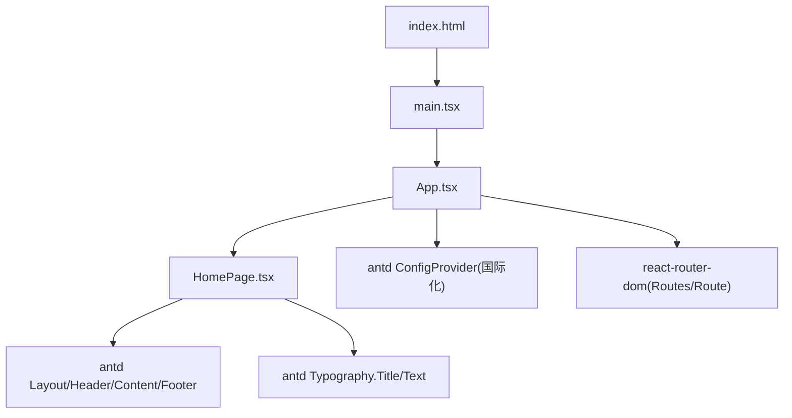
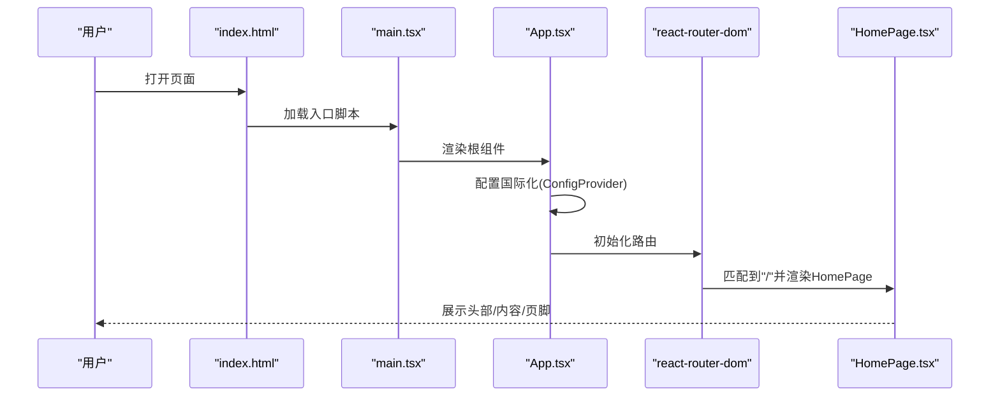
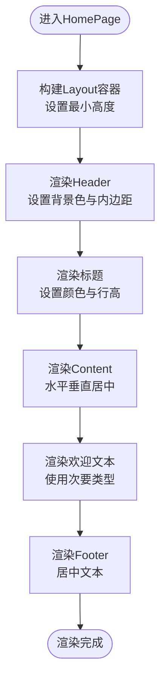
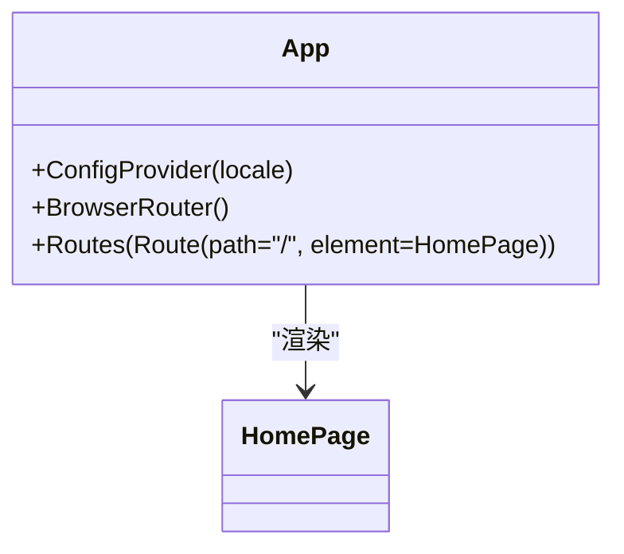
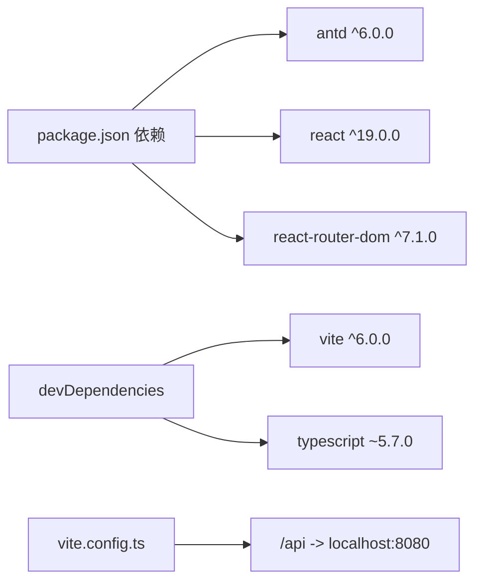

# UI组件设计

<cite>
**本文引用的文件**
- [HomePage.tsx](file://web/src/pages/HomePage.tsx)
- [App.tsx](file://web/src/App.tsx)
- [main.tsx](file://web/src/main.tsx)
- [package.json](file://web/package.json)
- [vite.config.ts](file://web/vite.config.ts)
- [index.html](file://web/index.html)
- [App.css](file://web/src/App.css)
- [README.md](file://README.md)
</cite>

## 目录
1. [简介](#简介)
2. [项目结构](#项目结构)
3. [核心组件](#核心组件)
4. [架构总览](#架构总览)
5. [详细组件分析](#详细组件分析)
6. [依赖分析](#依赖分析)
7. [性能考虑](#性能考虑)
8. [故障排查指南](#故障排查指南)
9. [结论](#结论)
10. [附录](#附录)

## 简介
本技术文档聚焦TaskBoard前端UI组件设计，围绕基于Ant Design 6的企业级UI集成方案展开。重点说明HomePage页面组件的布局模式、组件组合与样式管理策略；解释Ant Design的配置选项、主题定制和本地化设置；梳理CSS组织方式、响应式设计与移动端适配思路；并提供组件使用规范、可访问性支持与用户体验优化建议，以及样式定制与扩展的最佳实践。

## 项目结构
前端采用React 19 + TypeScript + Vite构建，路由使用react-router-dom，UI库为Ant Design 6。入口文件挂载根组件并引入全局样式；应用层通过ConfigProvider配置国际化；页面层以HomePage为核心展示布局。

图表来源
- [index.html:1-14](file://web/index.html#L1-L14)
- [main.tsx:1-11](file://web/src/main.tsx#L1-L11)
- [App.tsx:1-19](file://web/src/App.tsx#L1-L19)
- [HomePage.tsx:1-42](file://web/src/pages/HomePage.tsx#L1-L42)

章节来源
- [README.md:1-63](file://README.md#L1-L63)
- [package.json:1-25](file://web/package.json#L1-L25)
- [vite.config.ts:1-15](file://web/vite.config.ts#L1-L15)

## 核心组件
- App（应用壳）：负责全局配置（国际化）、路由容器与页面挂载。
- HomePage（首页）：基于Ant Design Layout构建基础三栏布局（Header/Content/Footer），并使用Typography进行标题与文本展示。
- main.tsx（入口）：创建React根节点并渲染App。
- index.html（HTML模板）：提供根节点与视口配置，确保移动端友好。
- App.css（全局样式）：重置body边距，保证内容区域完整显示。

章节来源
- [App.tsx:1-19](file://web/src/App.tsx#L1-L19)
- [HomePage.tsx:1-42](file://web/src/pages/HomePage.tsx#L1-L42)
- [main.tsx:1-11](file://web/src/main.tsx#L1-L11)
- [index.html:1-14](file://web/index.html#L1-L14)
- [App.css:1-4](file://web/src/App.css#L1-L4)

## 架构总览
前端采用“配置层-路由层-页面层”的分层组织：
- 配置层：通过ConfigProvider集中注入国际化语言包，便于后续统一主题与本地化扩展。
- 路由层：使用BrowserRouter与Routes/Route声明式路由，当前仅包含首页路由。
- 页面层：HomePage以Layout为基础骨架，结合Typography完成信息展示。

图表来源
- [index.html:1-14](file://web/index.html#L1-L14)
- [main.tsx:1-11](file://web/src/main.tsx#L1-L11)
- [App.tsx:1-19](file://web/src/App.tsx#L1-L19)
- [HomePage.tsx:1-42](file://web/src/pages/HomePage.tsx#L1-L42)

## 详细组件分析

### HomePage页面组件
- 布局模式：使用Layout作为外层容器，内部组合Header、Content、Footer三部分，形成经典顶部导航+主内容+底部版权的结构。
- 组件组合：
  - Header：用于放置品牌标识与导航入口（当前为标题）。
  - Content：居中展示欢迎文案，预留足够最小高度以保证视觉平衡。
  - Footer：展示版权信息与年份。
- 样式管理策略：
  - 组件内联style用于快速定位关键样式（如背景色、对齐方式、间距等），适合轻量场景。
  - 对于复杂或复用样式，建议迁移至CSS模块或主题变量，以提升可维护性与一致性。
- 可访问性：
  - 语义化标签（Header/Content/Footer）有助于屏幕阅读器理解页面结构。
  - 标题层级合理（Title level=3），符合信息层次。
- 响应式与移动端适配：
  - 通过minHeight与flex布局实现自适应高度与居中对齐。
  - 建议在更大规模时引入断点与栅格系统，进一步优化小屏体验。

图表来源
- [HomePage.tsx:1-42](file://web/src/pages/HomePage.tsx#L1-L42)

章节来源
- [HomePage.tsx:1-42](file://web/src/pages/HomePage.tsx#L1-L42)

### App应用壳组件
- 国际化：通过ConfigProvider注入中文语言包，使Ant Design组件默认显示中文文案。
- 路由：使用BrowserRouter包裹Routes/Route，定义根路径映射到HomePage。
- 可扩展性：可在该层集中配置主题、错误边界、权限守卫等全局能力。

图表来源
- [App.tsx:1-19](file://web/src/App.tsx#L1-L19)

章节来源
- [App.tsx:1-19](file://web/src/App.tsx#L1-L19)

### 入口与HTML模板
- main.tsx：创建React根节点并启用StrictMode，提升开发期问题检测能力。
- index.html：设置viewport以确保移动端正确缩放，提供根节点与图标。

章节来源
- [main.tsx:1-11](file://web/src/main.tsx#L1-L11)
- [index.html:1-14](file://web/index.html#L1-L14)

### 全局样式与主题
- App.css：重置body边距，避免默认浏览器样式影响布局。
- 主题定制建议：
  - 在ConfigProvider中通过theme属性覆盖Token（如色彩、圆角、字号等），实现企业级主题。
  - 将常用样式抽取为CSS变量或主题Token，减少内联样式分散。
- 本地化：已配置中文语言包，后续新增组件应遵循同一配置。

章节来源
- [App.css:1-4](file://web/src/App.css#L1-L4)
- [App.tsx:1-19](file://web/src/App.tsx#L1-L19)

## 依赖分析
- 运行时依赖：
  - antd 6：企业级UI组件库，提供Layout、Typography等基础组件。
  - react 19 / react-dom 19：框架与渲染器。
  - react-router-dom 7：客户端路由。
- 开发依赖：
  - vite 6：构建工具与开发服务器。
  - @vitejs/plugin-react：React支持插件。
  - typescript 5：类型检查与编译。
- 代理配置：
  - Vite开发服务器对/api请求进行代理转发至后端服务，便于前后端联调。

图表来源
- [package.json:1-25](file://web/package.json#L1-L25)
- [vite.config.ts:1-15](file://web/vite.config.ts#L1-L15)

章节来源
- [package.json:1-25](file://web/package.json#L1-L25)
- [vite.config.ts:1-15](file://web/vite.config.ts#L1-L15)

## 性能考虑
- 首屏加载：
  - 按需引入Ant Design组件（Vite环境下通常自动Tree Shaking），避免全量引入。
  - 合理使用图片与字体资源，必要时进行懒加载。
- 渲染性能：
  - 保持组件粒度清晰，避免在高频更新区域进行重计算。
  - 对列表与大数据渲染采用虚拟滚动或分页。
- 构建优化：
  - 生产环境开启压缩与代码分割。
  - 静态资源缓存策略与CDN加速。

[本节为通用指导，不直接分析具体文件]

## 故障排查指南
- 页面空白或无法渲染：
  - 检查index.html是否包含根节点与入口脚本。
  - 确认main.tsx是否正确挂载App。
- 路由未生效：
  - 确认BrowserRouter与Routes/Route配置正确，路径匹配无误。
- 国际化未生效：
  - 确认ConfigProvider包裹了需要国际化的组件树，且locale配置正确。
- 样式异常：
  - 检查App.css是否被引入，是否存在全局样式冲突。
  - 若使用内联样式，注意优先级与覆盖顺序。
- API联调失败：
  - 检查vite.config.ts中的代理配置是否与后端端口一致。

章节来源
- [index.html:1-14](file://web/index.html#L1-L14)
- [main.tsx:1-11](file://web/src/main.tsx#L1-L11)
- [App.tsx:1-19](file://web/src/App.tsx#L1-L19)
- [App.css:1-4](file://web/src/App.css#L1-L4)
- [vite.config.ts:1-15](file://web/vite.config.ts#L1-L15)

## 结论
本项目在前端侧已建立清晰的React + Ant Design 6基础架构：通过ConfigProvider完成国际化，使用BrowserRouter进行路由管理，HomePage以Layout构建标准页面骨架。后续可在该基础上扩展主题定制、组件库封装、响应式布局与可访问性增强，逐步完善企业级UI体系。

[本节为总结性内容，不直接分析具体文件]

## 附录

### Ant Design 6集成要点
- 配置Provider：在应用顶层使用ConfigProvider集中配置locale与theme，便于统一管理。
- 组件使用：优先使用官方提供的Layout、Typography等基础组件，保证一致性与可维护性。
- 主题定制：通过theme Token覆盖默认样式，避免直接修改源码样式。

章节来源
- [App.tsx:1-19](file://web/src/App.tsx#L1-L19)
- [HomePage.tsx:1-42](file://web/src/pages/HomePage.tsx#L1-L42)

### 样式组织与响应式建议
- 样式组织：
  - 将通用样式放入全局或主题变量，组件内仅保留必要内联样式。
  - 推荐使用CSS Modules或CSS-in-JS方案提高样式隔离与复用性。
- 响应式与移动端：
  - 利用Flex布局与百分比宽度实现自适应。
  - 结合媒体查询或栅格系统处理不同屏幕尺寸下的排版差异。
  - 确保触摸目标大小与对比度满足可访问性要求。

章节来源
- [App.css:1-4](file://web/src/App.css#L1-L4)
- [HomePage.tsx:1-42](file://web/src/pages/HomePage.tsx#L1-L42)
- [index.html:1-14](file://web/index.html#L1-L14)

### 可访问性与用户体验
- 可访问性：
  - 使用语义化标签与合理的标题层级。
  - 为交互元素提供足够的对比度与键盘可达性。
- 用户体验：
  - 明确的信息层次与留白，提升可读性。
  - 一致的交互反馈与状态提示，降低认知负担。

[本节为通用指导，不直接分析具体文件]