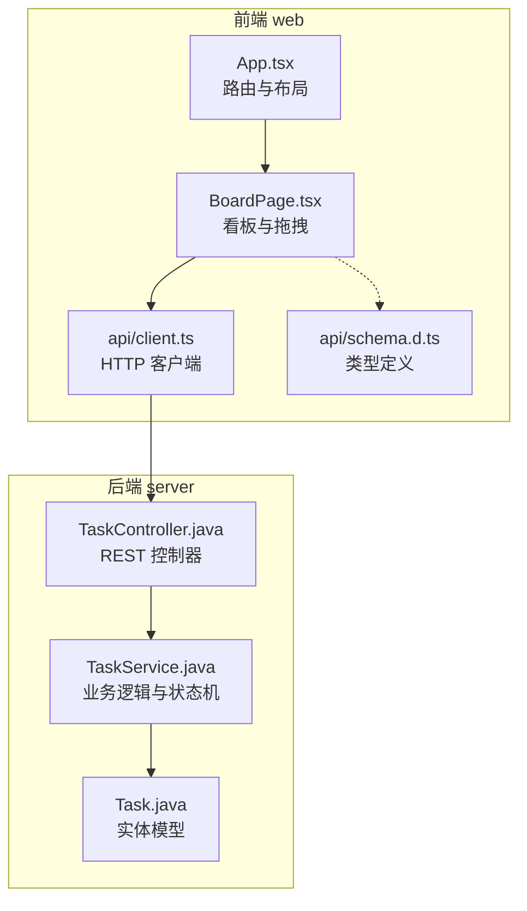
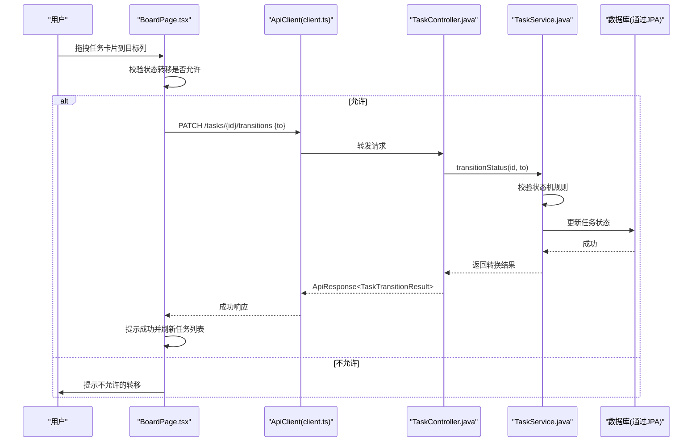
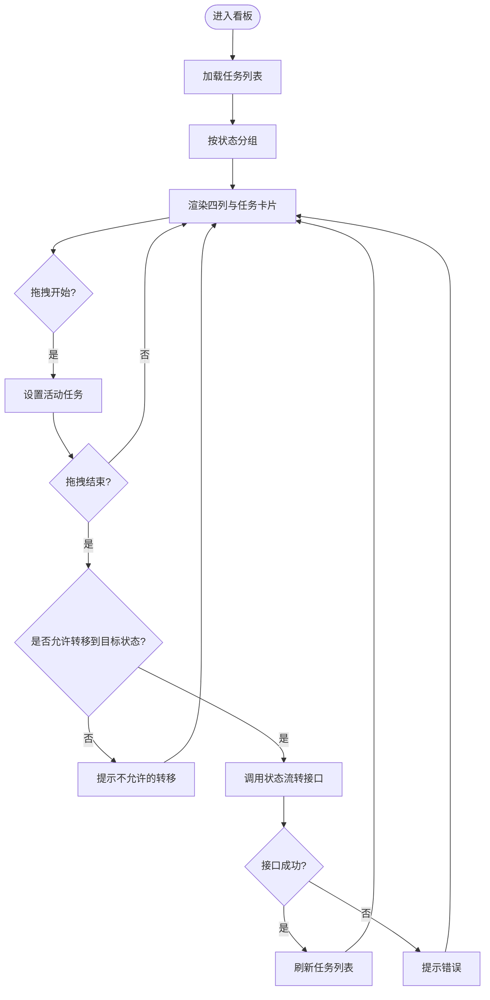
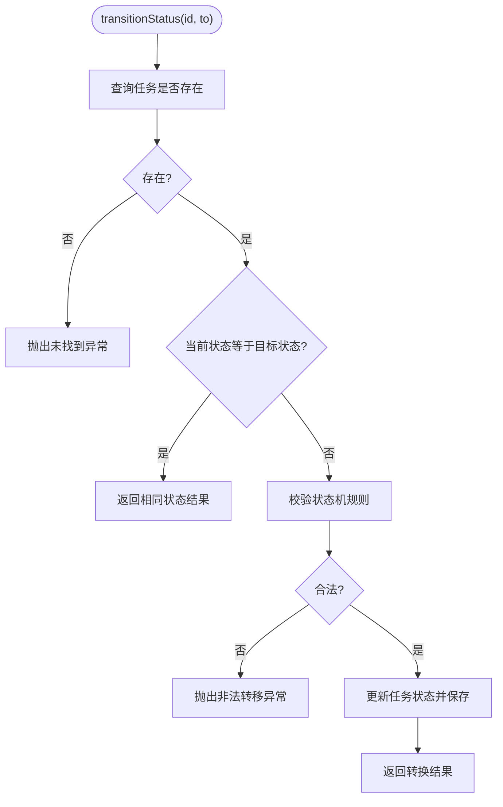
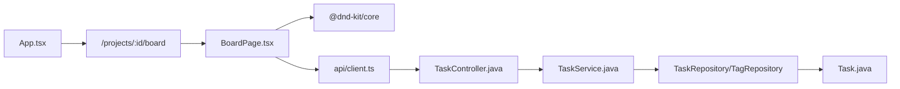

# 交互式看板拖拽

<cite>
**本文引用的文件**   
- [README.md](file://README.md)
- [TaskBoardApplication.java](file://server/src/main/java/com/taskboard/TaskBoardApplication.java)
- [TaskController.java](file://server/src/main/java/com/taskboard/controller/TaskController.java)
- [TaskService.java](file://server/src/main/java/com/taskboard/service/TaskService.java)
- [Task.java](file://server/src/main/java/com/taskboard/entity/Task.java)
- [client.ts](file://web/src/api/client.ts)
- [schema.d.ts](file://web/src/api/schema.d.ts)
- [App.tsx](file://web/src/App.tsx)
- [BoardPage.tsx](file://web/src/pages/BoardPage.tsx)
</cite>

## 目录
1. [引言](#引言)
2. [项目结构](#项目结构)
3. [核心组件](#核心组件)
4. [架构总览](#架构总览)
5. [详细组件分析](#详细组件分析)
6. [依赖关系分析](#依赖关系分析)
7. [性能与体验优化建议](#性能与体验优化建议)
8. [故障排查指南](#故障排查指南)
9. [结论](#结论)

## 引言
本文件聚焦“交互式看板拖拽”能力，围绕前端看板页面与后端任务状态流转接口展开，说明从用户拖拽任务卡片到列、到后端校验并持久化状态变更的完整链路。该功能基于 React + antd 的前端界面，使用 @dnd-kit/core 实现拖拽交互；后端采用 Spring Boot 提供 REST API，并通过服务层的状态机规则校验任务状态转移。

## 项目结构
本项目为前后端分离的 Monorepo：
- 后端 server：Spring Boot 应用，提供任务、项目、标签、工时等 REST API。
- 前端 web：React + TypeScript + antd + Vite，包含看板、任务列表、统计等页面。

图表来源
- [App.tsx:65-73](file://web/src/App.tsx#L65-L73)
- [BoardPage.tsx:112-271](file://web/src/pages/BoardPage.tsx#L112-L271)
- [client.ts:11-85](file://web/src/api/client.ts#L11-L85)
- [TaskController.java:17-88](file://server/src/main/java/com/taskboard/controller/TaskController.java#L17-L88)
- [TaskService.java:140-166](file://server/src/main/java/com/taskboard/service/TaskService.java#L140-L166)
- [Task.java:11-49](file://server/src/main/java/com/taskboard/entity/Task.java#L11-L49)

章节来源
- [README.md:1-63](file://README.md#L1-L63)

## 核心组件
- 前端看板页面 BoardPage：负责加载任务、分组渲染列、处理拖拽开始/结束、调用后端状态流转接口、打开抽屉编辑任务。
- 后端 TaskController：暴露任务相关 REST 接口，包括获取任务、更新任务、状态流转、删除任务。
- 后端 TaskService：封装任务创建、更新、删除与状态流转的业务逻辑，内置状态机校验。
- 后端 Task 实体：描述任务字段、默认值、时间戳与多对多标签关联。
- 前端 HTTP 客户端 client.ts：统一封装 GET/POST/PUT/PATCH/DELETE 请求，返回统一响应结构。
- 前端类型 schema.d.ts：定义 TaskDto、TagDto、TaskTransitionResult 等类型契约。

章节来源
- [BoardPage.tsx:112-312](file://web/src/pages/BoardPage.tsx#L112-L312)
- [TaskController.java:17-88](file://server/src/main/java/com/taskboard/controller/TaskController.java#L17-L88)
- [TaskService.java:23-281](file://server/src/main/java/com/taskboard/service/TaskService.java#L23-L281)
- [Task.java:11-162](file://server/src/main/java/com/taskboard/entity/Task.java#L11-L162)
- [client.ts:11-85](file://web/src/api/client.ts#L11-L85)
- [schema.d.ts:24-67](file://web/src/api/schema.d.ts#L24-L67)

## 架构总览
看板拖拽的整体流程如下：
- 用户在看板中拖拽任务卡片到目标列。
- 前端根据当前状态与目标状态进行本地合法性判断。
- 若合法，前端调用 PATCH /tasks/{id}/transitions 接口提交目标状态。
- 后端服务层执行状态机校验，通过后更新任务状态并返回结果。
- 前端刷新任务列表以反映最新状态。

图表来源
- [BoardPage.tsx:169-194](file://web/src/pages/BoardPage.tsx#L169-L194)
- [client.ts:66-78](file://web/src/api/client.ts#L66-L78)
- [TaskController.java:71-78](file://server/src/main/java/com/taskboard/controller/TaskController.java#L71-L78)
- [TaskService.java:149-166](file://server/src/main/java/com/taskboard/service/TaskService.java#L149-L166)

## 详细组件分析

### 前端看板与拖拽（BoardPage）
- 数据加载：按项目过滤任务列表，并按状态分组渲染四列（待办、进行中、已完成、已关闭）。
- 拖拽配置：使用 @dnd-kit/core 的 DndContext、useDraggable、useDroppable、PointerSensor 等能力。
- 状态机约束：前端维护合法转移表，阻止非法拖拽并给出提示。
- 交互反馈：拖拽时显示 DragOverlay；失败时 message.warning；成功时 message.success 并刷新数据。
- 详情编辑：点击卡片打开 Drawer，支持标题、描述、优先级的编辑保存。

图表来源
- [BoardPage.tsx:129-194](file://web/src/pages/BoardPage.tsx#L129-L194)
- [BoardPage.tsx:237-271](file://web/src/pages/BoardPage.tsx#L237-L271)

章节来源
- [BoardPage.tsx:28-55](file://web/src/pages/BoardPage.tsx#L28-L55)
- [BoardPage.tsx:57-110](file://web/src/pages/BoardPage.tsx#L57-L110)
- [BoardPage.tsx:112-194](file://web/src/pages/BoardPage.tsx#L112-L194)
- [BoardPage.tsx:237-308](file://web/src/pages/BoardPage.tsx#L237-L308)

### 后端控制器（TaskController）
- 暴露任务 CRUD 与状态流转接口。
- 状态流转接口接收任务 ID 与目标状态，委托给服务层处理。

章节来源
- [TaskController.java:17-88](file://server/src/main/java/com/taskboard/controller/TaskController.java#L17-L88)

### 后端服务（TaskService）
- 状态机校验：
  - CLOSED 为终态，不可再转移。
  - TODO → IN_PROGRESS
  - IN_PROGRESS → DONE 或 TODO
  - DONE → CLOSED 或 IN_PROGRESS
- 其他校验：标题长度、描述长度、优先级范围、到期时间格式、标签存在性。
- DTO 映射：将 Entity 转换为 TaskDto，格式化时间字段，并映射标签集合。

图表来源
- [TaskService.java:149-166](file://server/src/main/java/com/taskboard/service/TaskService.java#L149-L166)
- [TaskService.java:223-240](file://server/src/main/java/com/taskboard/service/TaskService.java#L223-L240)

章节来源
- [TaskService.java:23-281](file://server/src/main/java/com/taskboard/service/TaskService.java#L23-L281)

### 后端实体（Task）
- 字段：id、projectId、title、description、status、priority、dueAt、createdAt、updatedAt。
- 默认值：新建时 status 默认为 TODO，priority 默认为 0。
- 时间戳：创建和更新时间由 JPA 生命周期回调自动填充。
- 标签关联：与 Tag 多对多关联，中间表 task_tags。

章节来源
- [Task.java:11-162](file://server/src/main/java/com/taskboard/entity/Task.java#L11-L162)

### 前端 HTTP 客户端（client.ts）
- 统一封装 GET/POST/PUT/PATCH/DELETE。
- 非 JSON 表单序列化：POST/PUT/PATCH 使用 application/x-www-form-urlencoded，并对空值进行过滤。
- 错误处理：当 response.ok 为 false 时抛出错误。

章节来源
- [client.ts:11-85](file://web/src/api/client.ts#L11-L85)

### 前端类型契约（schema.d.ts）
- TaskDto：任务数据传输对象，包含状态枚举、优先级、到期时间、标签数组等。
- TaskTransitionResult：状态流转结果，包含前一个状态、当前状态与流转时间。
- TagDto：标签数据传输对象。

章节来源
- [schema.d.ts:24-67](file://web/src/api/schema.d.ts#L24-L67)

## 依赖关系分析
- 前端 App.tsx 通过 react-router-dom 注册 /projects/:id/board 路由，指向 BoardPage。
- BoardPage 依赖 @dnd-kit/core 实现拖拽，依赖 apiClient 调用后端接口，依赖 schema 类型定义。
- 后端 TaskController 依赖 TaskService，TaskService 依赖 TaskRepository 与 TagRepository，最终操作 Task 实体。

图表来源
- [App.tsx:65-73](file://web/src/App.tsx#L65-L73)
- [BoardPage.tsx:1-18](file://web/src/pages/BoardPage.tsx#L1-L18)
- [TaskController.java:17-88](file://server/src/main/java/com/taskboard/controller/TaskController.java#L17-L88)
- [TaskService.java:23-35](file://server/src/main/java/com/taskboard/service/TaskService.java#L23-L35)
- [Task.java:11-49](file://server/src/main/java/com/taskboard/entity/Task.java#L11-L49)

章节来源
- [App.tsx:31-78](file://web/src/App.tsx#L31-L78)
- [BoardPage.tsx:1-18](file://web/src/pages/BoardPage.tsx#L1-L18)

## 性能与体验优化建议
- 拖拽性能：
  - 在任务数量较多时，考虑虚拟滚动或分页加载，减少 DOM 节点数量。
  - 使用 useMemo 缓存分组结果（已实现），避免重复计算。
- 网络请求：
  - 在拖拽结束后仅刷新必要数据，避免全量重绘。
  - 可引入请求去抖与重试机制，提升用户体验。
- 交互反馈：
  - 对非法转移增加更明确的视觉提示（如禁用目标列高亮）。
  - 对成功/失败消息增加自动消失与可关闭选项。

[本节为通用建议，不直接分析具体文件]

## 故障排查指南
- 拖拽无响应：
  - 检查 PointerSensor 的 activationConstraint 是否过大导致无法触发。
  - 确认 useDraggable/useDroppable 的 id 唯一且 data 正确传递。
- 状态流转失败：
  - 检查前端 canDrop 逻辑与后端 validateStateTransition 是否一致。
  - 查看后端日志中的 BizException 信息，定位非法转移原因。
- 数据不同步：
  - 确认拖拽成功后是否调用了 fetchTasks 刷新列表。
  - 检查 apiClient.patch 的请求体是否正确序列化。

章节来源
- [BoardPage.tsx:123-125](file://web/src/pages/BoardPage.tsx#L123-L125)
- [BoardPage.tsx:164-194](file://web/src/pages/BoardPage.tsx#L164-L194)
- [TaskService.java:223-240](file://server/src/main/java/com/taskboard/service/TaskService.java#L223-L240)
- [client.ts:66-78](file://web/src/api/client.ts#L66-L78)

## 结论
交互式看板拖拽通过前端 @dnd-kit 与后端状态机协作，实现了直观的任务状态流转。前端负责交互与本地校验，后端负责权威校验与持久化。整体架构清晰、职责分明，具备良好的可扩展性与可维护性。后续可在性能优化、错误提示与数据一致性方面持续改进。