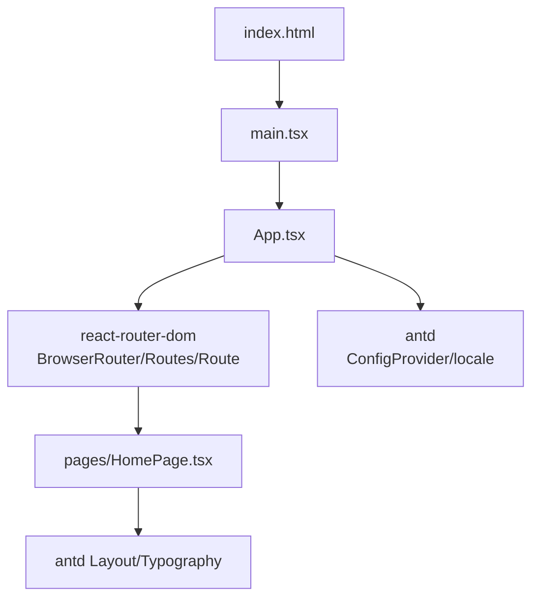
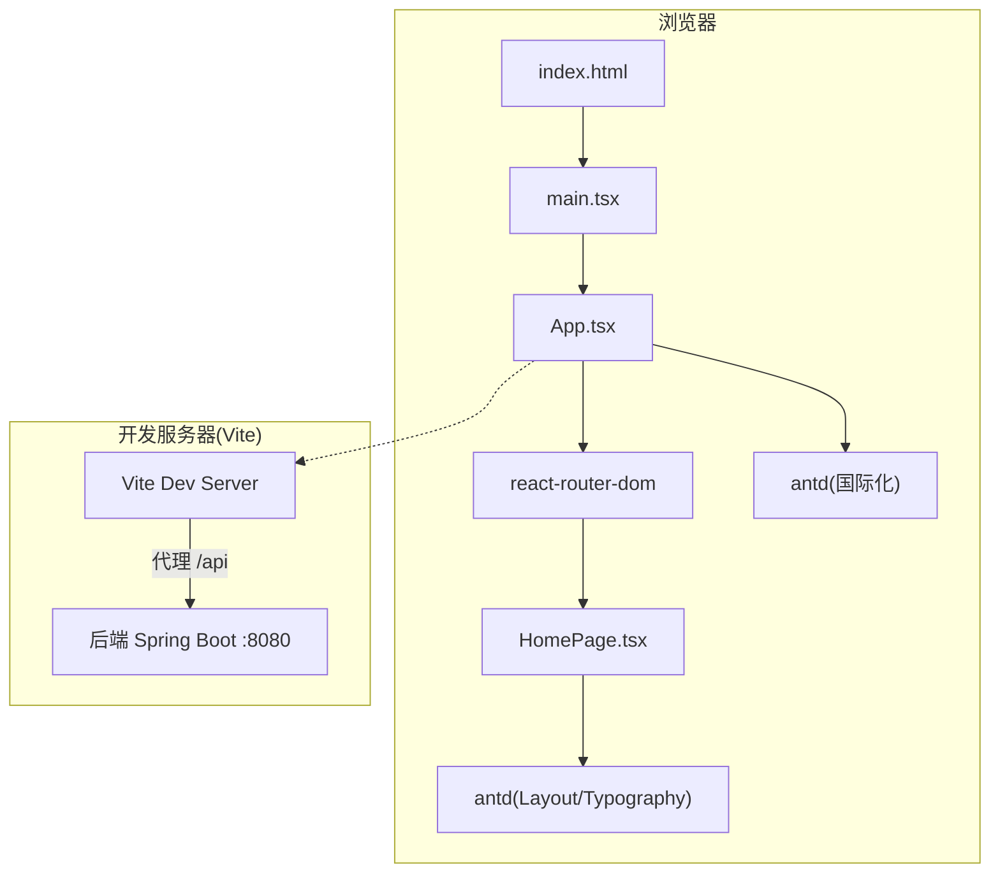
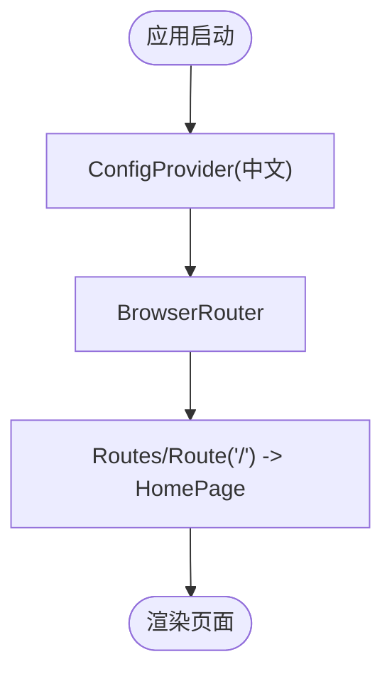
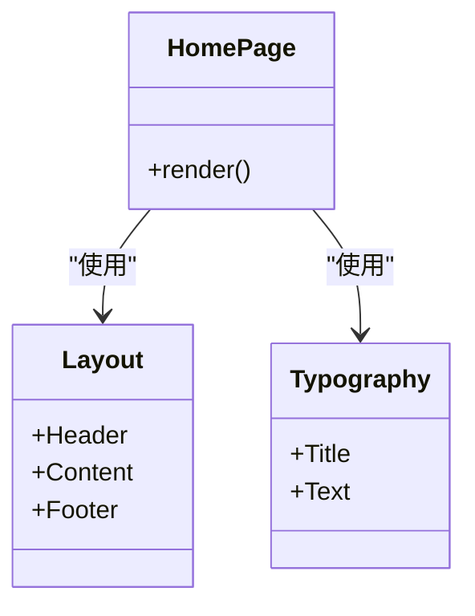
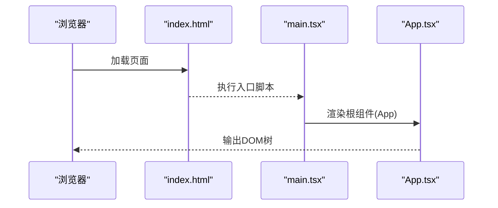
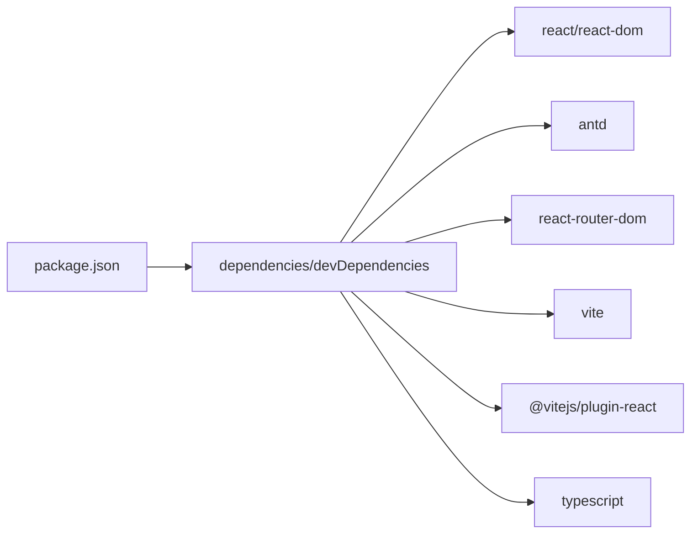

# 前端架构

<cite>
**本文引用的文件**   
- [package.json](file://web/package.json)
- [vite.config.ts](file://web/vite.config.ts)
- [tsconfig.json](file://web/tsconfig.json)
- [App.tsx](file://web/src/App.tsx)
- [HomePage.tsx](file://web/src/pages/HomePage.tsx)
- [main.tsx](file://web/src/main.tsx)
- [index.html](file://web/index.html)
- [README.md](file://README.md)
</cite>

## 目录
1. [简介](#简介)
2. [项目结构](#项目结构)
3. [核心组件](#核心组件)
4. [架构总览](#架构总览)
5. [详细组件分析](#详细组件分析)
6. [依赖分析](#依赖分析)
7. [性能考虑](#性能考虑)
8. [故障排查指南](#故障排查指南)
9. [结论](#结论)
10. [附录](#附录)

## 简介
本技术文档面向TaskBoard的前端工程，基于React 19与TypeScript，使用Vite作为构建工具，集成Ant Design 6与react-router-dom进行路由与UI组件管理。文档从系统架构、组件关系、数据流、处理逻辑、集成点、错误处理、性能特性等维度进行全面解析，并提供可操作的优化建议与最佳实践，帮助读者快速理解并扩展该前端应用。

## 项目结构
前端位于web目录下，采用现代React工程化结构：
- 入口HTML与脚本挂载点在index.html
- React应用入口在src/main.tsx
- 根组件App.tsx负责全局配置（国际化）与路由
- 页面组件按功能划分在src/pages下，当前包含HomePage
- Vite配置文件vite.config.ts定义插件、开发服务器代理等
- TypeScript编译选项在tsconfig.json中统一配置
- 包管理与脚本在package.json中声明

图表来源
- [index.html:1-14](file://web/index.html#L1-L14)
- [main.tsx:1-11](file://web/src/main.tsx#L1-L11)
- [App.tsx:1-19](file://web/src/App.tsx#L1-L19)
- [HomePage.tsx:1-42](file://web/src/pages/HomePage.tsx#L1-L42)

章节来源
- [index.html:1-14](file://web/index.html#L1-L14)
- [main.tsx:1-11](file://web/src/main.tsx#L1-L11)
- [App.tsx:1-19](file://web/src/App.tsx#L1-L19)
- [HomePage.tsx:1-42](file://web/src/pages/HomePage.tsx#L1-L42)

## 核心组件
- App根组件
  - 职责：提供全局国际化语言包（中文），包裹路由容器，定义基础路由映射。
  - 关键点：使用antd的ConfigProvider设置locale为中文；使用react-router-dom的BrowserRouter和Routes/Route组织页面。
- HomePage页面组件
  - 职责：展示首页布局与欢迎信息，使用antd的Layout与Typography构建头部、内容区与底部。
  - 关键点：通过内联样式实现深色头部与居中内容区，Footer显示版权信息。

章节来源
- [App.tsx:1-19](file://web/src/App.tsx#L1-L19)
- [HomePage.tsx:1-42](file://web/src/pages/HomePage.tsx#L1-L42)

## 架构总览
前端采用“单页应用”模式，由Vite驱动开发与构建，React 19渲染UI，react-router-dom管理客户端路由，Ant Design提供UI组件与主题/国际化能力。开发阶段通过Vite server代理将/api请求转发至后端服务（默认http://localhost:8080）。

图表来源
- [index.html:1-14](file://web/index.html#L1-L14)
- [main.tsx:1-11](file://web/src/main.tsx#L1-L11)
- [App.tsx:1-19](file://web/src/App.tsx#L1-L19)
- [HomePage.tsx:1-42](file://web/src/pages/HomePage.tsx#L1-L42)
- [vite.config.ts:1-15](file://web/vite.config.ts#L1-L15)

## 详细组件分析

### App根组件
- 设计要点
  - 使用ConfigProvider注入中文本地化，确保所有antd组件默认中文文案。
  - 使用BrowserRouter包裹整个应用，启用HTML5 History模式。
  - 使用Routes/Route定义根路径"/"对应HomePage。
- 扩展建议
  - 后续可在App层添加全局异常边界、加载状态、权限守卫等。
  - 可将路由表集中管理，便于维护与权限控制。

图表来源
- [App.tsx:1-19](file://web/src/App.tsx#L1-L19)

章节来源
- [App.tsx:1-19](file://web/src/App.tsx#L1-L19)

### HomePage页面组件
- 设计要点
  - 使用antd Layout组合Header/Content/Footer，形成标准三栏布局。
  - Header区域使用深色背景与居中标题，体现品牌标识。
  - Content区域居中显示欢迎文本，Footer显示版权年份。
- 交互与状态
  - 当前为静态展示，无复杂状态与副作用。
- 扩展建议
  - 可拆分为Header/Content/Footer子组件以提升复用性。
  - 可引入业务模块（如看板卡片、任务列表）逐步丰富页面。

图表来源
- [HomePage.tsx:1-42](file://web/src/pages/HomePage.tsx#L1-L42)

章节来源
- [HomePage.tsx:1-42](file://web/src/pages/HomePage.tsx#L1-L42)

### 应用入口与HTML挂载
- main.tsx
  - 使用ReactDOM.createRoot挂载到index.html中的root节点。
  - 使用React.StrictMode开启严格模式，辅助发现潜在问题。
- index.html
  - 提供根节点div与入口脚本，设置标题与图标。

图表来源
- [index.html:1-14](file://web/index.html#L1-L14)
- [main.tsx:1-11](file://web/src/main.tsx#L1-L11)
- [App.tsx:1-19](file://web/src/App.tsx#L1-L19)

章节来源
- [index.html:1-14](file://web/index.html#L1-L14)
- [main.tsx:1-11](file://web/src/main.tsx#L1-L11)

## 依赖分析
- 运行时依赖
  - react/react-dom：React 19渲染引擎。
  - antd：UI组件库与国际化支持。
  - react-router-dom：客户端路由。
- 开发时依赖
  - vite：构建与开发服务器。
  - @vitejs/plugin-react：React JSX支持。
  - typescript：类型检查与编译。
- 脚本命令
  - dev：启动Vite开发服务器。
  - build：先执行tsc类型检查，再构建生产包。
  - preview：预览构建产物。

图表来源
- [package.json:1-25](file://web/package.json#L1-L25)

章节来源
- [package.json:1-25](file://web/package.json#L1-L25)

## 性能考虑
- 构建与打包
  - 使用Vite原生ESM与按需加载，提升冷启动与热更新速度。
  - 生产构建前执行tsc类型检查，提前暴露类型错误，减少运行时风险。
- 代码分割与懒加载
  - 建议对路由级组件使用动态导入，降低首屏体积。
- 资源优化
  - 图片与静态资源建议使用合适格式与尺寸，必要时引入CDN。
- 运行时优化
  - 合理使用React.memo/useMemo/useCallback避免不必要的重渲染。
  - 列表渲染使用稳定key，避免重复计算与DOM抖动。
- 网络请求
  - 使用统一的API封装与缓存策略，减少重复请求。
  - 结合后端分页与增量更新，降低前端压力。

[本节为通用指导，不直接分析具体文件]

## 故障排查指南
- 开发服务器代理问题
  - 现象：前端调用/api接口失败或跨域报错。
  - 排查：确认vite.config.ts中server.proxy配置是否正确，目标地址是否可达。
  - 参考：[vite.config.ts:6-12](file://web/vite.config.ts#L6-L12)
- 端口与访问
  - 现象：无法访问http://localhost:5173。
  - 排查：确认npm run dev已启动，端口未被占用。
- 路由不生效
  - 现象：刷新后404或页面空白。
  - 排查：确认BrowserRouter与Routes/Route配置正确，部署时需服务端回退到index.html。
  - 参考：[App.tsx:9-12](file://web/src/App.tsx#L9-L12)
- 国际化未生效
  - 现象：antd组件文案仍为英文。
  - 排查：确认ConfigProvider locale设置为zh_CN且包裹了应用根节点。
  - 参考：[App.tsx:2-4, 8-14:2-4](file://web/src/App.tsx#L2-L4)
- 类型检查失败
  - 现象：build时报错。
  - 排查：根据tsc输出定位类型错误，修复后再构建。
  - 参考：[package.json:8](file://web/package.json#L8), [tsconfig.json:1-22](file://web/tsconfig.json#L1-L22)

章节来源
- [vite.config.ts:6-12](file://web/vite.config.ts#L6-L12)
- [App.tsx:2-4](file://web/src/App.tsx#L2-L4)
- [App.tsx:8-14](file://web/src/App.tsx#L8-L14)
- [package.json:8](file://web/package.json#L8)
- [tsconfig.json:1-22](file://web/tsconfig.json#L1-L22)

## 结论
TaskBoard前端采用清晰的分层与组件化架构：以App为根，集中处理国际化与路由；HomePage承载页面布局与展示；Vite提供高效开发与构建体验；Ant Design提供一致的UI与国际化能力。当前版本为轻量起步，具备良好的可扩展性。建议在后续迭代中引入路由懒加载、统一API层、状态管理方案与更完善的测试体系，持续提升可维护性与性能表现。

[本节为总结性内容，不直接分析具体文件]

## 附录

### 关键配置说明
- Vite配置
  - 插件：启用@vitejs/plugin-react以支持JSX。
  - 开发服务器：将/api请求代理到http://localhost:8080，changeOrigin设为true以适配后端Host校验。
  - 参考：[vite.config.ts:1-15](file://web/vite.config.ts#L1-L15)
- TypeScript编译选项
  - target: ES2020，lib包含DOM与Iterable，moduleResolution: bundler，strict严格模式，noEmit交由Vite处理。
  - 参考：[tsconfig.json:1-22](file://web/tsconfig.json#L1-L22)
- 包与脚本
  - 依赖：react/react-dom 19，antd 6，react-router-dom 7，vite 6，typescript 5。
  - 脚本：dev/build/preview。
  - 参考：[package.json:1-25](file://web/package.json#L1-L25)

章节来源
- [vite.config.ts:1-15](file://web/vite.config.ts#L1-L15)
- [tsconfig.json:1-22](file://web/tsconfig.json#L1-L22)
- [package.json:1-25](file://web/package.json#L1-L25)

### 前后端协作与运行方式
- 后端
  - Spring Boot 4，默认监听http://localhost:8080，API前缀/api。
  - 健康检查：GET /api/health。
- 前端
  - 开发环境：http://localhost:5173，/api请求通过Vite代理转发到后端。
  - 构建产物：npm run build生成静态资源，可用npm run preview预览。
- 参考：[README.md:1-63](file://README.md#L1-L63)

章节来源
- [README.md:1-63](file://README.md#L1-L63)