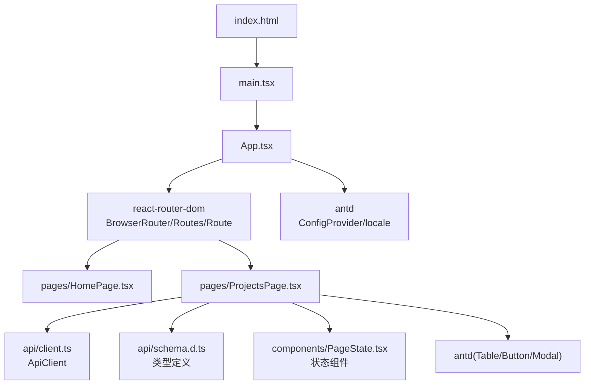
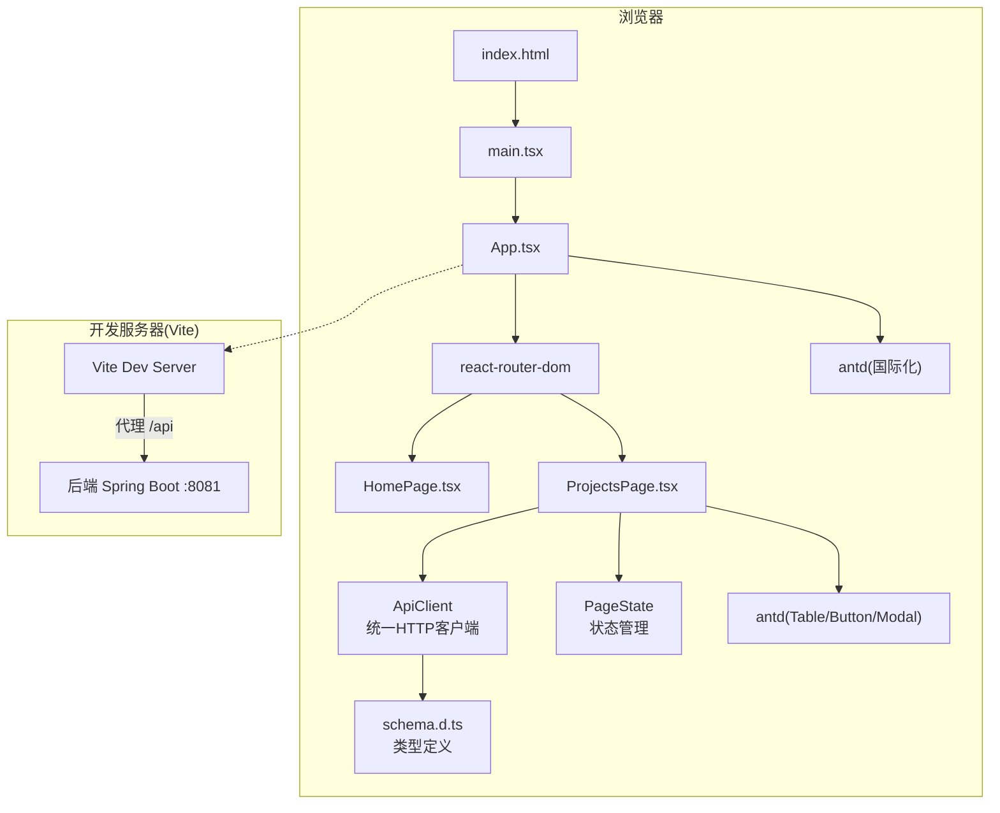
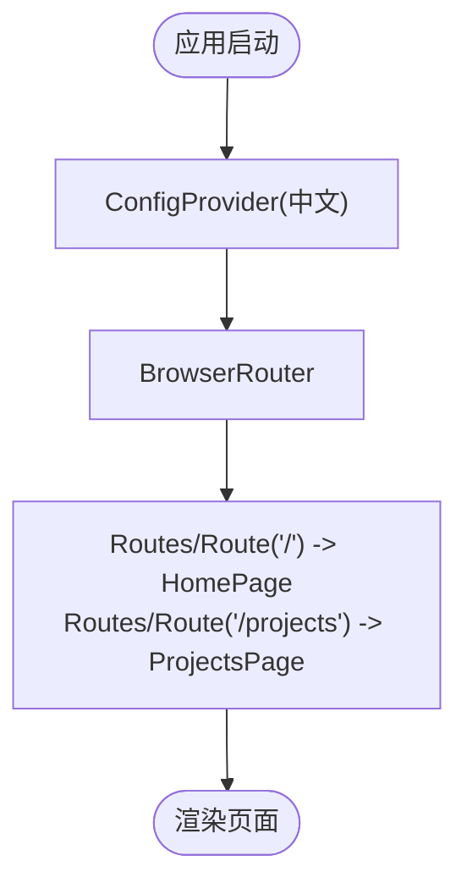
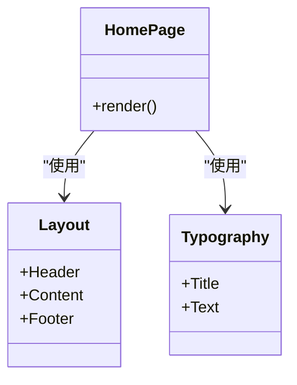
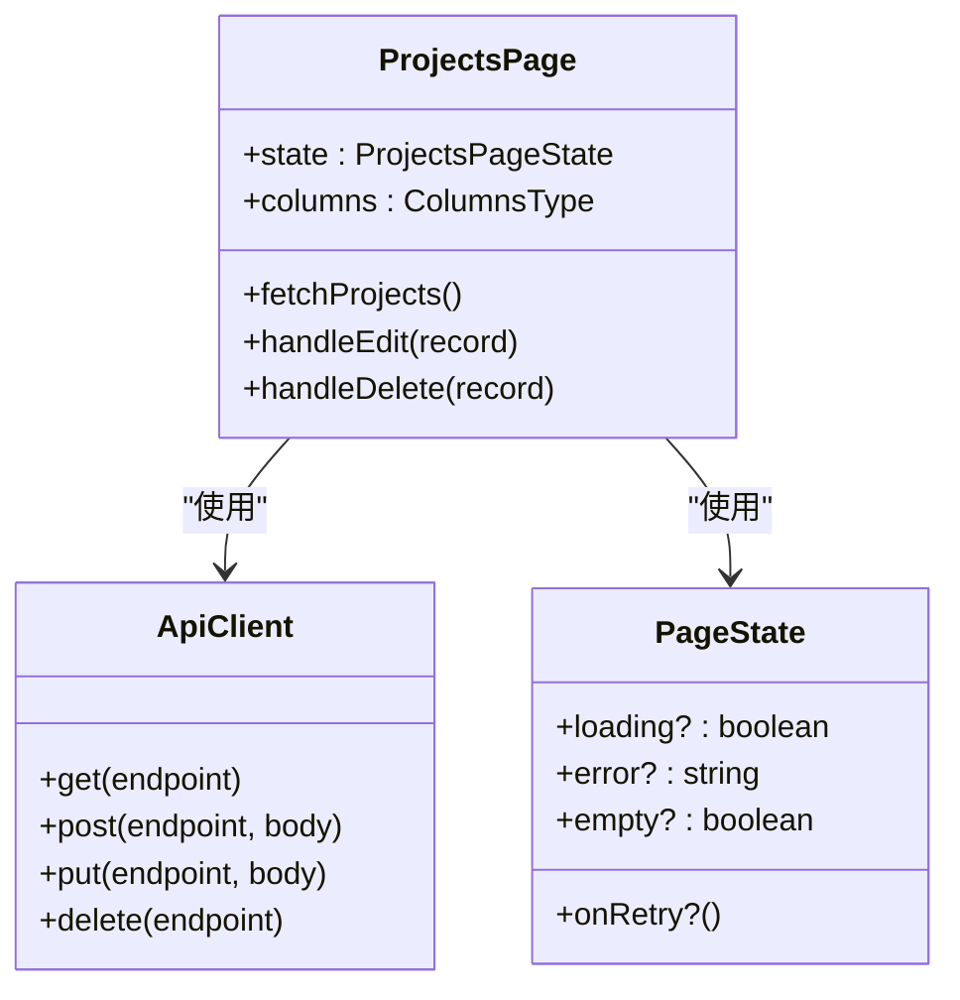
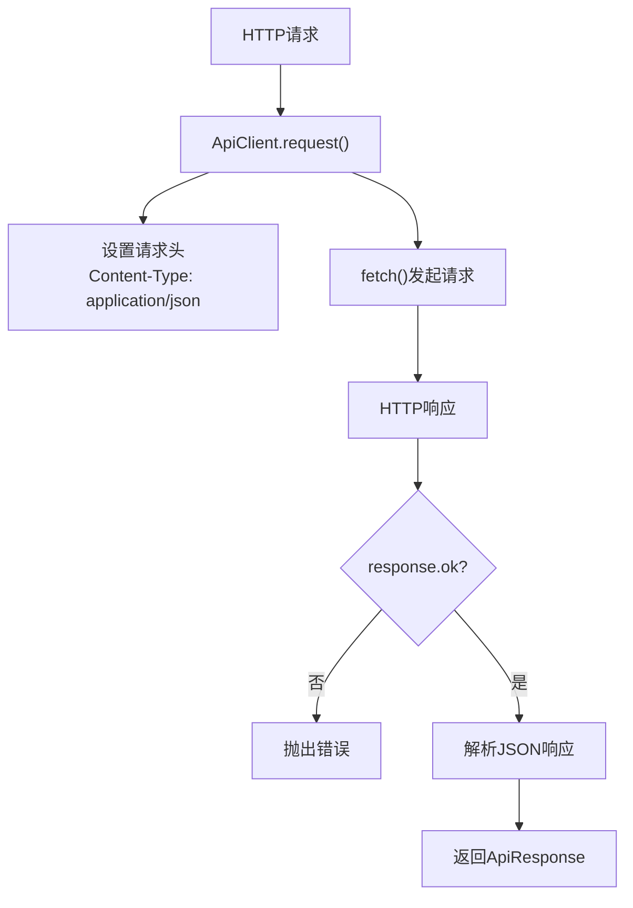
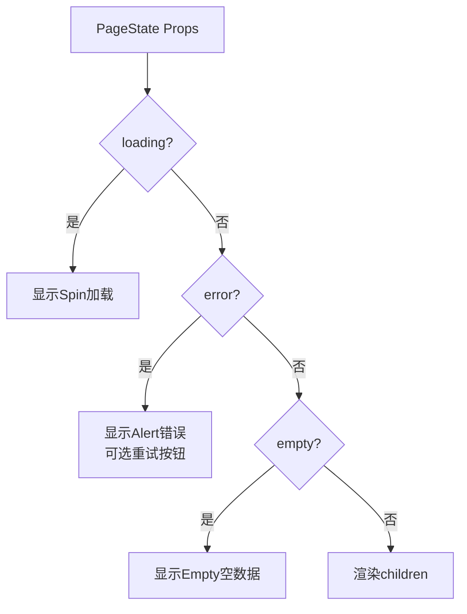
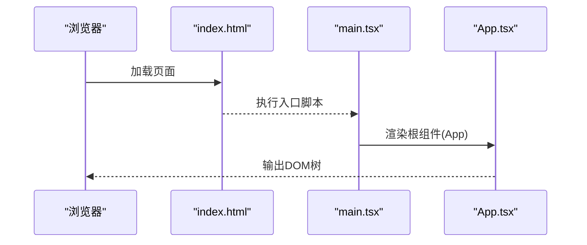
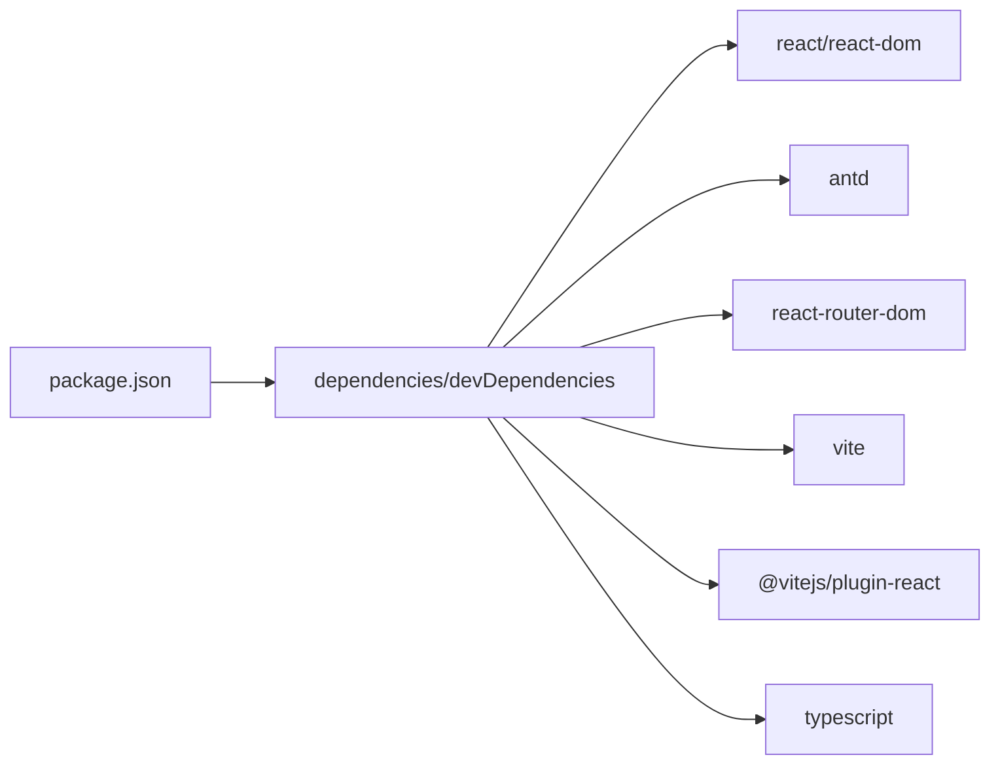

# 前端架构

<cite>
**本文引用的文件**   
- [package.json](file://web/package.json)
- [vite.config.ts](file://web/vite.config.ts)
- [tsconfig.json](file://web/tsconfig.json)
- [App.tsx](file://web/src/App.tsx)
- [HomePage.tsx](file://web/src/pages/HomePage.tsx)
- [ProjectsPage.tsx](file://web/src/pages/ProjectsPage.tsx)
- [client.ts](file://web/src/api/client.ts)
- [schema.d.ts](file://web/src/api/schema.d.ts)
- [PageState.tsx](file://web/src/components/PageState.tsx)
- [main.tsx](file://web/src/main.tsx)
- [index.html](file://web/index.html)
- [README.md](file://README.md)
</cite>

## 更新摘要
**已进行的变更**
- 新增集中式API客户端模块，提供统一的HTTP请求封装
- 新增TypeScript类型定义文件，统一API响应和数据结构
- 新增可复用的PageState组件，处理加载、错误、空状态
- 改进ProjectsPage实现，集成API客户端和状态管理
- 更新路由配置，添加项目管理页面路由

## 目录
1. [简介](#简介)
2. [项目结构](#项目结构)
3. [核心组件](#核心组件)
4. [架构总览](#架构总览)
5. [详细组件分析](#详细组件分析)
6. [依赖分析](#依赖分析)
7. [性能考虑](#性能考虑)
8. [故障排查指南](#故障排查指南)
9. [结论](#结论)
10. [附录](#附录)

## 简介
本技术文档面向TaskBoard的前端工程，基于React 19与TypeScript，使用Vite作为构建工具，集成Ant Design 6与react-router-dom进行路由与UI组件管理。文档从系统架构、组件关系、数据流、处理逻辑、集成点、错误处理、性能特性等维度进行全面解析，并提供可操作的优化建议与最佳实践，帮助读者快速理解并扩展该前端应用。

**更新** 本次更新引入了现代化的前端架构模式，包括集中式API客户端、类型安全的API调用、可复用的状态管理组件，以及完整的项目管理功能实现。

## 项目结构
前端位于web目录下，采用现代React工程化结构：
- 入口HTML与脚本挂载点在index.html
- React应用入口在src/main.tsx
- 根组件App.tsx负责全局配置（国际化）与路由
- 页面组件按功能划分在src/pages下，包含HomePage和ProjectsPage
- API层在src/api下，包含集中式客户端和类型定义
- 通用组件在src/components下，包含可复用的PageState组件
- Vite配置文件vite.config.ts定义插件、开发服务器代理等
- TypeScript编译选项在tsconfig.json中统一配置
- 包管理与脚本在package.json中声明

图表来源
- [index.html:1-14](file://web/index.html#L1-L14)
- [main.tsx:1-11](file://web/src/main.tsx#L1-L11)
- [App.tsx:1-21](file://web/src/App.tsx#L1-L21)
- [HomePage.tsx:1-42](file://web/src/pages/HomePage.tsx#L1-L42)
- [ProjectsPage.tsx:1-227](file://web/src/pages/ProjectsPage.tsx#L1-L227)
- [client.ts:1-72](file://web/src/api/client.ts#L1-L72)
- [schema.d.ts:1-39](file://web/src/api/schema.d.ts#L1-L39)
- [PageState.tsx:1-52](file://web/src/components/PageState.tsx#L1-L52)

章节来源
- [index.html:1-14](file://web/index.html#L1-L14)
- [main.tsx:1-11](file://web/src/main.tsx#L1-L11)
- [App.tsx:1-21](file://web/src/App.tsx#L1-L21)
- [HomePage.tsx:1-42](file://web/src/pages/HomePage.tsx#L1-L42)
- [ProjectsPage.tsx:1-227](file://web/src/pages/ProjectsPage.tsx#L1-L227)
- [client.ts:1-72](file://web/src/api/client.ts#L1-L72)
- [schema.d.ts:1-39](file://web/src/api/schema.d.ts#L1-L39)
- [PageState.tsx:1-52](file://web/src/components/PageState.tsx#L1-L52)

## 核心组件
- App根组件
  - 职责：提供全局国际化语言包（中文），包裹路由容器，定义基础路由映射。
  - 关键点：使用antd的ConfigProvider设置locale为中文；使用react-router-dom的BrowserRouter和Routes/Route组织页面；包含HomePage和ProjectsPage两个路由。
- HomePage页面组件
  - 职责：展示首页布局与欢迎信息，使用antd的Layout与Typography构建头部、内容区与底部。
  - 关键点：通过内联样式实现深色头部与居中内容区，Footer显示版权信息。
- ProjectsPage页面组件
  - 职责：实现完整的项目管理功能，包括CRUD操作、表格展示、模态框交互。
  - 关键点：集成ApiClient进行API调用，使用PageState处理页面状态，支持项目的增删改查操作。
- ApiClient API客户端
  - 职责：提供统一的HTTP请求封装，处理请求头、响应格式、错误处理。
  - 关键点：支持GET/POST/PUT/DELETE方法，自动处理URLSearchParams序列化，统一的ApiResponse包装。
- PageState状态组件
  - 职责：提供统一的页面状态展示，包括加载中、错误、空数据状态。
  - 关键点：支持重试机制，可配置的提示信息，与antd组件深度集成。

章节来源
- [App.tsx:1-21](file://web/src/App.tsx#L1-L21)
- [HomePage.tsx:1-42](file://web/src/pages/HomePage.tsx#L1-L42)
- [ProjectsPage.tsx:1-227](file://web/src/pages/ProjectsPage.tsx#L1-L227)
- [client.ts:1-72](file://web/src/api/client.ts#L1-L72)
- [PageState.tsx:1-52](file://web/src/components/PageState.tsx#L1-L52)

## 架构总览
前端采用"单页应用"模式，由Vite驱动开发与构建，React 19渲染UI，react-router-dom管理客户端路由，Ant Design提供UI组件与主题/国际化能力。开发阶段通过Vite server代理将/api请求转发至后端服务（默认http://localhost:8081）。

**更新** 新增了集中式的API层设计，所有HTTP请求都通过ApiClient统一管理，确保类型安全和一致的请求格式。

图表来源
- [index.html:1-14](file://web/index.html#L1-L14)
- [main.tsx:1-11](file://web/src/main.tsx#L1-L11)
- [App.tsx:1-21](file://web/src/App.tsx#L1-L21)
- [HomePage.tsx:1-42](file://web/src/pages/HomePage.tsx#L1-L42)
- [ProjectsPage.tsx:1-227](file://web/src/pages/ProjectsPage.tsx#L1-L227)
- [client.ts:1-72](file://web/src/api/client.ts#L1-L72)
- [schema.d.ts:1-39](file://web/src/api/schema.d.ts#L1-L39)
- [PageState.tsx:1-52](file://web/src/components/PageState.tsx#L1-L52)
- [vite.config.ts:1-15](file://web/vite.config.ts#L1-L15)

## 详细组件分析

### App根组件
- 设计要点
  - 使用ConfigProvider注入中文本地化，确保所有antd组件默认中文文案。
  - 使用BrowserRouter包裹整个应用，启用HTML5 History模式。
  - 使用Routes/Route定义根路径"/"对应HomePage，"/projects"对应ProjectsPage。
- 扩展建议
  - 后续可在App层添加全局异常边界、加载状态、权限守卫等。
  - 可将路由表集中管理，便于维护与权限控制。

图表来源
- [App.tsx:1-21](file://web/src/App.tsx#L1-L21)

章节来源
- [App.tsx:1-21](file://web/src/App.tsx#L1-L21)

### HomePage页面组件
- 设计要点
  - 使用antd Layout组合Header/Content/Footer，形成标准三栏布局。
  - Header区域使用深色背景与居中标题，体现品牌标识。
  - Content区域居中显示欢迎文本，Footer显示版权年份。
- 交互与状态
  - 当前为静态展示，无复杂状态与副作用。
- 扩展建议
  - 可拆分为Header/Content/Footer子组件以提升复用性。
  - 可引入业务模块（如看板卡片、任务列表）逐步丰富页面。

图表来源
- [HomePage.tsx:1-42](file://web/src/pages/HomePage.tsx#L1-L42)

章节来源
- [HomePage.tsx:1-42](file://web/src/pages/HomePage.tsx#L1-L42)

### ProjectsPage页面组件
- 设计要点
  - 实现完整的项目管理CRUD功能，包括创建、编辑、删除项目。
  - 使用antd Table展示项目列表，支持分页和排序。
  - 集成ApiClient进行API调用，使用PageState处理页面状态。
  - 使用Modal和Form实现项目的创建和编辑交互。
- 状态管理
  - 使用useState管理loading、projects、error状态。
  - 通过useEffect在组件挂载时获取项目列表。
  - 使用PageState组件统一处理加载、错误、空数据状态。
- API集成
  - 使用apiClient.get获取项目列表。
  - 使用apiClient.post创建新项目。
  - 使用apiClient.put更新项目信息。
  - 使用apiClient.delete删除项目。

图表来源
- [ProjectsPage.tsx:1-227](file://web/src/pages/ProjectsPage.tsx#L1-L227)
- [client.ts:1-72](file://web/src/api/client.ts#L1-L72)
- [PageState.tsx:1-52](file://web/src/components/PageState.tsx#L1-L52)

章节来源
- [ProjectsPage.tsx:1-227](file://web/src/pages/ProjectsPage.tsx#L1-L227)

### ApiClient API客户端
- 设计要点
  - 提供统一的HTTP请求封装，支持GET/POST/PUT/DELETE方法。
  - 自动处理请求头和响应格式，确保类型安全。
  - 内置错误处理机制，抛出标准化的错误信息。
  - 支持URLSearchParams序列化和JSON响应解析。
- 核心功能
  - baseURL配置：支持自定义API基础路径。
  - request方法：通用的HTTP请求封装。
  - get/post/put/delete方法：RESTful API方法封装。
  - ApiResponse<T>泛型：类型安全的响应处理。

图表来源
- [client.ts:18-32](file://web/src/api/client.ts#L18-L32)

章节来源
- [client.ts:1-72](file://web/src/api/client.ts#L1-L72)

### PageState状态组件
- 设计要点
  - 提供统一的页面状态展示，包括加载中、错误、空数据状态。
  - 支持可配置的重试机制，提升用户体验。
  - 与antd组件深度集成，保持视觉一致性。
  - 支持自定义空数据提示内容。
- 状态处理
  - loading状态：显示Spin加载指示器。
  - error状态：显示Alert错误提示，支持重试按钮。
  - empty状态：显示Empty空数据组件。
  - normal状态：渲染children内容。

图表来源
- [PageState.tsx:15-50](file://web/src/components/PageState.tsx#L15-L50)

章节来源
- [PageState.tsx:1-52](file://web/src/components/PageState.tsx#L1-L52)

### 类型定义系统
- 设计要点
  - 统一定义API响应格式和项目数据结构。
  - 提供类型安全的API调用接口。
  - 支持泛型参数，确保类型推导准确性。
- 核心类型
  - ApiResponse<T>：统一的API响应包装。
  - ProjectDto：项目数据传输对象。
  - PageResult<T>：分页结果类型。
  - ErrorItem：验证错误项类型。

章节来源
- [schema.d.ts:1-39](file://web/src/api/schema.d.ts#L1-L39)

### 应用入口与HTML挂载
- main.tsx
  - 使用ReactDOM.createRoot挂载到index.html中的root节点。
  - 使用React.StrictMode开启严格模式，辅助发现潜在问题。
- index.html
  - 提供根节点div与入口脚本，设置标题与图标。

图表来源
- [index.html:1-14](file://web/index.html#L1-L14)
- [main.tsx:1-11](file://web/src/main.tsx#L1-L11)
- [App.tsx:1-21](file://web/src/App.tsx#L1-L21)

章节来源
- [index.html:1-14](file://web/index.html#L1-L14)
- [main.tsx:1-11](file://web/src/main.tsx#L1-L11)

## 依赖分析
- 运行时依赖
  - react/react-dom：React 19渲染引擎。
  - antd：UI组件库与国际化支持。
  - react-router-dom：客户端路由。
- 开发时依赖
  - vite：构建与开发服务器。
  - @vitejs/plugin-react：React JSX支持。
  - typescript：类型检查与编译。
- 脚本命令
  - dev：启动Vite开发服务器。
  - build：先执行tsc类型检查，再构建生产包。
  - preview：预览构建产物。

图表来源
- [package.json:1-25](file://web/package.json#L1-L25)

章节来源
- [package.json:1-25](file://web/package.json#L1-L25)

## 性能考虑
- 构建与打包
  - 使用Vite原生ESM与按需加载，提升冷启动与热更新速度。
  - 生产构建前执行tsc类型检查，提前暴露类型错误，减少运行时风险。
- 代码分割与懒加载
  - 建议对路由级组件使用动态导入，降低首屏体积。
  - 大型组件可使用React.lazy和Suspense进行懒加载。
- 资源优化
  - 图片与静态资源建议使用合适格式与尺寸，必要时引入CDN。
  - CSS模块已启用，避免样式冲突。
- 运行时优化
  - 合理使用React.memo/useMemo/useCallback避免不必要的重渲染。
  - 列表渲染使用稳定key，避免重复计算与DOM抖动。
  - PageState组件已优化状态展示，减少重复渲染。
- 网络请求
  - 使用统一的ApiClient封装，减少重复代码和错误处理逻辑。
  - 结合后端分页与增量更新，降低前端压力。
  - 支持请求缓存策略，避免重复请求。

## 故障排查指南
- 开发服务器代理问题
  - 现象：前端调用/api接口失败或跨域报错。
  - 排查：确认vite.config.ts中server.proxy配置是否正确，目标地址是否可达。
  - 参考：[vite.config.ts:6-12](file://web/vite.config.ts#L6-L12)
- 端口与访问
  - 现象：无法访问http://localhost:5173。
  - 排查：确认npm run dev已启动，端口未被占用。
- 路由不生效
  - 现象：刷新后404或页面空白。
  - 排查：确认BrowserRouter与Routes/Route配置正确，部署时需服务端回退到index.html。
  - 参考：[App.tsx:10-15](file://web/src/App.tsx#L10-L15)
- 国际化未生效
  - 现象：antd组件文案仍为英文。
  - 排查：确认ConfigProvider locale设置为zh_CN且包裹了应用根节点。
  - 参考：[App.tsx:2-4, 9-16:2-4](file://web/src/App.tsx#L2-L4)
- API请求失败
  - 现象：ProjectsPage显示错误状态或数据加载失败。
  - 排查：检查ApiClient配置、后端服务状态、网络连接。
  - 参考：[client.ts:18-32](file://web/src/api/client.ts#L18-L32), [ProjectsPage.tsx:30-43](file://web/src/pages/ProjectsPage.tsx#L30-L43)
- 类型检查失败
  - 现象：build时报错。
  - 排查：根据tsc输出定位类型错误，修复后再构建。
  - 参考：[package.json:8](file://web/package.json#L8), [tsconfig.json:1-22](file://web/tsconfig.json#L1-L22)

章节来源
- [vite.config.ts:6-12](file://web/vite.config.ts#L6-L12)
- [App.tsx:2-4](file://web/src/App.tsx#L2-L4)
- [App.tsx:10-15](file://web/src/App.tsx#L10-L15)
- [client.ts:18-32](file://web/src/api/client.ts#L18-L32)
- [ProjectsPage.tsx:30-43](file://web/src/pages/ProjectsPage.tsx#L30-L43)
- [package.json:8](file://web/package.json#L8)
- [tsconfig.json:1-22](file://web/tsconfig.json#L1-L22)

## 结论
TaskBoard前端采用清晰的分层与组件化架构：以App为根，集中处理国际化与路由；HomePage承载页面布局与展示；ProjectsPage实现完整的项目管理功能；Vite提供高效开发与构建体验；Ant Design提供一致的UI与国际化能力。

**更新** 本次现代化改造引入了集中式API客户端、类型安全的API调用、可复用的状态管理组件，显著提升了代码质量和可维护性。新的架构模式为后续功能扩展奠定了坚实基础，具备良好的可扩展性和性能表现。建议在后续迭代中继续完善测试覆盖、引入更复杂的业务逻辑，并持续优化用户体验。

## 附录

### 关键配置说明
- Vite配置
  - 插件：启用@vitejs/plugin-react以支持JSX。
  - 开发服务器：将/api请求代理到http://localhost:8081，changeOrigin设为true以适配后端Host校验。
  - 参考：[vite.config.ts:1-15](file://web/vite.config.ts#L1-L15)
- TypeScript编译选项
  - target: ES2020，lib包含DOM与Iterable，moduleResolution: bundler，strict严格模式，noEmit交由Vite处理。
  - 参考：[tsconfig.json:1-22](file://web/tsconfig.json#L1-L22)
- 包与脚本
  - 依赖：react/react-dom 19，antd 6，react-router-dom 7，vite 6，typescript 5。
  - 脚本：dev/build/preview。
  - 参考：[package.json:1-25](file://web/package.json#L1-L25)

章节来源
- [vite.config.ts:1-15](file://web/vite.config.ts#L1-L15)
- [tsconfig.json:1-22](file://web/tsconfig.json#L1-L22)
- [package.json:1-25](file://web/package.json#L1-L25)

### 前后端协作与运行方式
- 后端
  - Spring Boot 4，默认监听http://localhost:8081，API前缀/api。
  - 健康检查：GET /api/health。
- 前端
  - 开发环境：http://localhost:5173，/api请求通过Vite代理转发到后端。
  - 构建产物：npm run build生成静态资源，可用npm run preview预览。
- API规范
  - 统一响应格式：ApiResponse<T>包含code、message、data字段。
  - 类型安全：所有API调用都有完整的TypeScript类型定义。
  - 错误处理：统一的错误捕获和用户友好提示。

章节来源
- [README.md:1-63](file://README.md#L1-L63)
- [schema.d.ts:1-39](file://web/src/api/schema.d.ts#L1-L39)
- [client.ts:1-72](file://web/src/api/client.ts#L1-L72)