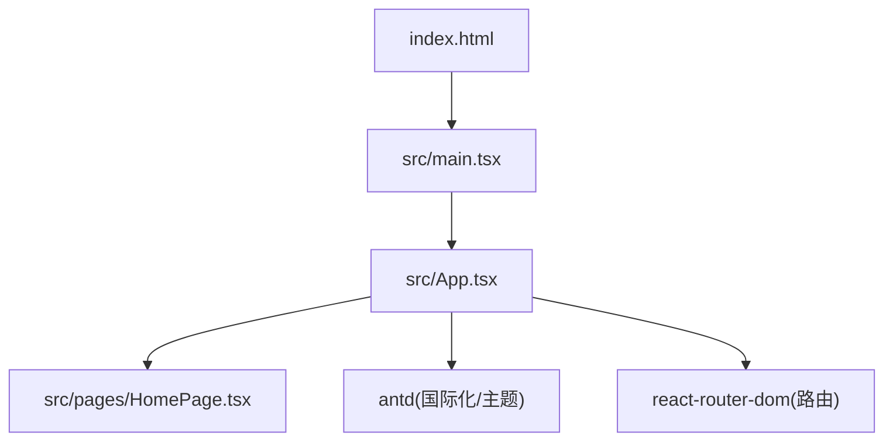
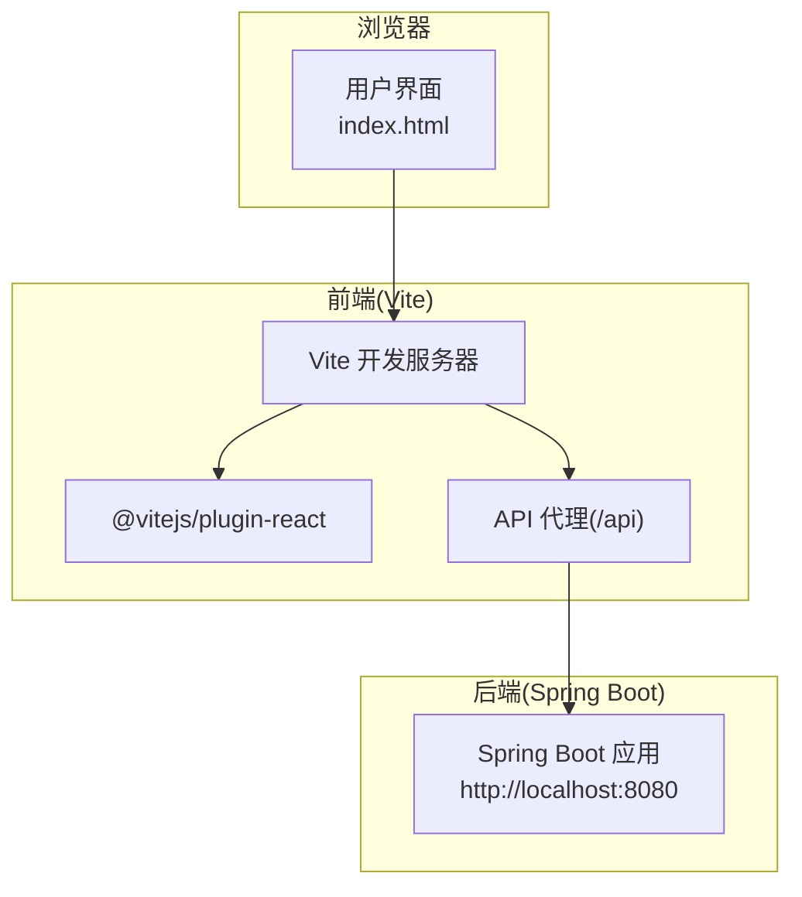
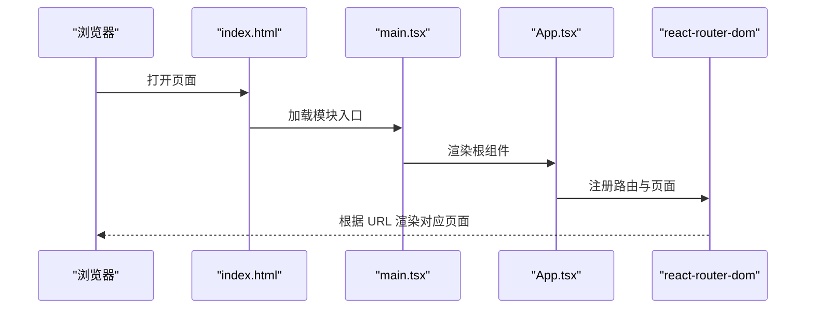
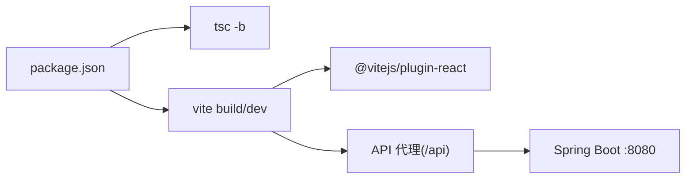

# 开发工具链

<cite>
**本文引用的文件**   
- [vite.config.ts](file://web/vite.config.ts)
- [package.json](file://web/package.json)
- [tsconfig.json](file://web/tsconfig.json)
- [.editorconfig](file://web/.editorconfig)
- [index.html](file://web/index.html)
- [main.tsx](file://web/src/main.tsx)
- [App.tsx](file://web/src/App.tsx)
- [HomePage.tsx](file://web/src/pages/HomePage.tsx)
- [README.md](file://README.md)
</cite>

## 目录
1. [简介](#简介)
2. [项目结构](#项目结构)
3. [核心组件](#核心组件)
4. [架构总览](#架构总览)
5. [详细组件分析](#详细组件分析)
6. [依赖关系分析](#依赖关系分析)
7. [性能与构建优化](#性能与构建优化)
8. [故障排除指南](#故障排除指南)
9. [结论](#结论)

## 简介
本文件面向 TaskBoard 前端工程，系统性梳理基于 Vite 6 + React 19 + TypeScript 5 的开发工具链。内容涵盖：
- Vite 开发服务器代理、热重载与构建优化策略
- TypeScript 编译配置（类型检查、模块解析、编译目标）
- package.json 依赖管理与脚本命令
- 开发工作流（代码格式化、Linting、调试集成）
- 工程化最佳实践（包版本管理、构建缓存、部署）
- 环境搭建与常见问题排查

## 项目结构
前端位于 web 目录，采用 Vite 作为构建与开发工具，React 为 UI 框架，TypeScript 提供类型系统，antd 提供组件库，react-router-dom 负责路由。入口 HTML 通过 index.html 引入 main.tsx，应用根组件 App.tsx 使用 BrowserRouter 和 Routes 进行页面路由，首页为 HomePage.tsx。

图表来源
- [index.html:1-14](file://web/index.html#L1-L14)
- [main.tsx:1-11](file://web/src/main.tsx#L1-L11)
- [App.tsx:1-19](file://web/src/App.tsx#L1-L19)
- [HomePage.tsx](file://web/src/pages/HomePage.tsx)

章节来源
- [README.md:10-16](file://README.md#L10-L16)
- [index.html:1-14](file://web/index.html#L1-L14)
- [main.tsx:1-11](file://web/src/main.tsx#L1-L11)
- [App.tsx:1-19](file://web/src/App.tsx#L1-L19)

## 核心组件
- Vite 构建与开发服务器：通过 vite.config.ts 配置插件、开发服务器代理等。
- TypeScript 编译：通过 tsconfig.json 定义语言特性、模块解析、严格模式等。
- 依赖与脚本：通过 package.json 声明运行时与开发时依赖，以及 dev/build/preview 脚本。
- 应用入口与路由：index.html 加载 main.tsx，App.tsx 配置 antd 中文与 react-router 路由。

章节来源
- [vite.config.ts:1-15](file://web/vite.config.ts#L1-L15)
- [tsconfig.json:1-22](file://web/tsconfig.json#L1-L22)
- [package.json:1-25](file://web/package.json#L1-L25)
- [index.html:1-14](file://web/index.html#L1-L14)
- [main.tsx:1-11](file://web/src/main.tsx#L1-L11)
- [App.tsx:1-19](file://web/src/App.tsx#L1-L19)

## 架构总览
下图展示前端在开发与生产阶段的整体交互：浏览器访问 Vite 开发服务器，Vite 通过 React 插件处理 TSX/JSX，并通过代理转发 /api 请求到后端 Spring Boot 服务；生产构建由 tsc -b 执行类型检查与增量编译，再由 vite build 打包产物。

图表来源
- [vite.config.ts:4-13](file://web/vite.config.ts#L4-L13)
- [README.md:37-48](file://README.md#L37-L48)

## 详细组件分析

### Vite 6 构建与开发服务器
- 插件：启用 @vitejs/plugin-react，支持 React JSX/TSX 转换与快速 HMR。
- 开发服务器：
  - 代理规则：将 /api 前缀的请求转发至 http://localhost:8080，并开启 changeOrigin 以适配后端 Host 校验。
  - 端口与热更新：默认端口 5173，HMR 由 Vite 自动注入，无需额外配置。
- 构建：未显式配置 optimizeDeps、build.rollupOptions 等，使用 Vite 默认优化策略。

```mermaid
flowchart TD
Start(["启动 Vite"]) --> LoadConfig["加载 vite.config.ts"]
LoadConfig --> InitServer["初始化开发服务器"]
InitServer --> ProxyRule{"请求路径匹配 /api ?"}
ProxyRule --> |是| Forward["转发到 http://localhost:8080/api/*"]
ProxyRule --> |否| ServeStatic["静态资源/源码服务"]
Forward --> End(["响应返回"])
ServeStatic --> End
```

图表来源
- [vite.config.ts:4-13](file://web/vite.config.ts#L4-L13)

章节来源
- [vite.config.ts:1-15](file://web/vite.config.ts#L1-L15)

### TypeScript 编译配置
- 目标与库：target ES2020，lib 包含 ES2020/DOM/DOM.Iterable，确保现代 API 可用。
- 模块系统：module ESNext，moduleResolution bundler，适配 Vite 的模块解析行为。
- 严格性与质量：strict 开启，noUnusedLocals/Parameters/FallthroughCasesInSwitch/noUncheckedSideEffectImports 提升健壮性。
- JSX：jsx react-jsx，配合 Vite React 插件实现零样板 JSX 转换。
- 输出控制：noEmit true，仅做类型检查与 IDE 提示，不产出 JS；tsc -b 用于多包/增量构建。
- include：仅编译 src 目录。

章节来源
- [tsconfig.json:1-22](file://web/tsconfig.json#L1-L22)

### package.json 依赖与脚本
- 脚本命令：
  - dev：启动 Vite 开发服务器。
  - build：先执行 tsc -b 进行类型检查与增量编译，再执行 vite build 生成生产构建。
  - preview：本地预览生产构建产物。
- 运行时依赖：react、react-dom、react-router-dom、antd。
- 开发依赖：@vitejs/plugin-react、typescript、vite、@types/react、@types/react-dom。

章节来源
- [package.json:1-25](file://web/package.json#L1-L25)

### 应用入口与路由
- index.html：定义页面骨架，引入 /src/main.tsx 作为模块入口。
- main.tsx：创建 React 根节点，渲染 App 组件，并启用 StrictMode。
- App.tsx：配置 antd ConfigProvider 中文 locale，使用 BrowserRouter/Routes 定义路由，首页指向 HomePage。

图表来源
- [index.html:1-14](file://web/index.html#L1-L14)
- [main.tsx:1-11](file://web/src/main.tsx#L1-L11)
- [App.tsx:1-19](file://web/src/App.tsx#L1-L19)

章节来源
- [index.html:1-14](file://web/index.html#L1-L14)
- [main.tsx:1-11](file://web/src/main.tsx#L1-L11)
- [App.tsx:1-19](file://web/src/App.tsx#L1-L19)

## 依赖关系分析
- 构建链路：tsc -b（类型检查/增量）→ vite build（打包）。
- 运行链路：浏览器 → Vite Dev Server → React 插件 → 业务组件 → 代理 → 后端 API。
- 外部依赖：antd（UI）、react-router-dom（路由）、@vitejs/plugin-react（Vite 插件）。

图表来源
- [package.json:6-23](file://web/package.json#L6-L23)
- [vite.config.ts:4-13](file://web/vite.config.ts#L4-L13)

章节来源
- [package.json:1-25](file://web/package.json#L1-L25)
- [vite.config.ts:1-15](file://web/vite.config.ts#L1-L15)

## 性能与构建优化
- 开发体验
  - HMR：由 @vitejs/plugin-react 与 Vite 内核提供，修改 TSX/JSX 即时生效。
  - 依赖预优化：Vite 默认对 node_modules 进行预构建，首次启动可能较慢，后续命中缓存。
- 构建优化
  - 当前未自定义 rollupOptions，建议按需拆分 chunk、启用 CSS 代码分割与资源哈希。
  - 可考虑 optimizeDeps.include/exclude 精细控制依赖预构建范围。
- 类型检查
  - 使用 tsc -b 进行增量类型检查，避免全量扫描，缩短 CI 与本地构建时间。
- 缓存
  - Vite 缓存依赖预构建结果于 node_modules/.vite；Node 包管理器缓存（npm/yarn/pnpm）可加速安装。
- 部署
  - 使用 npm run build 生成静态资源，部署到任意静态托管或反向代理后端的静态目录。
  - 若后端统一托管静态资源，需确保 /api 代理规则在生产环境由 Nginx/网关层实现。

[本节为通用指导，不直接分析具体文件]

## 故障排除指南
- 无法访问后端接口
  - 确认后端已启动且监听 http://localhost:8080。
  - 检查 Vite 代理是否生效：浏览器网络面板中 /api 请求应被转发至后端。
  - 若后端存在跨域限制，确保 changeOrigin 已开启（已在配置中启用）。
- 端口冲突
  - 默认开发端口 5173，如被占用可在 vite.config.ts 中设置 server.port。
- 类型报错或构建失败
  - 执行 npm run build 会先运行 tsc -b，定位类型错误并修复。
  - 若出现模块解析问题，检查 tsconfig.json 的 moduleResolution 与 include 配置。
- 样式或图标不显示
  - 确认 index.html 正确引入 main.tsx，且 App.css 已被导入。
- 环境变量或路径问题
  - 如需接入 .env，请在 vite.config.ts 中使用 import.meta.env 读取变量。

章节来源
- [vite.config.ts:4-13](file://web/vite.config.ts#L4-L13)
- [package.json:6-9](file://web/package.json#L6-L9)
- [tsconfig.json:1-22](file://web/tsconfig.json#L1-L22)
- [index.html:1-14](file://web/index.html#L1-L14)

## 结论
本项目以 Vite 6 为核心构建与开发工具，结合 React 19 与 TypeScript 5，形成高效的前端工程体系。通过合理的代理配置、严格的类型检查与清晰的脚本组织，既保证了开发体验，也为生产构建提供了稳定基础。建议在后续迭代中逐步完善 Lint/格式化规范、细化构建优化项，并完善部署与监控方案，进一步提升工程质量与交付效率。