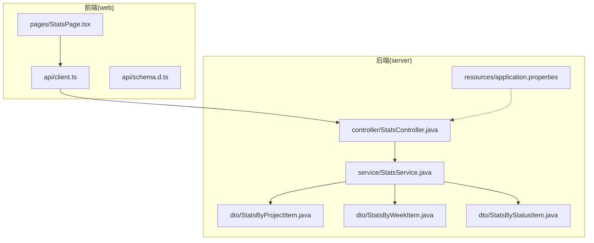
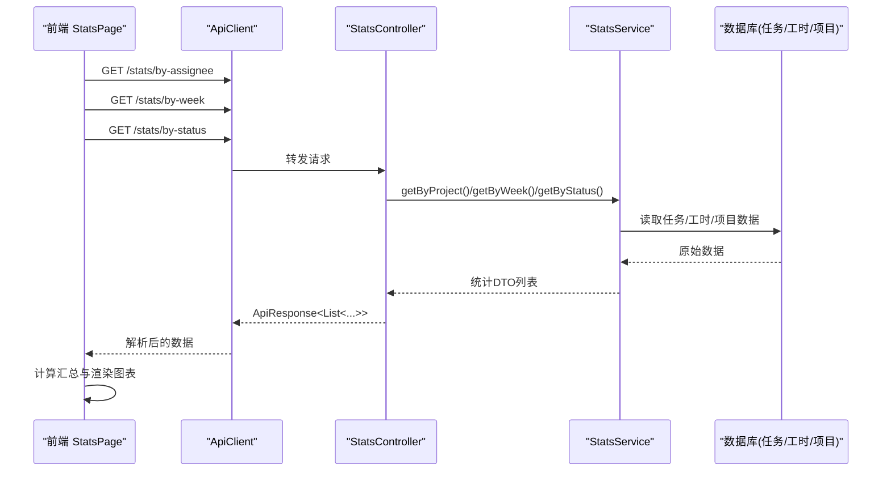
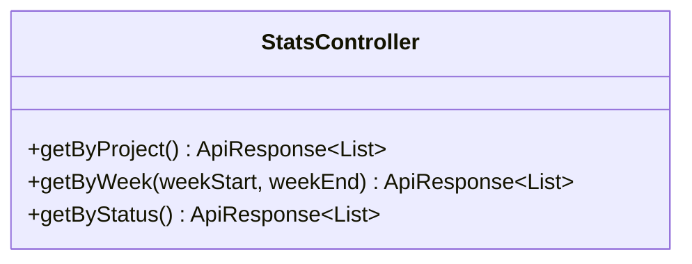
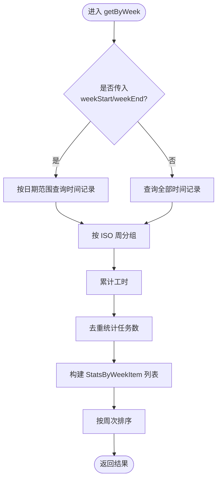
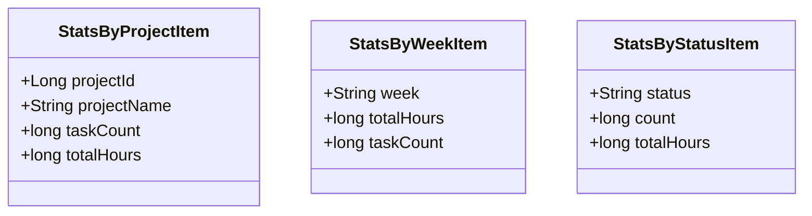
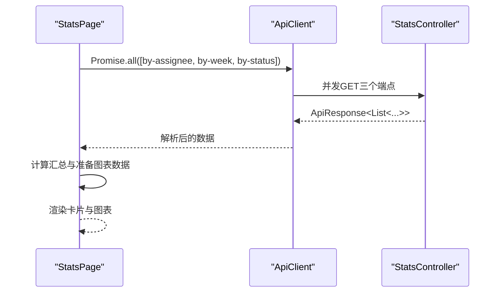
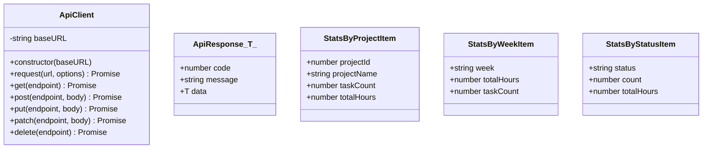
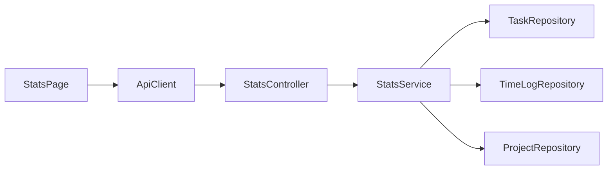

# 统计报表仪表板

<cite>
**本文引用的文件**   
- [README.md](file://README.md)
- [application.properties](file://server/src/main/resources/application.properties)
- [StatsController.java](file://server/src/main/java/com/taskboard/controller/StatsController.java)
- [StatsService.java](file://server/src/main/java/com/taskboard/service/StatsService.java)
- [StatsByProjectItem.java](file://server/src/main/java/com/taskboard/dto/StatsByProjectItem.java)
- [StatsByWeekItem.java](file://server/src/main/java/com/taskboard/dto/StatsByWeekItem.java)
- [StatsByStatusItem.java](file://server/src/main/java/com/taskboard/dto/StatsByStatusItem.java)
- [client.ts](file://web/src/api/client.ts)
- [schema.d.ts](file://web/src/api/schema.d.ts)
- [StatsPage.tsx](file://web/src/pages/StatsPage.tsx)
</cite>

## 目录
1. [简介](#简介)
2. [项目结构](#项目结构)
3. [核心组件](#核心组件)
4. [架构总览](#架构总览)
5. [详细组件分析](#详细组件分析)
6. [依赖关系分析](#依赖关系分析)
7. [性能与扩展性](#性能与扩展性)
8. [故障排查指南](#故障排查指南)
9. [结论](#结论)

## 简介
本文件聚焦“统计报表仪表板”功能，覆盖后端统计接口、服务层聚合逻辑、前端页面与图表展示。该功能提供三类统计：按项目、按周工时趋势、按任务状态，并以汇总卡片和多种图表呈现。

- 后端基于 Spring Boot，暴露 /api/stats 系列接口，返回统一 ApiResponse 包装。
- 前端基于 React + Ant Design Charts，通过 apiClient 调用后端并渲染柱状图、饼图和折线图。

## 项目结构
与统计报表相关的代码主要分布在 server（后端）与 web（前端）两个子模块中：

**图示来源**
- [StatsController.java:17-52](file://server/src/main/java/com/taskboard/controller/StatsController.java#L17-L52)
- [StatsService.java:20-158](file://server/src/main/java/com/taskboard/service/StatsService.java#L20-L158)
- [StatsByProjectItem.java:6-11](file://server/src/main/java/com/taskboard/dto/StatsByProjectItem.java#L6-L11)
- [StatsByWeekItem.java:6-10](file://server/src/main/java/com/taskboard/dto/StatsByWeekItem.java#L6-L10)
- [StatsByStatusItem.java:6-10](file://server/src/main/java/com/taskboard/dto/StatsByStatusItem.java#L6-L10)
- [StatsPage.tsx:1-182](file://web/src/pages/StatsPage.tsx#L1-L182)
- [client.ts:11-85](file://web/src/api/client.ts#L11-L85)
- [schema.d.ts:70-95](file://web/src/api/schema.d.ts#L70-L95)
- [application.properties:1-18](file://server/src/main/resources/application.properties#L1-L18)

**章节来源**
- [README.md:10-16](file://README.md#L10-L16)

## 核心组件
- 控制器 StatsController：对外暴露三个 GET 接口，分别用于获取按项目、按周、按状态的统计数据。
- 服务层 StatsService：从 Task、TimeLog、Project 数据源进行聚合计算，输出 DTO 列表。
- DTO 模型：StatsByProjectItem、StatsByWeekItem、StatsByStatusItem 描述统计项字段。
- 前端 StatsPage：并行拉取三类数据，计算汇总指标，并使用 Ant Design Charts 渲染图表。
- API 客户端 client.ts：封装 HTTP 请求，统一处理响应体 ApiResponse。
- 类型定义 schema.d.ts：为前端提供 TypeScript 类型约束。

**章节来源**
- [StatsController.java:17-52](file://server/src/main/java/com/taskboard/controller/StatsController.java#L17-L52)
- [StatsService.java:20-158](file://server/src/main/java/com/taskboard/service/StatsService.java#L20-L158)
- [StatsByProjectItem.java:6-11](file://server/src/main/java/com/taskboard/dto/StatsByProjectItem.java#L6-L11)
- [StatsByWeekItem.java:6-10](file://server/src/main/java/com/taskboard/dto/StatsByWeekItem.java#L6-L10)
- [StatsByStatusItem.java:6-10](file://server/src/main/java/com/taskboard/dto/StatsByStatusItem.java#L6-L10)
- [StatsPage.tsx:24-182](file://web/src/pages/StatsPage.tsx#L24-L182)
- [client.ts:11-85](file://web/src/api/client.ts#L11-L85)
- [schema.d.ts:70-95](file://web/src/api/schema.d.ts#L70-L95)

## 架构总览
统计报表的数据流从前端发起请求，经后端控制器路由到服务层聚合，最终将结果以 JSON 返回给前端渲染。

**图示来源**
- [StatsPage.tsx:33-59](file://web/src/pages/StatsPage.tsx#L33-L59)
- [client.ts:18-36](file://web/src/api/client.ts#L18-L36)
- [StatsController.java:27-52](file://server/src/main/java/com/taskboard/controller/StatsController.java#L27-L52)
- [StatsService.java:39-148](file://server/src/main/java/com/taskboard/service/StatsService.java#L39-L148)

## 详细组件分析

### 控制器层：StatsController
- 职责：接收 /api/stats 下的三类查询请求，委托 StatsService 完成聚合，统一返回 ApiResponse。
- 关键端点：
  - GET /api/stats/by-assignee：按项目维度统计任务数与工时。
  - GET /api/stats/by-week：按 ISO 周维度统计工时与涉及任务数，支持可选的 weekStart/weekEnd 过滤。
  - GET /api/stats/by-status：按任务状态维度统计任务数与工时。

**图示来源**
- [StatsController.java:17-52](file://server/src/main/java/com/taskboard/controller/StatsController.java#L17-L52)

**章节来源**
- [StatsController.java:17-52](file://server/src/main/java/com/taskboard/controller/StatsController.java#L17-L52)

### 服务层：StatsService
- 职责：对 Task、TimeLog、Project 数据进行聚合，输出三类统计 DTO。
- 核心逻辑要点：
  - 按项目统计：汇总每个项目的任务数量与工时；若项目名缺失则回退为“项目 #id”。
  - 按周统计：基于 TimeLog.workDate 使用 ISO 周规则分组，统计每周总工时与涉及任务数；当传入 weekStart/weekEnd 时仅查询该区间。
  - 按状态统计：确保包含 TODO/IN_PROGRESS/DONE/CLOSED 四类状态，即使某类无数据也返回计数为 0。
  - 工时解析：安全地将字符串工时转换为数值，异常值视为 0。

**图示来源**
- [StatsService.java:80-115](file://server/src/main/java/com/taskboard/service/StatsService.java#L80-L115)

**章节来源**
- [StatsService.java:39-158](file://server/src/main/java/com/taskboard/service/StatsService.java#L39-L158)

### DTO 模型
- StatsByProjectItem：projectId、projectName、taskCount、totalHours。
- StatsByWeekItem：week、totalHours、taskCount。
- StatsByStatusItem：status、count、totalHours。

**图示来源**
- [StatsByProjectItem.java:6-11](file://server/src/main/java/com/taskboard/dto/StatsByProjectItem.java#L6-L11)
- [StatsByWeekItem.java:6-10](file://server/src/main/java/com/taskboard/dto/StatsByWeekItem.java#L6-L10)
- [StatsByStatusItem.java:6-10](file://server/src/main/java/com/taskboard/dto/StatsByStatusItem.java#L6-L10)

**章节来源**
- [StatsByProjectItem.java:6-11](file://server/src/main/java/com/taskboard/dto/StatsByProjectItem.java#L6-L11)
- [StatsByWeekItem.java:6-10](file://server/src/main/java/com/taskboard/dto/StatsByWeekItem.java#L6-L10)
- [StatsByStatusItem.java:6-10](file://server/src/main/java/com/taskboard/dto/StatsByStatusItem.java#L6-L10)

### 前端页面：StatsPage
- 生命周期：组件挂载后并行请求三类统计接口，成功后更新状态并渲染。
- 汇总指标：项目总数、任务总数、累计工时（分钟）。
- 图表：
  - 按项目统计：分组柱状图（任务数、工时）。
  - 按状态统计：环形饼图（状态占比）。
  - 按周工时趋势：折线图（周 vs 工时）。
- 错误处理：捕获网络或解析异常，显示重试按钮。

**图示来源**
- [StatsPage.tsx:33-59](file://web/src/pages/StatsPage.tsx#L33-L59)
- [StatsPage.tsx:69-92](file://web/src/pages/StatsPage.tsx#L69-L92)
- [StatsPage.tsx:94-182](file://web/src/pages/StatsPage.tsx#L94-L182)
- [client.ts:18-36](file://web/src/api/client.ts#L18-L36)

**章节来源**
- [StatsPage.tsx:24-182](file://web/src/pages/StatsPage.tsx#L24-L182)

### API 客户端与类型
- ApiClient：封装 fetch，统一设置 Content-Type，处理非 2xx 响应抛出错误。
- schema.d.ts：定义 ApiResponse、StatsByProjectItem、StatsByWeekItem、StatsByStatusItem 等类型，保证前后端数据结构一致。

**图示来源**
- [client.ts:11-85](file://web/src/api/client.ts#L11-L85)
- [schema.d.ts:4-8](file://web/src/api/schema.d.ts#L4-L8)
- [schema.d.ts:70-95](file://web/src/api/schema.d.ts#L70-L95)

**章节来源**
- [client.ts:11-85](file://web/src/api/client.ts#L11-L85)
- [schema.d.ts:70-95](file://web/src/api/schema.d.ts#L70-L95)

## 依赖关系分析
- 控制器依赖服务层，服务层依赖多个 Repository（TaskRepository、TimeLogRepository、ProjectRepository），并通过 DTO 传递结果。
- 前端依赖 ApiClient 与 schema 类型定义，页面组件负责状态管理与图表渲染。

**图示来源**
- [StatsController.java:17-52](file://server/src/main/java/com/taskboard/controller/StatsController.java#L17-L52)
- [StatsService.java:20-34](file://server/src/main/java/com/taskboard/service/StatsService.java#L20-L34)
- [StatsPage.tsx:1-7](file://web/src/pages/StatsPage.tsx#L1-L7)
- [client.ts:11-85](file://web/src/api/client.ts#L11-L85)

**章节来源**
- [StatsController.java:17-52](file://server/src/main/java/com/taskboard/controller/StatsController.java#L17-L52)
- [StatsService.java:20-34](file://server/src/main/java/com/taskboard/service/StatsService.java#L20-L34)
- [StatsPage.tsx:1-7](file://web/src/pages/StatsPage.tsx#L1-L7)
- [client.ts:11-85](file://web/src/api/client.ts#L11-L85)

## 性能与扩展性
- 聚合复杂度：
  - 按项目/按状态：对任务与工时集合进行分组与求和，时间复杂度近似 O(N+M)，N 为任务数，M 为工时记录数。
  - 按周：在工时记录上按 ISO 周分组，再对任务 ID 去重计数，复杂度近似 O(M)。
- 优化建议：
  - 在服务层引入缓存（如按周/按状态的结果缓存），减少重复聚合开销。
  - 对大表场景，考虑在数据库层实现聚合 SQL，降低内存压力。
  - 前端可分页加载历史周数据，避免一次性渲染过多折线点。

[本节为通用指导，不直接分析具体文件]

## 故障排查指南
- 端口与服务启动：
  - 后端默认端口为 8081，上下文路径为根路径。可通过 health 接口验证服务可用性。
- 常见错误：
  - 前端报 HTTP 错误：检查后端是否启动、端口是否正确、跨域与代理配置。
  - 工时解析异常：后端会忽略非法工时值，前端仍可能显示 0，需核对工时录入格式。
  - 空数据：当无任务或工时时，图表区域显示“暂无数据”，属预期行为。
- 调试建议：
  - 使用 H2 Console 查看数据初始化情况。
  - 在后端开启 SQL 日志，确认聚合查询是否符合预期。

**章节来源**
- [application.properties:1-18](file://server/src/main/resources/application.properties#L1-L18)
- [StatsService.java:150-157](file://server/src/main/java/com/taskboard/service/StatsService.java#L150-L157)
- [StatsPage.tsx:52-67](file://web/src/pages/StatsPage.tsx#L52-L67)

## 结论
统计报表仪表板通过清晰的分层架构实现了多维度统计数据的聚合与可视化。后端控制器与服务层职责明确，前端以并发请求提升加载体验，并以多种图表直观呈现结果。建议在数据量增长时引入缓存与数据库侧聚合，进一步提升性能与可扩展性。