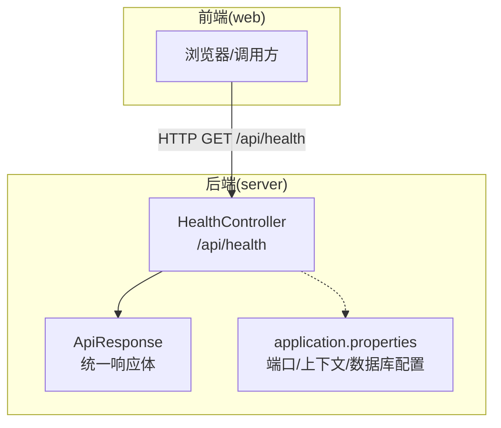
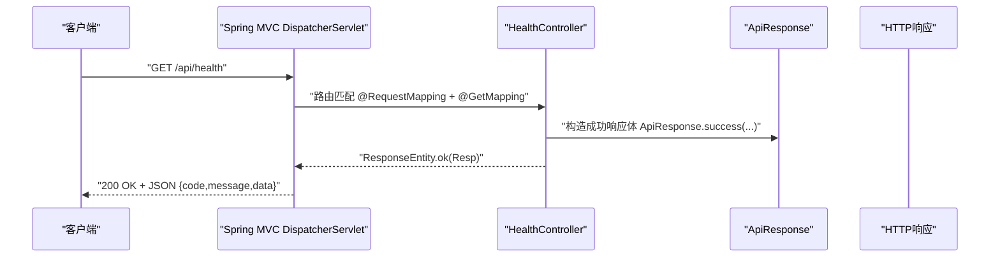
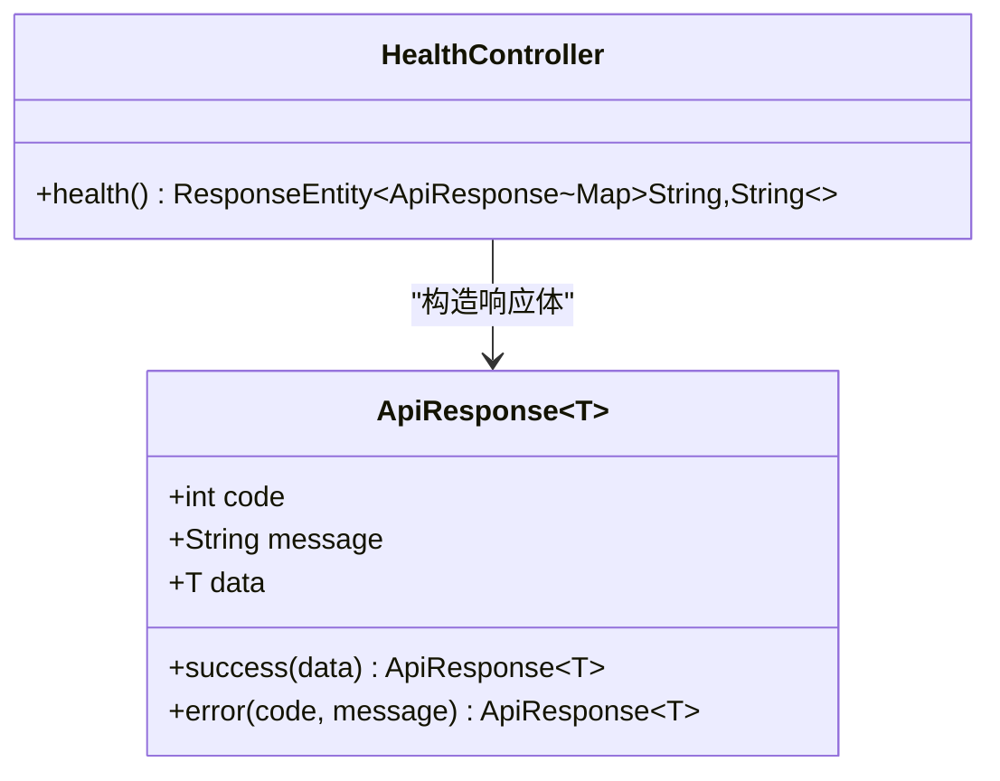

# API控制器层

<cite>
**本文引用的文件**
- [HealthController.java](file://server/src/main/java/com/taskboard/controller/HealthController.java)
- [ApiResponse.java](file://server/src/main/java/com/taskboard/dto/ApiResponse.java)
- [application.properties](file://server/src/main/resources/application.properties)
- [README.md](file://README.md)
- [HealthControllerTest.java](file://server/src/test/java/com/taskboard/controller/HealthControllerTest.java)
</cite>

## 目录
1. [简介](#简介)
2. [项目结构](#项目结构)
3. [核心组件](#核心组件)
4. [架构总览](#架构总览)
5. [详细组件分析](#详细组件分析)
6. [依赖关系分析](#依赖关系分析)
7. [性能考量](#性能考量)
8. [故障排查指南](#故障排查指南)
9. [结论](#结论)
10. [附录：新增API端点规范与示例](#附录新增api端点规范与示例)

## 简介
本章节面向TaskBoard后端API控制器层，聚焦RESTful设计原则在HealthController中的落地实践。文档从HTTP方法选择、URL路径设计、状态码使用入手，完整梳理从HTTP请求接收到响应返回的处理链路；解析@RestContoller与@RequestMapping注解的使用方式与最佳实践；说明参数绑定、数据验证与异常处理机制；并给出API版本控制、请求拦截器与中间件的设计理念，以及开发新API端点的规范与参考路径。

## 项目结构
本项目采用前后端分离的Monorepo结构，后端基于Spring Boot 4（Java 25），前端为React 19。后端服务默认监听8080端口，所有API统一以/api为前缀暴露。健康检查接口位于controller包下，统一的响应体封装在dto包中。

图表来源
- [HealthController.java:14-26](file://server/src/main/java/com/taskboard/controller/HealthController.java#L14-L26)
- [ApiResponse.java:6-26](file://server/src/main/java/com/taskboard/dto/ApiResponse.java#L6-L26)
- [application.properties:1-2](file://server/src/main/resources/application.properties#L1-L2)

章节来源
- [README.md:25-37](file://README.md#L25-L37)
- [application.properties:1-2](file://server/src/main/resources/application.properties#L1-L2)

## 核心组件
- HealthController：提供健康检查REST端点，遵循REST语义，使用GET方法访问资源，返回标准JSON响应体。
- ApiResponse：统一响应包装类，包含code、message、data字段，便于客户端一致化处理。

章节来源
- [HealthController.java:14-26](file://server/src/main/java/com/taskboard/controller/HealthController.java#L14-L26)
- [ApiResponse.java:6-26](file://server/src/main/java/com/taskboard/dto/ApiResponse.java#L6-L26)

## 架构总览
下图展示了从客户端发起请求到控制器处理并返回响应的整体流程，包括Spring MVC的映射、控制器方法执行、统一响应体封装与HTTP状态码设置。

图表来源
- [HealthController.java:14-26](file://server/src/main/java/com/taskboard/controller/HealthController.java#L14-L26)
- [ApiResponse.java:20-26](file://server/src/main/java/com/taskboard/dto/ApiResponse.java#L20-L26)

## 详细组件分析

### RESTful设计原则在HealthController中的实现
- HTTP方法选择
  - 使用GET获取系统健康状态，符合幂等、只读语义。
- URL路径设计
  - 根路径由application.properties的context-path决定为“/”，控制器级前缀为“/api”，具体资源为“/health”，最终路径为“/api/health”。
- 状态码使用
  - 通过ResponseEntity.ok(...)返回200 OK，表示请求成功。
  - 业务状态码由ApiResponse.code表达，当前成功场景为200。

章节来源
- [HealthController.java:14-26](file://server/src/main/java/com/taskboard/controller/HealthController.java#L14-L26)
- [application.properties:1-2](file://server/src/main/resources/application.properties#L1-L2)
- [ApiResponse.java:20-26](file://server/src/main/java/com/taskboard/dto/ApiResponse.java#L20-L26)

### 注解使用与最佳实践
- @RestController
  - 将类声明为REST控制器，自动启用@ResponseBody语义，简化返回值序列化。
- @RequestMapping("/api")
  - 为控制器内所有端点统一添加/api前缀，便于未来进行API版本化（如/v1）。
- @GetMapping("/health")
  - 精确映射GET /health，避免歧义，提高可读性。

最佳实践建议
- 控制器仅负责请求路由与响应组装，业务逻辑下沉至Service层。
- 使用ResponseEntity显式控制HTTP状态码，增强可观测性与一致性。
- 统一响应体封装于ApiResponse，保证前后端契约稳定。

章节来源
- [HealthController.java:14-26](file://server/src/main/java/com/taskboard/controller/HealthController.java#L14-L26)
- [ApiResponse.java:6-26](file://server/src/main/java/com/taskboard/dto/ApiResponse.java#L6-L26)

### 参数绑定、数据验证与异常处理
- 参数绑定
  - 当前健康检查端点无入参，无需@PathVariable或@RequestParam。
  - 若后续扩展查询条件，可使用@RequestParam绑定可选参数，并结合@Valid进行校验。
- 数据验证
  - 建议在DTO上使用JSR-303/380注解（如@NotBlank、@NotNull）配合@Valid进行入参校验。
- 异常处理
  - 建议在全局使用@ControllerAdvice + @ExceptionHandler统一捕获并转换为ApiResponse错误格式，保持错误响应一致性。
  - 对未找到资源、参数非法、权限不足等分别返回合适的HTTP状态码（404、400、403等）。

章节来源
- [HealthController.java:14-26](file://server/src/main/java/com/taskboard/controller/HealthController.java#L14-L26)
- [ApiResponse.java:20-26](file://server/src/main/java/com/taskboard/dto/ApiResponse.java#L20-L26)

### API版本控制策略
- 当前API前缀为/api，推荐通过URL路径版本化：/api/v1/...，便于向后兼容与平滑演进。
- 也可结合Accept头或自定义Header进行版本协商，但URL版本化更直观且易于缓存与网关路由。

章节来源
- [application.properties:1-2](file://server/src/main/resources/application.properties#L1-L2)
- [HealthController.java:14-16](file://server/src/main/java/com/taskboard/controller/HealthController.java#L14-L16)

### 请求拦截器与中间件设计理念
- 拦截器（HandlerInterceptor）
  - 用于横切关注点：日志记录、耗时统计、审计、限流前置检查等。
- 过滤器（Filter）
  - 适合更底层的请求预处理：CORS、编码、安全头设置等。
- 建议
  - 将鉴权、限流、灰度等能力抽象为可插拔组件，按需要装配。
  - 与统一响应体结合，确保错误信息标准化输出。

[本节为通用设计说明，不直接分析具体代码文件]

## 依赖关系分析
HealthController依赖统一响应体ApiResponse，并通过Spring MVC完成请求映射与响应序列化。测试用例通过MockMvc验证接口行为。

图表来源
- [HealthController.java:14-26](file://server/src/main/java/com/taskboard/controller/HealthController.java#L14-L26)
- [ApiResponse.java:6-26](file://server/src/main/java/com/taskboard/dto/ApiResponse.java#L6-L26)

章节来源
- [HealthControllerTest.java:29-36](file://server/src/test/java/com/taskboard/controller/HealthControllerTest.java#L29-L36)

## 性能考量
- 健康检查接口应轻量、快速返回，避免引入外部依赖或慢查询。
- 使用即时时间戳而非持久化存储，减少I/O开销。
- 在高并发场景下，可通过连接池、线程池与缓存优化后续复杂接口。

[本节为通用性能建议，不直接分析具体代码文件]

## 故障排查指南
- 接口不可达
  - 检查application.properties中的server.port与context-path是否正确。
- 路径错误
  - 确认请求路径是否包含正确的上下文路径与控制器前缀，即“/api/health”。
- 响应体不一致
  - 确认客户端期望的code/message/data字段是否与ApiResponse定义一致。
- 单元测试失败
  - 使用MockMvc复现问题，核对断言：状态码、JSON路径与字段值。

章节来源
- [application.properties:1-2](file://server/src/main/resources/application.properties#L1-L2)
- [HealthControllerTest.java:29-36](file://server/src/test/java/com/taskboard/controller/HealthControllerTest.java#L29-L36)

## 结论
HealthController以简洁的方式实现了RESTful健康检查端点，遵循了清晰的HTTP语义、合理的URL设计与一致的状态码约定。通过统一响应体ApiResponse，保证了前后端契约的一致性。后续可在该基础上扩展更多业务端点，并引入全局异常处理、参数校验、API版本化与拦截器等工程化能力，提升系统的可维护性与可观测性。

[本节为总结性内容，不直接分析具体代码文件]

## 附录：新增API端点规范与示例
- 命名与路径
  - 使用名词复数表示资源集合，动词放在HTTP方法中，例如：GET /api/v1/tasks。
  - 资源ID使用路径变量，例如：GET /api/v1/tasks/{id}。
- 方法选择
  - GET：读取资源（幂等、安全）
  - POST：创建资源
  - PUT/PATCH：更新资源（全量/增量）
  - DELETE：删除资源
- 状态码
  - 200/201/204：成功
  - 400：参数错误
  - 401/403：认证/授权失败
  - 404：资源不存在
  - 500：服务器内部错误
- 请求体与响应体
  - 入参使用DTO并配合@Valid校验
  - 出参统一使用ApiResponse<T>封装
- 版本控制
  - 通过URL路径版本化：/api/v1/...
- 示例（概念性步骤）
  - 新建DTO：定义字段与校验规则
  - 新建Controller：使用@RestController与@RequestMapping标注
  - 编写方法：使用@GetMapping/@PostMapping等映射HTTP方法
  - 组装响应：使用ApiResponse.success/error
  - 编写测试：使用MockMvc断言状态码与JSON字段

[本节为通用规范与步骤说明，不直接分析具体代码文件]