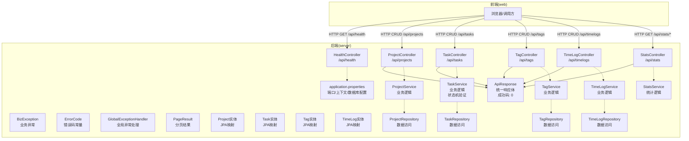
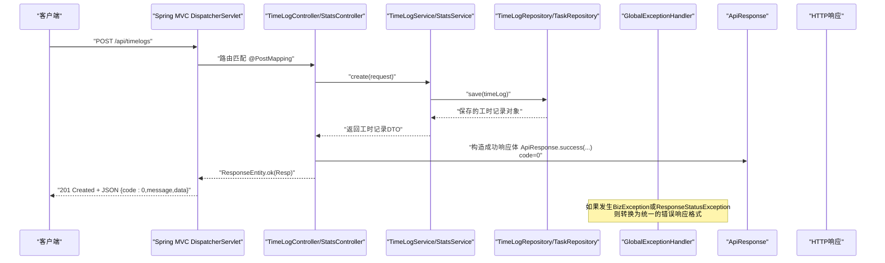

# API控制器层

<cite>
**本文引用的文件**
- [HealthController.java](file://server/src/main/java/com/taskboard/controller/HealthController.java)
- [ProjectController.java](file://server/src/main/java/com/taskboard/controller/ProjectController.java)
- [TaskController.java](file://server/src/main/java/com/taskboard/controller/TaskController.java)
- [TagController.java](file://server/src/main/java/com/taskboard/controller/TagController.java)
- [TimeLogController.java](file://server/src/main/java/com/taskboard/controller/TimeLogController.java)
- [StatsController.java](file://server/src/main/java/com/taskboard/controller/StatsController.java)
- [BizException.java](file://server/src/main/java/com/taskboard/common/BizException.java)
- [ErrorCode.java](file://server/src/main/java/com/taskboard/common/ErrorCode.java)
- [GlobalExceptionHandler.java](file://server/src/main/java/com/taskboard/common/GlobalExceptionHandler.java)
- [PageResult.java](file://server/src/main/java/com/taskboard/common/PageResult.java)
- [ApiResponse.java](file://server/src/main/java/com/taskboard/dto/ApiResponse.java)
- [CreateTimeLogRequest.java](file://server/src/main/java/com/taskboard/dto/CreateTimeLogRequest.java)
- [TimeLogDto.java](file://server/src/main/java/com/taskboard/dto/TimeLogDto.java)
- [TaskTransitionResult.java](file://server/src/main/java/com/taskboard/dto/TaskTransitionResult.java)
- [StatsByProjectItem.java](file://server/src/main/java/com/taskboard/dto/StatsByProjectItem.java)
- [StatsByWeekItem.java](file://server/src/main/java/com/taskboard/dto/StatsByWeekItem.java)
- [StatsByStatusItem.java](file://server/src/main/java/com/taskboard/dto/StatsByStatusItem.java)
- [CreateTaskRequest.java](file://server/src/main/java/com/taskboard/dto/CreateTaskRequest.java)
- [UpdateTaskRequest.java](file://server/src/main/java/com/taskboard/dto/UpdateTaskRequest.java)
- [TaskDto.java](file://server/src/main/java/com/taskboard/dto/TaskDto.java)
- [TagDto.java](file://server/src/main/java/com/taskboard/dto/TagDto.java)
- [Project.java](file://server/src/main/java/com/taskboard/entity/Project.java)
- [Task.java](file://server/src/main/java/com/taskboard/entity/Task.java)
- [Tag.java](file://server/src/main/java/com/taskboard/entity/Tag.java)
- [TimeLog.java](file://server/src/main/java/com/taskboard/entity/TimeLog.java)
- [ProjectService.java](file://server/src/main/java/com/taskboard/service/ProjectService.java)
- [TaskService.java](file://server/src/main/java/com/taskboard/service/TaskService.java)
- [TagService.java](file://server/src/main/java/com/taskboard/service/TagService.java)
- [TimeLogService.java](file://server/src/main/java/com/taskboard/service/TimeLogService.java)
- [StatsService.java](file://server/src/main/java/com/taskboard/service/StatsService.java)
- [ProjectRepository.java](file://server/src/main/java/com/taskboard/repository/ProjectRepository.java)
- [TaskRepository.java](file://server/src/main/java/com/taskboard/repository/TaskRepository.java)
- [TagRepository.java](file://server/src/main/java/com/taskboard/repository/TagRepository.java)
- [TimeLogRepository.java](file://server/src/main/java/com/taskboard/repository/TimeLogRepository.java)
- [application.properties](file://server/src/main/resources/application.properties)
- [README.md](file://README.md)
- [HealthControllerTest.java](file://server/src/test/java/com/taskboard/controller/HealthControllerTest.java)
- [ProjectControllerTest.java](file://server/src/test/java/com/taskboard/controller/ProjectControllerTest.java)
</cite>

## 更新摘要
**变更内容**
- 新增TimeLogController和StatsController，实现工时统计和报表功能
- 增强错误处理基础设施，引入BizException、ErrorCode和GlobalExceptionHandler
- TaskController新增状态转换端点(/tasks/{id}/transitions)，支持复杂的状态机验证
- 统一分页响应格式，使用PageResult封装分页数据
- 完善API的错误处理和状态码使用规范

## 目录
1. [简介](#简介)
2. [项目结构](#项目结构)
3. [核心组件](#核心组件)
4. [架构总览](#架构总览)
5. [详细组件分析](#详细组件分析)
6. [依赖关系分析](#依赖关系分析)
7. [性能考量](#性能考量)
8. [故障排查指南](#故障排查指南)
9. [结论](#结论)
10. [附录：新增API端点规范与示例](#附录新增api端点规范与示例)

## 简介
本章节面向TaskBoard后端API控制器层，聚焦RESTful设计原则在HealthController、ProjectController、TaskController、TagController、TimeLogController和StatsController中的落地实践。文档从HTTP方法选择、URL路径设计、状态码使用入手，完整梳理从HTTP请求接收到响应返回的处理链路；解析@RestContoller与@RequestMapping注解的使用方式与最佳实践；说明参数绑定、数据验证与异常处理机制；并给出API版本控制、请求拦截器与中间件的设计理念，以及开发新API端点的规范与参考路径。

**更新摘要**
- ApiResponse成功响应码已标准化为0，替代原来的200
- 新增了TimeLogController和StatsController两个重要的业务控制器
- TaskController实现了复杂的状态机验证逻辑和状态转换端点
- 引入了统一的错误处理基础设施(BizException、ErrorCode、GlobalExceptionHandler)
- 统一的分页响应格式提升了API的一致性和可维护性
- 增强了错误处理模式和业务逻辑验证机制

## 项目结构
本项目采用前后端分离的Monorepo结构，后端基于Spring Boot 4（Java 25），前端为React 19。后端服务默认监听8080端口，所有API统一以/api为前缀暴露。健康检查接口位于controller包下，项目管理API同样位于controller包中，新增的任务管理API、标签管理API、工时管理API和统计报表API也遵循相同的组织结构，统一的响应体封装在dto包中，增强的错误处理基础设施位于common包中。

图表来源
- [HealthController.java:14-26](file://server/src/main/java/com/taskboard/controller/HealthController.java#L14-L26)
- [ProjectController.java:14-77](file://server/src/main/java/com/taskboard/controller/ProjectController.java#L14-L77)
- [TaskController.java:16-89](file://server/src/main/java/com/taskboard/controller/TaskController.java#L16-L89)
- [TagController.java:14-64](file://server/src/main/java/com/taskboard/controller/TagController.java#L14-L64)
- [TimeLogController.java:15-66](file://server/src/main/java/com/taskboard/controller/TimeLogController.java#L15-L66)
- [StatsController.java:17-54](file://server/src/main/java/com/taskboard/controller/StatsController.java#L17-L54)
- [BizException.java:7-29](file://server/src/main/java/com/taskboard/common/BizException.java#L7-L29)
- [ErrorCode.java:9-40](file://server/src/main/java/com/taskboard/common/ErrorCode.java#L9-L40)
- [GlobalExceptionHandler.java:14-92](file://server/src/main/java/com/taskboard/common/GlobalExceptionHandler.java#L14-L92)
- [ApiResponse.java:6-26](file://server/src/main/java/com/taskboard/dto/ApiResponse.java#L6-L26)
- [PageResult.java:8-59](file://server/src/main/java/com/taskboard/common/PageResult.java#L8-L59)

章节来源
- [README.md:25-37](file://README.md#L25-L37)
- [application.properties:1-2](file://server/src/main/resources/application.properties#L1-L2)

## 核心组件
- HealthController：提供健康检查REST端点，遵循REST语义，使用GET方法访问资源，返回标准JSON响应体。
- ProjectController：提供项目管理的完整RESTful API，包括获取所有项目、创建项目、获取单个项目、更新项目和删除项目。
- **新增** TaskController：提供任务管理的RESTful API，包含状态机验证功能和状态转换端点，支持任务的CRUD操作和复杂的状态转换逻辑。
- **新增** TagController：提供标签管理的RESTful API，包含标签的CRUD操作。
- **新增** TimeLogController：提供工时记录的RESTful API，包含分页查询、创建和删除功能，支持按任务ID过滤。
- **新增** StatsController：提供统计报表的RESTful API，包含按项目、按周、按状态的统计数据聚合。
- **新增** BizException：业务异常类，携带错误码和消息，用于抛出业务逻辑异常。
- **新增** ErrorCode：错误码常量类，定义了参数验证、状态转换、内部错误等分类的错误码。
- **新增** GlobalExceptionHandler：全局异常处理器，将各种异常转换为统一的ApiResponse格式。
- ApiResponse：统一响应包装类，包含code、message、data字段，成功响应码标准化为0，便于客户端一致化处理。
- **新增** PageResult：分页结果容器，包含items、total、page、size字段，用于封装分页数据。
- Project实体：JPA实体类，映射数据库project表，包含项目的基本信息和时间戳。
- **新增** Task实体：JPA实体类，映射数据库task表，包含任务的状态、优先级、截止日期等信息，支持与标签的多对多关联。
- **新增** Tag实体：JPA实体类，映射数据库tag表，包含标签名称和时间戳信息。
- **新增** TimeLog实体：JPA实体类，映射数据库timelog表，包含工时记录、工作日期和备注信息。
- ProjectService：业务逻辑层，处理项目相关的业务规则和事务管理。
- **新增** TaskService：业务逻辑层，处理任务相关的业务规则、状态机验证和事务管理。
- **新增** TagService：业务逻辑层，处理标签相关的业务规则和事务管理。
- **新增** TimeLogService：业务逻辑层，处理工时记录相关的业务规则和事务管理。
- **新增** StatsService：业务逻辑层，处理统计数据的聚合计算和事务管理。
- ProjectRepository：数据访问层，继承JpaRepository提供基础CRUD操作和自定义查询方法。
- **新增** TaskRepository：数据访问层，继承JpaRepository提供任务相关的数据操作。
- **新增** TagRepository：数据访问层，继承JpaRepository提供标签相关的数据操作。
- **新增** TimeLogRepository：数据访问层，继承JpaRepository提供工时记录相关的数据操作。

章节来源
- [HealthController.java:14-26](file://server/src/main/java/com/taskboard/controller/HealthController.java#L14-L26)
- [ProjectController.java:14-77](file://server/src/main/java/com/taskboard/controller/ProjectController.java#L14-L77)
- [TaskController.java:16-89](file://server/src/main/java/com/taskboard/controller/TaskController.java#L16-L89)
- [TagController.java:14-64](file://server/src/main/java/com/taskboard/controller/TagController.java#L14-L64)
- [TimeLogController.java:15-66](file://server/src/main/java/com/taskboard/controller/TimeLogController.java#L15-L66)
- [StatsController.java:17-54](file://server/src/main/java/com/taskboard/controller/StatsController.java#L17-L54)
- [BizException.java:7-29](file://server/src/main/java/com/taskboard/common/BizException.java#L7-L29)
- [ErrorCode.java:9-40](file://server/src/main/java/com/taskboard/common/ErrorCode.java#L9-L40)
- [GlobalExceptionHandler.java:14-92](file://server/src/main/java/com/taskboard/common/GlobalExceptionHandler.java#L14-L92)
- [ApiResponse.java:6-26](file://server/src/main/java/com/taskboard/dto/ApiResponse.java#L6-L26)
- [PageResult.java:8-59](file://server/src/main/java/com/taskboard/common/PageResult.java#L8-L59)

## 架构总览
下图展示了从客户端发起请求到控制器处理并返回响应的整体流程，包括Spring MVC的映射、控制器方法执行、业务逻辑处理、数据持久化与统一响应体封装。新增的TimeLogController和StatsController遵循相同的架构模式，同时集成了新的错误处理基础设施。

图表来源
- [TimeLogController.java:50-55](file://server/src/main/java/com/taskboard/controller/TimeLogController.java#L50-L55)
- [StatsController.java:30-33](file://server/src/main/java/com/taskboard/controller/StatsController.java#L30-L33)
- [TimeLogService.java:51-100](file://server/src/main/java/com/taskboard/service/TimeLogService.java#L51-L100)
- [StatsService.java:39-75](file://server/src/main/java/com/taskboard/service/StatsService.java#L39-L75)
- [GlobalExceptionHandler.java:32-42](file://server/src/main/java/com/taskboard/common/GlobalExceptionHandler.java#L32-L42)
- [ApiResponse.java:20-26](file://server/src/main/java/com/taskboard/dto/ApiResponse.java#L20-L26)

## 详细组件分析

### RESTful设计原则在HealthController中的实现
- HTTP方法选择
  - 使用GET获取系统健康状态，符合幂等、只读语义。
- URL路径设计
  - 根路径由application.properties的context-path决定为"/"，控制器级前缀为"/api"，具体资源为"/health"，最终路径为"/api/health"。
- 状态码使用
  - 通过ResponseEntity.ok(...)返回200 OK，表示请求成功。
  - 业务状态码由ApiResponse.code表达，**更新**成功场景现在统一为0，而非之前的200。

章节来源
- [HealthController.java:14-26](file://server/src/main/java/com/taskboard/controller/HealthController.java#L14-L26)
- [application.properties:1-2](file://server/src/main/resources/application.properties#L1-L2)
- [ApiResponse.java:20-26](file://server/src/main/java/com/taskboard/dto/ApiResponse.java#L20-L26)

### RESTful设计原则在ProjectController中的实现
- HTTP方法选择
  - GET /api/projects：获取所有项目列表，幂等操作
  - POST /api/projects：创建新项目，非幂等操作
  - GET /api/projects/{id}：获取指定ID的项目，幂等操作
  - PUT /api/projects/{id}：更新指定ID的项目，幂等操作
  - DELETE /api/projects/{id}：删除指定ID的项目，幂等操作
- URL路径设计
  - 控制器级前缀为"/api/projects"，资源ID使用路径变量{id}
  - 集合资源使用复数形式"projects"，符合RESTful命名规范
- 状态码使用
  - 成功操作返回200 OK，部分操作如删除返回200 OK而非204 No Content
  - 业务异常通过ResponseStatusException抛出，自动转换为相应HTTP状态码
  - 404 Not Found：资源不存在
  - 400 Bad Request：参数验证失败
  - 409 Conflict：资源冲突（如重复名称）
  - **更新** 业务响应码统一为0表示成功，HTTP状态码与业务状态码分离

章节来源
- [ProjectController.java:27-76](file://server/src/main/java/com/taskboard/controller/ProjectController.java#L27-L76)
- [ProjectService.java:45-115](file://server/src/main/java/com/taskboard/service/ProjectService.java#L45-L115)

### **新增** RESTful设计原则在TaskController中的实现
- HTTP方法选择
  - GET /api/tasks：获取所有任务列表，幂等操作
  - POST /api/tasks：创建新任务，非幂等操作
  - GET /api/tasks/{id}：获取指定ID的任务，幂等操作
  - PUT /api/tasks/{id}：更新指定ID的任务，幂等操作
  - PATCH /api/tasks/{id}/transitions：任务状态转换，幂等操作
  - DELETE /api/tasks/{id}：删除指定ID的任务，幂等操作
- URL路径设计
  - 控制器级前缀为"/api/tasks"，资源ID使用路径变量{id}
  - 特殊操作使用子路径/transitions进行状态转换
  - 集合资源使用复数形式"tasks"，符合RESTful命名规范
- 状态码使用
  - 成功操作返回200 OK，部分操作如创建返回201 Created，删除返回204 No Content
  - 业务异常通过ResponseStatusException抛出，自动转换为相应HTTP状态码
  - 404 Not Found：任务不存在
  - 400 Bad Request：参数验证失败或状态转换非法
  - **更新** 业务响应码统一为0表示成功，HTTP状态码与业务状态码分离
- **新增** 状态机验证
  - TODO → IN_PROGRESS：任务开始处理
  - IN_PROGRESS → DONE：任务完成
  - IN_PROGRESS → TODO：任务回退到待办
  - DONE → CLOSED：任务关闭
  - DONE → IN_PROGRESS：任务重新打开
  - CLOSED：终态，不允许任何状态转换

**更新** TaskController实现了完整的RESTful CRUD操作和复杂的状态机验证逻辑，遵循标准的HTTP语义和状态码约定，并使用标准化的成功响应码0。新增的状态转换端点提供了细粒度的状态管理能力。

章节来源
- [TaskController.java:29-88](file://server/src/main/java/com/taskboard/controller/TaskController.java#L29-L88)
- [TaskService.java:157-170](file://server/src/main/java/com/taskboard/service/TaskService.java#L157-L170)
- [TaskService.java:248-267](file://server/src/main/java/com/taskboard/service/TaskService.java#L248-L267)

### **新增** RESTful设计原则在TagController中的实现
- HTTP方法选择
  - GET /api/tags：获取所有标签列表，幂等操作
  - POST /api/tags：创建新标签，非幂等操作
  - PUT /api/tags/{id}：更新指定ID的标签，幂等操作
  - DELETE /api/tags/{id}：删除指定ID的标签，幂等操作
- URL路径设计
  - 控制器级前缀为"/api/tags"，资源ID使用路径变量{id}
  - 集合资源使用复数形式"tags"，符合RESTful命名规范
- 状态码使用
  - 成功操作返回200 OK，使用@ResponseStatus显式声明
  - 业务异常通过ResponseStatusException抛出，自动转换为相应HTTP状态码
  - 404 Not Found：标签不存在
  - 400 Bad Request：参数验证失败
  - 409 Conflict：标签名称重复
  - **更新** 业务响应码统一为0表示成功，HTTP状态码与业务状态码分离

**更新** TagController实现了完整的RESTful CRUD操作，遵循标准的HTTP语义和状态码约定，并使用标准化的成功响应码0。

章节来源
- [TagController.java:27-63](file://server/src/main/java/com/taskboard/controller/TagController.java#L27-L63)
- [TagService.java:40-98](file://server/src/main/java/com/taskboard/service/TagService.java#L40-L98)

### **新增** RESTful设计原则在TimeLogController中的实现
- HTTP方法选择
  - GET /api/timelogs：获取工时记录列表（支持分页和按任务过滤），幂等操作
  - POST /api/timelogs：创建新的工时记录，非幂等操作
  - DELETE /api/timelogs/{id}：删除指定的工时记录，幂等操作
- URL路径设计
  - 控制器级前缀为"/api/timelogs"，资源ID使用路径变量{id}
  - 查询参数支持taskId过滤、page分页、size分页大小
  - 集合资源使用复数形式"timelogs"，符合RESTful命名规范
- 状态码使用
  - 成功操作返回200 OK，创建操作返回201 Created，删除操作返回204 No Content
  - 业务异常通过BizException抛出，由GlobalExceptionHandler转换为相应HTTP状态码
  - 400 Bad Request：参数验证失败
  - 404 Not Found：工时记录不存在
  - **更新** 业务响应码统一为0表示成功，HTTP状态码与业务状态码分离
- **新增** 分页支持
  - 使用PageResult封装分页数据，包含items、total、page、size字段
  - 默认分页大小为20，最大限制为100条记录
  - 支持按任务ID过滤工时记录

**更新** TimeLogController实现了完整的RESTful API，支持分页查询、参数过滤和统一的分页响应格式，遵循标准的HTTP语义和状态码约定。

章节来源
- [TimeLogController.java:28-64](file://server/src/main/java/com/taskboard/controller/TimeLogController.java#L28-L64)
- [TimeLogService.java:36-111](file://server/src/main/java/com/taskboard/service/TimeLogService.java#L36-L111)
- [PageResult.java:8-59](file://server/src/main/java/com/taskboard/common/PageResult.java#L8-L59)

### **新增** RESTful设计原则在StatsController中的实现
- HTTP方法选择
  - GET /api/stats/by-assignee：获取按项目聚合的统计数据，幂等操作
  - GET /api/stats/by-week：获取按周聚合的统计数据，幂等操作
  - GET /api/stats/by-status：获取按任务状态聚合的统计数据，幂等操作
- URL路径设计
  - 控制器级前缀为"/api/stats"，统计类型使用子路径区分
  - 支持可选的日期范围参数(weekStart, weekEnd)进行时间范围过滤
  - 统计端点使用描述性的子路径，符合RESTful命名规范
- 状态码使用
  - 成功操作返回200 OK
  - 业务异常通过BizException抛出，由GlobalExceptionHandler转换为相应HTTP状态码
  - 400 Bad Request：参数验证失败
  - **更新** 业务响应码统一为0表示成功，HTTP状态码与业务状态码分离
- **新增** 统计维度
  - 按项目聚合：包含项目ID、项目名称、任务数量、总工时
  - 按周聚合：包含ISO周标识、总工时、参与任务数量
  - 按状态聚合：包含任务状态、任务数量、总工时

**更新** StatsController实现了完整的统计报表API，支持多种统计维度和时间范围过滤，使用标准化的成功响应码0。

章节来源
- [StatsController.java:30-52](file://server/src/main/java/com/taskboard/controller/StatsController.java#L30-L52)
- [StatsService.java:39-148](file://server/src/main/java/com/taskboard/service/StatsService.java#L39-L148)

### 增强的错误处理基础设施
- **新增** BizException
  - 业务异常基类，携带错误码和消息
  - 支持通过ErrorCode枚举或自定义错误码构造
  - 被GlobalExceptionHandler捕获并转换为统一的错误响应格式
- **新增** ErrorCode
  - 错误码常量定义，采用分段分配方案：
    - 40xxx：参数/验证错误
    - 42xxx：状态转换错误
    - 49xxx：内部错误
  - 预定义了常用错误码如PARAM_REQUIRED、TRANSITION_ILLEGAL、INTERNAL_DB等
- **新增** GlobalExceptionHandler
  - 全局异常处理器，使用@RestControllerAdvice注解
  - 统一处理BizException、ResponseStatusException、IllegalArgumentException等异常
  - 将异常转换为包含errors数组的ApiErrorResult格式
  - 根据错误码自动映射到合适的HTTP状态码

**更新** 整个系统的错误处理机制得到了显著增强，提供了更细粒度的错误分类和更友好的错误响应格式。

章节来源
- [BizException.java:7-29](file://server/src/main/java/com/taskboard/common/BizException.java#L7-L29)
- [ErrorCode.java:9-40](file://server/src/main/java/com/taskboard/common/ErrorCode.java#L9-L40)
- [GlobalExceptionHandler.java:14-92](file://server/src/main/java/com/taskboard/common/GlobalExceptionHandler.java#L14-L92)

### 注解使用与最佳实践
- @RestController
  - 将类声明为REST控制器，自动启用@ResponseBody语义，简化返回值序列化。
- @RequestMapping("/api")
  - 为控制器内所有端点统一添加/api前缀，便于未来进行API版本化（如/v1）。
- @GetMapping/@PostMapping/@PutMapping/@DeleteMapping/@PatchMapping
  - 精确映射各种HTTP方法，避免歧义，提高可读性。
- @RequestParam/@PathVariable
  - 分别用于查询参数和路径变量的绑定，支持可选参数和默认值。
- @ResponseStatus
  - 显式设置HTTP状态码，增强API的可观测性。
- **新增** @Transactional
  - 用于Service层方法的事务管理，确保数据一致性。
- **新增** @DateTimeFormat
  - 用于日期参数的格式化解析，支持ISO日期格式。

最佳实践建议
- 控制器仅负责请求路由与响应组装，业务逻辑下沉至Service层。
- 使用ResponseEntity显式控制HTTP状态码，增强可观测性与一致性。
- 统一响应体封装于ApiResponse，保证前后端契约稳定，**更新**成功响应码统一为0。
- 在Service层进行业务验证和异常处理，保持控制器简洁。
- **新增** 使用BizException和ErrorCode进行业务异常的规范化处理。
- **新增** 使用PageResult封装分页数据，提供一致的分页响应格式。

章节来源
- [HealthController.java:14-26](file://server/src/main/java/com/taskboard/controller/HealthController.java#L14-L26)
- [ProjectController.java:14-77](file://server/src/main/java/com/taskboard/controller/ProjectController.java#L14-L77)
- [TaskController.java:16-89](file://server/src/main/java/com/taskboard/controller/TaskController.java#L16-L89)
- [TagController.java:14-64](file://server/src/main/java/com/taskboard/controller/TagController.java#L14-L64)
- [TimeLogController.java:15-66](file://server/src/main/java/com/taskboard/controller/TimeLogController.java#L15-L66)
- [StatsController.java:17-54](file://server/src/main/java/com/taskboard/controller/StatsController.java#L17-L54)
- [ApiResponse.java:6-26](file://server/src/main/java/com/taskboard/dto/ApiResponse.java#L6-L26)

### 参数绑定、数据验证与异常处理
- 参数绑定
  - 路径变量：使用@PathVariable绑定URL中的{id}参数
  - 查询参数：使用@RequestParam绑定可选参数，支持required和defaultValue属性
  - 请求体：当前使用表单参数，可扩展为@RequestBody接收JSON
  - **新增** 日期参数：使用@DateTimeFormat配合ISO日期格式进行解析
- 数据验证
  - 业务层验证：在Service层进行名称唯一性、长度限制等业务规则验证
  - **新增** 参数验证：TimeLogService中对工时数值、日期格式、备注长度等进行严格验证
  - **新增** 业务验证：使用BizException和ErrorCode抛出标准化的业务异常
  - 建议使用JSR-303/380注解（如@NotBlank、@NotNull、@Size）配合@Valid进行入参校验
- 异常处理
  - 使用ResponseStatusException抛出业务异常，自动转换为HTTP状态码
  - **新增** 全局异常处理：GlobalExceptionHandler统一捕获并转换为ApiResponse错误格式
  - **新增** 错误码映射：根据错误码自动映射到合适的HTTP状态码
  - 对未找到资源、参数非法、权限不足等分别返回合适的HTTP状态码（404、400、403等）

**更新** 整个参数绑定和数据验证机制得到了显著增强，新增了日期参数处理、严格的业务验证和统一的全局异常处理机制。

章节来源
- [ProjectController.java:38-44](file://server/src/main/java/com/taskboard/controller/ProjectController.java#L38-L44)
- [TaskController.java:48-53](file://server/src/main/java/com/taskboard/controller/TaskController.java#L48-L53)
- [TagController.java:46-53](file://server/src/main/java/com/taskboard/controller/TagController.java#L46-L53)
- [TimeLogController.java:29-33](file://server/src/main/java/com/taskboard/controller/TimeLogController.java#L29-L33)
- [StatsController.java:39-42](file://server/src/main/java/com/taskboard/controller/StatsController.java#L39-L42)
- [TimeLogService.java:53-90](file://server/src/main/java/com/taskboard/service/TimeLogService.java#L53-L90)
- [GlobalExceptionHandler.java:32-92](file://server/src/main/java/com/taskboard/common/GlobalExceptionHandler.java#L32-L92)

### API版本控制策略
- 当前API前缀为/api，推荐通过URL路径版本化：/api/v1/...，便于向后兼容与平滑演进。
- 也可结合Accept头或自定义Header进行版本协商，但URL版本化更直观且易于缓存与网关路由。

章节来源
- [application.properties:1-2](file://server/src/main/resources/application.properties#L1-L2)
- [HealthController.java:14-16](file://server/src/main/java/com/taskboard/controller/HealthController.java#L14-L16)
- [ProjectController.java:15](file://server/src/main/java/com/taskboard/controller/ProjectController.java#L15)
- [TaskController.java:17](file://server/src/main/java/com/taskboard/controller/TaskController.java#L17)
- [TagController.java:15](file://server/src/main/java/com/taskboard/controller/TagController.java#L15)
- [TimeLogController.java:16](file://server/src/main/java/com/taskboard/controller/TimeLogController.java#L16)
- [StatsController.java:18](file://server/src/main/java/com/taskboard/controller/StatsController.java#L18)

### 请求拦截器与中间件设计理念
- 拦截器（HandlerInterceptor）
  - 用于横切关注点：日志记录、耗时统计、审计、限流前置检查等。
- 过滤器（Filter）
  - 适合更底层的请求预处理：CORS、编码、安全头设置等。
- 建议
  - 将鉴权、限流、灰度等能力抽象为可插拔组件，按需要装配。
  - 与统一响应体结合，确保错误信息标准化输出，**更新**成功响应码统一为0。
  - **新增** 与全局异常处理集成，确保所有异常都能转换为统一的错误响应格式。

[本节为通用设计说明，不直接分析具体代码文件]

## 依赖关系分析
HealthController、ProjectController、TaskController、TagController、TimeLogController和StatsController都依赖统一响应体ApiResponse，并通过Spring MVC完成请求映射与响应序列化。各控制器还依赖相应的Service进行业务逻辑处理，形成清晰的三层架构。**新增**的TimeLogController和StatsController引入了新的依赖关系，同时所有控制器都受益于增强的错误处理基础设施。测试用例通过MockMvc验证接口行为。

```mermaid
classDiagram
class HealthController {
+health() ResponseEntity~ApiResponse~Map~String,String~~
}
class ProjectController {
+getAllProjects() ApiResponse~Project[]~
+createProject(name, description) ApiResponse~Project~
+getProject(id) ApiResponse~Project~
+updateProject(id, name, description) ApiResponse~Project~
+deleteProject(id) ApiResponse~Void~
}
class TaskController {
+getAllTasks() ApiResponse~TaskDto[]~
+createTask(request) ApiResponse~TaskDto~
+getTaskById(id) ApiResponse~TaskDto~
+updateTask(id, request) ApiResponse~TaskDto~
+transitionStatus(id, to) ApiResponse~TaskTransitionResult~
+deleteTask(id) ApiResponse~Void~
}
class TagController {
+getAllTags() ApiResponse~TagDto[]~
+createTag(name) ApiResponse~TagDto~
+updateTag(id, name) ApiResponse~TagDto~
+deleteTag(id) ApiResponse~Void~
}
class TimeLogController {
+getTimeLogs(taskId, page, size) ApiResponse~PageResult~TimeLogDto~~
+createTimeLog(request) ApiResponse~TimeLogDto~
+deleteTimeLog(id) ApiResponse~Void~
}
class StatsController {
+getByProject() ApiResponse~StatsByProjectItem[]~
+getByWeek(weekStart, weekEnd) ApiResponse~StatsByWeekItem[]~
+getByStatus() ApiResponse~StatsByStatusItem[]~
}
class BizException {
+int errorCode
+getMessage() String
+getErrorCode() int
}
class ErrorCode {
+PARAM_REQUIRED
+TRANSITION_ILLEGAL
+INTERNAL_DB
}
class GlobalExceptionHandler {
+handleBizException(ex) ResponseEntity~ApiErrorResult~
+handleResponseStatusException(ex) ResponseEntity~ApiErrorResult~
+handleIllegalArgument(ex) ResponseEntity~ApiErrorResult~
}
class ProjectService {
+getAllProjects() Project[]
+createProject(name, description) Project
+getProjectById(id) Project
+updateProject(id, name, description) Project
+deleteProject(id) void
}
class TaskService {
+findAll() TaskDto[]
+createTask(request) TaskDto
+findById(id) Optional~TaskDto~
+updateTask(id, request) TaskDto
+transitionStatus(id, targetStatus) TaskDto
+deleteTask(id) void
+validateStateTransition(current, target) void
}
class TagService {
+findAll() TagDto[]
+createTag(name) TagDto
+updateTag(id, name) TagDto
+deleteTag(id) void
}
class TimeLogService {
+findAll(taskId, page, size) Page~TimeLogDto~
+create(request) TimeLogDto
+delete(id) void
}
class StatsService {
+getByProject() StatsByProjectItem[]
+getByWeek(weekStart, weekEnd) StatsByWeekItem[]
+getByStatus() StatsByStatusItem[]
}
class ProjectRepository {
+findAllByOrderByCreatedAtDesc() Project[]
+existsByName(name) boolean
}
class TaskRepository {
+findAllByOrderByCreatedAtDesc() Task[]
+findAllByProjectIdOrderByCreatedAtDesc(projectId) Task[]
+existsById(id) boolean
}
class TagRepository {
+findAllByOrderByCreatedAtDesc() Tag[]
+existsByName(name) boolean
}
class TimeLogRepository {
+findByTaskIdOrderByWorkDateDesc(taskId, pageRequest) Page~TimeLog~
+findAllByOrderByWorkDateDesc(pageRequest) Page~TimeLog~
+existsById(id) boolean
+findAllOrdered() TimeLog[]
+findByDateRange(start, end) TimeLog[]
}
class ApiResponse~T~ {
+int code
+String message
+T data
+success(data) ApiResponse~T~
+error(code, message) ApiResponse~T~
}
HealthController --> ApiResponse : "构造响应体<br/>code=0"
ProjectController --> ProjectService : "业务逻辑调用"
ProjectController --> ApiResponse : "构造响应体<br/>code=0"
TaskController --> TaskService : "业务逻辑调用<br/>状态机验证"
TaskController --> ApiResponse : "构造响应体<br/>code=0"
TagController --> TagService : "业务逻辑调用"
TagController --> ApiResponse : "构造响应体<br/>code=0"
TimeLogController --> TimeLogService : "业务逻辑调用<br/>分页处理"
TimeLogController --> ApiResponse : "构造响应体<br/>code=0"
StatsController --> StatsService : "统计逻辑调用"
StatsController --> ApiResponse : "构造响应体<br/>code=0"
ProjectService --> ProjectRepository : "数据访问"
TaskService --> TaskRepository : "数据访问"
TagService --> TagRepository : "数据访问"
TimeLogService --> TimeLogRepository : "数据访问"
TimeLogService --> TaskRepository : "数据访问"
StatsService --> TaskRepository : "数据访问"
StatsService --> TimeLogRepository : "数据访问"
StatsService --> ProjectRepository : "数据访问"
GlobalExceptionHandler --> BizException : "处理业务异常"
GlobalExceptionHandler --> ErrorCode : "错误码映射"
```

图表来源
- [HealthController.java:14-26](file://server/src/main/java/com/taskboard/controller/HealthController.java#L14-L26)
- [ProjectController.java:14-77](file://server/src/main/java/com/taskboard/controller/ProjectController.java#L14-L77)
- [TaskController.java:16-89](file://server/src/main/java/com/taskboard/controller/TaskController.java#L16-L89)
- [TagController.java:14-64](file://server/src/main/java/com/taskboard/controller/TagController.java#L14-L64)
- [TimeLogController.java:15-66](file://server/src/main/java/com/taskboard/controller/TimeLogController.java#L15-L66)
- [StatsController.java:17-54](file://server/src/main/java/com/taskboard/controller/StatsController.java#L17-L54)
- [BizException.java:7-29](file://server/src/main/java/com/taskboard/common/BizException.java#L7-L29)
- [ErrorCode.java:9-40](file://server/src/main/java/com/taskboard/common/ErrorCode.java#L9-L40)
- [GlobalExceptionHandler.java:14-92](file://server/src/main/java/com/taskboard/common/GlobalExceptionHandler.java#L14-L92)
- [ProjectService.java:15-116](file://server/src/main/java/com/taskboard/service/ProjectService.java#L15-L116)
- [TaskService.java:25-311](file://server/src/main/java/com/taskboard/service/TaskService.java#L25-L311)
- [TagService.java:18-127](file://server/src/main/java/com/taskboard/service/TagService.java#L18-L127)
- [TimeLogService.java:23-113](file://server/src/main/java/com/taskboard/service/TimeLogService.java#L23-L113)
- [StatsService.java:24-159](file://server/src/main/java/com/taskboard/service/StatsService.java#L24-L159)
- [ProjectRepository.java:12-24](file://server/src/main/java/com/taskboard/repository/ProjectRepository.java#L12-L24)
- [TaskRepository.java:11-27](file://server/src/main/java/com/taskboard/repository/TaskRepository.java#L11-L27)
- [TagRepository.java:11-22](file://server/src/main/java/com/taskboard/repository/TagRepository.java#L11-L22)
- [TimeLogRepository.java:11-22](file://server/src/main/java/com/taskboard/repository/TimeLogRepository.java#L11-L22)
- [ApiResponse.java:6-26](file://server/src/main/java/com/taskboard/dto/ApiResponse.java#L6-L26)

章节来源
- [HealthControllerTest.java:29-36](file://server/src/test/java/com/taskboard/controller/HealthControllerTest.java#L29-L36)
- [ProjectControllerTest.java:43-114](file://server/src/test/java/com/taskboard/controller/ProjectControllerTest.java#L43-L114)

## 性能考量
- 健康检查接口应轻量、快速返回，避免引入外部依赖或慢查询。
- 使用即时时间戳而非持久化存储，减少I/O开销。
- 项目列表查询使用按创建时间倒序排序，优化常见使用场景。
- **新增** 工时记录查询使用分页机制，避免一次性加载大量数据。
- **新增** 统计查询使用优化的数据聚合算法，减少内存占用。
- 在高并发场景下，可通过连接池、线程池与缓存优化后续复杂接口。
- 使用@Transactional确保数据一致性，但需注意事务边界避免过长事务。
- **新增** 统计服务使用只读事务(@Transactional(readOnly = true))提升查询性能。

**更新** TimeLogService和StatsService引入了事务管理和优化的查询方法，提升了数据操作的可靠性和性能。TaskService的状态机验证逻辑增加了额外的计算开销，但保证了业务规则的严格执行。同时使用标准化的成功响应码0减少了响应体大小。新增的分页机制有效控制了单次查询的数据量。

[本节为通用性能建议，不直接分析具体代码文件]

## 故障排查指南
- 接口不可达
  - 检查application.properties中的server.port与context-path是否正确。
- 路径错误
  - 确认请求路径是否包含正确的上下文路径与控制器前缀，即"/api/health"、"/api/projects"、"/api/tasks"、"/api/tags"、"/api/timelogs"或"/api/stats"。
- 响应体不一致
  - 确认客户端期望的code/message/data字段是否与ApiResponse定义一致，**更新**成功响应码应为0而非200。
- 单元测试失败
  - 使用MockMvc复现问题，核对断言：状态码、JSON路径与字段值，**更新**注意code字段断言应为0。
- 项目操作异常
  - 检查项目名称唯一性约束，避免重复名称导致409冲突。
  - 验证参数长度限制，确保名称不超过64字符，描述不超过512字符。
  - 确认项目ID存在性，避免404未找到错误。
- **新增** 任务操作异常
  - 检查任务状态转换是否符合状态机规则，避免非法状态转换导致400错误。
  - 验证任务标题长度限制（128字符）和描述长度限制（1024字符）。
  - 确认任务优先级范围（0-3）和截止日期格式（ISO-8601）。
  - 检查标签ID的有效性，避免无效的标签关联。
- **新增** 标签操作异常
  - 检查标签名称唯一性约束，避免重复名称导致409冲突。
  - 验证标签名称长度限制（64字符）。
  - 确认标签ID存在性，避免404未找到错误。
- **新增** 工时记录操作异常
  - 检查工时数值是否为正整数，避免参数验证失败。
  - 验证工作日期格式（YYYY-MM-DD），避免日期解析异常。
  - 确认任务ID存在性，避免关联任务不存在错误。
  - 检查备注长度限制（256字符），避免超出长度限制。
  - 验证分页参数范围，确保size不超过100。
- **新增** 统计查询异常
  - 检查日期参数格式，确保weekStart和weekEnd为有效的ISO日期格式。
  - 验证日期范围合理性，避免无效的时间范围查询。
  - 确认数据库中存在相关数据，避免空结果集处理异常。

**更新** 新增了任务相关API、标签相关API、工时记录API和统计API的故障排查指导，包括状态机验证、参数验证、资源存在性检查、分页参数验证和日期格式验证，以及成功响应码标准化为0的注意事项。

章节来源
- [application.properties:1-2](file://server/src/main/resources/application.properties#L1-L2)
- [HealthControllerTest.java:29-36](file://server/src/test/java/com/taskboard/controller/HealthControllerTest.java#L29-L36)
- [ProjectControllerTest.java:43-114](file://server/src/test/java/com/taskboard/controller/ProjectControllerTest.java#L43-L114)
- [TaskService.java:248-267](file://server/src/main/java/com/taskboard/service/TaskService.java#L248-L267)
- [TagService.java:102-115](file://server/src/main/java/com/taskboard/service/TagService.java#L102-L115)
- [TimeLogService.java:53-90](file://server/src/main/java/com/taskboard/service/TimeLogService.java#L53-L90)
- [StatsService.java:81-87](file://server/src/main/java/com/taskboard/service/StatsService.java#L81-L87)

## 结论
HealthController、ProjectController、TaskController、TagController、TimeLogController和StatsController共同构成了TaskBoard的后端API控制器层，以简洁的方式实现了RESTful健康检查、项目管理系统、任务管理系统、标签管理系统、工时记录系统和统计报表系统。六个控制器都遵循了清晰的HTTP语义、合理的URL设计与一致的状态码约定。**更新**通过统一响应体ApiResponse的成功响应码标准化为0，以及增强的错误处理基础设施(BizException、ErrorCode、GlobalExceptionHandler)，保证了前后端契约的一致性和API设计的规范性。新增的TimeLogController和StatsController完善了系统的工时管理和统计分析功能，展现了完整的RESTful API设计模式。特别是TaskController的状态机验证机制、TimeLogController的分页查询功能和StatsController的多维度统计能力体现了复杂的业务逻辑处理能力。后续可在该基础上扩展更多业务端点，并引入全局异常处理、参数校验、API版本化与拦截器等工程化能力，提升系统的可维护性与可观测性。

[本节为总结性内容，不直接分析具体代码文件]

## 附录：新增API端点规范与示例
- 命名与路径
  - 使用名词复数表示资源集合，动词放在HTTP方法中，例如：GET /api/v1/tasks。
  - 资源ID使用路径变量，例如：GET /api/v1/tasks/{id}。
  - 特殊操作使用子路径，例如：PATCH /api/v1/tasks/{id}/transitions。
  - 统计端点使用描述性子路径，例如：GET /api/v1/stats/by-project。
- 方法选择
  - GET：读取资源（幂等、安全）
  - POST：创建资源
  - PUT/PATCH：更新资源（全量/增量）
  - DELETE：删除资源
- 状态码
  - HTTP状态码：200/201/204表示成功，400/401/403/404/409/500表示各类错误
  - **更新** 业务响应码：0表示成功，其他数值表示具体业务错误
- 请求体与响应体
  - 入参使用DTO并配合@Valid校验
  - 出参统一使用ApiResponse<T>封装，**更新**成功响应code字段固定为0
  - **新增** 分页响应使用PageResult<T>封装，包含items、total、page、size字段
- 版本控制
  - 通过URL路径版本化：/api/v1/...
- 错误处理
  - **新增** 使用BizException抛出业务异常，携带ErrorCode
  - **新增** GlobalExceptionHandler统一处理异常，转换为包含errors数组的错误响应
  - **新增** 错误码分类：40xxx参数错误、42xxx状态转换错误、49xxx内部错误
- 示例（概念性步骤）
  - 新建DTO：定义字段与校验规则
  - 新建Controller：使用@RestController与@RequestMapping标注
  - 编写方法：使用@GetMapping/@PostMapping等映射HTTP方法
  - 组装响应：使用ApiResponse.success/error，**更新**成功响应自动使用code=0
  - 处理异常：使用BizException和ErrorCode抛出业务异常
  - 分页处理：使用PageResult封装分页数据
  - 编写测试：使用MockMvc断言状态码与JSON字段，**更新**注意code字段断言应为0

**更新** 新增了业务响应码标准化的重要规范，成功响应统一使用code=0，这是ApiResponse标准化设计的关键特性。同时新增了特殊操作路径的设计模式，如任务状态转换的/transitions子路径，以及统计端点的描述性子路径设计。新增了分页响应格式和错误处理机制的规范要求。

[本节为通用规范与步骤说明，不直接分析具体代码文件]