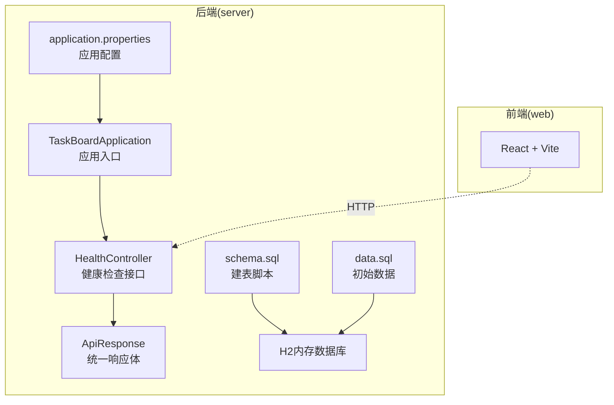
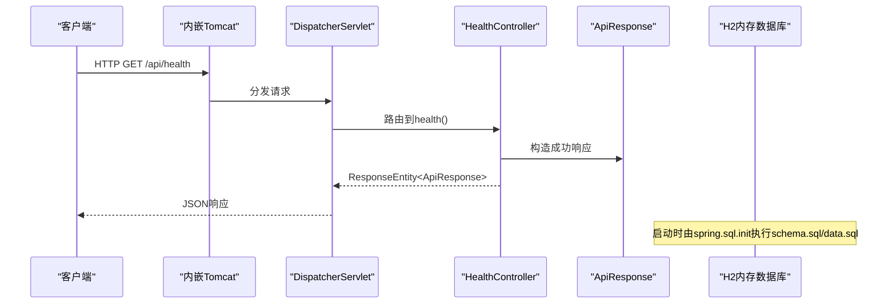
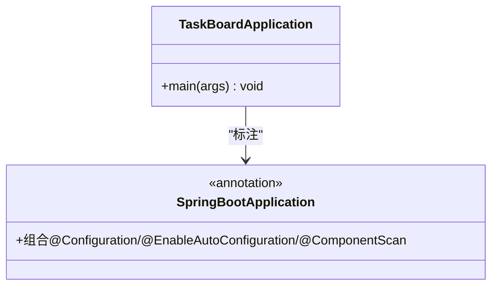
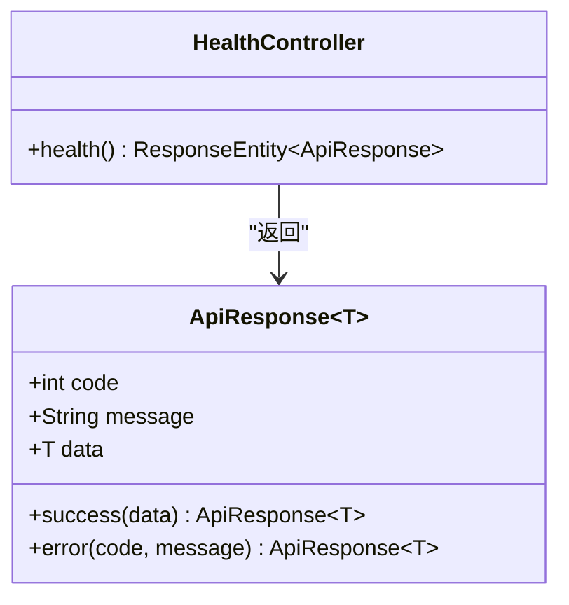
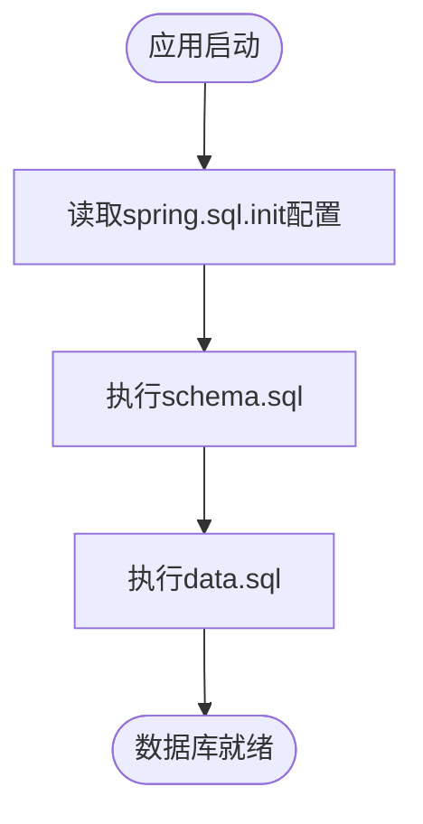
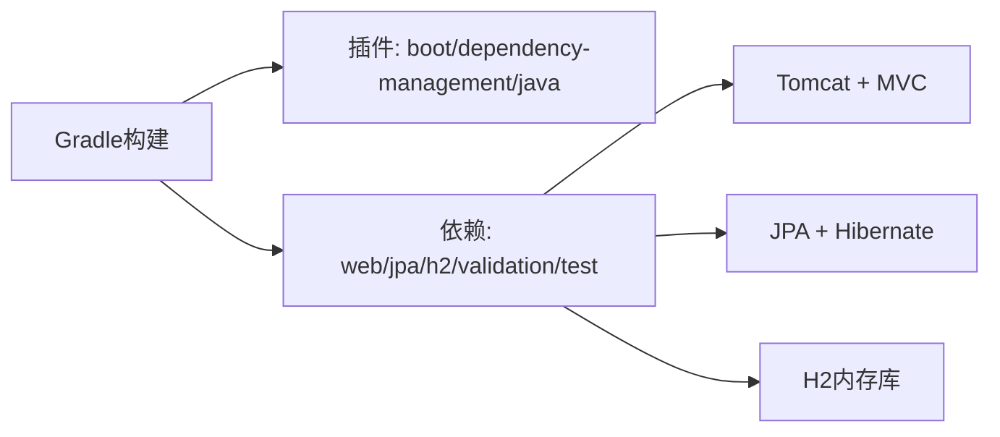
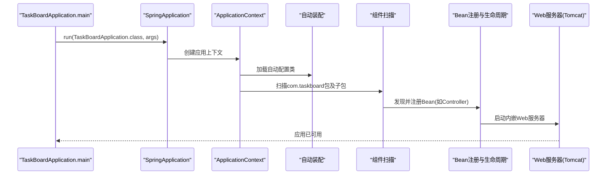

# Spring Boot应用架构

<cite>
**本文引用的文件**   
- [TaskBoardApplication.java](file://server/src/main/java/com/taskboard/TaskBoardApplication.java)
- [HealthController.java](file://server/src/main/java/com/taskboard/controller/HealthController.java)
- [ApiResponse.java](file://server/src/main/java/com/taskboard/dto/ApiResponse.java)
- [application.properties](file://server/src/main/resources/application.properties)
- [schema.sql](file://server/src/main/resources/schema.sql)
- [data.sql](file://server/src/main/resources/data.sql)
- [build.gradle.kts](file://server/build.gradle.kts)
- [settings.gradle.kts](file://server/settings.gradle.kts)
- [README.md](file://README.md)
</cite>

## 目录
1. [引言](#引言)
2. [项目结构](#项目结构)
3. [核心组件](#核心组件)
4. [架构总览](#架构总览)
5. [详细组件分析](#详细组件分析)
6. [依赖与构建分析](#依赖与构建分析)
7. [启动流程详解](#启动流程详解)
8. [配置与环境管理](#配置与环境管理)
9. [扩展与最佳实践](#扩展与最佳实践)
10. [性能优化建议](#性能优化建议)
11. [故障排查指南](#故障排查指南)
12. [结论](#结论)

## 引言
本技术文档面向TaskBoard的Spring Boot后端，系统阐述其应用架构、自动装配机制、Gradle构建配置、启动流程、配置与环境管理策略，以及扩展与性能优化实践。读者无需深入Java或Spring源码即可理解整体设计思路与关键实现要点。

## 项目结构
本项目采用前后端分离的Monorepo结构：
- server：Spring Boot后端（Java 25、Spring Boot 4.0.x、Gradle Kotlin DSL）
- web：React前端（TypeScript、Vite）

后端模块组织遵循“控制器-数据模型-资源”分层：
- controller：REST接口层
- dto：统一响应封装
- resources：应用配置与数据库初始化脚本

图表来源
- [TaskBoardApplication.java:6-10](file://server/src/main/java/com/taskboard/TaskBoardApplication.java#L6-L10)
- [HealthController.java:14-26](file://server/src/main/java/com/taskboard/controller/HealthController.java#L14-L26)
- [ApiResponse.java:6-26](file://server/src/main/java/com/taskboard/dto/ApiResponse.java#L6-L26)
- [application.properties:1-18](file://server/src/main/resources/application.properties#L1-L18)
- [schema.sql:1-6](file://server/src/main/resources/schema.sql#L1-L6)
- [data.sql:1-2](file://server/src/main/resources/data.sql#L1-L2)

章节来源
- [README.md:10-16](file://README.md#L10-L16)

## 核心组件
- TaskBoardApplication：应用主类，使用@SpringBootApplication并启动Spring容器
- HealthController：提供/api/health健康检查接口，返回统一响应体
- ApiResponse：统一API响应封装，包含code、message、data字段
- application.properties：端口、上下文路径、H2数据库、JPA/Hibernate、SQL初始化等配置
- schema.sql/data.sql：通过spring.sql.init自动执行，完成建表与初始数据加载

章节来源
- [TaskBoardApplication.java:6-10](file://server/src/main/java/com/taskboard/TaskBoardApplication.java#L6-L10)
- [HealthController.java:14-26](file://server/src/main/java/com/taskboard/controller/HealthController.java#L14-L26)
- [ApiResponse.java:6-26](file://server/src/main/java/com/taskboard/dto/ApiResponse.java#L6-L26)
- [application.properties:1-18](file://server/src/main/resources/application.properties#L1-L18)
- [schema.sql:1-6](file://server/src/main/resources/schema.sql#L1-L6)
- [data.sql:1-2](file://server/src/main/resources/data.sql#L1-L2)

## 架构总览
下图展示从请求进入Web容器到控制器处理并返回统一响应的调用链，以及与H2数据库的交互关系。

图表来源
- [HealthController.java:14-26](file://server/src/main/java/com/taskboard/controller/HealthController.java#L14-L26)
- [application.properties:1-18](file://server/src/main/resources/application.properties#L1-L18)
- [schema.sql:1-6](file://server/src/main/resources/schema.sql#L1-L6)
- [data.sql:1-2](file://server/src/main/resources/data.sql#L1-L2)

## 详细组件分析

### 应用入口与注解机制
- TaskBoardApplication使用@SpringBootApplication，该注解组合了以下能力：
  - @Configuration：启用配置类解析
  - @EnableAutoConfiguration：开启自动装配
  - @ComponentScan：默认扫描当前包及其子包下的组件
- main方法通过SpringApplication.run启动应用，触发容器初始化、自动装配、Bean注册与Web服务器启动

图表来源
- [TaskBoardApplication.java:6-10](file://server/src/main/java/com/taskboard/TaskBoardApplication.java#L6-L10)

章节来源
- [TaskBoardApplication.java:6-10](file://server/src/main/java/com/taskboard/TaskBoardApplication.java#L6-L10)

### 控制器与统一响应
- HealthController暴露GET /api/health，返回统一的ApiResponse包装对象，便于前端统一处理
- ApiResponse提供success/error静态工厂方法，规范业务状态码与消息

图表来源
- [HealthController.java:14-26](file://server/src/main/java/com/taskboard/controller/HealthController.java#L14-L26)
- [ApiResponse.java:6-26](file://server/src/main/java/com/taskboard/dto/ApiResponse.java#L6-L26)

章节来源
- [HealthController.java:14-26](file://server/src/main/java/com/taskboard/controller/HealthController.java#L14-L26)
- [ApiResponse.java:6-26](file://server/src/main/java/com/taskboard/dto/ApiResponse.java#L6-L26)

### 数据库初始化流程
- 通过spring.sql.init.mode=always与schema-locations/data-locations指定初始化脚本
- 启动时自动执行schema.sql创建表，再执行data.sql插入初始数据

图表来源
- [application.properties:10-15](file://server/src/main/resources/application.properties#L10-L15)
- [schema.sql:1-6](file://server/src/main/resources/schema.sql#L1-L6)
- [data.sql:1-2](file://server/src/main/resources/data.sql#L1-L2)

章节来源
- [application.properties:10-15](file://server/src/main/resources/application.properties#L10-L15)
- [schema.sql:1-6](file://server/src/main/resources/schema.sql#L1-L6)
- [data.sql:1-2](file://server/src/main/resources/data.sql#L1-L2)

## 依赖与构建分析
- Gradle插件：
  - org.springframework.boot：提供Boot相关任务与依赖管理
  - io.spring.dependency-management：集中管理依赖版本
  - java：标准Java编译与打包
- 依赖项：
  - spring-boot-starter-web：内置Tomcat与Web MVC
  - spring-boot-starter-data-jpa：JPA与Hibernate集成
  - h2：内存数据库运行时
  - spring-boot-starter-validation：参数校验支持
  - spring-boot-starter-test：测试框架（JUnit Platform）
- Java工具链：Java 25

图表来源
- [build.gradle.kts:1-42](file://server/build.gradle.kts#L1-L42)

章节来源
- [build.gradle.kts:1-42](file://server/build.gradle.kts#L1-L42)
- [settings.gradle.kts:1-9](file://server/settings.gradle.kts#L1-L9)

## 启动流程详解
从main方法执行到容器完全可用的关键步骤如下：

图表来源
- [TaskBoardApplication.java:6-10](file://server/src/main/java/com/taskboard/TaskBoardApplication.java#L6-L10)
- [build.gradle.kts:22-37](file://server/build.gradle.kts#L22-L37)

章节来源
- [TaskBoardApplication.java:6-10](file://server/src/main/java/com/taskboard/TaskBoardApplication.java#L6-L10)

## 配置与环境管理
- 应用配置集中在application.properties，包括：
  - 服务端口与上下文路径
  - H2数据源连接信息
  - JPA/Hibernate方言与DDL策略
  - SQL初始化模式与脚本位置
  - H2控制台开关与访问路径
- 环境变量与多环境支持策略建议：
  - 使用外部化配置：通过-D或环境变量覆盖application.properties中的键值
  - Profile切换：按环境拆分配置文件（如application-dev.properties、application-prod.properties），并通过spring.profiles.active激活
  - 敏感信息：将密码等敏感配置放入环境变量或密钥管理服务，避免硬编码
  - 数据库迁移：生产环境建议使用专用迁移工具（如Flyway/Liquibase），而非仅依赖spring.sql.init

章节来源
- [application.properties:1-18](file://server/src/main/resources/application.properties#L1-L18)

## 扩展与最佳实践
- 组件扫描与自动装配
  - 保持合理的包结构，确保@Component/@Service/@Repository等注解位于被扫描范围内
  - 谨慎使用@EnableAutoConfiguration排除不必要的自动配置，减少启动开销
- Bean生命周期管理
  - 合理使用@PostConstruct、DisposableBean等回调进行资源初始化与清理
  - 对长生命周期Bean注意线程安全与资源占用
- 控制器与DTO
  - 统一响应体封装（如ApiResponse）有助于前端一致处理
  - 使用JSR-303/380校验注解提升输入健壮性
- 数据库初始化
  - 开发阶段可使用spring.sql.init快速搭建；生产环境推荐迁移脚本工具
  - 合理设置ddl-auto，避免在生产环境意外变更结构
- 可观测性与健康检查
  - 在现有HealthController基础上接入Actuator指标与健康检查
  - 结合日志框架输出结构化日志，便于问题定位

[本节为通用实践指导，不直接分析具体文件]

## 性能优化建议
- 启动性能
  - 按需排除不必要的自动配置，减少Bean数量
  - 延迟初始化非关键Bean（如懒加载单例）
- 运行期性能
  - 合理设置JVM参数（堆大小、GC策略）
  - 针对H2的使用场景评估是否适合生产；如需持久化与高并发，考虑MySQL/PostgreSQL
  - 开启连接池（若引入其他数据库）并调优最大连接数
- I/O与序列化
  - 控制JSON序列化体积，避免返回冗余字段
  - 合理使用缓存（如Caffeine）降低热点查询压力

[本节为通用性能指导，不直接分析具体文件]

## 故障排查指南
- 端口冲突
  - 现象：启动时报端口占用
  - 处理：修改server.port或释放占用端口
- 数据库初始化失败
  - 现象：启动时报SQL语法错误或权限不足
  - 处理：检查schema.sql/data.sql语法与字符集；确认spring.sql.init.mode与脚本路径配置正确
- H2控制台无法访问
  - 现象：/h2-console返回404
  - 处理：确认spring.h2.console.enabled=true且路径配置正确
- 接口返回异常
  - 现象：前端收到非预期状态码或消息
  - 处理：检查HealthController返回值与ApiResponse封装逻辑；必要时增加全局异常处理器

章节来源
- [application.properties:1-18](file://server/src/main/resources/application.properties#L1-L18)
- [HealthController.java:14-26](file://server/src/main/java/com/taskboard/controller/HealthController.java#L14-L26)
- [ApiResponse.java:6-26](file://server/src/main/java/com/taskboard/dto/ApiResponse.java#L6-L26)

## 结论
TaskBoard后端以最小化的Spring Boot应用结构实现了REST接口、统一响应封装与基于H2的轻量级数据初始化。通过Gradle Kotlin DSL完成依赖管理与构建，配合application.properties实现可配置化部署。建议在后续迭代中完善多环境配置、引入生产级数据库迁移方案与可观测性能力，并在保证功能稳定的前提下持续优化启动与运行性能。