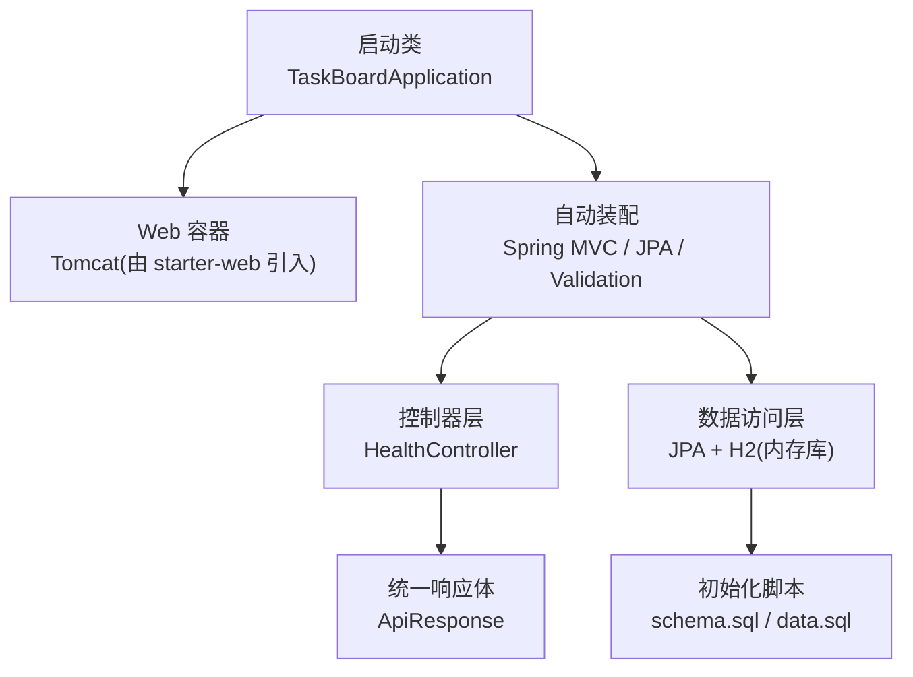
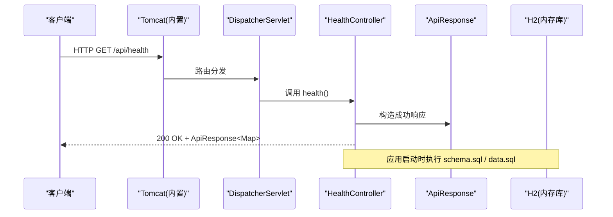
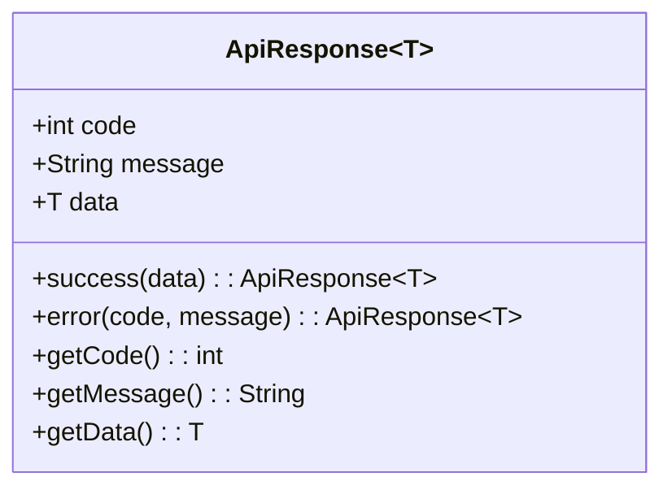
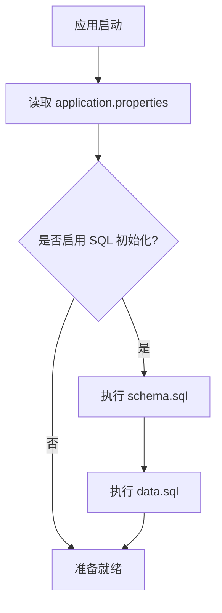
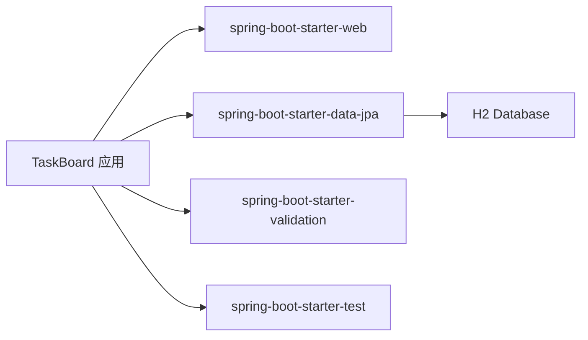

# 后端架构

<cite>
**本文引用的文件**
- [TaskBoardApplication.java](file://server/src/main/java/com/taskboard/TaskBoardApplication.java)
- [HealthController.java](file://server/src/main/java/com/taskboard/controller/HealthController.java)
- [ApiResponse.java](file://server/src/main/java/com/taskboard/dto/ApiResponse.java)
- [build.gradle.kts](file://server/build.gradle.kts)
- [settings.gradle.kts](file://server/settings.gradle.kts)
- [application.properties](file://server/src/main/resources/application.properties)
- [schema.sql](file://server/src/main/resources/schema.sql)
- [data.sql](file://server/src/main/resources/data.sql)
- [README.md](file://README.md)
</cite>

## 目录
1. [简介](#简介)
2. [项目结构](#项目结构)
3. [核心组件](#核心组件)
4. [架构总览](#架构总览)
5. [详细组件分析](#详细组件分析)
6. [依赖分析](#依赖分析)
7. [性能考虑](#性能考虑)
8. [故障排查指南](#故障排查指南)
9. [结论](#结论)
10. [附录](#附录)

## 简介
本技术文档面向 TaskBoard 后端（Spring Boot 4）的架构设计与实现细节，覆盖应用启动流程、自动配置机制、MVC 分层职责划分、统一响应格式设计、Gradle 构建与依赖管理策略，并通过架构图表说明数据流向与调用关系。同时提供扩展新功能的最佳实践与代码规范建议，帮助开发者快速理解并高效扩展系统。

## 项目结构
后端采用标准的 Spring Boot 工程组织方式，按功能域进行包划分：
- 启动类位于根包下，负责引导应用
- 控制器层集中在 controller 包，暴露 REST API
- DTO 层集中在 dto 包，定义统一的响应封装
- 资源文件在 resources 下，包含应用配置、数据库初始化脚本等

图表来源
- [TaskBoardApplication.java:6-10](file://server/src/main/java/com/taskboard/TaskBoardApplication.java#L6-L10)
- [HealthController.java:14-26](file://server/src/main/java/com/taskboard/controller/HealthController.java#L14-L26)
- [ApiResponse.java:6-26](file://server/src/main/java/com/taskboard/dto/ApiResponse.java#L6-L26)
- [application.properties:1-18](file://server/src/main/resources/application.properties#L1-L18)

章节来源
- [README.md:10-16](file://README.md#L10-L16)
- [settings.gradle.kts:1-9](file://server/settings.gradle.kts#L1-L9)

## 核心组件
- 启动类 TaskBoardApplication：使用 @SpringBootApplication 注解启用自动装配与组件扫描，通过 SpringApplication.run 启动应用。
- 健康检查控制器 HealthController：提供 GET /api/health 接口，返回服务状态、数据库连接状态与时间戳，统一以 ApiResponse 包装。
- 统一响应体 ApiResponse<T>：定义 code、message、data 三个字段，并提供 success/error 静态工厂方法，确保前后端交互的一致性。
- 构建与依赖：基于 Gradle Kotlin DSL，引入 spring-boot-starter-web、spring-boot-starter-data-jpa、validation、H2 数据库及测试依赖。
- 应用配置 application.properties：设置端口、上下文路径、H2 数据源、JPA/Hibernate 方言、SQL 初始化模式与 H2 Console 路径。

章节来源
- [TaskBoardApplication.java:1-12](file://server/src/main/java/com/taskboard/TaskBoardApplication.java#L1-L12)
- [HealthController.java:1-28](file://server/src/main/java/com/taskboard/controller/HealthController.java#L1-L28)
- [ApiResponse.java:1-53](file://server/src/main/java/com/taskboard/dto/ApiResponse.java#L1-L53)
- [build.gradle.kts:1-42](file://server/build.gradle.kts#L1-L42)
- [application.properties:1-18](file://server/src/main/resources/application.properties#L1-L18)

## 架构总览
下图展示了从请求进入 Web 容器到控制器处理、统一响应封装以及数据库初始化的整体流程。

图表来源
- [HealthController.java:18-26](file://server/src/main/java/com/taskboard/controller/HealthController.java#L18-L26)
- [application.properties:13-15](file://server/src/main/resources/application.properties#L13-L15)
- [schema.sql:1-6](file://server/src/main/resources/schema.sql#L1-L6)
- [data.sql:1-2](file://server/src/main/resources/data.sql#L1-L2)

## 详细组件分析

### 启动类 TaskBoardApplication
- 职责：作为应用入口，启用自动装配与组件扫描，启动 Spring 容器。
- 关键点：@SpringBootApplication 聚合了 @Configuration、@EnableAutoConfiguration、@ComponentScan；main 方法中调用 SpringApplication.run 完成容器初始化与 Web 服务器启动。
- 扩展点：后续可在该包或子包中添加 Service、Repository、Config 等组件，无需额外配置即可被自动发现。

章节来源
- [TaskBoardApplication.java:6-10](file://server/src/main/java/com/taskboard/TaskBoardApplication.java#L6-L10)

### 控制器层 HealthController
- 职责：暴露健康检查接口，返回服务状态、数据库连接状态与时间戳。
- 设计要点：
  - 使用 @RestController 与 @RequestMapping("/api") 限定接口前缀
  - 使用 ResponseEntity<ApiResponse<Map<String,String>>> 明确返回类型与状态码
  - 统一通过 ApiResponse.success 包装业务数据，保证响应结构一致
- 数据流：请求进入 -> 控制器组装状态 Map -> 封装为 ApiResponse -> 返回 JSON 响应

图表来源
- [HealthController.java:18-26](file://server/src/main/java/com/taskboard/controller/HealthController.java#L18-L26)

章节来源
- [HealthController.java:1-28](file://server/src/main/java/com/taskboard/controller/HealthController.java#L1-L28)

### 统一响应体 ApiResponse<T>
- 职责：定义标准响应结构，包含 code、message、data，提供 success/error 静态工厂方法。
- 设计要点：
  - 泛型 T 支持任意数据类型，便于复用
  - 静态方法简化构造，减少样板代码
  - 与前端约定一致的字段语义，提升联调效率
- 使用场景：所有控制器接口均应以 ApiResponse 包裹返回结果，错误分支使用 error(code, message) 构造

图表来源
- [ApiResponse.java:6-26](file://server/src/main/java/com/taskboard/dto/ApiResponse.java#L6-L26)

章节来源
- [ApiResponse.java:1-53](file://server/src/main/java/com/taskboard/dto/ApiResponse.java#L1-L53)

### 数据访问层与初始化
- 数据源：H2 内存数据库，通过 spring-boot-starter-data-jpa 集成 JPA/Hibernate
- 初始化：
  - schema.sql：创建 health_check 表
  - data.sql：插入初始记录
  - application.properties 中开启 SQL 初始化模式与指定脚本位置
- 运行期：当前控制器未直接访问数据库，但应用启动时会执行脚本，确保环境就绪

图表来源
- [application.properties:13-15](file://server/src/main/resources/application.properties#L13-L15)
- [schema.sql:1-6](file://server/src/main/resources/schema.sql#L1-L6)
- [data.sql:1-2](file://server/src/main/resources/data.sql#L1-L2)

章节来源
- [application.properties:1-18](file://server/src/main/resources/application.properties#L1-L18)
- [schema.sql:1-6](file://server/src/main/resources/schema.sql#L1-L6)
- [data.sql:1-2](file://server/src/main/resources/data.sql#L1-L2)

## 依赖分析
- Web 栈：spring-boot-starter-web 提供 MVC、JSON 序列化、内嵌 Tomcat
- 数据访问：spring-boot-starter-data-jpa 提供 JPA/Hibernate 自动配置；H2 作为运行时依赖
- 校验：spring-boot-starter-validation 提供 Bean Validation 能力
- 测试：spring-boot-starter-test 提供单元测试与集成测试基础
- 构建工具：Gradle Kotlin DSL，Java 工具链设置为 Java 25

图表来源
- [build.gradle.kts:22-37](file://server/build.gradle.kts#L22-L37)

章节来源
- [build.gradle.kts:1-42](file://server/build.gradle.kts#L1-L42)
- [settings.gradle.kts:1-9](file://server/settings.gradle.kts#L1-L9)

## 性能考虑
- 内存数据库：H2 内存模式适合开发与演示，重启后数据清空，不适合持久化生产环境
- SQL 初始化：每次启动都会执行 schema.sql 与 data.sql，频繁重启可能带来开销
- 日志与监控：可结合 Spring Boot Actuator 暴露更丰富的健康指标与度量
- 并发与线程池：默认 Tomcat 线程池可满足一般负载，高并发场景需根据压测调整 server.tomcat.* 参数
- 缓存：对热点数据可引入 Redis 或本地缓存降低数据库压力

[本节为通用指导，不直接分析具体文件]

## 故障排查指南
- 端口占用：若 8080 端口被占用，修改 application.properties 中的 server.port
- 数据库初始化失败：检查 schema.sql 与 data.sql 语法与编码；确认 spring.sql.init.mode 与 locations 配置正确
- H2 Console 无法访问：确认 spring.h2.console.enabled=true 且路径配置正确
- 启动报错：查看控制台输出，定位异常堆栈；必要时临时开启 spring.jpa.show-sql=true 观察 SQL
- 接口返回非预期：确认控制器返回 ApiResponse 结构，检查 code/message/data 字段是否符合约定

章节来源
- [application.properties:1-18](file://server/src/main/resources/application.properties#L1-L18)
- [schema.sql:1-6](file://server/src/main/resources/schema.sql#L1-L6)
- [data.sql:1-2](file://server/src/main/resources/data.sql#L1-L2)

## 结论
本项目以最小可用形态实现了 Spring Boot 4 的后端骨架：清晰的启动入口、规范的 MVC 分层、统一的响应封装、基于 H2 的轻量数据层与完善的 Gradle 构建配置。在此基础上，可按模块逐步扩展业务控制器、服务层与数据访问层，遵循统一响应与配置驱动的原则，保持代码一致性与可维护性。

[本节为总结性内容，不直接分析具体文件]

## 附录

### 扩展新功能最佳实践
- 新增控制器：在 controller 包下按领域划分子包，使用 @RestController 与 @RequestMapping 限定路径
- 统一响应：所有接口返回 ApiResponse<T>，成功用 success，失败用 error(code, message)
- 数据访问：新增实体与 Repository，配合 JPA 自动配置；如需复杂查询可使用 @Query
- 配置管理：将可变配置放入 application.properties 或外部化配置中心
- 测试：为新增接口编写单元测试与集成测试，验证响应结构与边界条件

### 代码规范建议
- 包命名：com.taskboard.{controller,dto,service,repository,model}
- 命名约定：类名大驼峰，方法名小驼峰；常量全大写加下划线
- 注释：关键方法与类添加简要说明；对外接口补充用途说明
- 错误处理：集中处理异常并转换为 ApiResponse.error，避免泄露内部细节
- 日志：使用 SLF4J 记录关键流程与异常，控制日志级别

[本节为通用指导，不直接分析具体文件]