# 后端架构

<cite>
**本文引用的文件**
- [TaskBoardApplication.java](file://server/src/main/java/com/taskboard/TaskBoardApplication.java)
- [HealthController.java](file://server/src/main/java/com/taskboard/controller/HealthController.java)
- [ProjectController.java](file://server/src/main/java/com/taskboard/controller/ProjectController.java)
- [TaskController.java](file://server/src/main/java/com/taskboard/controller/TaskController.java)
- [TagController.java](file://server/src/main/java/com/taskboard/controller/TagController.java)
- [ProjectService.java](file://server/src/main/java/com/taskboard/service/ProjectService.java)
- [TaskService.java](file://server/src/main/java/com/taskboard/service/TaskService.java)
- [TagService.java](file://server/src/main/java/com/taskboard/service/TagService.java)
- [ProjectRepository.java](file://server/src/main/java/com/taskboard/repository/ProjectRepository.java)
- [TaskRepository.java](file://server/src/main/java/com/taskboard/repository/TaskRepository.java)
- [TagRepository.java](file://server/src/main/java/com/taskboard/repository/TagRepository.java)
- [Project.java](file://server/src/main/java/com/taskboard/entity/Project.java)
- [Task.java](file://server/src/main/java/com/taskboard/entity/Task.java)
- [Tag.java](file://server/src/main/java/com/taskboard/entity/Tag.java)
- [ApiResponse.java](file://server/src/main/java/com/taskboard/dto/ApiResponse.java)
- [TaskDto.java](file://server/src/main/java/com/taskboard/dto/TaskDto.java)
- [TagDto.java](file://server/src/main/java/com/taskboard/dto/TagDto.java)
- [CreateTaskRequest.java](file://server/src/main/java/com/taskboard/dto/CreateTaskRequest.java)
- [UpdateTaskRequest.java](file://server/src/main/java/com/taskboard/dto/UpdateTaskRequest.java)
- [build.gradle.kts](file://server/build.gradle.kts)
- [settings.gradle.kts](file://server/settings.gradle.kts)
- [application.properties](file://server/src/main/resources/application.properties)
- [schema.sql](file://server/src/main/resources/schema.sql)
- [data.sql](file://server/src/main/resources/data.sql)
- [domain-model.md](file://docs/architecture/domain-model.md)
- [README.md](file://README.md)
</cite>

## 更新摘要
**变更内容**
- 新增完整任务管理模块，包含Task实体、TaskController、TaskService和TaskRepository
- 新增完整标签管理模块，包含Tag实体、TagController、TagService和TagRepository
- 实现任务状态机验证机制，支持TODO → IN_PROGRESS → DONE → CLOSED的状态转换
- 添加任务与标签的多对多关系管理，通过task_tags关联表实现
- 扩展数据库schema，新增task、tag和task_tags表结构
- 完善API接口规范，提供任务和标签的完整CRUD操作

## 目录
1. [简介](#简介)
2. [项目结构](#项目结构)
3. [核心组件](#核心组件)
4. [架构总览](#架构总览)
5. [详细组件分析](#详细组件分析)
6. [依赖分析](#依赖分析)
7. [性能考虑](#性能考虑)
8. [故障排查指南](#故障排查指南)
9. [结论](#结论)
10. [附录](#附录)

## 简介
本技术文档面向 TaskBoard 后端（Spring Boot 4）的架构设计与实现细节，覆盖应用启动流程、自动配置机制、MVC 分层职责划分、统一响应格式设计、Gradle 构建与依赖管理策略，并通过架构图表说明数据流向与调用关系。同时提供扩展新功能的最佳实践与代码规范建议，帮助开发者快速理解并高效扩展系统。

**更新** 现已包含完整的项目管理、任务管理和标签管理功能模块，实现了从实体到控制器的完整分层架构，并引入了任务状态机验证机制。

## 项目结构
后端采用标准的 Spring Boot 工程组织方式，按功能域进行包划分：
- 启动类位于根包下，负责引导应用
- 控制器层集中在 controller 包，暴露 REST API
- 服务层在 service 包，封装业务逻辑
- 仓储层在 repository 包，处理数据访问
- 实体层在 entity 包，定义领域模型
- DTO 层集中在 dto 包，定义统一的响应封装
- 资源文件在 resources 下，包含应用配置、数据库初始化脚本等

```mermaid
graph TB
A["启动类<br/>TaskBoardApplication"] --> B["Web 容器<br/>Tomcat(由 starter-web 引入)"]
A --> C["自动装配<br/>Spring MVC / JPA / Validation"]
C --> D["控制器层<br/>HealthController + ProjectController + TaskController + TagController"]
D --> E["服务层<br/>ProjectService + TaskService + TagService"]
E --> F["仓储层<br/>ProjectRepository + TaskRepository + TagRepository"]
F --> G["实体层<br/>Project + Task + Tag"]
D --> H["统一响应体<br/>ApiResponse<T>"]
C --> I["数据访问层<br/>JPA + H2(内存库)"]
I --> J["初始化脚本<br/>schema.sql / data.sql"]
```

**图表来源**
- [TaskBoardApplication.java:6-10](file://server/src/main/java/com/taskboard/TaskBoardApplication.java#L6-L10)
- [HealthController.java:14-26](file://server/src/main/java/com/taskboard/controller/HealthController.java#L14-L26)
- [ProjectController.java:14-78](file://server/src/main/java/com/taskboard/controller/ProjectController.java#L14-L78)
- [TaskController.java:16-89](file://server/src/main/java/com/taskboard/controller/TaskController.java#L16-L89)
- [TagController.java:14-65](file://server/src/main/java/com/taskboard/controller/TagController.java#L14-L65)

章节来源
- [README.md:10-16](file://README.md#L10-L16)
- [settings.gradle.kts:1-9](file://server/settings.gradle.kts#L1-L9)

## 核心组件
- 启动类 TaskBoardApplication：使用 @SpringBootApplication 注解启用自动装配与组件扫描，通过 SpringApplication.run 启动应用。
- 健康检查控制器 HealthController：提供 GET /api/health 接口，返回服务状态、数据库连接状态与时间戳，统一以 ApiResponse 包装。
- 项目管理控制器 ProjectController：提供完整的项目CRUD接口，包括获取所有项目、创建项目、获取单个项目、更新项目和删除项目。
- 任务管理控制器 TaskController：提供任务的完整CRUD接口，包括状态机转换功能，支持 TODO → IN_PROGRESS → DONE → CLOSED 的状态流转。
- 标签管理控制器 TagController：提供标签的完整CRUD接口，支持全局标签的创建、更新和删除。
- 项目管理服务 ProjectService：封装项目相关的业务逻辑，包括数据验证、唯一性检查和事务管理。
- 任务管理服务 TaskService：封装任务相关的业务逻辑，包含状态机验证、优先级校验、截止日期解析和多对多标签关系管理。
- 标签管理服务 TagService：封装标签相关的业务逻辑，包含名称验证、唯一性检查和事务管理。
- 项目仓储 ProjectRepository：继承 JpaRepository，提供项目数据的持久化操作和自定义查询方法。
- 任务仓储 TaskRepository：继承 JpaRepository，提供任务数据的持久化操作和按项目ID查询方法。
- 标签仓储 TagRepository：继承 JpaRepository，提供标签数据的持久化操作和按名称存在性检查。
- 项目实体 Project：定义项目的领域模型，包含ID、名称、描述、创建时间和更新时间字段。
- 任务实体 Task：定义任务的领域模型，包含项目关联、标题、描述、状态、优先级、截止日期和时间戳，支持与标签的多对多关系。
- 标签实体 Tag：定义标签的领域模型，包含ID、名称（全局唯一）和时间戳字段。
- 统一响应体 ApiResponse<T>：定义 code、message、data 三个字段，并提供 success/error 静态工厂方法，确保前后端交互的一致性。
- 构建与依赖：基于 Gradle Kotlin DSL，引入 spring-boot-starter-web、spring-boot-starter-data-jpa、validation、H2 数据库及测试依赖。
- 应用配置 application.properties：设置端口、上下文路径、H2 数据源、JPA/Hibernate 方言、SQL 初始化模式与 H2 Console 路径。

**更新** 新增了任务管理和标签管理相关的核心组件，形成了更完整的三层架构体系。

章节来源
- [TaskBoardApplication.java:1-12](file://server/src/main/java/com/taskboard/TaskBoardApplication.java#L1-L12)
- [HealthController.java:1-28](file://server/src/main/java/com/taskboard/controller/HealthController.java#L1-L28)
- [ProjectController.java:1-78](file://server/src/main/java/com/taskboard/controller/ProjectController.java#L1-L78)
- [TaskController.java:1-89](file://server/src/main/java/com/taskboard/controller/TaskController.java#L1-L89)
- [TagController.java:1-65](file://server/src/main/java/com/taskboard/controller/TagController.java#L1-L65)
- [ProjectService.java:1-117](file://server/src/main/java/com/taskboard/service/ProjectService.java#L1-L117)
- [TaskService.java:1-311](file://server/src/main/java/com/taskboard/service/TaskService.java#L1-L311)
- [TagService.java:1-127](file://server/src/main/java/com/taskboard/service/TagService.java#L1-L127)
- [ProjectRepository.java:1-25](file://server/src/main/java/com/taskboard/repository/ProjectRepository.java#L1-L25)
- [TaskRepository.java:1-28](file://server/src/main/java/com/taskboard/repository/TaskRepository.java#L1-L28)
- [TagRepository.java:1-23](file://server/src/main/java/com/taskboard/repository/TagRepository.java#L1-L23)
- [Project.java:1-90](file://server/src/main/java/com/taskboard/entity/Project.java#L1-L90)
- [Task.java:1-162](file://server/src/main/java/com/taskboard/entity/Task.java#L1-L162)
- [Tag.java:1-78](file://server/src/main/java/com/taskboard/entity/Tag.java#L1-L78)
- [ApiResponse.java:1-53](file://server/src/main/java/com/taskboard/dto/ApiResponse.java#L1-L53)
- [TaskDto.java:1-21](file://server/src/main/java/com/taskboard/dto/TaskDto.java#L1-L21)
- [TagDto.java:1-13](file://server/src/main/java/com/taskboard/dto/TagDto.java#L1-L13)
- [CreateTaskRequest.java:1-16](file://server/src/main/java/com/taskboard/dto/CreateTaskRequest.java#L1-L16)
- [UpdateTaskRequest.java:1-14](file://server/src/main/java/com/taskboard/dto/UpdateTaskRequest.java#L1-L14)
- [build.gradle.kts:1-42](file://server/build.gradle.kts#L1-L42)
- [application.properties:1-18](file://server/src/main/resources/application.properties#L1-L18)

## 架构总览
下图展示了从请求进入 Web 容器到控制器处理、服务层业务逻辑、仓储层数据访问以及数据库初始化的整体流程。

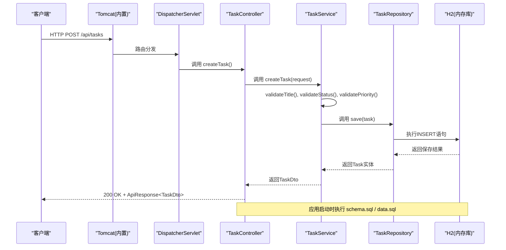

**图表来源**
- [TaskController.java:38-43](file://server/src/main/java/com/taskboard/controller/TaskController.java#L38-L43)
- [TaskService.java:67-95](file://server/src/main/java/com/taskboard/service/TaskService.java#L67-L95)
- [TaskRepository.java:11-27](file://server/src/main/java/com/taskboard/repository/TaskRepository.java#L11-L27)
- [application.properties:13-15](file://server/src/main/resources/application.properties#L13-L15)
- [schema.sql:9-19](file://server/src/main/resources/schema.sql#L9-L19)
- [data.sql:1-4](file://server/src/main/resources/data.sql#L1-L4)

## 详细组件分析

### 启动类 TaskBoardApplication
- 职责：作为应用入口，启用自动装配与组件扫描，启动 Spring 容器。
- 关键点：@SpringBootApplication 聚合了 @Configuration、@EnableAutoConfiguration、@ComponentScan；main 方法中调用 SpringApplication.run 完成容器初始化与 Web 服务器启动。
- 扩展点：后续可在该包或子包中添加 Service、Repository、Config 等组件，无需额外配置即可被自动发现。

章节来源
- [TaskBoardApplication.java:6-10](file://server/src/main/java/com/taskboard/TaskBoardApplication.java#L6-L10)

### 控制器层

#### HealthController
- 职责：暴露健康检查接口，返回服务状态、数据库连接状态与时间戳。
- 设计要点：
  - 使用 @RestController 与 @RequestMapping("/api") 限定接口前缀
  - 使用 ResponseEntity<ApiResponse<Map<String,String>>> 明确返回类型与状态码
  - 统一通过 ApiResponse.success 包装业务数据，保证响应结构一致
- 数据流：请求进入 -> 控制器组装状态 Map -> 封装为 ApiResponse -> 返回 JSON 响应

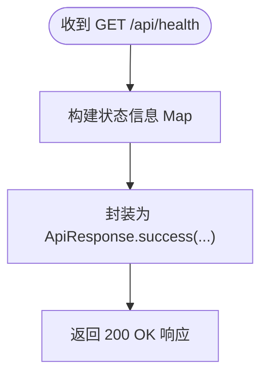

**图表来源**
- [HealthController.java:18-26](file://server/src/main/java/com/taskboard/controller/HealthController.java#L18-L26)

章节来源
- [HealthController.java:1-28](file://server/src/main/java/com/taskboard/controller/HealthController.java#L1-L28)

#### ProjectController
- 职责：提供项目管理的RESTful API接口，包括CRUD操作。
- 设计要点：
  - 使用 @RestController 与 @RequestMapping("/api/projects") 限定接口前缀
  - 实现完整的CRUD操作：GET /api/projects、POST /api/projects、GET /api/projects/{id}、PUT /api/projects/{id}、DELETE /api/projects/{id}
  - 参数验证：name必填，description可选且默认空字符串
  - 统一通过 ApiResponse 包装返回结果
- 数据流：请求进入 -> 参数验证 -> 调用服务层 -> 封装响应 -> 返回JSON

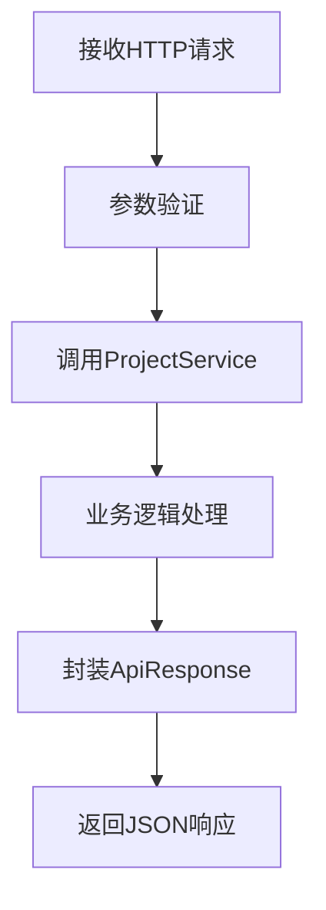

**图表来源**
- [ProjectController.java:27-78](file://server/src/main/java/com/taskboard/controller/ProjectController.java#L27-L78)

章节来源
- [ProjectController.java:1-78](file://server/src/main/java/com/taskboard/controller/ProjectController.java#L1-L78)

#### TaskController
- 职责：提供任务管理的RESTful API接口，包括CRUD操作和状态机转换。
- 设计要点：
  - 使用 @RestController 与 @RequestMapping("/api/tasks") 限定接口前缀
  - 实现完整的CRUD操作：GET /api/tasks、POST /api/tasks、GET /api/tasks/{id}、PUT /api/tasks/{id}、DELETE /api/tasks/{id}
  - 特殊接口：PATCH /api/tasks/{id}/transitions 用于状态机转换
  - 参数验证：title必填，status必须在允许范围内，priority在0-3之间
  - 统一通过 ApiResponse 包装返回结果
- 数据流：请求进入 -> 参数验证 -> 调用服务层 -> 状态机验证 -> 封装响应 -> 返回JSON

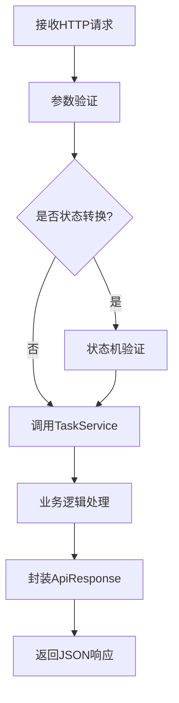

**图表来源**
- [TaskController.java:29-89](file://server/src/main/java/com/taskboard/controller/TaskController.java#L29-L89)

章节来源
- [TaskController.java:1-89](file://server/src/main/java/com/taskboard/controller/TaskController.java#L1-L89)

#### TagController
- 职责：提供标签管理的RESTful API接口，包括CRUD操作。
- 设计要点：
  - 使用 @RestController 与 @RequestMapping("/api/tags") 限定接口前缀
  - 实现完整的CRUD操作：GET /api/tags、POST /api/tags、PUT /api/tags/{id}、DELETE /api/tags/{id}
  - 参数验证：name必填且唯一，最大64字符
  - 统一通过 ApiResponse 包装返回结果
- 数据流：请求进入 -> 参数验证 -> 调用服务层 -> 封装响应 -> 返回JSON

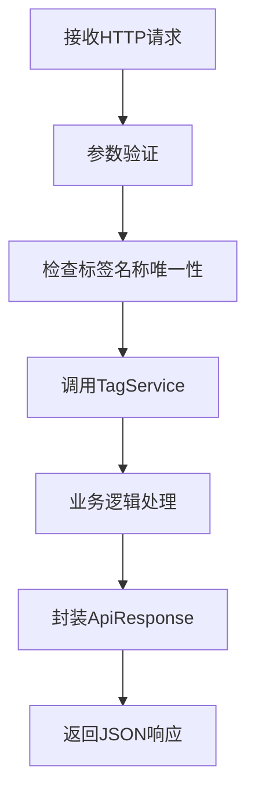

**图表来源**
- [TagController.java:27-65](file://server/src/main/java/com/taskboard/controller/TagController.java#L27-L65)

章节来源
- [TagController.java:1-65](file://server/src/main/java/com/taskboard/controller/TagController.java#L1-L65)

### 服务层

#### ProjectService
- 职责：封装项目相关的业务逻辑，包括数据验证、唯一性检查和事务管理。
- 核心方法：
  - getAllProjects()：获取所有项目并按创建时间倒序排列
  - getProjectById(Long id)：根据ID获取项目，不存在抛出404异常
  - createProject(String name, String description)：创建新项目，包含名称验证和唯一性检查
  - updateProject(Long id, String name, String description)：更新项目信息，支持部分更新
  - deleteProject(Long id)：删除项目，包含存在性检查
- 事务管理：所有写操作方法都使用 @Transactional 注解确保数据一致性
- 异常处理：使用 ResponseStatusException 抛出适当的HTTP状态码

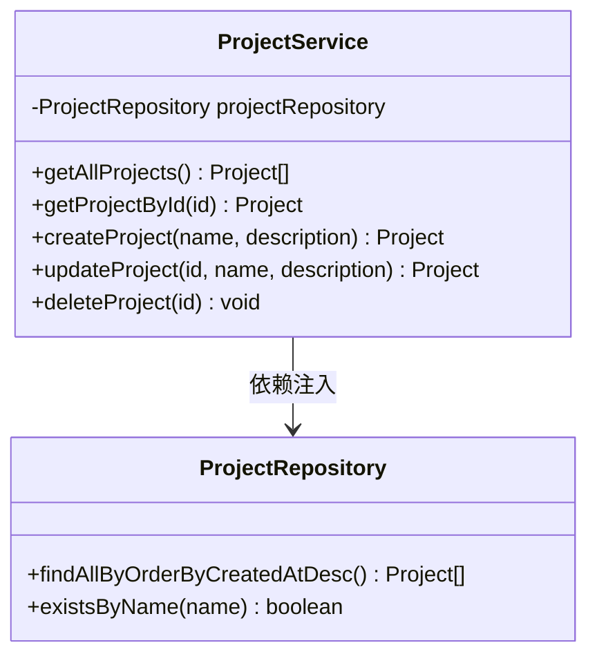

**图表来源**
- [ProjectService.java:15-117](file://server/src/main/java/com/taskboard/service/ProjectService.java#L15-L117)
- [ProjectRepository.java:12-25](file://server/src/main/java/com/taskboard/repository/ProjectRepository.java#L12-L25)

章节来源
- [ProjectService.java:1-117](file://server/src/main/java/com/taskboard/service/ProjectService.java#L1-L117)

#### TaskService
- 职责：封装任务相关的业务逻辑，包含状态机验证、优先级校验、截止日期解析和多对多标签关系管理。
- 核心方法：
  - findAll()：获取所有任务并按创建时间倒序排列
  - findByProjectId(Long projectId)：按项目ID获取任务列表
  - findById(Long id)：根据ID获取任务
  - createTask(CreateTaskRequest request)：创建任务，包含完整的数据验证和标签关联
  - updateTask(Long id, UpdateTaskRequest request)：更新任务，支持部分更新和标签替换
  - transitionStatus(Long id, String targetStatus)：状态机转换，严格验证状态流转规则
  - deleteTask(Long id)：删除任务，级联删除相关的时间记录
- 状态机验证：
  - TODO → IN_PROGRESS
  - IN_PROGRESS → DONE 或 TODO
  - DONE → CLOSED 或 IN_PROGRESS
  - CLOSED 为终态，不允许任何状态转换
- 事务管理：所有写操作方法都使用 @Transactional 注解确保数据一致性
- 数据验证：
  - 标题验证：非空且不超过128字符
  - 描述验证：不超过1024字符
  - 状态验证：必须是 TODO、IN_PROGRESS、DONE、CLOSED 之一
  - 优先级验证：必须是0-3之间的整数
  - 截止日期验证：ISO-8601格式的Instant字符串

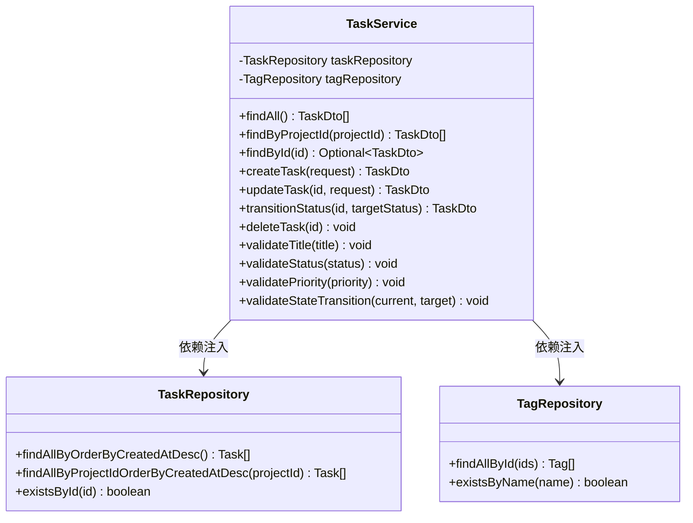

**图表来源**
- [TaskService.java:25-311](file://server/src/main/java/com/taskboard/service/TaskService.java#L25-L311)
- [TaskRepository.java:11-27](file://server/src/main/java/com/taskboard/repository/TaskRepository.java#L11-L27)
- [TagRepository.java:11-22](file://server/src/main/java/com/taskboard/repository/TagRepository.java#L11-L22)

章节来源
- [TaskService.java:1-311](file://server/src/main/java/com/taskboard/service/TaskService.java#L1-L311)

#### TagService
- 职责：封装标签相关的业务逻辑，包含名称验证、唯一性检查和事务管理。
- 核心方法：
  - findAll()：获取所有标签并按创建时间倒序排列
  - createTag(String name)：创建标签，包含名称验证和唯一性检查
  - updateTag(Long id, String name)：更新标签，支持部分更新和唯一性检查
  - deleteTag(Long id)：删除标签，仅移除关联关系，不删除关联的任务
- 数据验证：
  - 名称验证：非空且不超过64字符
  - 唯一性检查：全局唯一的标签名称
- 事务管理：所有写操作方法都使用 @Transactional 注解确保数据一致性

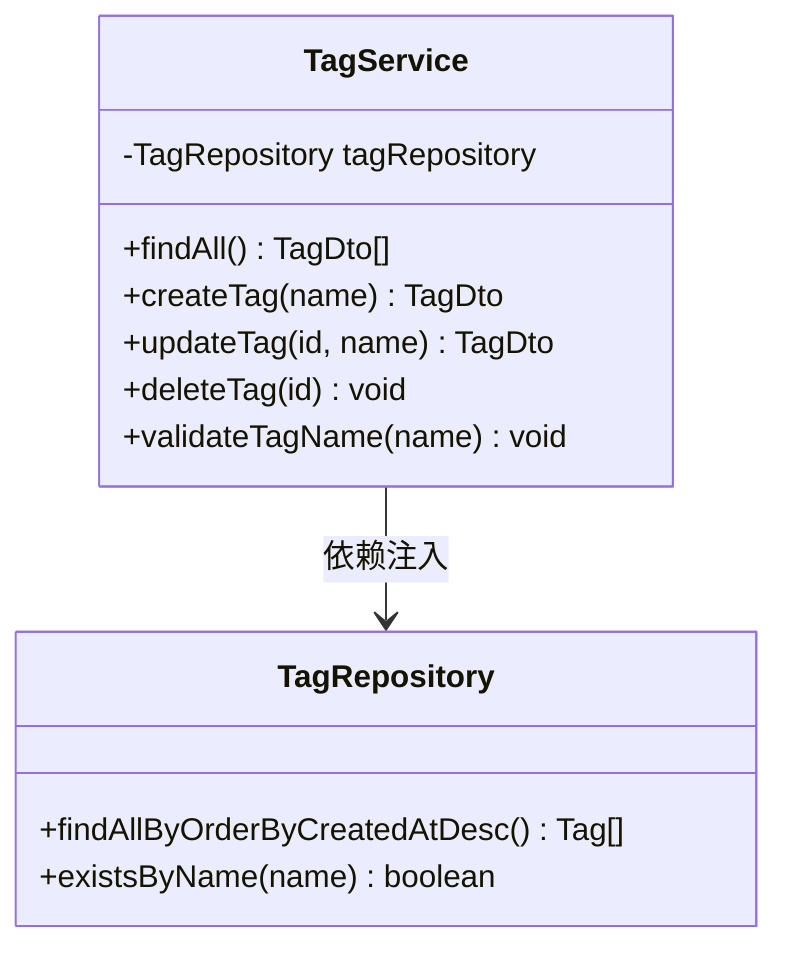

**图表来源**
- [TagService.java:18-127](file://server/src/main/java/com/taskboard/service/TagService.java#L18-L127)
- [TagRepository.java:11-22](file://server/src/main/java/com/taskboard/repository/TagRepository.java#L11-L22)

章节来源
- [TagService.java:1-127](file://server/src/main/java/com/taskboard/service/TagService.java#L1-L127)

### 仓储层

#### ProjectRepository
- 职责：继承 JpaRepository 提供项目实体的数据访问能力。
- 自定义查询方法：
  - findAllByOrderByCreatedAtDesc()：按创建时间倒序获取所有项目
  - existsByName(String name)：检查项目名称是否已存在
- 继承的方法：提供标准的CRUD操作如 save、findById、deleteById 等

章节来源
- [ProjectRepository.java:1-25](file://server/src/main/java/com/taskboard/repository/ProjectRepository.java#L1-L25)

#### TaskRepository
- 职责：继承 JpaRepository 提供任务实体的数据访问能力。
- 自定义查询方法：
  - findAllByOrderByCreatedAtDesc()：按创建时间倒序获取所有任务
  - findAllByProjectIdOrderByCreatedAtDesc(Long projectId)：按项目ID获取任务并按创建时间倒序排列
  - existsById(Long id)：检查任务是否存在
- 继承的方法：提供标准的CRUD操作如 save、findById、deleteById 等

章节来源
- [TaskRepository.java:1-28](file://server/src/main/java/com/taskboard/repository/TaskRepository.java#L1-L28)

#### TagRepository
- 职责：继承 JpaRepository 提供标签实体的数据访问能力。
- 自定义查询方法：
  - findAllByOrderByCreatedAtDesc()：按创建时间倒序获取所有标签
  - existsByName(String name)：检查标签名称是否已存在
- 继承的方法：提供标准的CRUD操作如 save、findById、deleteById 等

章节来源
- [TagRepository.java:1-23](file://server/src/main/java/com/taskboard/repository/TagRepository.java#L1-L23)

### 实体层

#### Project
- 职责：定义项目的领域模型，映射到数据库表 project。
- 字段说明：
  - id：主键，自增Long类型
  - name：项目名称，必填且唯一，最大64字符
  - description：项目描述，可选，最大512字符
  - createdAt：创建时间，不可变，自动设置
  - updatedAt：更新时间，自动更新
- 生命周期回调：
  - @PrePersist：在保存前设置createdAt和updatedAt
  - @PreUpdate：在更新前设置updatedAt
- 构造函数：提供无参构造器和带参数的构造器

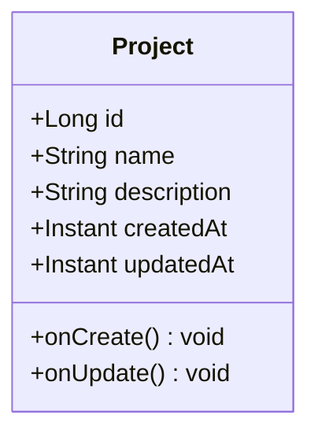

**图表来源**
- [Project.java:9-90](file://server/src/main/java/com/taskboard/entity/Project.java#L9-L90)

章节来源
- [Project.java:1-90](file://server/src/main/java/com/taskboard/entity/Project.java#L1-L90)

#### Task
- 职责：定义任务的领域模型，映射到数据库表 task。
- 字段说明：
  - id：主键，自增Long类型
  - projectId：所属项目ID，外键关联project表
  - title：任务标题，必填，最大128字符
  - description：任务描述，可选，最大1024字符
  - status：任务状态，必填，默认TODO，枚举值：TODO、IN_PROGRESS、DONE、CLOSED
  - priority：优先级，必填，默认0，范围0-3
  - dueAt：截止日期，可选
  - createdAt：创建时间，不可变，自动设置
  - updatedAt：更新时间，自动更新
  - tags：标签集合，多对多关系，通过task_tags关联表
- 生命周期回调：
  - @PrePersist：在保存前设置createdAt、updatedAt，默认status为TODO，默认priority为0
  - @PreUpdate：在更新前设置updatedAt
- 关系映射：
  - @ManyToMany(fetch = FetchType.LAZY)：懒加载标签关联
  - @JoinTable(name = "task_tags")：指定关联表名
- 构造函数：提供无参构造器和带参数的构造器

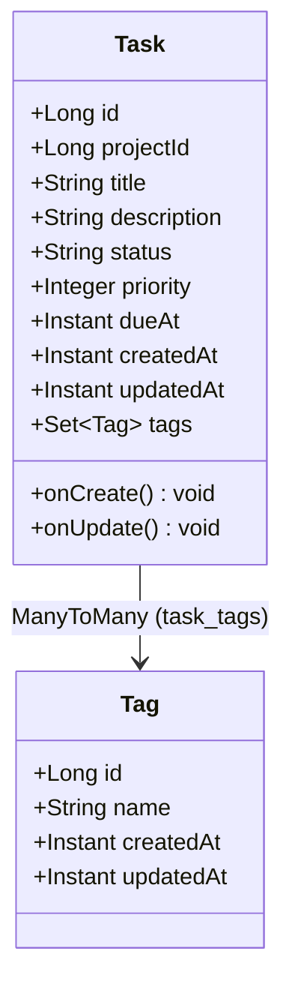

**图表来源**
- [Task.java:11-162](file://server/src/main/java/com/taskboard/entity/Task.java#L11-L162)

章节来源
- [Task.java:1-162](file://server/src/main/java/com/taskboard/entity/Task.java#L1-L162)

#### Tag
- 职责：定义标签的领域模型，映射到数据库表 tag。
- 字段说明：
  - id：主键，自增Long类型
  - name：标签名称，必填且全局唯一，最大64字符
  - createdAt：创建时间，不可变，自动设置
  - updatedAt：更新时间，自动更新
- 生命周期回调：
  - @PrePersist：在保存前设置createdAt和updatedAt
  - @PreUpdate：在更新前设置updatedAt
- 构造函数：提供无参构造器和带参数的构造器

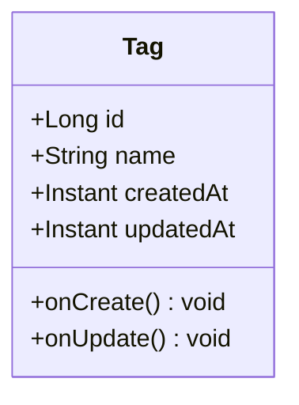

**图表来源**
- [Tag.java:9-78](file://server/src/main/java/com/taskboard/entity/Tag.java#L9-L78)

章节来源
- [Tag.java:1-78](file://server/src/main/java/com/taskboard/entity/Tag.java#L1-L78)

### 统一响应体 ApiResponse<T>
- 职责：定义标准响应结构，包含 code、message、data，提供 success/error 静态工厂方法。
- 设计要点：
  - 泛型 T 支持任意数据类型，便于复用
  - 静态方法简化构造，减少样板代码
  - 与前端约定一致的字段语义，提升联调效率
- 使用场景：所有控制器接口均应以 ApiResponse 包裹返回结果，错误分支使用 error(code, message) 构造

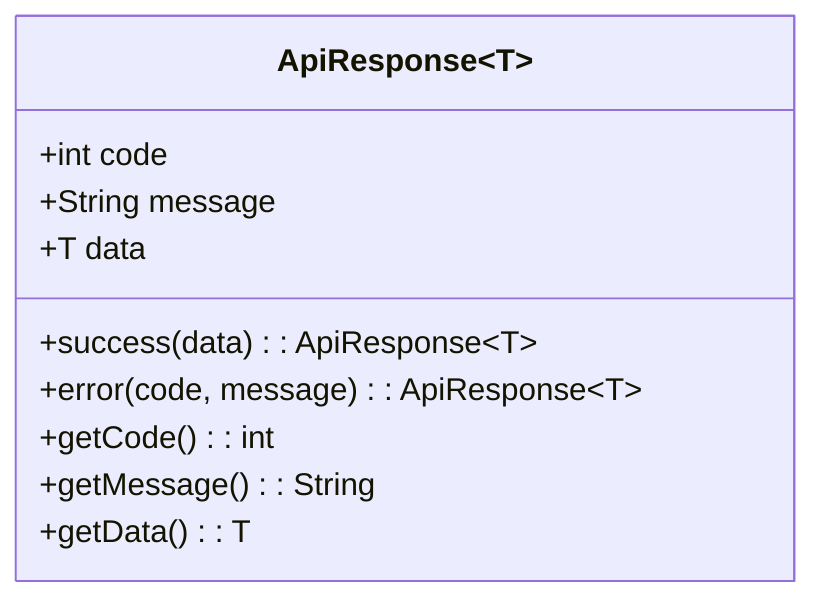

**图表来源**
- [ApiResponse.java:6-26](file://server/src/main/java/com/taskboard/dto/ApiResponse.java#L6-L26)

章节来源
- [ApiResponse.java:1-53](file://server/src/main/java/com/taskboard/dto/ApiResponse.java#L1-L53)

### 数据传输对象 DTO

#### TaskDto
- 职责：任务数据传输对象，用于API响应数据封装。
- 字段说明：
  - id：任务ID
  - projectId：所属项目ID
  - title：任务标题
  - description：任务描述
  - status：任务状态
  - priority：优先级
  - dueAt：截止日期（ISO-8601格式字符串）
  - tags：标签列表（List<TagDto>）
  - createdAt：创建时间（ISO-8601格式字符串）
  - updatedAt：更新时间（ISO-8601格式字符串）

章节来源
- [TaskDto.java:1-21](file://server/src/main/java/com/taskboard/dto/TaskDto.java#L1-L21)

#### TagDto
- 职责：标签数据传输对象，用于API响应数据封装。
- 字段说明：
  - id：标签ID
  - name：标签名称
  - createdAt：创建时间（ISO-8601格式字符串）
  - updatedAt：更新时间（ISO-8601格式字符串）

章节来源
- [TagDto.java:1-13](file://server/src/main/java/com/taskboard/dto/TagDto.java#L1-L13)

#### CreateTaskRequest
- 职责：创建任务的请求数据传输对象。
- 字段说明：
  - projectId：所属项目ID
  - title：任务标题（必填）
  - description：任务描述（可选）
  - status：任务状态（可选，默认TODO）
  - priority：优先级（可选，默认0）
  - dueAt：截止日期（可选，ISO-8601格式字符串）
  - tagIds：标签ID列表（可选）

章节来源
- [CreateTaskRequest.java:1-16](file://server/src/main/java/com/taskboard/dto/CreateTaskRequest.java#L1-L16)

#### UpdateTaskRequest
- 职责：更新任务的请求数据传输对象。
- 字段说明：
  - title：任务标题（可选）
  - description：任务描述（可选）
  - priority：优先级（可选）
  - dueAt：截止日期（可选，ISO-8601格式字符串）
  - tagIds：标签ID列表（可选，用于替换现有标签）

章节来源
- [UpdateTaskRequest.java:1-14](file://server/src/main/java/com/taskboard/dto/UpdateTaskRequest.java#L1-L14)

### 数据访问层与初始化
- 数据源：H2 内存数据库，通过 spring-boot-starter-data-jpa 集成 JPA/Hibernate
- 初始化：
  - schema.sql：创建 health_check、project、task、tag 和 task_tags 表
  - data.sql：插入初始项目记录
  - application.properties 中开启 SQL 初始化模式与指定脚本位置
- 运行期：控制器直接访问数据库，通过JPA自动生成的SQL语句进行操作

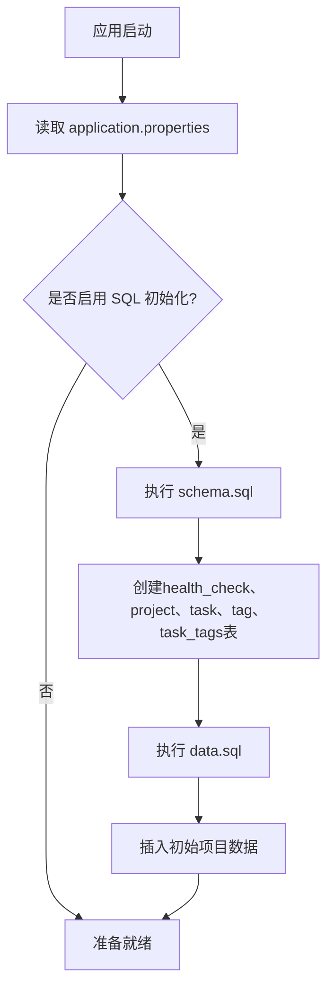

**图表来源**
- [application.properties:13-15](file://server/src/main/resources/application.properties#L13-L15)
- [schema.sql:1-35](file://server/src/main/resources/schema.sql#L1-L35)
- [data.sql:1-5](file://server/src/main/resources/data.sql#L1-L5)

章节来源
- [application.properties:1-18](file://server/src/main/resources/application.properties#L1-L18)
- [schema.sql:1-35](file://server/src/main/resources/schema.sql#L1-L35)
- [data.sql:1-5](file://server/src/main/resources/data.sql#L1-L5)

## 依赖分析
- Web 栈：spring-boot-starter-web 提供 MVC、JSON 序列化、内嵌 Tomcat
- 数据访问：spring-boot-starter-data-jpa 提供 JPA/Hibernate 自动配置；H2 作为运行时依赖
- 校验：spring-boot-starter-validation 提供 Bean Validation 能力
- 测试：spring-boot-starter-test 提供单元测试与集成测试基础
- 构建工具：Gradle Kotlin DSL，Java 工具链设置为 Java 25

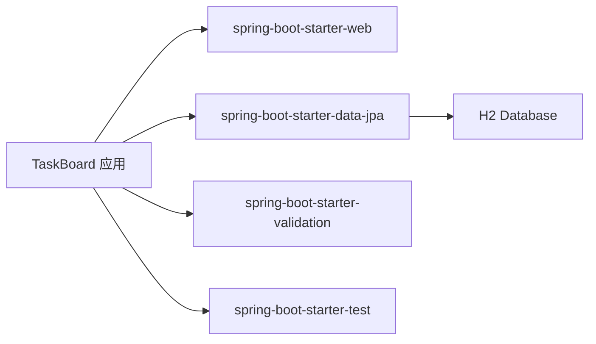

**图表来源**
- [build.gradle.kts:22-37](file://server/build.gradle.kts#L22-L37)

章节来源
- [build.gradle.kts:1-42](file://server/build.gradle.kts#L1-L42)
- [settings.gradle.kts:1-9](file://server/settings.gradle.kts#L1-L9)

## 性能考虑
- 内存数据库：H2 内存模式适合开发与演示，重启后数据清空，不适合持久化生产环境
- SQL 初始化：每次启动都会执行 schema.sql 与 data.sql，频繁重启可能带来开销
- 日志与监控：可结合 Spring Boot Actuator 暴露更丰富的健康指标与度量
- 并发与线程池：默认 Tomcat 线程池可满足一般负载，高并发场景需根据压测调整 server.tomcat.* 参数
- 缓存：对热点数据可引入 Redis 或本地缓存降低数据库压力
- **更新** 项目查询已优化为按创建时间倒序排序，避免全表扫描后的内存排序
- **更新** 任务查询支持按项目ID过滤和按创建时间排序，提高查询效率
- **更新** 标签查询支持按创建时间倒序排序，优化列表展示性能
- **更新** 多对多关系使用懒加载（FetchType.LAZY），避免N+1查询问题

## 故障排查指南
- 端口占用：若 8080 端口被占用，修改 application.properties 中的 server.port
- 数据库初始化失败：检查 schema.sql 与 data.sql 语法与编码；确认 spring.sql.init.mode 与 locations 配置正确
- H2 Console 无法访问：确认 spring.h2.console.enabled=true 且路径配置正确
- 启动报错：查看控制台输出，定位异常堆栈；必要时临时开启 spring.jpa.show-sql=true 观察 SQL
- 接口返回非预期：确认控制器返回 ApiResponse 结构，检查 code/message/data 字段是否符合约定
- **更新** 项目相关错误：
  - 404 Not Found：项目ID不存在
  - 409 Conflict：项目名称重复
  - 400 Bad Request：参数验证失败（名称为空或超长）
- **更新** 任务相关错误：
  - 404 Not Found：任务ID不存在
  - 400 Bad Request：任务标题为空或超长、状态无效、优先级超出范围、截止日期格式错误
  - 400 Bad Request：状态转换非法（违反状态机规则）
  - 400 Bad Request：标签ID不存在
- **更新** 标签相关错误：
  - 404 Not Found：标签ID不存在
  - 409 Conflict：标签名称重复
  - 400 Bad Request：标签名称为空或超长

章节来源
- [application.properties:1-18](file://server/src/main/resources/application.properties#L1-L18)
- [schema.sql:1-35](file://server/src/main/resources/schema.sql#L1-L35)
- [data.sql:1-5](file://server/src/main/resources/data.sql#L1-L5)

## 结论
本项目以最小可用形态实现了 Spring Boot 4 的后端骨架：清晰的启动入口、规范的 MVC 分层、统一的响应封装、基于 H2 的轻量数据层与完善的 Gradle 构建配置。现已扩展出完整的项目管理、任务管理和标签管理功能模块，展示了标准的分层架构实现模式，并引入了任务状态机验证机制和多对多关系管理。在此基础上，可按模块逐步扩展业务控制器、服务层与数据访问层，遵循统一响应与配置驱动的原则，保持代码一致性与可维护性。

**更新** 新增的任务管理和标签管理模块提供了完整的CRUD操作示例和状态机验证机制，可作为其他业务功能开发的参考模板。

## 附录

### 领域模型设计
项目采用了完整的领域驱动设计，定义了以下核心实体：

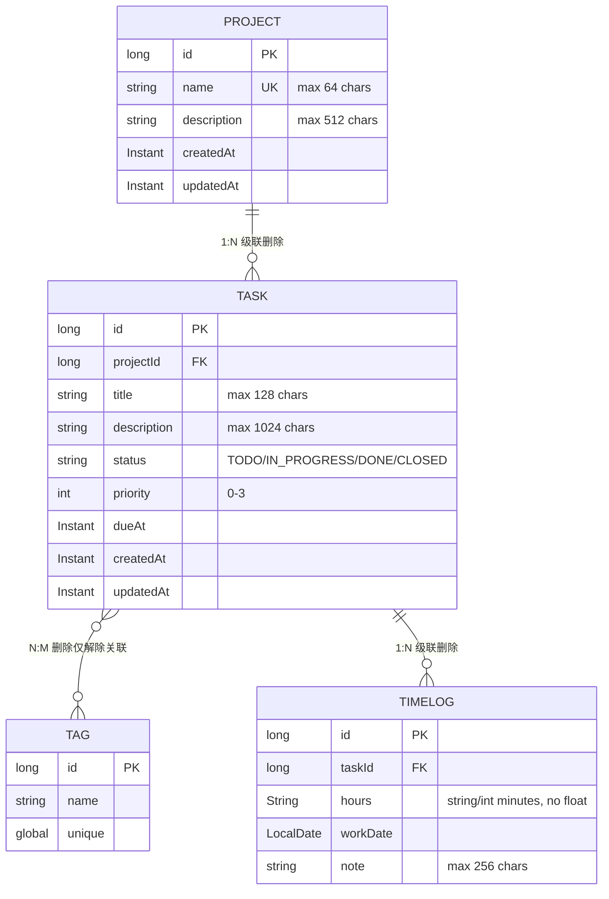

**图表来源**
- [domain-model.md:8-46](file://docs/architecture/domain-model.md#L8-L46)

章节来源
- [domain-model.md:1-193](file://docs/architecture/domain-model.md#L1-L193)

### 任务状态机设计
任务状态机定义了严格的狀態转换规则，确保业务流程的正确性：

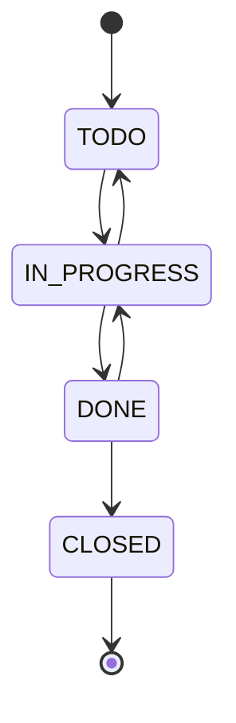

**图表来源**
- [TaskService.java:151-170](file://server/src/main/java/com/taskboard/service/TaskService.java#L151-L170)

### 扩展新功能最佳实践
- 新增控制器：在 controller 包下按领域划分子包，使用 @RestController 与 @RequestMapping 限定路径
- 统一响应：所有接口返回 ApiResponse<T>，成功用 success，失败用 error(code, message)
- 数据访问：新增实体与 Repository，配合 JPA 自动配置；如需复杂查询可使用 @Query
- 服务层：封装业务逻辑，包含数据验证、事务管理和异常处理
- 配置管理：将可变配置放入 application.properties 或外部化配置中心
- 测试：为新增接口编写单元测试与集成测试，验证响应结构与边界条件
- **更新** 分层架构：遵循 Entity → Repository → Service → Controller 的标准分层模式
- **更新** 状态机设计：对于有状态的业务实体，使用独立的状态机验证方法确保状态转换合法性
- **更新** 多对多关系：使用 @ManyToMany 和 @JoinTable 定义关联关系，通过中间表管理关联数据

### 代码规范建议
- 包命名：com.taskboard.{controller,dto,service,repository,model}
- 命名约定：类名大驼峰，方法名小驼峰；常量全大写加下划线
- 注释：关键方法与类添加简要说明；对外接口补充用途说明
- 错误处理：集中处理异常并转换为 ApiResponse.error，避免泄露内部细节
- 日志：使用 SLF4J 记录关键流程与异常，控制日志级别
- **更新** 事务管理：写操作方法使用 @Transactional 注解确保数据一致性
- **更新** 参数验证：在服务层进行业务规则验证，使用 ResponseStatusException 抛出适当的状态码
- **更新** 状态机验证：使用独立的验证方法确保状态转换的合法性
- **更新** 多对多关系：使用懒加载避免N+1查询问题，通过DTO层进行数据转换

### API接口规范
项目提供了以下RESTful API接口：

#### 项目管理API
| 方法 | 路径 | 描述 | 请求参数 | 响应数据 |
|------|------|------|----------|----------|
| GET | /api/projects | 获取所有项目 | 无 | ApiResponse<List<Project>> |
| POST | /api/projects | 创建新项目 | name(必填), description(可选) | ApiResponse<Project> |
| GET | /api/projects/{id} | 获取单个项目 | id(路径参数) | ApiResponse<Project> |
| PUT | /api/projects/{id} | 更新项目 | id(路径), name(可选), description(可选) | ApiResponse<Project> |
| DELETE | /api/projects/{id} | 删除项目 | id(路径参数) | ApiResponse<Void> |

#### 任务管理API
| 方法 | 路径 | 描述 | 请求参数 | 响应数据 |
|------|------|------|----------|----------|
| GET | /api/tasks | 获取所有任务 | 无 | ApiResponse<List<TaskDto>> |
| POST | /api/tasks | 创建新任务 | CreateTaskRequest | ApiResponse<TaskDto> |
| GET | /api/tasks/{id} | 获取单个任务 | id(路径参数) | ApiResponse<TaskDto> |
| PUT | /api/tasks/{id} | 更新任务 | id(路径), UpdateTaskRequest | ApiResponse<TaskDto> |
| PATCH | /api/tasks/{id}/transitions | 状态机转换 | id(路径), to(查询参数) | ApiResponse<TaskDto> |
| DELETE | /api/tasks/{id} | 删除任务 | id(路径参数) | ApiResponse<Void> |

#### 标签管理API
| 方法 | 路径 | 描述 | 请求参数 | 响应数据 |
|------|------|------|----------|----------|
| GET | /api/tags | 获取所有标签 | 无 | ApiResponse<List<TagDto>> |
| POST | /api/tags | 创建新标签 | name(必填) | ApiResponse<TagDto> |
| PUT | /api/tags/{id} | 更新标签 | id(路径), name(可选) | ApiResponse<TagDto> |
| DELETE | /api/tags/{id} | 删除标签 | id(路径参数) | ApiResponse<Void> |

**更新** 新增任务和标签管理API接口规范

章节来源
- [ProjectController.java:27-78](file://server/src/main/java/com/taskboard/controller/ProjectController.java#L27-L78)
- [TaskController.java:29-89](file://server/src/main/java/com/taskboard/controller/TaskController.java#L29-L89)
- [TagController.java:27-65](file://server/src/main/java/com/taskboard/controller/TagController.java#L27-L65)