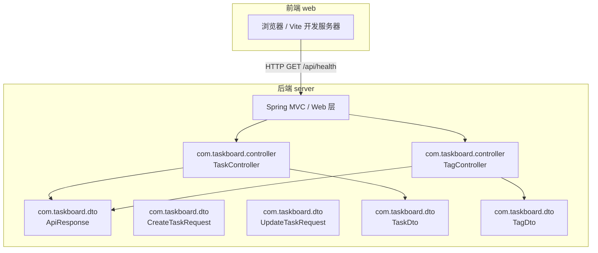
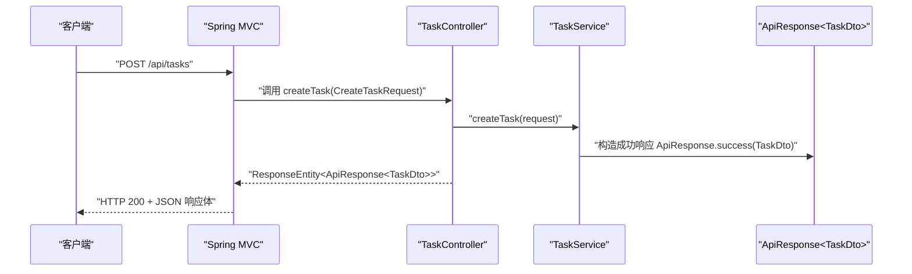
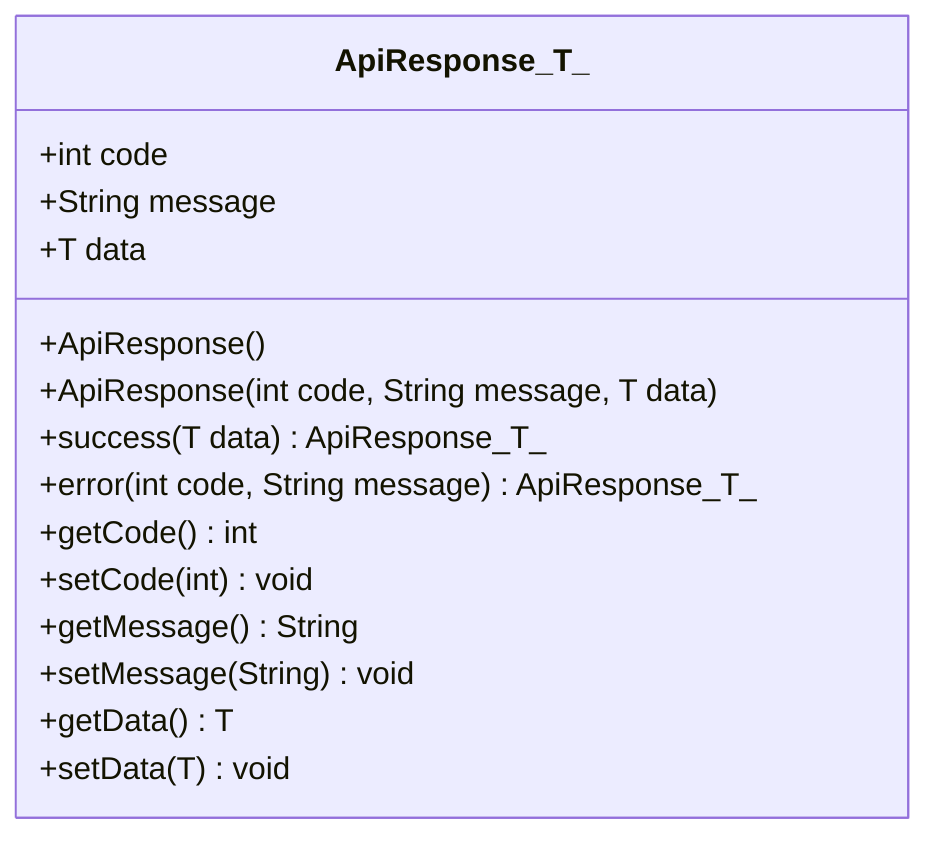
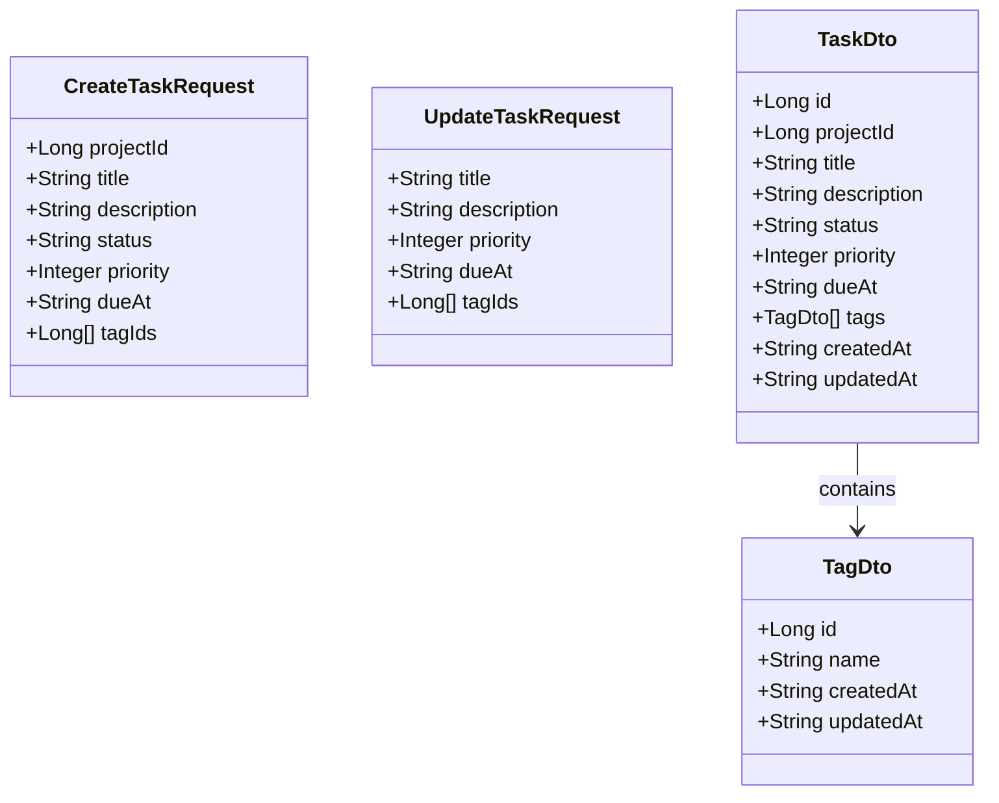
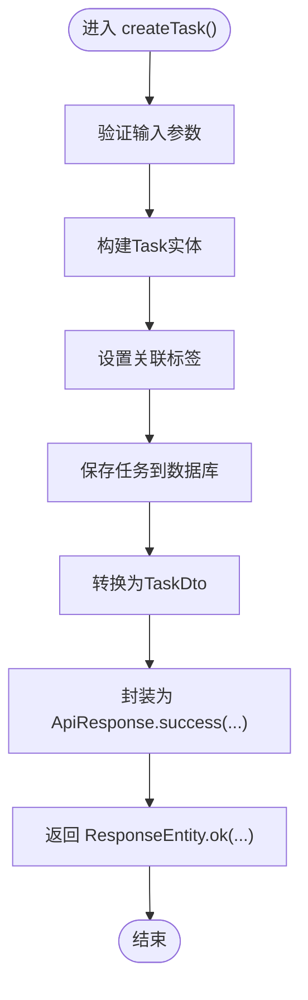
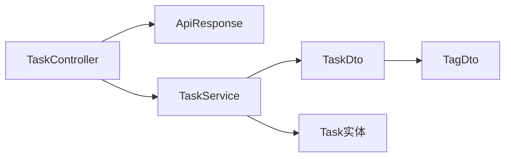

# 数据传输对象

<cite>
**本文引用的文件**   
- [ApiResponse.java](file://server/src/main/java/com/taskboard/dto/ApiResponse.java)
- [CreateTaskRequest.java](file://server/src/main/java/com/taskboard/dto/CreateTaskRequest.java)
- [UpdateTaskRequest.java](file://server/src/main/java/com/taskboard/dto/UpdateTaskRequest.java)
- [TaskDto.java](file://server/src/main/java/com/taskboard/dto/TaskDto.java)
- [TagDto.java](file://server/src/main/java/com/taskboard/dto/TagDto.java)
- [TaskController.java](file://server/src/main/java/com/taskboard/controller/TaskController.java)
- [TagController.java](file://server/src/main/java/com/taskboard/controller/TagController.java)
- [TaskService.java](file://server/src/main/java/com/taskboard/service/TaskService.java)
- [TagService.java](file://server/src/main/java/com/taskboard/service/TagService.java)
- [HealthController.java](file://server/src/main/java/com/taskboard/controller/HealthController.java)
- [README.md](file://README.md)
- [INIT_REPORT.md](file://INIT_REPORT.md)
</cite>

## 更新摘要
**变更内容**   
- 新增了任务管理相关的DTO类：CreateTaskRequest、UpdateTaskRequest、TaskDto
- 新增了标签管理相关的DTO类：TagDto
- 扩展了统一响应格式的使用场景，涵盖CRUD操作和复杂业务逻辑
- 更新了DTO模式在任务管理和标签管理中的应用示例
- 增强了数据验证和业务规则的实现说明

## 目录
1. [引言](#引言)
2. [项目结构](#项目结构)
3. [核心组件](#核心组件)
4. [架构总览](#架构总览)
5. [详细组件分析](#详细组件分析)
6. [依赖关系分析](#依赖关系分析)
7. [性能与序列化考量](#性能与序列化考量)
8. [故障排查指南](#故障排查指南)
9. [结论](#结论)
10. [附录：DTO 最佳实践与设计模式](#附录dto-最佳实践与设计模式)

## 引言
本文件聚焦 TaskBoard 后端的数据传输对象（DTO）设计，重点解析统一响应封装类 ApiResponse<T> 的设计动机、泛型机制、字段语义以及在控制器中的使用方式。随着项目的演进，现已新增任务管理和标签管理的完整DTO体系，包括 CreateTaskRequest、UpdateTaskRequest、TaskDto 和 TagDto，展示了DTO模式在后端开发中的作用与优势，包括数据解耦、类型安全与接口契约定义，并给出扩展新 DTO 类的实践建议。

## 项目结构
TaskBoard 采用前后端分离的单体仓库结构，后端基于 Spring Boot 4，前端基于 React 19 + TypeScript。当前后端已实现完整的任务管理系统，包含统一的 API 响应包装、健康检查接口以及任务、标签的完整CRUD操作。

图示来源
- [TaskController.java:16-88](file://server/src/main/java/com/taskboard/controller/TaskController.java#L16-L88)
- [TagController.java:14-64](file://server/src/main/java/com/taskboard/controller/TagController.java#L14-L64)
- [ApiResponse.java:6-51](file://server/src/main/java/com/taskboard/dto/ApiResponse.java#L6-L51)

章节来源
- [README.md:10-16](file://README.md#L10-L16)
- [README.md:56-62](file://README.md#L56-L62)

## 核心组件
- **ApiResponse<T>**：统一的 API 响应包装类，包含 code、message、data 三个标准字段，并提供 success/error 静态工厂方法。
- **CreateTaskRequest**：任务创建请求DTO，包含项目名称、标题、描述、状态、优先级、截止日期和标签ID列表。
- **UpdateTaskRequest**：任务更新请求DTO，支持部分字段更新，包含标题、描述、优先级、截止日期和标签ID列表。
- **TaskDto**：任务响应DTO，包含完整的任务信息和关联的标签列表。
- **TagDto**：标签响应DTO，包含标签的基本信息和时间戳。
- **TaskController**：任务管理控制器，演示如何使用DTO进行CRUD操作。
- **TagController**：标签管理控制器，展示简单的实体管理API。

章节来源
- [ApiResponse.java:6-51](file://server/src/main/java/com/taskboard/dto/ApiResponse.java#L6-L51)
- [CreateTaskRequest.java:6-14](file://server/src/main/java/com/taskboard/dto/CreateTaskRequest.java#L6-L14)
- [UpdateTaskRequest.java:6-12](file://server/src/main/java/com/taskboard/dto/UpdateTaskRequest.java#L6-L12)
- [TaskDto.java:8-19](file://server/src/main/java/com/taskboard/dto/TaskDto.java#L8-L19)
- [TagDto.java:6-11](file://server/src/main/java/com/taskboard/dto/TagDto.java#L6-L11)
- [TaskController.java:16-88](file://server/src/main/java/com/taskboard/controller/TaskController.java#L16-L88)
- [TagController.java:14-64](file://server/src/main/java/com/taskboard/controller/TagController.java#L14-L64)

## 架构总览
下图展示从客户端到控制器的请求处理流程，以及统一响应对象的生成与返回过程，涵盖了任务管理的完整生命周期。

图示来源
- [TaskController.java:38-43](file://server/src/main/java/com/taskboard/controller/TaskController.java#L38-L43)
- [TaskService.java:67-95](file://server/src/main/java/com/taskboard/service/TaskService.java#L67-L95)
- [ApiResponse.java:20-26](file://server/src/main/java/com/taskboard/dto/ApiResponse.java#L20-L26)

## 详细组件分析

### ApiResponse<T> 统一响应格式
- **设计理念**
  - 通过统一外层结构屏蔽业务细节，使前端对错误码、消息和数据体进行一致化处理。
  - 使用泛型 T 承载任意业务数据结构，保持类型安全与可扩展性。
- **字段语义**
  - code：状态码，用于区分成功与失败场景，便于前端路由与提示。
  - message：人类可读的消息，可用于调试或用户提示。
  - data：业务数据载体，可为对象、集合或 Map；失败时可为 null。
- **工厂方法**
  - success(data)：快速构建成功响应，默认 code 为 200，message 为 Success。
  - error(code, message)：快速构建失败响应，data 为 null。
- **序列化行为**
  - 由 Spring MVC 自动将 Java 对象序列化为 JSON，字段名与 getter/setter 保持一致。
- **扩展建议**
  - 可引入枚举替代魔法数字 code，增强可读性与约束力。
  - 可增加分页、traceId、timestamp 等通用字段以支持更丰富的监控与审计需求。

图示来源
- [ApiResponse.java:6-51](file://server/src/main/java/com/taskboard/dto/ApiResponse.java#L6-L51)

章节来源
- [ApiResponse.java:6-51](file://server/src/main/java/com/taskboard/dto/ApiResponse.java#L6-L51)

### 任务管理DTO体系

#### CreateTaskRequest - 任务创建请求
- **用途**：接收创建新任务的请求数据
- **字段说明**：
  - projectId：所属项目ID
  - title：任务标题（必填）
  - description：任务描述（可选）
  - status：任务状态（TODO/IN_PROGRESS/DONE/CLOSED）
  - priority：优先级（0-3）
  - dueAt：截止日期（ISO-8601格式）
  - tagIds：关联标签ID列表
- **设计特点**：使用Java Record实现不可变对象，提供简洁的构造函数

#### UpdateTaskRequest - 任务更新请求  
- **用途**：接收更新现有任务的请求数据
- **字段说明**：
  - title：任务标题（可选更新）
  - description：任务描述（可选更新）
  - priority：优先级（可选更新）
  - dueAt：截止日期（可选更新）
  - tagIds：关联标签ID列表（可选更新）
- **设计特点**：支持部分字段更新，所有字段均为可选

#### TaskDto - 任务响应DTO
- **用途**：返回任务完整信息给客户端
- **字段说明**：
  - id：任务唯一标识
  - projectId：所属项目ID
  - title：任务标题
  - description：任务描述
  - status：任务状态
  - priority：优先级
  - dueAt：截止日期（ISO-8601字符串）
  - tags：关联标签列表（嵌套DTO）
  - createdAt：创建时间（ISO-8601字符串）
  - updatedAt：更新时间（ISO-8601字符串）
- **设计特点**：包含完整的业务信息，时间字段统一格式化为ISO-8601字符串

#### TagDto - 标签响应DTO
- **用途**：返回标签基本信息
- **字段说明**：
  - id：标签唯一标识
  - name：标签名称
  - createdAt：创建时间（ISO-8601字符串）
  - updatedAt：更新时间（ISO-8601字符串）
- **设计特点**：简洁的只读DTO，用于标签信息的展示

图示来源
- [CreateTaskRequest.java:6-14](file://server/src/main/java/com/taskboard/dto/CreateTaskRequest.java#L6-L14)
- [UpdateTaskRequest.java:6-12](file://server/src/main/java/com/taskboard/dto/UpdateTaskRequest.java#L6-L12)
- [TaskDto.java:8-19](file://server/src/main/java/com/taskboard/dto/TaskDto.java#L8-L19)
- [TagDto.java:6-11](file://server/src/main/java/com/taskboard/dto/TagDto.java#L6-L11)

章节来源
- [CreateTaskRequest.java:6-14](file://server/src/main/java/com/taskboard/dto/CreateTaskRequest.java#L6-L14)
- [UpdateTaskRequest.java:6-12](file://server/src/main/java/com/taskboard/dto/UpdateTaskRequest.java#L6-L12)
- [TaskDto.java:8-19](file://server/src/main/java/com/taskboard/dto/TaskDto.java#L8-L19)
- [TagDto.java:6-11](file://server/src/main/java/com/taskboard/dto/TagDto.java#L6-L11)

### 控制器使用示例

#### TaskController - 任务管理控制器
- **职责**：提供任务的完整CRUD操作和状态转换功能
- **主要接口**：
  - GET /api/tasks：获取所有任务
  - POST /api/tasks：创建新任务
  - GET /api/tasks/{id}：根据ID获取任务
  - PUT /api/tasks/{id}：更新任务
  - PATCH /api/tasks/{id}/transitions：状态转换
  - DELETE /api/tasks/{id}：删除任务
- **返回值**：所有接口均返回 ApiResponse<TaskDto> 或 ApiResponse<List<TaskDto>>

#### TagController - 标签管理控制器
- **职责**：提供标签的CRUD操作
- **主要接口**：
  - GET /api/tags：获取所有标签
  - POST /api/tags：创建标签
  - PUT /api/tags/{id}：更新标签
  - DELETE /api/tags/{id}：删除标签
- **返回值**：所有接口均返回 ApiResponse<TagDto> 或 ApiResponse<List<TagDto>>

图示来源
- [TaskController.java:38-43](file://server/src/main/java/com/taskboard/controller/TaskController.java#L38-L43)
- [TaskService.java:67-95](file://server/src/main/java/com/taskboard/service/TaskService.java#L67-L95)

章节来源
- [TaskController.java:16-88](file://server/src/main/java/com/taskboard/controller/TaskController.java#L16-L88)
- [TagController.java:14-64](file://server/src/main/java/com/taskboard/controller/TagController.java#L14-L64)

## 依赖关系分析
- **控制器依赖统一响应对象**，形成"控制器 -> 响应包装"的单向依赖，避免在控制器中散落响应构造逻辑。
- **服务层负责DTO转换**，在服务层将领域模型转换为DTO，再交由控制器返回。
- **DTO之间建立关联关系**，TaskDto包含TagDto列表，体现一对多的业务关系。
- **当前引入了Bean Validation注解**于DTO，验证与国际化能力可按需扩展。

图示来源
- [TaskController.java:3-88](file://server/src/main/java/com/taskboard/controller/TaskController.java#L3-L88)
- [TaskService.java:3-311](file://server/src/main/java/com/taskboard/service/TaskService.java#L3-L311)
- [TaskDto.java:8-19](file://server/src/main/java/com/taskboard/dto/TaskDto.java#L8-L19)

章节来源
- [TaskController.java:3-88](file://server/src/main/java/com/taskboard/controller/TaskController.java#L3-L88)
- [TaskService.java:3-311](file://server/src/main/java/com/taskboard/service/TaskService.java#L3-L311)
- [ApiResponse.java:6-51](file://server/src/main/java/com/taskboard/dto/ApiResponse.java#L6-L51)

## 性能与序列化考量
- **序列化开销**
  - 统一响应会增加一层 JSON 包装，但能显著降低前端分支判断复杂度，整体收益大于额外开销。
  - TaskDto中包含嵌套的TagDto列表，需要注意N+1查询问题，已通过懒加载优化。
- **内存占用**
  - 失败路径 data 为 null，避免无意义对象分配；成功路径按需填充业务数据。
  - 使用Java Record定义的DTO具有更好的内存效率和性能表现。
- **扩展点**
  - 若需要减少网络体积，可在特定接口返回轻量 DTO，或在统一响应中增加可选字段以减少冗余。
  - 考虑添加分页DTO以支持大数据集的高效传输。

[本节为通用指导，不直接分析具体文件]

## 故障排查指南
- **常见问题**
  - 前端无法解析响应：确认后端返回的是 ApiResponse<T> 且字段名一致。
  - 状态码含义不明确：建议在 ApiResponse 中使用枚举或常量集中管理 code 值。
  - 消息语言问题：当前 message 为硬编码英文，如需多语言，可引入 i18n 资源并在控制器或服务层注入。
  - 日期格式问题：确保所有时间字段使用ISO-8601格式，避免序列化异常。
  - 标签关联问题：检查tagIds数组是否为空或包含无效ID。
- **定位步骤**
  - 检查控制器返回类型是否为 ResponseEntity<ApiResponse<...>>。
  - 检查 ApiResponse.success/error 的使用是否正确。
  - 查看日志与数据库连接状态，确保 /api/health 返回的 database 字段符合预期。
  - 验证DTO字段的必填项是否满足业务规则。
  - 检查状态转换是否符合预定义的状态机规则。

章节来源
- [README.md:56-62](file://README.md#L56-L62)
- [INIT_REPORT.md:83-99](file://INIT_REPORT.md#L83-L99)
- [TaskService.java:195-281](file://server/src/main/java/com/taskboard/service/TaskService.java#L195-L281)

## 结论
TaskBoard 通过 ApiResponse<T> 实现了统一的 API 响应封装，配合新增的任务和标签管理DTO体系，展示了完整的DTO模式应用。该设计提升了接口的规范性与可维护性，并为后续业务功能的扩展提供了良好基础。项目中使用的Java Record语法使得DTO定义更加简洁高效，结合服务层的业务逻辑验证，形成了健壮的数据传输层。建议在后续迭代中引入枚举化状态码、分页与追踪字段，并结合 Bean Validation 与 i18n 完善输入校验与多语言支持。

[本节为总结性内容，不直接分析具体文件]

## 附录：DTO 最佳实践与设计模式
- **数据解耦**
  - 使用 DTO 隔离外部契约与内部领域模型，避免领域对象直接暴露给 API 层。
  - 通过DTO定义清晰的API边界，便于前后端协作和版本管理。
- **类型安全**
  - 利用泛型与强类型约束，减少运行时类型转换错误。
  - 使用Java Record确保DTO的不可变性和线程安全性。
- **接口契约**
  - 明确定义 code/message/data 的语义与取值范围，配合文档与测试保障契约稳定。
  - 为每个业务场景定义专门的DTO，避免过度耦合。
- **创建新 DTO 的步骤**
  - 定义 DTO 类，仅包含对外暴露的必要字段。
  - 优先使用Java Record简化DTO定义。
  - 在控制器或服务层组装 DTO，避免直接返回领域实体。
  - 如需要校验，添加 Bean Validation 注解并配置自定义校验规则。
  - 如需多语言，将错误消息抽取至 i18n 资源文件，并通过校验结果映射到 message。
- **设计模式参考**
  - **工厂模式**：ApiResponse.success/error 提供便捷构造。
  - **适配器模式**：在服务层将领域模型转换为 DTO，再交由控制器返回。
  - **策略模式**：针对不同业务场景定制不同的响应包装策略（例如分页、批量操作）。
  - **组合模式**：TaskDto包含TagDto列表，体现复杂的对象组合关系。
- **验证与转换**
  - 在服务层进行业务逻辑验证，而非在DTO层面。
  - 使用专门的转换器方法处理实体与DTO之间的转换。
  - 处理复杂的数据格式转换，如日期时间的标准化。

[本节为概念性指导，不直接分析具体文件]