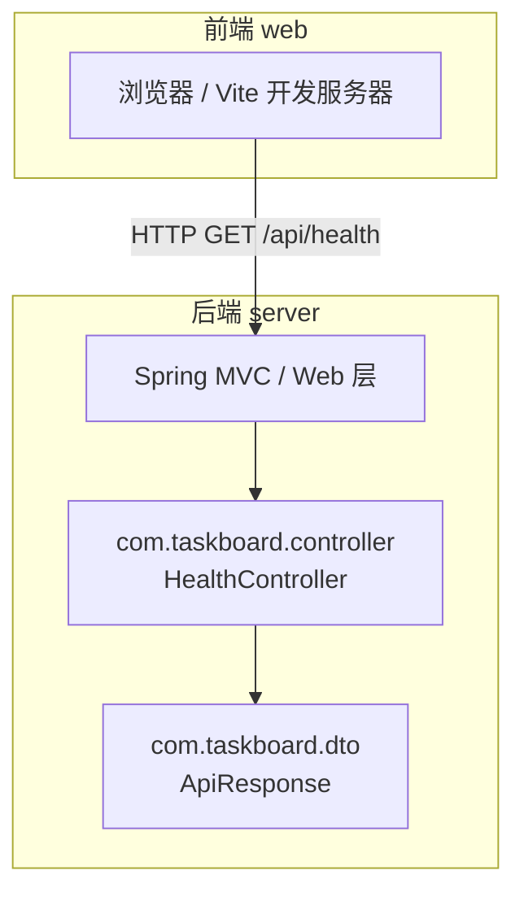
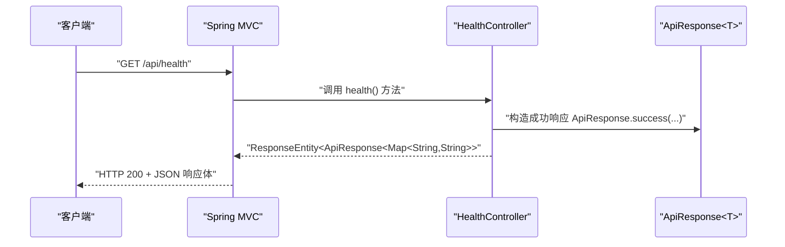
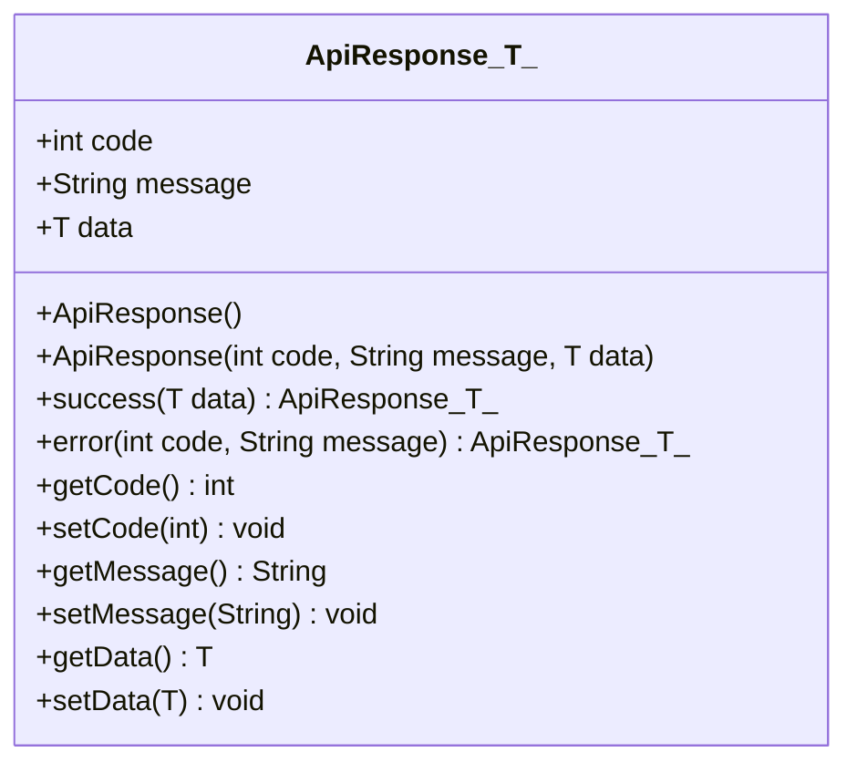
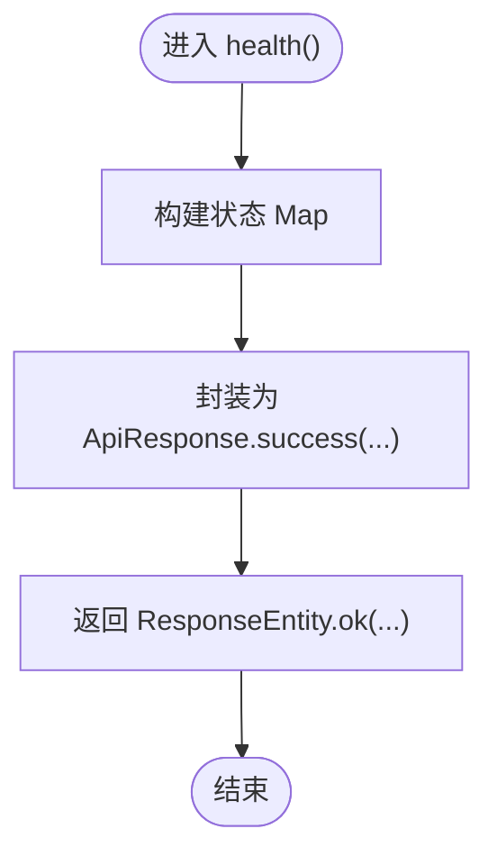

# 数据传输对象

<cite>
**本文引用的文件**   
- [ApiResponse.java](file://server/src/main/java/com/taskboard/dto/ApiResponse.java)
- [HealthController.java](file://server/src/main/java/com/taskboard/controller/HealthController.java)
- [README.md](file://README.md)
- [INIT_REPORT.md](file://INIT_REPORT.md)
</cite>

## 目录
1. [引言](#引言)
2. [项目结构](#项目结构)
3. [核心组件](#核心组件)
4. [架构总览](#架构总览)
5. [详细组件分析](#详细组件分析)
6. [依赖关系分析](#依赖关系分析)
7. [性能与序列化考量](#性能与序列化考量)
8. [故障排查指南](#故障排查指南)
9. [结论](#结论)
10. [附录：DTO 最佳实践与设计模式](#附录dto-最佳实践与设计模式)

## 引言
本文件聚焦 TaskBoard 后端的数据传输对象（DTO）设计，重点解析统一响应封装类 ApiResponse<T> 的设计动机、泛型机制、字段语义以及在控制器中的使用方式。同时结合现有代码，说明 DTO 在后端开发中的作用与优势，包括数据解耦、类型安全与接口契约定义，并给出扩展新 DTO 类的实践建议。

## 项目结构
TaskBoard 采用前后端分离的单体仓库结构，后端基于 Spring Boot 4，前端基于 React 19 + TypeScript。当前后端已实现最小可用能力：统一的 API 响应包装与一个健康检查接口。

图示来源
- [HealthController.java:14-26](file://server/src/main/java/com/taskboard/controller/HealthController.java#L14-L26)
- [ApiResponse.java:6-51](file://server/src/main/java/com/taskboard/dto/ApiResponse.java#L6-L51)

章节来源
- [README.md:10-16](file://README.md#L10-L16)
- [README.md:56-62](file://README.md#L56-L62)

## 核心组件
- ApiResponse<T>：统一的 API 响应包装类，包含 code、message、data 三个标准字段，并提供 success/error 静态工厂方法。
- HealthController：示例控制器，演示如何返回 ApiResponse<T> 作为 HTTP 响应体。

章节来源
- [ApiResponse.java:6-51](file://server/src/main/java/com/taskboard/dto/ApiResponse.java#L6-L51)
- [HealthController.java:14-26](file://server/src/main/java/com/taskboard/controller/HealthController.java#L14-L26)

## 架构总览
下图展示从客户端到控制器的请求处理流程，以及统一响应对象的生成与返回过程。

图示来源
- [HealthController.java:18-26](file://server/src/main/java/com/taskboard/controller/HealthController.java#L18-L26)
- [ApiResponse.java:20-26](file://server/src/main/java/com/taskboard/dto/ApiResponse.java#L20-L26)

## 详细组件分析

### ApiResponse<T> 统一响应格式
- 设计理念
  - 通过统一外层结构屏蔽业务细节，使前端对错误码、消息和数据体进行一致化处理。
  - 使用泛型 T 承载任意业务数据结构，保持类型安全与可扩展性。
- 字段语义
  - code：状态码，用于区分成功与失败场景，便于前端路由与提示。
  - message：人类可读的消息，可用于调试或用户提示。
  - data：业务数据载体，可为对象、集合或 Map；失败时可为 null。
- 工厂方法
  - success(data)：快速构建成功响应，默认 code 为 200，message 为 Success。
  - error(code, message)：快速构建失败响应，data 为 null。
- 序列化行为
  - 由 Spring MVC 自动将 Java 对象序列化为 JSON，字段名与 getter/setter 保持一致。
- 扩展建议
  - 可引入枚举替代魔法数字 code，增强可读性与约束力。
  - 可增加分页、traceId、timestamp 等通用字段以支持更丰富的监控与审计需求。

图示来源
- [ApiResponse.java:6-51](file://server/src/main/java/com/taskboard/dto/ApiResponse.java#L6-L51)

章节来源
- [ApiResponse.java:6-51](file://server/src/main/java/com/taskboard/dto/ApiResponse.java#L6-L51)

### HealthController 使用示例
- 职责
  - 暴露 /api/health 健康检查接口，返回系统状态信息。
- 返回值
  - 使用 ResponseEntity<ApiResponse<Map<String, String>>> 包裹业务数据，体现统一响应规范。
- 数据内容
  - 返回包含 status、database、timestamp 的状态信息，便于运维与前端展示。

图示来源
- [HealthController.java:18-26](file://server/src/main/java/com/taskboard/controller/HealthController.java#L18-L26)

章节来源
- [HealthController.java:14-26](file://server/src/main/java/com/taskboard/controller/HealthController.java#L14-L26)

## 依赖关系分析
- 控制器依赖统一响应对象，形成“控制器 -> 响应包装”的单向依赖，避免在控制器中散落响应构造逻辑。
- 当前未引入额外的校验框架注解于 DTO，验证与国际化能力可按需扩展。

图示来源
- [HealthController.java:3-26](file://server/src/main/java/com/taskboard/controller/HealthController.java#L3-L26)
- [ApiResponse.java:6-51](file://server/src/main/java/com/taskboard/dto/ApiResponse.java#L6-L51)

章节来源
- [HealthController.java:3-26](file://server/src/main/java/com/taskboard/controller/HealthController.java#L3-L26)
- [ApiResponse.java:6-51](file://server/src/main/java/com/taskboard/dto/ApiResponse.java#L6-L51)

## 性能与序列化考量
- 序列化开销
  - 统一响应会增加一层 JSON 包装，但能显著降低前端分支判断复杂度，整体收益大于额外开销。
- 内存占用
  - 失败路径 data 为 null，避免无意义对象分配；成功路径按需填充业务数据。
- 扩展点
  - 若需要减少网络体积，可在特定接口返回轻量 DTO，或在统一响应中增加可选字段以减少冗余。

[本节为通用指导，不直接分析具体文件]

## 故障排查指南
- 常见问题
  - 前端无法解析响应：确认后端返回的是 ApiResponse<T> 且字段名一致。
  - 状态码含义不明确：建议在 ApiResponse 中使用枚举或常量集中管理 code 值。
  - 消息语言问题：当前 message 为硬编码英文，如需多语言，可引入 i18n 资源并在控制器或服务层注入。
- 定位步骤
  - 检查控制器返回类型是否为 ResponseEntity<ApiResponse<...>>。
  - 检查 ApiResponse.success/error 的使用是否正确。
  - 查看日志与数据库连接状态，确保 /api/health 返回的 database 字段符合预期。

章节来源
- [README.md:56-62](file://README.md#L56-L62)
- [INIT_REPORT.md:83-99](file://INIT_REPORT.md#L83-L99)

## 结论
TaskBoard 通过 ApiResponse<T> 实现了统一的 API 响应封装，配合 HealthController 展示了典型用法。该设计提升了接口的规范性与可维护性，并为后续业务 DTO 的扩展提供了良好基础。建议在后续迭代中引入枚举化状态码、分页与追踪字段，并结合 Bean Validation 与 i18n 完善输入校验与多语言支持。

[本节为总结性内容，不直接分析具体文件]

## 附录：DTO 最佳实践与设计模式
- 数据解耦
  - 使用 DTO 隔离外部契约与内部领域模型，避免领域对象直接暴露给 API 层。
- 类型安全
  - 利用泛型与强类型约束，减少运行时类型转换错误。
- 接口契约
  - 明确定义 code/message/data 的语义与取值范围，配合文档与测试保障契约稳定。
- 创建新 DTO 的步骤
  - 定义 DTO 类，仅包含对外暴露的必要字段。
  - 在控制器或服务层组装 DTO，避免直接返回领域实体。
  - 如需要校验，添加 Bean Validation 注解并配置自定义校验规则。
  - 如需多语言，将错误消息抽取至 i18n 资源文件，并通过校验结果映射到 message。
- 设计模式参考
  - 工厂模式：ApiResponse.success/error 提供便捷构造。
  - 适配器模式：在服务层将领域模型转换为 DTO，再交由控制器返回。
  - 策略模式：针对不同业务场景定制不同的响应包装策略（例如分页、批量操作）。

[本节为概念性指导，不直接分析具体文件]