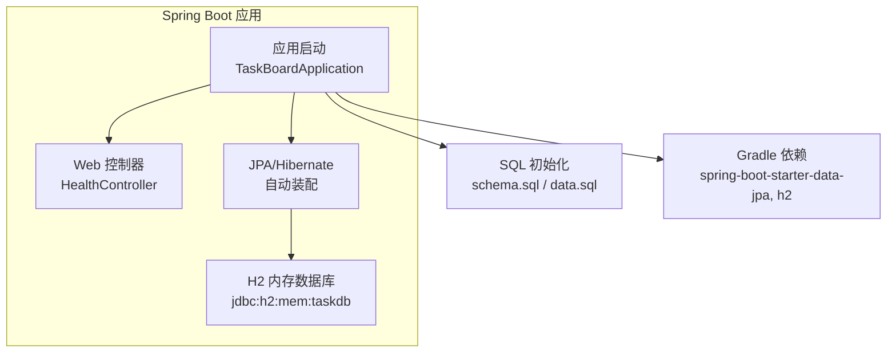
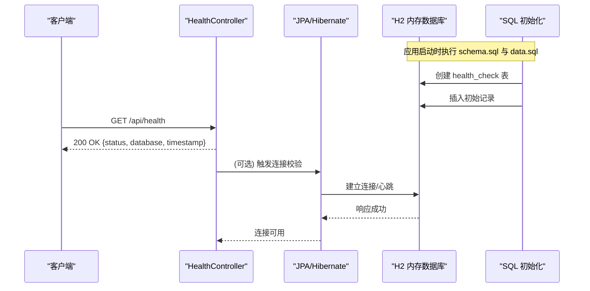
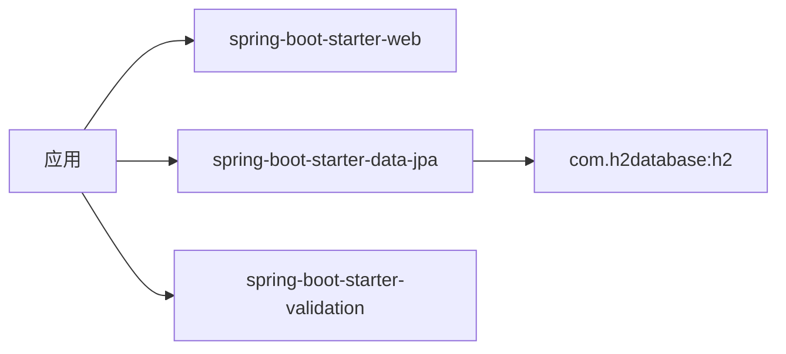

# 数据库设计

<cite>
**本文引用的文件**
- [application.properties](file://server/src/main/resources/application.properties)
- [schema.sql](file://server/src/main/resources/schema.sql)
- [data.sql](file://server/src/main/resources/data.sql)
- [build.gradle.kts](file://server/build.gradle.kts)
- [HealthController.java](file://server/src/main/java/com/taskboard/controller/HealthController.java)
</cite>

## 目录
1. [简介](#简介)
2. [项目结构](#项目结构)
3. [核心组件](#核心组件)
4. [架构总览](#架构总览)
5. [详细组件分析](#详细组件分析)
6. [依赖关系分析](#依赖关系分析)
7. [性能考虑](#性能考虑)
8. [故障排查指南](#故障排查指南)
9. [结论](#结论)
10. [附录](#附录)

## 简介
本技术文档围绕 TaskBoard 后端服务的数据库设计与实现，聚焦 H2 内存数据库的配置与应用集成、SQL 脚本的表结构与初始数据策略、JPA/Hibernate 配置与数据访问方式，以及连接池、事务管理与性能优化建议。同时提供数据库迁移、版本管理与备份恢复的最佳实践指导，帮助读者在现有基础上扩展业务表与数据访问层。

## 项目结构
当前后端服务基于 Spring Boot 4.x，使用 Gradle 构建，通过 starter 引入 Web、Data JPA、Validation 等能力；H2 作为内存数据库，配合 schema.sql 与 data.sql 完成建表与种子数据初始化；应用暴露健康检查接口以验证服务与数据库连通性。

图表来源
- [application.properties:4-17](file://server/src/main/resources/application.properties#L4-L17)
- [build.gradle.kts:22-31](file://server/build.gradle.kts#L22-L31)

章节来源
- [application.properties:1-18](file://server/src/main/resources/application.properties#L1-L18)
- [build.gradle.kts:1-42](file://server/build.gradle.kts#L1-L42)

## 核心组件
- H2 内存数据库：通过 JDBC URL 指定内存库名称，启用 H2 Console 便于调试。
- SQL 初始化：通过 spring.sql.init.* 配置，按顺序执行 schema.sql 与 data.sql。
- JPA/Hibernate：声明方言为 H2Dialect，关闭 DDL 自动更新，开启 SQL 日志输出。
- 健康检查接口：返回服务状态与数据库连通信息，便于外部监控。

章节来源
- [application.properties:4-17](file://server/src/main/resources/application.properties#L4-L17)
- [schema.sql:1-6](file://server/src/main/resources/schema.sql#L1-L6)
- [data.sql:1-2](file://server/src/main/resources/data.sql#L1-L2)
- [HealthController.java:14-26](file://server/src/main/java/com/taskboard/controller/HealthController.java#L14-L26)

## 架构总览
下图展示了从请求到数据库的调用链路，以及 SQL 初始化流程。

图表来源
- [application.properties:4-17](file://server/src/main/resources/application.properties#L4-L17)
- [schema.sql:1-6](file://server/src/main/resources/schema.sql#L1-L6)
- [data.sql:1-2](file://server/src/main/resources/data.sql#L1-L2)
- [HealthController.java:14-26](file://server/src/main/java/com/taskboard/controller/HealthController.java#L14-L26)

## 详细组件分析

### H2 内存数据库配置与应用集成
- 数据源 URL 指向内存数据库实例，进程重启后数据清空，适合开发与测试。
- 驱动类名显式指定 H2 驱动。
- 启用 H2 Console 并设置访问路径，便于可视化查看数据与执行 SQL。
- JPA 方言设置为 H2Dialect，确保 SQL 生成兼容 H2。
- 关闭 Hibernate DDL 自动更新，避免覆盖由 SQL 脚本管理的表结构。
- 开启 SQL 日志输出，便于调试与性能分析。
- 强制始终执行 SQL 初始化，确保每次启动都重建 schema 与 seed 数据。

章节来源
- [application.properties:4-17](file://server/src/main/resources/application.properties#L4-L17)

### 数据库表结构（schema.sql）
- 表名：health_check
- 字段与类型
  - id：BIGINT，自增主键
  - status：VARCHAR(50)，非空
  - created_at：TIMESTAMP，非空
- 约束与索引
  - 主键：id
  - 唯一/外键：无
  - 索引：未显式定义额外索引
- 设计说明
  - 该表用于存储健康检查相关的最小化状态信息，满足轻量级监控需求。
  - 若后续需要按时间范围查询或按状态聚合，可考虑对 created_at 或 status 添加索引以提升查询性能。

章节来源
- [schema.sql:1-6](file://server/src/main/resources/schema.sql#L1-L6)

### 初始数据与种子策略（data.sql）
- 插入一条健康检查记录，状态为 UP，时间为当前时间戳。
- 种子策略
  - 每次应用启动都会重新执行 data.sql，因此数据是“幂等”的（当前仅单条固定记录）。
  - 对于复杂种子数据，建议采用“存在即跳过”或“版本号+条件插入”的策略以避免重复与冲突。

章节来源
- [data.sql:1-2](file://server/src/main/resources/data.sql#L1-L2)

### JPA 实体映射、ORM 配置与数据访问层
- ORM 配置
  - 已启用 Data JPA Starter，Hibernate 方言为 H2Dialect。
  - DDL 自动更新关闭，表结构由 SQL 脚本管理，保证环境一致性。
  - SQL 日志开启，便于定位问题。
- 实体映射
  - 当前代码仓库中未发现 JPA 实体类与 Repository 接口，数据访问尚未通过 JPA 进行封装。
  - 如需通过 JPA 访问 health_check 表，可新增实体类与 Repository，并在 application.properties 中配置扫描包路径。
- 数据访问现状
  - 健康检查接口目前直接返回静态状态，未实际读取数据库；但应用启动时会建立数据库连接并执行初始化脚本，间接验证了数据库连通性。

章节来源
- [application.properties:10-15](file://server/src/main/resources/application.properties#L10-L15)
- [HealthController.java:14-26](file://server/src/main/java/com/taskboard/controller/HealthController.java#L14-L26)

### 数据库连接池配置
- 当前未显式配置连接池参数，Spring Boot 默认使用 HikariCP。
- 建议根据并发与负载调整的关键参数
  - maximum-pool-size：最大连接数，通常与 CPU 核数或并发量匹配。
  - minimum-idle：最小空闲连接数，减少冷启动时的连接创建开销。
  - connection-timeout：获取连接的超时时间，避免长时间阻塞。
  - idle-timeout/max-lifetime：连接生命周期与空闲回收策略，防止连接泄漏与失效。
- 监控与诊断
  - 结合 Hikari 指标与 SQL 日志，观察连接获取耗时与连接池水位。

章节来源
- [application.properties:4-17](file://server/src/main/resources/application.properties#L4-L17)

### 事务管理
- 当前未见 @Transactional 注解的使用，因健康检查接口不涉及写操作。
- 建议
  - 对涉及多步写操作的 Service 方法使用 @Transactional 保证原子性。
  - 明确只读方法使用 readOnly=true 提升性能。
  - 合理设置隔离级别与传播行为，避免不必要的锁竞争。

章节来源
- [HealthController.java:14-26](file://server/src/main/java/com/taskboard/controller/HealthController.java#L14-L26)

### 性能优化策略
- SQL 层面
  - 针对高频查询字段添加合适索引（如 created_at、status）。
  - 避免 SELECT *，仅选择必要字段。
- 应用层面
  - 控制单次查询的数据量，必要时分页。
  - 合理使用缓存（如本地缓存或 Redis）降低热点查询压力。
  - 开启并关注 SQL 日志，定位慢查询与 N+1 问题。
- 连接池与资源
  - 调优 HikariCP 参数，避免连接不足或过多导致的抖动。
  - 合理设置线程池大小与任务队列，避免请求堆积。

章节来源
- [application.properties:10-15](file://server/src/main/resources/application.properties#L10-L15)

## 依赖关系分析
- Gradle 依赖
  - spring-boot-starter-web：提供 Web 容器与 MVC 能力。
  - spring-boot-starter-data-jpa：引入 JPA/Hibernate 支持。
  - com.h2database:h2：运行时 H2 数据库驱动。
  - spring-boot-starter-validation：Bean Validation 支持。
- 运行时依赖
  - 应用启动时加载上述依赖，装配 DataSource、JPA、H2 Console 等组件。
  - 通过 SQL 初始化脚本完成建表与种子数据。

图表来源
- [build.gradle.kts:22-31](file://server/build.gradle.kts#L22-L31)

章节来源
- [build.gradle.kts:22-31](file://server/build.gradle.kts#L22-L31)

## 性能考虑
- 内存数据库特性
  - H2 内存模式下，数据驻留内存，读写延迟极低，但进程重启后数据丢失。
  - 适合开发、测试与演示场景；生产环境建议使用持久化数据库。
- 初始化成本
  - 每次启动均执行 schema.sql 与 data.sql，若脚本较大可能影响启动时间。
  - 可通过拆分脚本、按需初始化或仅在特定 Profile 下执行来优化。
- 监控与调优
  - 利用 SQL 日志与连接池指标，识别瓶颈并针对性优化。

[本节为通用性能讨论，不直接分析具体文件]

## 故障排查指南
- 常见问题
  - 端口冲突：确认 server.port 未被占用。
  - 数据库连接失败：检查 URL、驱动类名、用户名与密码是否正确。
  - 表不存在：确认 schema.sql 是否成功执行，或 DDL 自动更新是否被误关闭。
  - 重复数据：data.sql 中的插入语句需具备幂等性或去重逻辑。
- 诊断步骤
  - 启用并查看 SQL 日志，核对执行的 DDL/DML。
  - 通过 H2 Console 查看表结构与数据。
  - 检查应用启动日志中的异常堆栈，定位错误源头。

章节来源
- [application.properties:4-17](file://server/src/main/resources/application.properties#L4-L17)
- [schema.sql:1-6](file://server/src/main/resources/schema.sql#L1-L6)
- [data.sql:1-2](file://server/src/main/resources/data.sql#L1-L2)

## 结论
当前 TaskBoard 后端以 H2 内存数据库为核心，通过 SQL 脚本管理表结构与种子数据，配合 JPA/Hibernate 的默认配置完成应用集成。健康检查接口可用于快速验证服务与数据库连通性。建议在后续迭代中完善实体与数据访问层，补充必要的索引与事务管理，并根据运行环境选择合适的连接池与性能调优策略。

[本节为总结性内容，不直接分析具体文件]

## 附录

### 数据库迁移、版本管理与备份恢复最佳实践
- 迁移工具
  - 推荐使用 Flyway 或 Liquibase 管理 SQL 脚本的版本化迁移，确保不同环境的一致性。
  - 将 schema 与数据变更拆分为带版本的脚本，避免直接修改历史脚本。
- 版本管理
  - 所有 SQL 脚本纳入版本控制系统，配合分支与合并流程进行评审。
  - 在 CI/CD 中执行迁移脚本，确保部署前后数据库状态一致。
- 备份与恢复
  - 内存数据库不适合生产备份；生产环境应切换至持久化数据库并制定定期备份策略。
  - 对关键数据进行快照与增量备份，并定期进行恢复演练。
- 回滚策略
  - 准备对应的回滚脚本，确保升级失败时可快速回退。
  - 在灰度发布阶段先小范围验证，再全量推进。

[本节为通用实践指导，不直接分析具体文件]