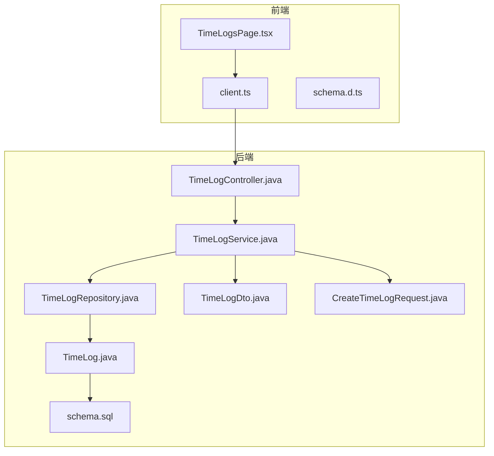
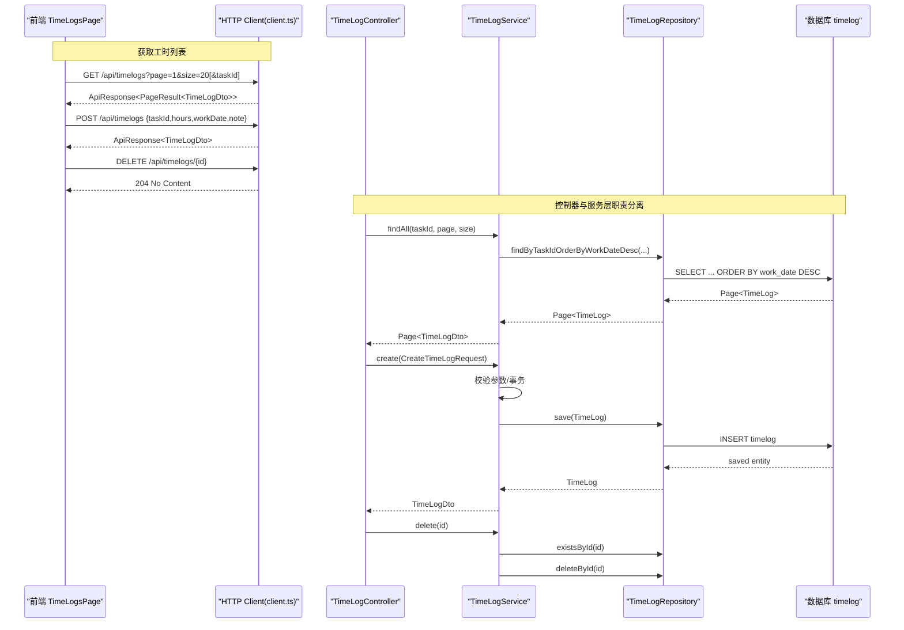
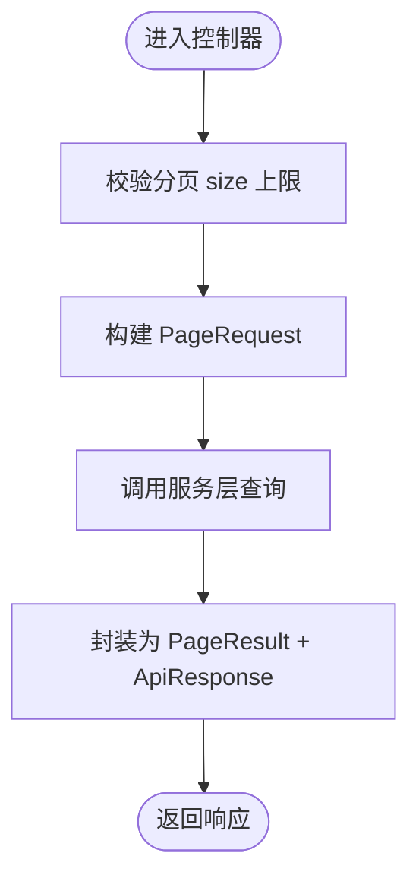
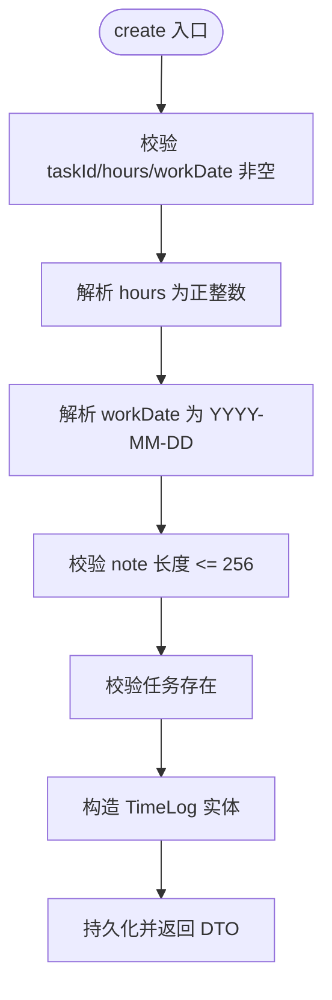
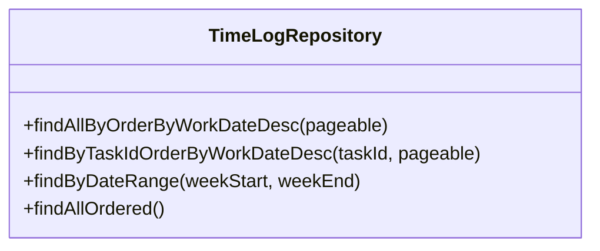
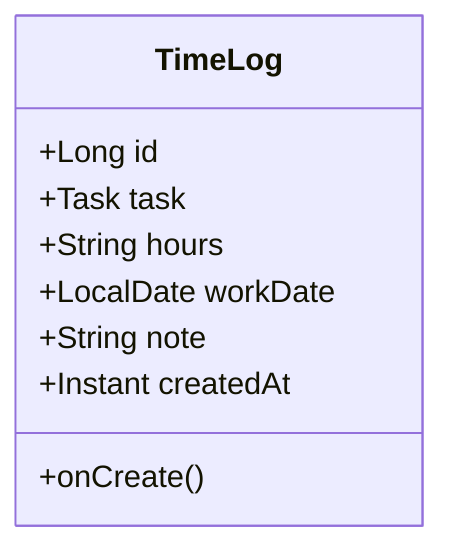
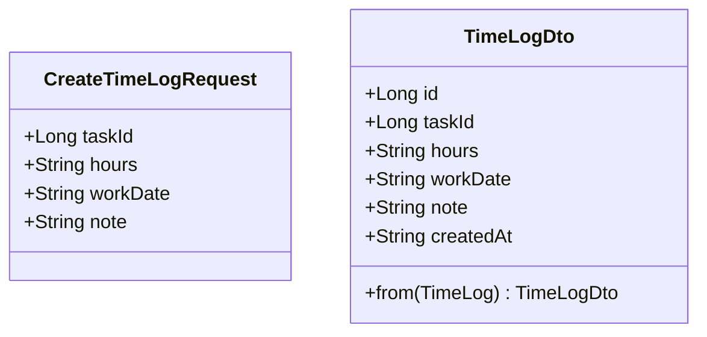
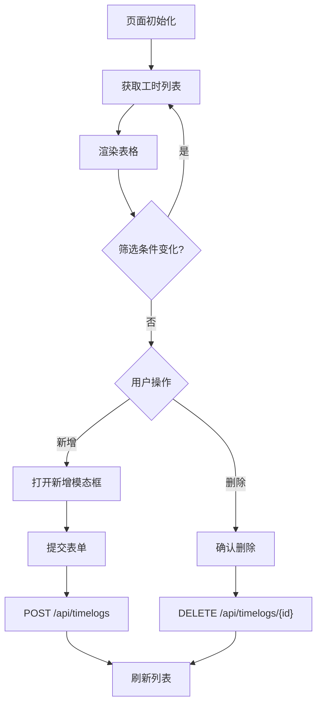
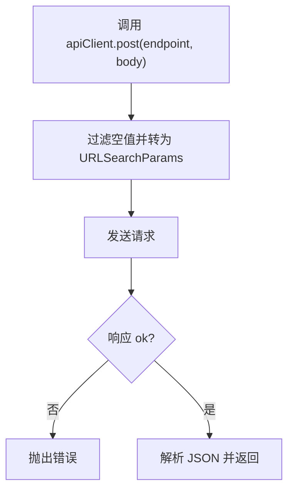
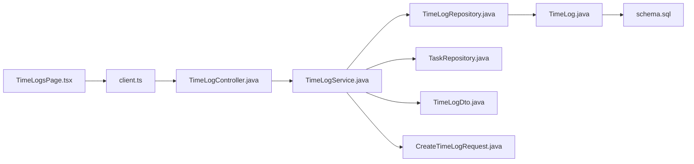

# 时间跟踪模块

<cite>
**本文引用的文件**   
- [TimeLogController.java](file://server/src/main/java/com/taskboard/controller/TimeLogController.java)
- [TimeLogService.java](file://server/src/main/java/com/taskboard/service/TimeLogService.java)
- [TimeLogRepository.java](file://server/src/main/java/com/taskboard/repository/TimeLogRepository.java)
- [TimeLog.java](file://server/src/main/java/com/taskboard/entity/TimeLog.java)
- [TimeLogDto.java](file://server/src/main/java/com/taskboard/dto/TimeLogDto.java)
- [CreateTimeLogRequest.java](file://server/src/main/java/com/taskboard/dto/CreateTimeLogRequest.java)
- [schema.sql](file://server/src/main/resources/schema.sql)
- [TimeLogsPage.tsx](file://web/src/pages/TimeLogsPage.tsx)
- [client.ts](file://web/src/api/client.ts)
- [schema.d.ts](file://web/src/api/schema.d.ts)
</cite>

## 目录
1. [简介](#简介)
2. [项目结构](#项目结构)
3. [核心组件](#核心组件)
4. [架构总览](#架构总览)
5. [详细组件分析](#详细组件分析)
6. [依赖关系分析](#依赖关系分析)
7. [性能与可扩展性](#性能与可扩展性)
8. [故障排查指南](#故障排查指南)
9. [结论](#结论)

## 简介
本章节聚焦“时间跟踪模块”，即工时填报与查询能力。该模块允许用户为任务记录工作日期、工时（分钟）和备注，并提供分页查询、按任务筛选、创建与删除等能力。后端基于 Spring Boot + JPA，前端使用 React + Ant Design，前后端通过 REST API 交互。

## 项目结构
时间跟踪模块涉及后端控制器、服务、仓储、实体、DTO 以及前端页面与类型定义：
- 后端
  - Controller：暴露 /api/timelogs 接口
  - Service：业务校验、事务控制、领域逻辑
  - Repository：JPA 数据访问
  - Entity：timelog 表映射
  - DTO：请求与响应对象
- 前端
  - TimeLogsPage：工时列表、筛选、新增、删除
  - client：统一 HTTP 客户端
  - schema：API 契约类型定义

**图表来源**
- [TimeLogsPage.tsx:1-274](file://web/src/pages/TimeLogsPage.tsx#L1-L274)
- [client.ts:1-86](file://web/src/api/client.ts#L1-L86)
- [TimeLogController.java:1-66](file://server/src/main/java/com/taskboard/controller/TimeLogController.java#L1-L66)
- [TimeLogService.java:1-113](file://server/src/main/java/com/taskboard/service/TimeLogService.java#L1-L113)
- [TimeLogRepository.java:1-31](file://server/src/main/java/com/taskboard/repository/TimeLogRepository.java#L1-L31)
- [TimeLog.java:1-96](file://server/src/main/java/com/taskboard/entity/TimeLog.java#L1-L96)
- [TimeLogDto.java:1-28](file://server/src/main/java/com/taskboard/dto/TimeLogDto.java#L1-L28)
- [CreateTimeLogRequest.java:1-13](file://server/src/main/java/com/taskboard/dto/CreateTimeLogRequest.java#L1-L13)
- [schema.sql:36-44](file://server/src/main/resources/schema.sql#L36-L44)

**章节来源**
- [TimeLogController.java:1-66](file://server/src/main/java/com/taskboard/controller/TimeLogController.java#L1-L66)
- [TimeLogService.java:1-113](file://server/src/main/java/com/taskboard/service/TimeLogService.java#L1-L113)
- [TimeLogRepository.java:1-31](file://server/src/main/java/com/taskboard/repository/TimeLogRepository.java#L1-L31)
- [TimeLog.java:1-96](file://server/src/main/java/com/taskboard/entity/TimeLog.java#L1-L96)
- [TimeLogDto.java:1-28](file://server/src/main/java/com/taskboard/dto/TimeLogDto.java#L1-L28)
- [CreateTimeLogRequest.java:1-13](file://server/src/main/java/com/taskboard/dto/CreateTimeLogRequest.java#L1-L13)
- [schema.sql:36-44](file://server/src/main/resources/schema.sql#L36-L44)
- [TimeLogsPage.tsx:1-274](file://web/src/pages/TimeLogsPage.tsx#L1-L274)
- [client.ts:1-86](file://web/src/api/client.ts#L1-L86)
- [schema.d.ts:47-105](file://web/src/api/schema.d.ts#L47-L105)

## 核心组件
- 控制器层：提供 REST 接口，负责参数接收、分页封装与统一响应包装。
- 服务层：实现工时记录的创建、查询、删除；包含输入校验、事务控制与异常处理。
- 仓储层：基于 JPA 的查询方法，支持分页、排序与范围查询。
- 实体层：timelog 表的 ORM 映射，维护与 task 的外键关系。
- DTO 层：对外暴露的请求与响应数据结构。
- 前端页面：工时列表展示、筛选、新增与删除交互。
- HTTP 客户端：统一的请求封装，处理表单序列化与错误抛出。
- 类型定义：前后端共享的接口契约。

**章节来源**
- [TimeLogController.java:15-65](file://server/src/main/java/com/taskboard/controller/TimeLogController.java#L15-L65)
- [TimeLogService.java:22-111](file://server/src/main/java/com/taskboard/service/TimeLogService.java#L22-L111)
- [TimeLogRepository.java:14-30](file://server/src/main/java/com/taskboard/repository/TimeLogRepository.java#L14-L30)
- [TimeLog.java:10-37](file://server/src/main/java/com/taskboard/entity/TimeLog.java#L10-L37)
- [TimeLogDto.java:9-26](file://server/src/main/java/com/taskboard/dto/TimeLogDto.java#L9-L26)
- [CreateTimeLogRequest.java:6-11](file://server/src/main/java/com/taskboard/dto/CreateTimeLogRequest.java#L6-L11)
- [TimeLogsPage.tsx:21-274](file://web/src/pages/TimeLogsPage.tsx#L21-L274)
- [client.ts:11-83](file://web/src/api/client.ts#L11-L83)
- [schema.d.ts:47-105](file://web/src/api/schema.d.ts#L47-L105)

## 架构总览
下图展示了从前端到后端的完整调用链，包括分页查询、创建与删除流程。

**图表来源**
- [TimeLogsPage.tsx:39-107](file://web/src/pages/TimeLogsPage.tsx#L39-L107)
- [client.ts:18-82](file://web/src/api/client.ts#L18-L82)
- [TimeLogController.java:28-64](file://server/src/main/java/com/taskboard/controller/TimeLogController.java#L28-L64)
- [TimeLogService.java:36-111](file://server/src/main/java/com/taskboard/service/TimeLogService.java#L36-L111)
- [TimeLogRepository.java:17-29](file://server/src/main/java/com/taskboard/repository/TimeLogRepository.java#L17-L29)

## 详细组件分析

### 控制器层：TimeLogController
- 暴露接口
  - GET /api/timelogs：分页查询，可选按 taskId 过滤
  - POST /api/timelogs：创建工时记录
  - DELETE /api/timelogs/{id}：删除工时记录
- 关键行为
  - 限制最大分页 size 上限，避免过大查询
  - 将 Spring Data Page 转换为统一 PageResult，并包裹在 ApiResponse 中返回
  - 删除接口返回 204 No Content

**图表来源**
- [TimeLogController.java:28-45](file://server/src/main/java/com/taskboard/controller/TimeLogController.java#L28-L45)

**章节来源**
- [TimeLogController.java:15-65](file://server/src/main/java/com/taskboard/controller/TimeLogController.java#L15-L65)

### 服务层：TimeLogService
- 查询
  - 根据是否传入 taskId 选择不同查询方法，均按 workDate 倒序
  - 返回 DTO 集合，便于解耦实体与接口
- 创建
  - 必填字段校验：taskId、hours、workDate
  - hours 必须为正整数，workDate 必须为 YYYY-MM-DD 格式
  - note 长度不超过 256
  - 校验关联任务存在
  - 保存实体并返回 DTO
- 删除
  - 先判断是否存在，不存在抛业务异常
  - 执行删除

**图表来源**
- [TimeLogService.java:51-100](file://server/src/main/java/com/taskboard/service/TimeLogService.java#L51-L100)

**章节来源**
- [TimeLogService.java:36-111](file://server/src/main/java/com/taskboard/service/TimeLogService.java#L36-L111)

### 仓储层：TimeLogRepository
- 分页查询
  - 全部记录按 workDate 倒序
  - 按 taskId 过滤并按 workDate 倒序
- 其他查询
  - 按日期范围查询（供统计使用）
  - 全量有序查询（供统计使用）

**图表来源**
- [TimeLogRepository.java:14-30](file://server/src/main/java/com/taskboard/repository/TimeLogRepository.java#L14-L30)

**章节来源**
- [TimeLogRepository.java:14-30](file://server/src/main/java/com/taskboard/repository/TimeLogRepository.java#L14-L30)

### 实体层：TimeLog
- 字段
  - id：自增主键
  - task：多对一关联 Task（外键 task_id）
  - hours：字符串存储（单位：分钟）
  - workDate：日期
  - note：备注（最长 256）
  - createdAt：创建时间（自动填充）
- 生命周期钩子
  - PrePersist 设置 createdAt

**图表来源**
- [TimeLog.java:10-37](file://server/src/main/java/com/taskboard/entity/TimeLog.java#L10-L37)

**章节来源**
- [TimeLog.java:10-95](file://server/src/main/java/com/taskboard/entity/TimeLog.java#L10-L95)

### DTO 层
- CreateTimeLogRequest：创建请求体，包含 taskId、hours、workDate、note
- TimeLogDto：响应体，包含 id、taskId、hours、workDate、note、createdAt，并提供 from 静态方法转换实体

**图表来源**
- [CreateTimeLogRequest.java:6-11](file://server/src/main/java/com/taskboard/dto/CreateTimeLogRequest.java#L6-L11)
- [TimeLogDto.java:9-26](file://server/src/main/java/com/taskboard/dto/TimeLogDto.java#L9-L26)

**章节来源**
- [CreateTimeLogRequest.java:1-13](file://server/src/main/java/com/taskboard/dto/CreateTimeLogRequest.java#L1-L13)
- [TimeLogDto.java:1-28](file://server/src/main/java/com/taskboard/dto/TimeLogDto.java#L1-L28)

### 前端页面：TimeLogsPage
- 功能
  - 加载工时列表，支持分页与按任务筛选
  - 打开模态框填写工时（任务、分钟数、日期、备注）
  - 删除确认与提示
- 交互
  - 使用 antd Table 展示数据
  - 使用 Select 下拉选择任务进行筛选
  - 使用 DatePicker 选择工作日期
  - 使用 Form 校验必填项

**图表来源**
- [TimeLogsPage.tsx:34-107](file://web/src/pages/TimeLogsPage.tsx#L34-L107)
- [TimeLogsPage.tsx:178-274](file://web/src/pages/TimeLogsPage.tsx#L178-L274)

**章节来源**
- [TimeLogsPage.tsx:1-274](file://web/src/pages/TimeLogsPage.tsx#L1-L274)

### HTTP 客户端：client.ts
- 统一封装 GET/POST/PUT/PATCH/DELETE
- POST/PUT/PATCH 将 body 序列化为 application/x-www-form-urlencoded
- 非 2xx 响应抛出错误

**图表来源**
- [client.ts:38-50](file://web/src/api/client.ts#L38-L50)

**章节来源**
- [client.ts:1-86](file://web/src/api/client.ts#L1-L86)

### 类型定义：schema.d.ts
- 定义 TimeLogDto、PageResult 等接口，确保前后端数据结构一致

**章节来源**
- [schema.d.ts:47-105](file://web/src/api/schema.d.ts#L47-L105)

## 依赖关系分析
- 控制器依赖服务，服务依赖仓储与任务仓储
- 实体与数据库表通过 JPA 注解映射
- 前端通过 HTTP 客户端调用后端 REST 接口
- DTO 作为接口契约，屏蔽实体细节

**图表来源**
- [TimeLogsPage.tsx:1-274](file://web/src/pages/TimeLogsPage.tsx#L1-L274)
- [client.ts:1-86](file://web/src/api/client.ts#L1-L86)
- [TimeLogController.java:1-66](file://server/src/main/java/com/taskboard/controller/TimeLogController.java#L1-L66)
- [TimeLogService.java:1-113](file://server/src/main/java/com/taskboard/service/TimeLogService.java#L1-L113)
- [TimeLogRepository.java:1-31](file://server/src/main/java/com/taskboard/repository/TimeLogRepository.java#L1-L31)
- [TimeLog.java:1-96](file://server/src/main/java/com/taskboard/entity/TimeLog.java#L1-L96)
- [schema.sql:36-44](file://server/src/main/resources/schema.sql#L36-L44)

**章节来源**
- [TimeLogService.java:1-113](file://server/src/main/java/com/taskboard/service/TimeLogService.java#L1-L113)
- [TimeLogRepository.java:1-31](file://server/src/main/java/com/taskboard/repository/TimeLogRepository.java#L1-L31)
- [TimeLog.java:1-96](file://server/src/main/java/com/taskboard/entity/TimeLog.java#L1-L96)
- [schema.sql:36-44](file://server/src/main/resources/schema.sql#L36-L44)

## 性能与可扩展性
- 分页与排序
  - 默认每页 20 条，最大限制 100 条，避免大结果集
  - 查询按 workDate 倒序，利于最近记录优先展示
- 索引建议
  - 建议在 timelog.work_date 上建立索引以优化排序与范围查询
  - 建议在 timelog.task_id 上建立索引以优化按任务筛选
- 扩展点
  - 可按周/月维度聚合工时（仓储已提供日期范围查询）
  - 可增加审计字段（如修改人、更新时间）用于合规与追溯

[本节为通用指导，不直接分析具体文件]

## 故障排查指南
- 常见错误
  - 工时必须为正整数：检查前端 InputNumber 与后端解析逻辑
  - 工作日期格式无效：确保前端 DatePicker 输出 YYYY-MM-DD
  - 任务不存在：检查 taskId 是否有效且任务未被删除
  - 工时记录不存在：删除前需确认 ID 存在
- 定位步骤
  - 查看前端控制台网络请求与响应
  - 检查后端日志中的业务异常信息
  - 核对数据库 timelog 表结构与约束

**章节来源**
- [TimeLogService.java:51-111](file://server/src/main/java/com/taskboard/service/TimeLogService.java#L51-L111)
- [TimeLogsPage.tsx:75-107](file://web/src/pages/TimeLogsPage.tsx#L75-L107)

## 结论
时间跟踪模块在后端采用清晰的三层架构，结合严格的参数校验与事务管理，保证数据一致性；前端提供直观的工时填报与列表管理能力。通过分页、排序与筛选，满足日常使用场景。后续可围绕统计分析与审计增强扩展能力。