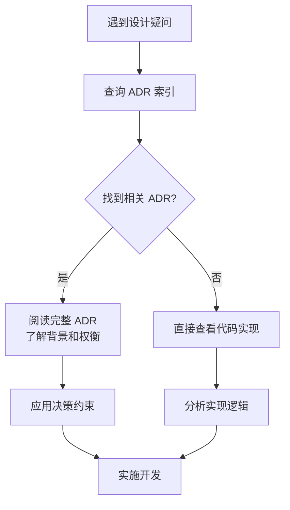
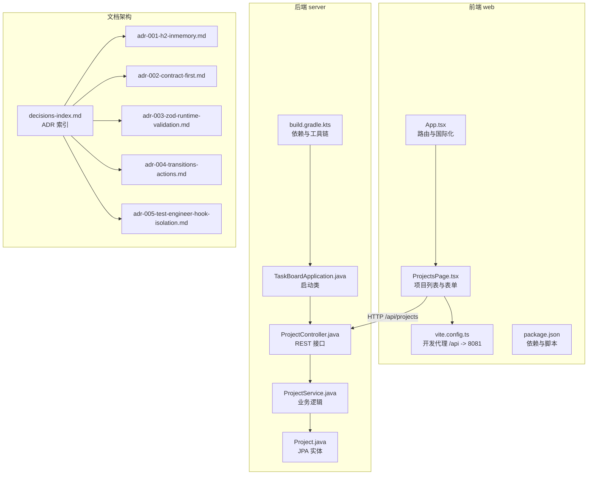
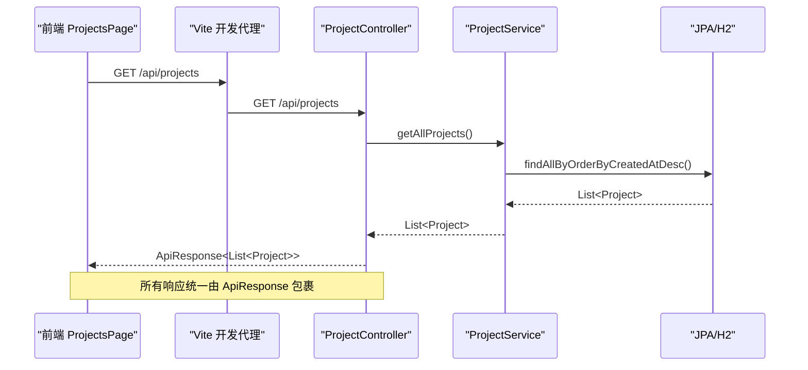
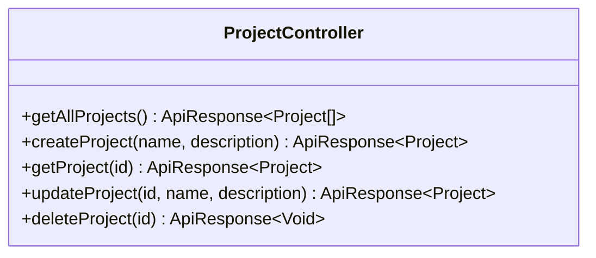
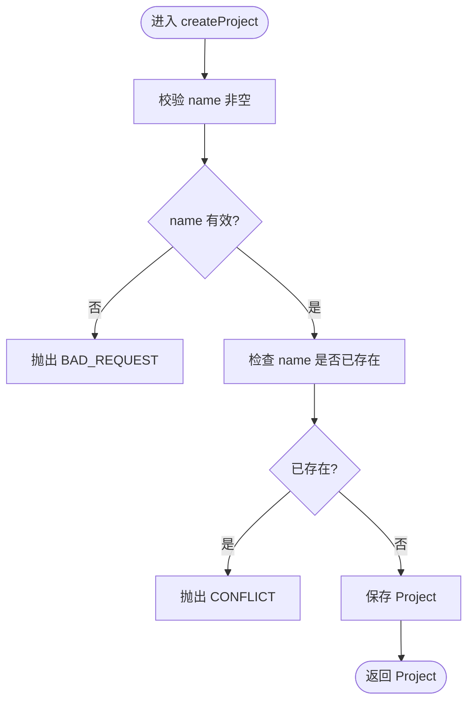
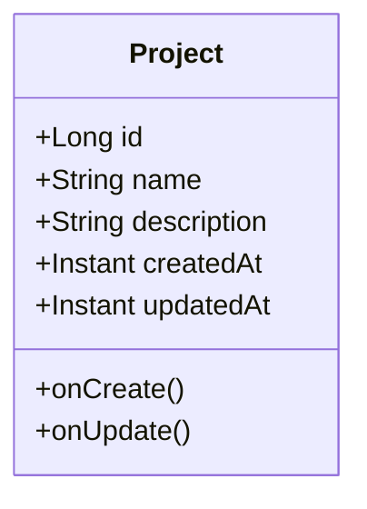
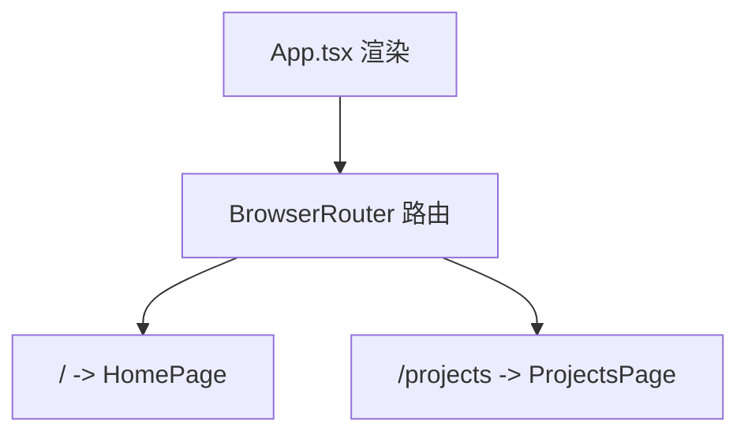
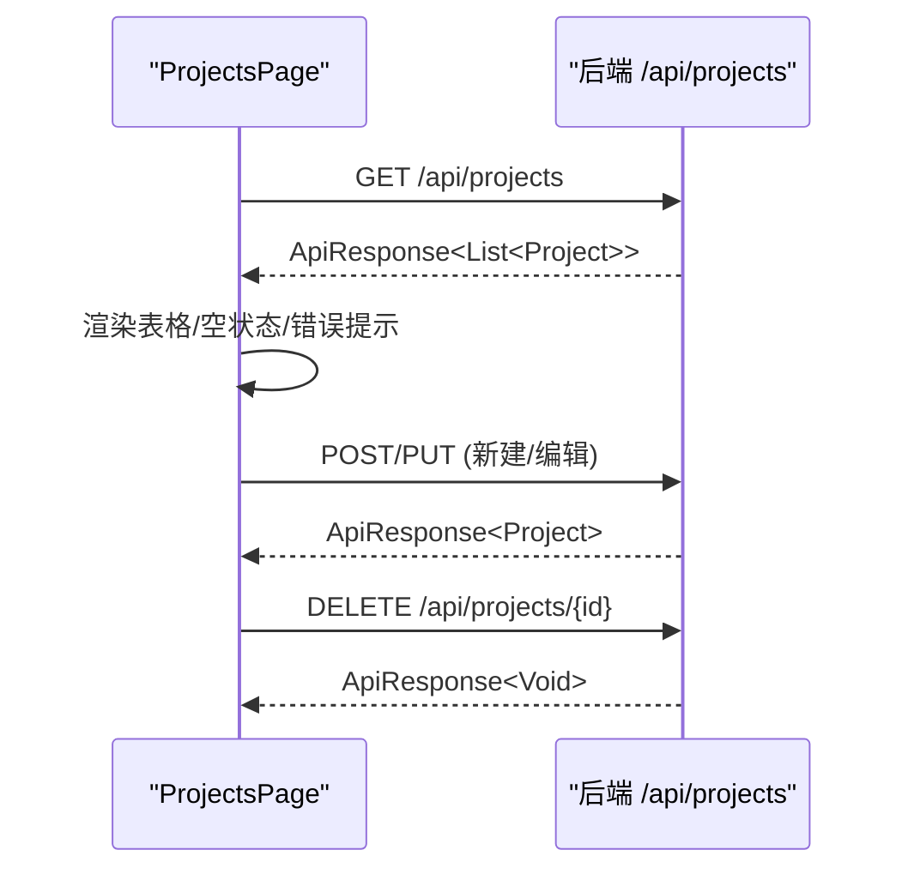
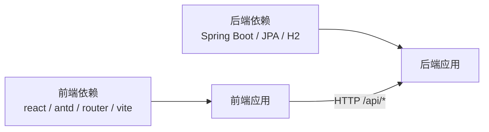
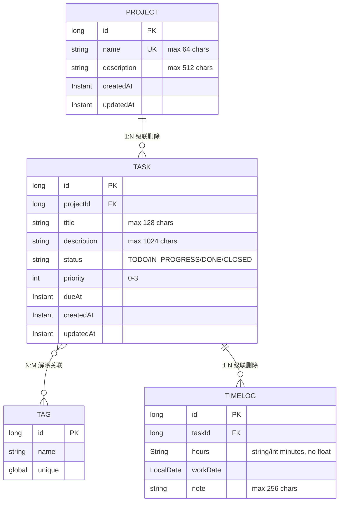

# 架构决策记录

<cite>
**本文引用的文件**   
- [README.md](file://README.md)
- [decisions-index.md](file://docs/architecture/decisions-index.md)
- [adr-001-h2-inmemory.md](file://docs/architecture/adr-001-h2-inmemory.md)
- [adr-002-contract-first.md](file://docs/architecture/adr-002-contract-first.md)
- [adr-003-zod-runtime-validation.md](file://docs/architecture/adr-003-zod-runtime-validation.md)
- [adr-004-transitions-actions.md](file://docs/architecture/adr-004-transitions-actions.md)
- [adr-005-test-engineer-hook-isolation.md](file://docs/architecture/adr-005-test-engineer-hook-isolation.md)
- [adr-formalization-report.md](file://docs/adr-formalization-report.md)
- [TaskBoardApplication.java](file://server/src/main/java/com/taskboard/TaskBoardApplication.java)
- [ProjectController.java](file://server/src/main/java/com/taskboard/controller/ProjectController.java)
- [ProjectService.java](file://server/src/main/java/com/taskboard/service/ProjectService.java)
- [Project.java](file://server/src/main/java/com/taskboard/entity/Project.java)
- [build.gradle.kts](file://server/build.gradle.kts)
- [App.tsx](file://web/src/App.tsx)
- [ProjectsPage.tsx](file://web/src/pages/ProjectsPage.tsx)
- [vite.config.ts](file://web/vite.config.ts)
- [package.json](file://web/package.json)
- [domain-model.md](file://docs/architecture/domain-model.md)
</cite>

## 更新摘要
**变更内容**   
- 新增完整的 ADR（架构决策记录）系统，包含 5 条正式化的架构决策
- 添加 decisions-index.md 作为可搜索的 ADR 导航索引
- 集成 Wiki 自动索引和知识卡片系统
- 建立 ADR 模板和使用规范
- 将隐性知识显性化，记录"为什么这样设计"的背景和权衡

## 目录
1. [引言](#引言)
2. [ADR 系统概览](#adr-系统概览)
3. [核心架构决策](#核心架构决策)
4. [项目结构](#项目结构)
5. [核心组件](#核心组件)
6. [架构总览](#架构总览)
7. [详细组件分析](#详细组件分析)
8. [依赖关系分析](#依赖关系分析)
9. [性能与可扩展性](#性能与可扩展性)
10. [故障排查指南](#故障排查指南)
11. [结论](#结论)
12. [附录：API 契约与领域模型](#附录api-契约与领域模型)

## 引言
本仓库是 TaskBoard 应用的单体多模块工程，后端采用 Spring Boot 4 + Java 25，前端采用 React 19 + TypeScript + Vite。当前已实现"项目管理"的最小可用闭环：前端页面发起请求，后端控制器、服务、实体与 H2 内存数据库协作完成项目的增删改查。

**重要更新**：本项目现已建立完整的架构决策记录（ADR）系统，通过 5 条正式化的架构决策记录，将隐性的设计决策显性化，帮助开发者理解"为什么这样设计"而非仅仅"如何实现"。

文档以"架构决策记录"的视角，梳理技术选型、分层职责、数据流、错误处理与后续演进方向，帮助读者快速理解系统并指导后续扩展。

## ADR 系统概览

### ADR 列表

| ADR | 决策主题 | 状态 | 日期 | 详细说明 |
| --- | --- | --- | --- | --- |
| [ADR-001](./docs/architecture/adr-001-h2-inmemory.md) | **H2 内存库**——零运维教学数据库选型 | 已采纳 | 2026-10-03 | 聚焦智能体规范，不纠缠运维；后果是重启丢数据，用 schema.sql+data.sql 管理 |
| [ADR-002](./docs/architecture/adr-002-contract-first.md) | **契约优先**——前端类型由 OpenAPI 生成 | 已采纳 | 2026-10-03 | 根治跨端不一致（D02）；后果是需维护生成流水线，派生文件须串行生成 |
| [ADR-003](./docs/architecture/adr-003-zod-runtime-validation.md) | **zod 运行时校验**——消灭编译后类型蒸发 | 已采纳 | 2026-10-03 | TS 类型编译后蒸发，线上数据不保证符合契约；后果是新增一个依赖（已过 charter 白名单自证） |
| [ADR-004](./docs/architecture/adr-004-transitions-actions.md) | **transitions 动作端点**——状态变更走专用 API | 已采纳 | 2026-10-03 | 防止把非法流转当字段赋值塞进库；后果是端点设计多一类动作型 |
| [ADR-005](./docs/architecture/adr-005-test-engineer-hook-isolation.md) | **Hook 兜底测试独立性**——文件系统级拦截 | 已采纳 | 2026-10-03 | 提示词约束是概率性的，测试独立性必须确定；后果是需维护 Hook 脚本 |

### ADR 使用指南

#### 对于人类开发者
1. **理解决策背景**：当遇到"为什么这么设计"的疑问时，先查 ADR 而非翻代码；
2. **评估重构成本**：改 ADR 覆盖的代码需重新审视后果链（如从 H2 迁到 PostgreSQL 需重审 ADR-001）；
3. **新决策记录**：重大架构变动前，先写 ADR Draft（草案），经人工审批后正式化。

#### 对于子智能体
1. **遵守 ADR 约束**：例如 ADR-002 禁止手写接口类型，违反即触发 Charter 第 8 条红线告警；
2. **引用 ADR**：在 SKILL.md/agent 配置中引用相关 ADR（如 `api-contract-sync` 引用 ADR-002）；
3. **更新 ADR 状态**：若旧 ADR 不再适用（如迁移出 H2），先标记为 "Superseded" 再立新 ADR。

**图表来源**
- [decisions-index.md:22-30](file://docs/architecture/decisions-index.md#L22-L30)

**章节来源**
- [decisions-index.md:1-71](file://docs/architecture/decisions-index.md#L1-L71)
- [adr-formalization-report.md:98-118](file://docs/adr-formalization-report.md#L98-L118)

## 核心架构决策

### ADR-001：H2 内存库选择
**核心决策**：选择 H2 内存库而非生产级数据库，专注于智能体规范教学而非运维复杂性。

**关键权衡**：
- ✅ 零配置启动，适合教学和演示
- ❌ 重启丢失数据，不适合持久化场景
- 📋 通过 schema.sql + data.sql 管理数据结构

**章节来源**
- [adr-001-h2-inmemory.md:1-33](file://docs/architecture/adr-001-h2-inmemory.md#L1-L33)

### ADR-002：契约优先设计
**核心决策**：前端类型由 OpenAPI 契约自动生成，消除跨端类型漂移。

**关键机制**：
- 📄 api-contract-v1.yaml 作为唯一事实源
- 🔄 自动生成 web/src/api/schema.d.ts
- 🚫 禁止手写接口类型定义

**章节来源**
- [adr-002-contract-first.md:1-41](file://docs/architecture/adr-002-contract-first.md#L1-L41)

### ADR-003：Zod 运行时校验
**核心决策**：引入 zod 作为前端唯一允许的运行时校验库。

**关键优势**：
- 🔒 编译期类型 + 运行时双重保障
- ⚡ 零配置，TypeScript 原生支持
- 🎯 精确的错误消息和类型收窄

**章节来源**
- [adr-003-zod-runtime-validation.md:1-41](file://docs/architecture/adr-003-zod-runtime-validation.md#L1-L41)

### ADR-004：Transitions 动作端点
**核心决策**：状态变更通过专用 transitions 端点处理，而非普通 CRUD 操作。

**关键设计**：
- 🔄 POST /api/tasks/{id}/transitions 专用端点
- 🛡️ Service 层强制状态机校验
- 📊 返回 TaskTransitionResult 包含转换详情

**章节来源**
- [adr-004-transitions-actions.md:1-47](file://docs/architecture/adr-004-transitions-actions.md#L1-L47)

### ADR-005：Test-Engineer Hook 隔离
**核心决策**：使用文件系统级 Hook 确保 test-engineer 角色的绝对独立性。

**关键实现**：
- 🛡️ PreToolUse Hook 拦截 Write/Edit 操作
- 📁 基于路径模式的权限控制
- 🔐 三层防护：提示词 → Hook → Code Review

**章节来源**
- [adr-005-test-engineer-hook-isolation.md:1-61](file://docs/architecture/adr-005-test-engineer-hook-isolation.md#L1-L61)

## 项目结构
仓库采用前后端分离的多模块组织方式：
- server：Spring Boot 后端，包含 Controller、Service、Entity、Repository 以及 Gradle 构建配置。
- web：React 前端，使用 Vite 开发、antd 组件库与 react-router 路由。
- docs：架构与设计文档，包括领域模型与 ADR（架构决策记录）。

**图表来源**
- [App.tsx:1-21](file://web/src/App.tsx#L1-L21)
- [ProjectsPage.tsx:1-283](file://web/src/pages/ProjectsPage.tsx#L1-L283)
- [vite.config.ts:1-15](file://web/vite.config.ts#L1-L15)
- [package.json:1-25](file://web/package.json#L1-L25)
- [TaskBoardApplication.java:1-12](file://server/src/main/java/com/taskboard/TaskBoardApplication.java#L1-L12)
- [ProjectController.java:1-78](file://server/src/main/java/com/taskboard/controller/ProjectController.java#L1-L78)
- [ProjectService.java:1-117](file://server/src/main/java/com/taskboard/service/ProjectService.java#L1-L117)
- [Project.java:1-90](file://server/src/main/java/com/taskboard/entity/Project.java#L1-L90)
- [build.gradle.kts:1-42](file://server/build.gradle.kts#L1-L42)
- [decisions-index.md:10-16](file://docs/architecture/decisions-index.md#L10-L16)

**章节来源**
- [README.md:1-63](file://README.md#L1-L63)

## 核心组件
- 后端启动入口：TaskBoardApplication 负责引导 Spring Boot 应用。
- REST 层：ProjectController 暴露项目管理的 REST API，统一返回 ApiResponse 包装体。
- 业务层：ProjectService 封装项目创建、查询、更新、删除的业务规则与校验。
- 数据层：Project 实体映射 project 表，维护 id、name、description、createdAt、updatedAt 等字段及时间戳自动填充。
- 前端路由：App.tsx 提供根路由与 antd 中文语言包。
- 前端页面：ProjectsPage.tsx 实现项目列表展示、新建/编辑弹窗、删除确认与错误提示。
- 构建与依赖：server 侧使用 Gradle Kotlin DSL；web 侧使用 Vite 与 npm 脚本。

**章节来源**
- [TaskBoardApplication.java:1-12](file://server/src/main/java/com/taskboard/TaskBoardApplication.java#L1-L12)
- [ProjectController.java:1-78](file://server/src/main/java/com/taskboard/controller/ProjectController.java#L1-L78)
- [ProjectService.java:1-117](file://server/src/main/java/com/taskboard/service/ProjectService.java#L1-L117)
- [Project.java:1-90](file://server/src/main/java/com/taskboard/entity/Project.java#L1-L90)
- [App.tsx:1-21](file://web/src/App.tsx#L1-L21)
- [ProjectsPage.tsx:1-283](file://web/src/pages/ProjectsPage.tsx#L1-L283)
- [build.gradle.kts:1-42](file://server/build.gradle.kts#L1-L42)
- [package.json:1-25](file://web/package.json#L1-L25)

## 架构总览
系统采用经典的分层架构：
- 表现层（前端）：React + antd + react-router，通过 Vite 开发服务器将 /api 请求代理到后端。
- 接口层（后端）：Spring MVC Controller 接收 HTTP 请求，参数绑定与响应封装。
- 业务层（后端）：Service 层执行业务规则、数据校验与事务控制。
- 持久化层（后端）：JPA Repository 访问 H2 内存数据库。

**图表来源**
- [ProjectsPage.tsx:33-59](file://web/src/pages/ProjectsPage.tsx#L33-L59)
- [vite.config.ts:6-13](file://web/vite.config.ts#L6-L13)
- [ProjectController.java:27-31](file://server/src/main/java/com/taskboard/controller/ProjectController.java#L27-L31)
- [ProjectService.java:27-29](file://server/src/main/java/com/taskboard/service/ProjectService.java#L27-L29)

## 详细组件分析

### 后端：ProjectController（REST 接口）
- 职责：定义 /api/projects 下的 CRUD 接口，统一返回 ApiResponse。
- 关键行为：
  - GET /api/projects：获取项目列表。
  - POST /api/projects：根据 name、description 创建项目。
  - GET /api/projects/{id}：按 ID 获取项目。
  - PUT /api/projects/{id}：更新项目。
  - DELETE /api/projects/{id}：删除项目。

**图表来源**
- [ProjectController.java:14-77](file://server/src/main/java/com/taskboard/controller/ProjectController.java#L14-L77)

**章节来源**
- [ProjectController.java:1-78](file://server/src/main/java/com/taskboard/controller/ProjectController.java#L1-L78)

### 后端：ProjectService（业务逻辑）
- 职责：实现项目相关的业务规则与校验，管理事务边界。
- 关键规则：
  - 名称不能为空，且唯一。
  - 更新时名称长度限制与唯一性检查。
  - 描述长度限制。
  - 不存在的项目在查询/更新/删除时报 NOT_FOUND。
  - 删除前检查存在性。

**图表来源**
- [ProjectService.java:45-63](file://server/src/main/java/com/taskboard/service/ProjectService.java#L45-L63)

**章节来源**
- [ProjectService.java:1-117](file://server/src/main/java/com/taskboard/service/ProjectService.java#L1-L117)

### 后端：Project（JPA 实体）
- 职责：映射 project 表，维护主键、名称、描述、创建与更新时间。
- 关键点：
  - createdAt 不可变，updatedAt 自动更新。
  - 使用 Instant 类型表示时间。
  - 字段长度约束与数据库 schema 对齐。

**图表来源**
- [Project.java:9-38](file://server/src/main/java/com/taskboard/entity/Project.java#L9-L38)

**章节来源**
- [Project.java:1-90](file://server/src/main/java/com/taskboard/entity/Project.java#L1-L90)

### 前端：App.tsx（路由与国际化）
- 职责：配置 react-router 路由与 antd 中文语言包。
- 关键行为：
  - 根路径 / 指向 HomePage。
  - /projects 指向 ProjectsPage。
  - 全局启用 antd 中文本地化。

**图表来源**
- [App.tsx:7-18](file://web/src/App.tsx#L7-L18)

**章节来源**
- [App.tsx:1-21](file://web/src/App.tsx#L1-L21)

### 前端：ProjectsPage.tsx（项目列表与操作）
- 职责：加载项目列表、新建/编辑项目、删除项目，处理网络与业务错误。
- 关键流程：
  - 初始化时调用 GET /api/projects。
  - 新建/编辑通过 POST/PUT 提交表单数据。
  - 删除通过 DELETE 请求并二次确认。
  - 统一解析 ApiResponse.code 与 message。

**图表来源**
- [ProjectsPage.tsx:33-59](file://web/src/pages/ProjectsPage.tsx#L33-L59)
- [ProjectsPage.tsx:101-138](file://web/src/pages/ProjectsPage.tsx#L101-L138)
- [ProjectsPage.tsx:84-99](file://web/src/pages/ProjectsPage.tsx#L84-L99)

**章节来源**
- [ProjectsPage.tsx:1-283](file://web/src/pages/ProjectsPage.tsx#L1-L283)

### 构建与依赖
- 后端：Gradle Kotlin DSL 引入 spring-boot-starter-web、spring-boot-starter-data-jpa、H2、validation、test。
- 前端：Vite + React 19 + antd 6 + react-router-dom，npm scripts 提供 dev/build/preview。

**章节来源**
- [build.gradle.kts:1-42](file://server/build.gradle.kts#L1-L42)
- [package.json:1-25](file://web/package.json#L1-L25)

## 依赖关系分析
- 前端依赖：react、react-dom、react-router-dom、antd、vite、typescript。
- 后端依赖：Spring Boot Web、JPA、H2、Validation、Test。
- 运行时依赖：Vite 开发服务器将 /api 代理到后端端口（注意 README 与 vite.config 的端口差异见下文"故障排查"）。

**图表来源**
- [package.json:11-23](file://web/package.json#L11-L23)
- [build.gradle.kts:22-37](file://server/build.gradle.kts#L22-L37)

**章节来源**
- [package.json:1-25](file://web/package.json#L1-L25)
- [build.gradle.kts:1-42](file://server/build.gradle.kts#L1-L42)

## 性能与可扩展性
- 当前为内存数据库 H2，重启即清空，适合演示与教学场景。
- 列表查询按创建时间倒序，简单高效；若数据量增长，可考虑分页与索引优化。
- 前端使用 antd Table 分页，默认每页 10 条，避免一次性渲染过多 DOM。
- 建议后续：
  - 后端引入分页与排序参数。
  - 前端增加缓存策略（如基于 key 的轻量缓存或 SWR/React Query）。
  - 对频繁读接口考虑 Redis 缓存。

[本节为通用建议，不直接分析具体文件]

## 故障排查指南
- 端口不一致问题：
  - README 指出后端运行在 8080，而 vite.config.ts 将 /api 代理到 8081。请确保后端实际监听端口与前端代理一致，或在 vite.config.ts 中修正为目标端口。
- 跨域与代理：
  - 开发环境通过 Vite proxy 转发 /api 请求，生产环境需确保网关或反向代理正确转发。
- 数据为空或报错：
  - 前端会显示"暂无项目"或错误提示；检查后端是否成功启动、schema.sql/data.sql 是否正确执行。
- 唯一性与长度校验：
  - 项目名称重复或超长会触发后端异常；前端会弹出对应错误消息。

**章节来源**
- [README.md:37-48](file://README.md#L37-L48)
- [vite.config.ts:6-13](file://web/vite.config.ts#L6-L13)
- [ProjectService.java:45-99](file://server/src/main/java/com/taskboard/service/ProjectService.java#L45-L99)
- [ProjectsPage.tsx:33-59](file://web/src/pages/ProjectsPage.tsx#L33-L59)

## 结论
本项目以清晰的分层架构实现了"项目管理"的最小可用闭环，前后端职责明确、数据流简洁。当前阶段聚焦于基础能力验证与教学演示，后续可在分页、缓存、认证授权、更丰富的领域模型（Task、Tag、TimeLog）等方面逐步扩展。

**重要更新**：通过建立完整的 ADR 系统，项目现在能够系统地记录和传达架构决策的背景、权衡和约束条件。这有助于：
- 新成员快速理解决策背后的原因
- 维护者在重构时评估影响范围
- 团队协作时保持架构一致性
- 将隐性知识显性化，提高团队效率

建议在扩展过程中严格遵循领域模型与契约，保持前后端接口一致性，并通过 ADR 记录关键变更与权衡。

[本节为总结性内容，不直接分析具体文件]

## 附录：API 契约与领域模型
- 领域模型：
  - 当前仅实现 Project 实体；Task、Tag、TimeLog 在领域模型文档中定义，待后续任务实现。
  - 删除策略采用物理级联，符合 PRD B.3 约定。
- API 契约：
  - 统一响应体 ApiResponse<T>，前端依据 code 与 message 进行分支处理。
  - 项目相关接口集中在 /api/projects，支持 GET/POST/PUT/DELETE。

**图表来源**
- [domain-model.md:8-46](file://docs/architecture/domain-model.md#L8-L46)

**章节来源**
- [domain-model.md:1-193](file://docs/architecture/domain-model.md#L1-L193)