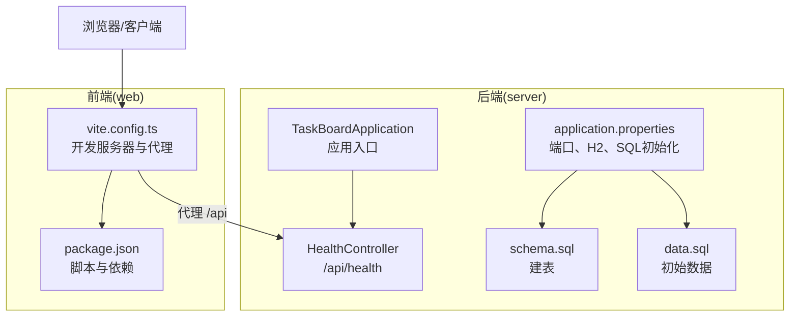
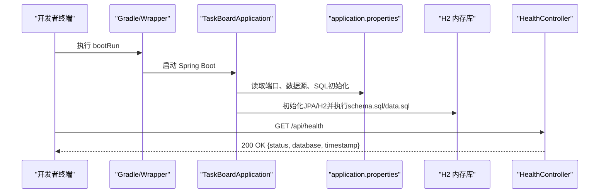
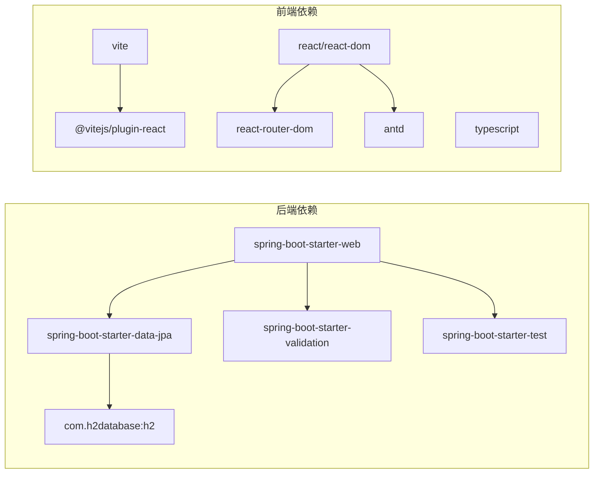

# 快速开始

<cite>
**本文引用的文件**   
- [README.md](file://README.md)
- [server/build.gradle.kts](file://server/build.gradle.kts)
- [server/gradle/wrapper/gradle-wrapper.properties](file://server/gradle/wrapper/gradle-wrapper.properties)
- [server/src/main/resources/application.properties](file://server/src/main/resources/application.properties)
- [server/src/main/java/com/taskboard/TaskBoardApplication.java](file://server/src/main/java/com/taskboard/TaskBoardApplication.java)
- [server/src/main/java/com/taskboard/controller/HealthController.java](file://server/src/main/java/com/taskboard/controller/HealthController.java)
- [web/package.json](file://web/package.json)
- [web/vite.config.ts](file://web/vite.config.ts)
</cite>

## 目录
1. [简介](#简介)
2. [项目结构](#项目结构)
3. [环境要求与安装](#环境要求与安装)
4. [后端启动指南](#后端启动指南)
5. [前端开发环境设置](#前端开发环境设置)
6. [健康检查验证](#健康检查验证)
7. [架构总览](#架构总览)
8. [依赖关系分析](#依赖关系分析)
9. [性能与运行特性](#性能与运行特性)
10. [常见问题与故障排除](#常见问题与故障排除)
11. [结论](#结论)

## 简介
本指南面向新手开发者，帮助你在最短时间内完成 TaskBoard 应用的本地环境搭建并成功运行前后端服务。项目采用 Spring Boot 4 + React 19 的单体仓库（Monorepo）结构，后端提供 REST API，前端通过 Vite 开发服务器进行开发与预览，并通过代理将 API 请求转发到后端。

## 项目结构
- server：Spring Boot 后端，使用 Gradle 构建，内置 Tomcat，默认端口 8080，API 前缀为 /api
- web：React 前端，使用 Vite 和 TypeScript，默认开发端口 5173，自动代理 /api 到后端

图表来源
- [server/src/main/java/com/taskboard/TaskBoardApplication.java:6-10](file://server/src/main/java/com/taskboard/TaskBoardApplication.java#L6-L10)
- [server/src/main/java/com/taskboard/controller/HealthController.java:14-26](file://server/src/main/java/com/taskboard/controller/HealthController.java#L14-L26)
- [server/src/main/resources/application.properties:1-17](file://server/src/main/resources/application.properties#L1-L17)
- [server/src/main/resources/schema.sql:1-5](file://server/src/main/resources/schema.sql#L1-L5)
- [server/src/main/resources/data.sql:1-2](file://server/src/main/resources/data.sql#L1-L2)
- [web/vite.config.ts:4-13](file://web/vite.config.ts#L4-L13)
- [web/package.json:6-23](file://web/package.json#L6-L23)

章节来源
- [README.md:10-16](file://README.md#L10-L16)

## 环境要求与安装
- Java 25+
- Node.js 18+
- Gradle 9.1+（本地安装或 Wrapper）

说明
- 后端强制使用 Java 25（由构建脚本指定工具链版本）
- 前端基于 Vite 6 与 React 19，Node.js 18+ 可稳定运行
- Gradle 可使用本地安装路径或项目自带的 Wrapper（会自动下载 Gradle 9.1.0）

章节来源
- [README.md:20-24](file://README.md#L20-L24)
- [server/build.gradle.kts:10-14](file://server/build.gradle.kts#L10-L14)
- [server/gradle/wrapper/gradle-wrapper.properties:1-3](file://server/gradle/wrapper/gradle-wrapper.properties#L1-L3)
- [web/package.json:17-23](file://web/package.json#L17-L23)

## 后端启动指南
目标
- 在本地启动 Spring Boot 后端服务，监听 http://localhost:8080，API 前缀 /api

步骤
- 进入后端目录
  - cd server
- 方式一：使用本地安装的 Gradle（示例路径请替换为你本地的实际路径）
  - & "D:\gradle-9.8.0\bin\gradle.bat" bootRun
  - & "D:\gradle-9.8.0\bin\gradle.bat" build
- 方式二：使用 Gradle Wrapper（需要网络以下载 Gradle 9.1.0）
  - ./gradlew bootRun
  - ./gradlew build

注意事项
- 首次使用 Wrapper 可能需要联网下载 Gradle 发行包
- 后端默认端口 8080，可通过 application.properties 修改
- 数据库为内存型 H2，重启后数据清空；DDL 关闭，由 SQL 脚本管理结构与数据

章节来源
- [README.md:25-37](file://README.md#L25-L37)
- [server/src/main/resources/application.properties:1-15](file://server/src/main/resources/application.properties#L1-L15)
- [server/gradle/wrapper/gradle-wrapper.properties:1-3](file://server/gradle/wrapper/gradle-wrapper.properties#L1-L3)

## 前端开发环境设置
目标
- 安装依赖、启动开发服务器、执行生产构建

步骤
- 进入前端目录
  - cd web
- 安装依赖
  - npm install
- 启动开发服务器
  - npm run dev
- 生产构建
  - npm run build

说明
- 开发服务器默认端口 5173
- 已配置代理：所有 /api 请求将被转发到 http://localhost:8080
- 构建命令会先编译 TypeScript，再打包静态资源

章节来源
- [README.md:39-48](file://README.md#L39-L48)
- [web/package.json:6-23](file://web/package.json#L6-L23)
- [web/vite.config.ts:4-13](file://web/vite.config.ts#L4-L13)

## 健康检查验证
目标
- 验证后端是否正常运行

步骤
- 直接访问后端接口
  - curl http://localhost:8080/api/health

预期结果
- 返回包含状态信息的 JSON，其中 status 为 UP，database 为 connected，并附带时间戳

补充
- 也可通过前端页面发起 /api/health 请求（由 Vite 代理转发至后端）

章节来源
- [README.md:50-54](file://README.md#L50-L54)
- [server/src/main/java/com/taskboard/controller/HealthController.java:14-26](file://server/src/main/java/com/taskboard/controller/HealthController.java#L14-L26)

## 架构总览
后端启动流程（简化）
- 应用入口加载配置
- 初始化 Web 容器与 JPA/H2
- 根据 SQL 脚本创建表并插入初始数据
- 暴露 /api/health 接口供外部调用

图表来源
- [server/src/main/java/com/taskboard/TaskBoardApplication.java:6-10](file://server/src/main/java/com/taskboard/TaskBoardApplication.java#L6-L10)
- [server/src/main/resources/application.properties:1-17](file://server/src/main/resources/application.properties#L1-L17)
- [server/src/main/java/com/taskboard/controller/HealthController.java:14-26](file://server/src/main/java/com/taskboard/controller/HealthController.java#L14-L26)

## 依赖关系分析
- 后端依赖
  - Spring Boot Web（含 Tomcat）
  - Spring Data JPA + H2 运行时
  - Validation
  - Test Starter（JUnit Platform）
- 前端依赖
  - React 19、react-router-dom、antd
  - Vite 6、TypeScript 5、@vitejs/plugin-react

图表来源
- [server/build.gradle.kts:20-41](file://server/build.gradle.kts#L20-L41)
- [web/package.json:11-23](file://web/package.json#L11-L23)

章节来源
- [server/build.gradle.kts:20-41](file://server/build.gradle.kts#L20-L41)
- [web/package.json:11-23](file://web/package.json#L11-L23)

## 性能与运行特性
- 数据库为内存型 H2，启动快、适合开发调试；重启后数据清空
- 使用 schema.sql 与 data.sql 管理表结构与初始数据，避免 DDL 自动变更带来的不确定性
- 后端默认开启 SQL 日志输出，便于开发阶段排查问题
- 前端通过 Vite 提供快速的模块热更新体验

章节来源
- [server/src/main/resources/application.properties:10-17](file://server/src/main/resources/application.properties#L10-L17)
- [server/src/main/resources/schema.sql:1-5](file://server/src/main/resources/schema.sql#L1-L5)
- [server/src/main/resources/data.sql:1-2](file://server/src/main/resources/data.sql#L1-L2)

## 常见问题与故障排除
- 无法启动后端（Java 版本不匹配）
  - 现象：构建或运行时报错提示 Java 版本不满足要求
  - 原因：构建脚本强制使用 Java 25 工具链
  - 解决：安装并切换到 Java 25+，确保 JAVA_HOME 指向正确版本
  - 参考
    - [server/build.gradle.kts:10-14](file://server/build.gradle.kts#L10-L14)

- 端口冲突（8080 被占用）
  - 现象：后端启动失败，报端口占用
  - 解决：修改 application.properties 中的 server.port，或释放占用进程
  - 参考
    - [server/src/main/resources/application.properties:1-2](file://server/src/main/resources/application.properties#L1-L2)

- 前端无法访问后端接口
  - 现象：浏览器控制台出现跨域或连接拒绝错误
  - 原因：后端未启动或代理目标地址不正确
  - 解决：确认后端已在 8080 启动；检查 vite.config.ts 中代理 target 是否为 http://localhost:8080
  - 参考
    - [web/vite.config.ts:6-12](file://web/vite.config.ts#L6-L12)

- 首次使用 Wrapper 下载缓慢或失败
  - 现象：./gradlew 长时间卡住或报错
  - 原因：需要从网络下载 Gradle 9.1.0
  - 解决：确保网络可达；或使用本地安装的 Gradle 替代
  - 参考
    - [server/gradle/wrapper/gradle-wrapper.properties:1-3](file://server/gradle/wrapper/gradle-wrapper.properties#L1-L3)

- 数据库为空或表不存在
  - 现象：启动后访问接口异常或查询失败
  - 原因：SQL 初始化未执行或脚本路径配置错误
  - 解决：确认 spring.sql.init.mode=always 且 schema/data 路径正确；检查 H2 控制台是否正常
  - 参考
    - [server/src/main/resources/application.properties:13-17](file://server/src/main/resources/application.properties#L13-L17)

- 前端构建失败（TypeScript 类型错误）
  - 现象：npm run build 报错
  - 解决：修复 TS 类型错误后重试；必要时清理 tsconfig.tsbuildinfo 后重新构建
  - 参考
    - [web/package.json:6-9](file://web/package.json#L6-L9)

## 结论
按照本指南完成环境准备与前后端启动后，你即可在本地运行 TaskBoard 应用。建议优先使用后端本地 Gradle 启动以提升稳定性，前端通过 Vite 代理访问后端接口。若遇到环境问题，可参考“常见问题与故障排除”章节逐项排查。