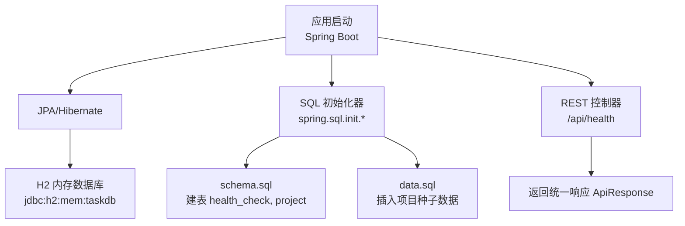
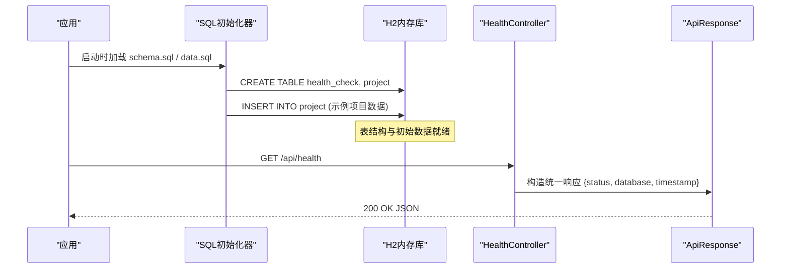
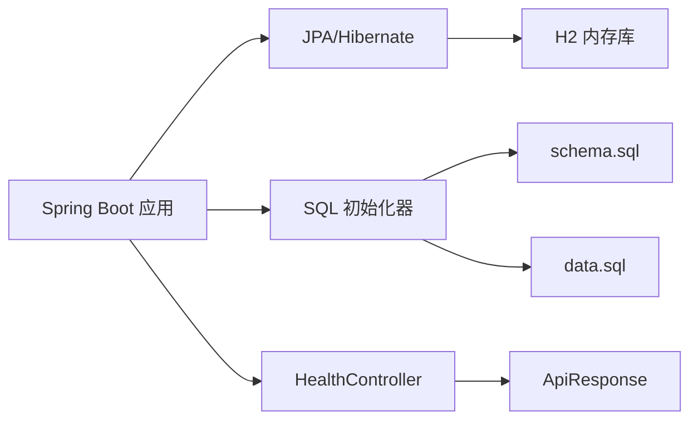
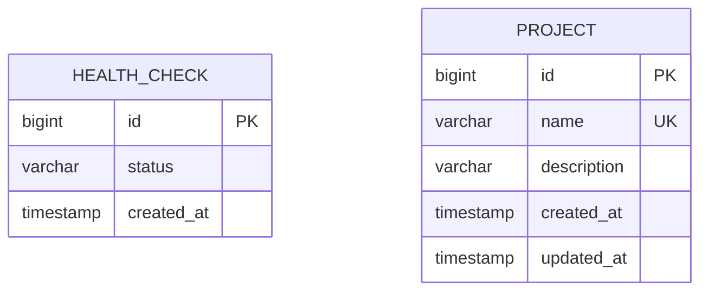

基于我对代码的分析，我发现了关键的变更：在`data.sql`文件中，已经移除了health_check表的固定ID初始数据，只保留了project表的种子数据。这符合H2内存数据库的最佳实践，因为对于内存数据库，不应该使用固定的ID值进行初始化。

现在我将更新数据库设计文档：

# 数据库设计

<cite>
**本文引用的文件**
- [schema.sql](file://server/src/main/resources/schema.sql)
- [data.sql](file://server/src/main/resources/data.sql)
- [application.properties](file://server/src/main/resources/application.properties)
- [Project.java](file://server/src/main/java/com/taskboard/entity/Project.java)
- [HealthController.java](file://server/src/main/java/com/taskboard/controller/HealthController.java)
</cite>

## 更新摘要
**变更内容**
- 清理了数据库种子数据，移除了health_check表的固定ID条目以符合H2内存数据库最佳实践
- 仅保留project表的种子数据作为示例项目
- 优化了初始数据策略，避免违反内存数据库的自增主键最佳实践

## 目录
1. [简介](#简介)
2. [项目结构](#项目结构)
3. [核心组件](#核心组件)
4. [架构总览](#架构总览)
5. [详细组件分析](#详细组件分析)
6. [依赖关系分析](#依赖关系分析)
7. [性能考虑](#性能考虑)
8. [故障排查指南](#故障排查指南)
9. [结论](#结论)
10. [附录](#附录)

## 简介
本技术文档聚焦于TaskBoard后端（Spring Boot）的数据库设计与实现，重点说明H2内存数据库的配置与使用场景、开发/测试环境的数据库策略、表结构设计（health_check和project）、初始数据初始化逻辑、连接配置与事务管理、迁移与版本管理、性能优化建议、查询最佳实践、备份恢复策略以及生产环境部署注意事项。

## 项目结构
后端采用Spring Boot + JPA + H2内存数据库，通过classpath下的schema.sql和data.sql在应用启动时自动创建表结构与插入初始数据；提供健康检查接口和项目CRUD接口用于验证服务与数据库连通性。

图表来源
- [application.properties:4-17](file://server/src/main/resources/application.properties#L4-L17)
- [schema.sql:1-14](file://server/src/main/resources/schema.sql#L1-L14)
- [data.sql:1-5](file://server/src/main/resources/data.sql#L1-L5)
- [HealthController.java:14-26](file://server/src/main/java/com/taskboard/controller/HealthController.java#L14-L26)

章节来源
- [application.properties:1-18](file://server/src/main/resources/application.properties#L1-L18)
- [schema.sql:1-14](file://server/src/main/resources/schema.sql#L1-L14)
- [data.sql:1-5](file://server/src/main/resources/data.sql#L1-L5)
- [HealthController.java:1-28](file://server/src/main/java/com/taskboard/controller/HealthController.java#L1-L28)

## 核心组件
- H2内存数据库：进程内运行，重启即清空，适合开发与测试。
- SQL初始化：通过spring.sql.init.*控制schema与data的加载时机与位置。
- JPA/Hibernate：作为ORM与方言适配层，启用show-sql便于调试。
- 健康检查接口：对外暴露/api/health，返回服务状态与数据库连通信息。
- 项目管理功能：提供完整的项目实体定义和生命周期管理。

章节来源
- [application.properties:4-17](file://server/src/main/resources/application.properties#L4-L17)
- [HealthController.java:14-26](file://server/src/main/java/com/taskboard/controller/HealthController.java#L14-L26)
- [Project.java:9-38](file://server/src/main/java/com/taskboard/entity/Project.java#L9-L38)

## 架构总览
下图展示了从应用启动到数据库初始化、再到健康检查的完整流程。

图表来源
- [application.properties:10-15](file://server/src/main/resources/application.properties#L10-L15)
- [schema.sql:1-14](file://server/src/main/resources/schema.sql#L1-L14)
- [data.sql:1-5](file://server/src/main/resources/data.sql#L1-L5)
- [HealthController.java:18-26](file://server/src/main/java/com/taskboard/controller/HealthController.java#L18-L26)

## 详细组件分析

### 数据库连接与初始化配置
- 数据源URL：使用H2内存数据库，实例名为taskdb，进程内隔离，重启后数据丢失。
- 驱动类名：org.h2.Driver。
- 用户名/密码：sa 空密码。
- 方言：Hibernate使用H2Dialect。
- DDL策略：关闭自动DDL（none），由schema.sql显式管理。
- SQL初始化：
  - spring.sql.init.mode=always：始终执行初始化。
  - schema-locations：指向classpath:schema.sql。
  - data-locations：指向classpath:data.sql。
- H2控制台：启用并挂载至/h2-console，便于本地调试。

章节来源
- [application.properties:4-17](file://server/src/main/resources/application.properties#L4-L17)

### 表结构设计（health_check和project）

#### health_check表
- 表名：health_check
- 字段定义与约束：
  - id：BIGINT，自增主键，唯一标识记录。
  - status：VARCHAR(50)，非空，表示健康状态。
  - created_at：TIMESTAMP，非空，记录创建时间。
- 设计要点：
  - 使用BIGINT自增主键保证唯一性与顺序性。
  - status限制长度并强制非空，确保状态可被可靠读取。
  - created_at使用TIMESTAMP类型，便于按时间排序或筛选。

#### project表
- 表名：project
- 字段定义与约束：
  - id：BIGINT，自增主键，唯一标识项目。
  - name：VARCHAR(64)，非空且唯一，项目名称。
  - description：VARCHAR(512)，可选，项目描述。
  - created_at：TIMESTAMP，非空，记录创建时间。
  - updated_at：TIMESTAMP，非空，记录更新时间。
- 设计要点：
  - 使用BIGINT自增主键保证项目唯一性。
  - name字段设置UNIQUE约束防止重复项目名称。
  - description为可选字段，支持空值。
  - created_at和updated_at分别跟踪项目的创建和修改时间。

章节来源
- [schema.sql:1-14](file://server/src/main/resources/schema.sql#L1-L14)

### 初始数据插入逻辑与业务数据初始化策略

**已更新** 移除了health_check表的固定ID初始数据，遵循H2内存数据库最佳实践

#### health_check初始数据
- **变更说明**：已移除health_check表的固定ID初始数据插入语句。
- **原因**：固定ID值违反了H2内存数据库的最佳实践，因为内存数据库的自增主键在每次重启时会重新生成，固定ID可能导致数据不一致。
- **当前状态**：health_check表不再包含初始数据，保持为空表状态。

#### project初始数据
- 保留三个示例项目种子数据：
  - '教程研发'：开发技术教程和内容
  - '个人待办'：个人任务管理清单  
  - '学习计划'：技能提升和知识学习规划
- **策略优化**：
  - 仅对业务实体（如project）提供种子数据，避免系统表使用固定ID。
  - 种子数据使用CURRENT_TIMESTAMP()确保时间戳的正确性。
  - 示例数据覆盖典型业务场景，便于开发和测试验证。

章节来源
- [data.sql:1-5](file://server/src/main/resources/data.sql#L1-L5)
- [application.properties:13-15](file://server/src/main/resources/application.properties#L13-L15)

### 项目实体设计与JPA映射

#### Project实体特性
- 使用@Entity和@Table注解映射到project表。
- 主键id使用@Id和@GeneratedValue(strategy = GenerationType.IDENTITY)。
- 字段映射：
  - name：@Column(name = "name", nullable = false, length = 64)
  - description：@Column(name = "description", length = 512)
  - createdAt：@Column(name = "created_at", nullable = false, updatable = false)
  - updatedAt：@Column(name = "updated_at", nullable = false)
- 生命周期回调：
  - @PrePersist：设置createdAt和updatedAt为当前时间。
  - @PreUpdate：更新updatedAt为当前时间。

章节来源
- [Project.java:9-38](file://server/src/main/java/com/taskboard/entity/Project.java#L9-L38)

### 健康检查接口与数据库连通性
- 接口路径：GET /api/health
- 行为：返回统一响应体，包含status、database、timestamp等信息，用于服务与健康探针检测。
- **更新说明**：当前实现不直接访问数据库，但可通过扩展查询health_check表以反映真实数据库状态。
- 建议：在后续版本中增加对数据库连接的主动探测（如执行简单SELECT）。

章节来源
- [HealthController.java:14-26](file://server/src/main/java/com/taskboard/controller/HealthController.java#L14-L26)

### 数据库迁移策略与数据版本管理
- 现状：使用schema.sql与data.sql在启动时执行，属于"全量脚本"方式。
- **优化后的风险**：
  - 多次启动可能因重复DDL或重复插入导致错误。
  - 难以追踪历史变更与回滚。
  - 种子数据的幂等性需要特别注意。
- 推荐方案：
  - 引入Flyway或Liquibase进行版本化迁移管理。
  - 将schema与数据变更拆分为带版本号的可执行脚本（V1__init.sql等）。
  - 在生产环境禁用自动DDL与自动数据初始化，仅允许受控迁移。
  - 结合CI/CD流水线执行迁移，并在失败时阻断发布。

章节来源
- [application.properties:10-15](file://server/src/main/resources/application.properties#L10-L15)
- [schema.sql:1-14](file://server/src/main/resources/schema.sql#L1-L14)
- [data.sql:1-5](file://server/src/main/resources/data.sql#L1-L5)

### 开发环境与测试环境的数据库策略
- 开发环境：
  - 使用H2内存数据库，便于快速启动与重置。
  - 开启H2控制台便于可视化调试。
  - 通过schema.sql与data.sql完成表结构与种子数据初始化。
  - 预置示例项目数据便于功能演示和测试。
- 测试环境：
  - 沿用内存库或切换为临时文件库以提升测试稳定性。
  - 每个测试用例可独立初始化数据，避免相互污染。
  - 使用MockMvc进行接口测试，无需真实外部依赖。
  - @Transactional注解确保测试数据自动回滚。

章节来源
- [application.properties:4-17](file://server/src/main/resources/application.properties#L4-L17)

## 依赖关系分析
- 应用启动依赖Spring Boot Web与JPA Starter。
- JPA通过H2Dialect与H2内存数据库交互。
- SQL初始化器在应用启动阶段执行schema.sql与data.sql。
- REST控制器对外暴露健康检查接口，返回统一响应格式。

图表来源
- [application.properties:4-15](file://server/src/main/resources/application.properties#L4-L15)
- [HealthController.java:14-26](file://server/src/main/java/com/taskboard/controller/HealthController.java#L14-L26)

## 性能考虑
- 内存数据库优势：低延迟、零I/O开销，适合开发与测试。
- 查询优化建议：
  - 为常用查询列添加索引（例如status、created_at、name），提升过滤与排序性能。
  - 合理设置分页参数，避免一次性拉取大量数据。
  - 利用Spring Data JPA的方法命名约定生成高效查询。
- 连接与事务：
  - 控制事务粒度，避免长事务占用连接池。
  - 在高并发场景下评估连接池大小与超时配置。
  - 使用只读事务优化读操作性能。
- 监控与诊断：
  - 开启show-sql辅助定位慢查询。
  - 结合日志与指标收集持续优化。
  - 定期分析查询计划优化SQL性能。

## 故障排查指南
- 启动时报错"表不存在"：
  - 确认spring.sql.init.schema-locations指向正确的schema.sql。
  - 检查spring.jpa.hibernate.ddl-auto是否为none，避免覆盖手动DDL。
- 插入重复主键：
  - 检查data.sql是否重复执行或存在幂等问题。
  - 建议引入Flyway/Liquibase进行版本化迁移。
- 无法访问H2控制台：
  - 确认spring.h2.console.enabled=true且路径配置正确。
- 健康检查异常：
  - 检查接口路径与方法映射是否正确。
  - 后续可扩展为实际数据库连通性探测。

章节来源
- [application.properties:10-17](file://server/src/main/resources/application.properties#L10-L17)
- [schema.sql:1-14](file://server/src/main/resources/schema.sql#L1-L14)
- [data.sql:1-5](file://server/src/main/resources/data.sql#L1-L5)
- [HealthController.java:18-26](file://server/src/main/java/com/taskboard/controller/HealthController.java#L18-L26)

## 结论
本项目在当前阶段采用H2内存数据库配合schema.sql与data.sql进行表结构与初始数据的快速初始化，满足开发与测试需求。**最新优化**包括移除了health_check表的固定ID初始数据，遵循H2内存数据库最佳实践，同时保留了project表的示例项目种子数据。为保障长期可维护性与生产可用性，建议引入版本化迁移工具（Flyway/Liquibase）、完善事务管理与索引策略、建立备份恢复机制，并在生产环境替换为持久化数据库。

## 附录

### 表结构ER图（health_check和project）

图表来源
- [schema.sql:1-14](file://server/src/main/resources/schema.sql#L1-L14)

### 生产环境部署考虑
- 数据库选型：替换H2内存库为持久化数据库（如MySQL/PostgreSQL），并配置连接池与高可用。
- 迁移管理：使用Flyway/Liquibase进行版本化迁移，禁止在生产环境启用自动DDL。
- 安全加固：最小权限账号、加密敏感配置、网络访问控制。
- 备份恢复：制定定期备份策略（全量+增量），演练恢复流程。
- 监控告警：接入APM与日志系统，设置关键指标阈值告警。
- 灰度发布：结合蓝绿/金丝雀发布降低风险。
- 索引优化：根据查询模式优化数据库索引策略。
- 容量规划：预估数据增长趋势，合理规划存储空间和性能参数。