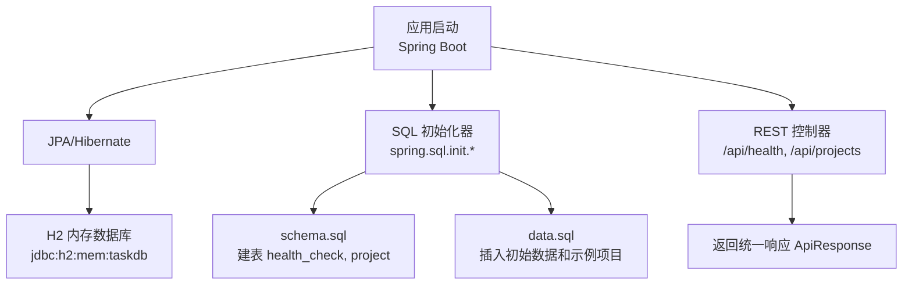
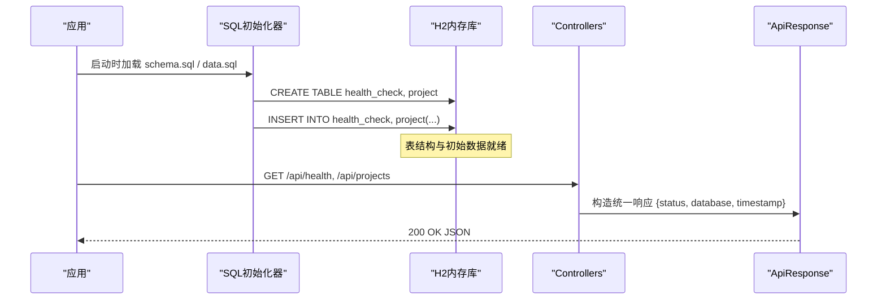
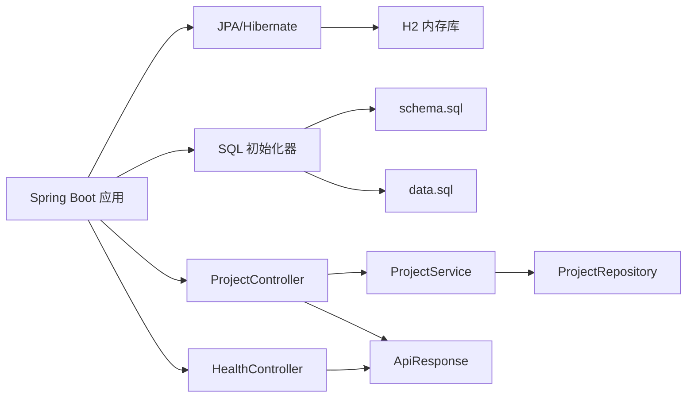
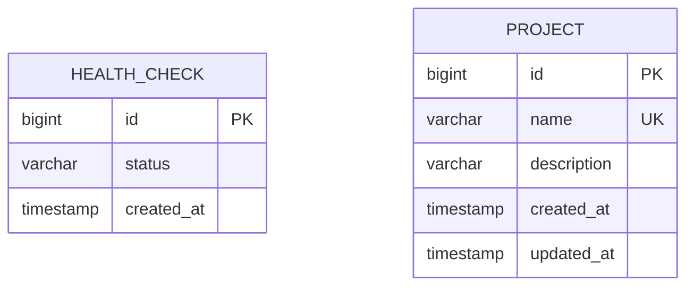
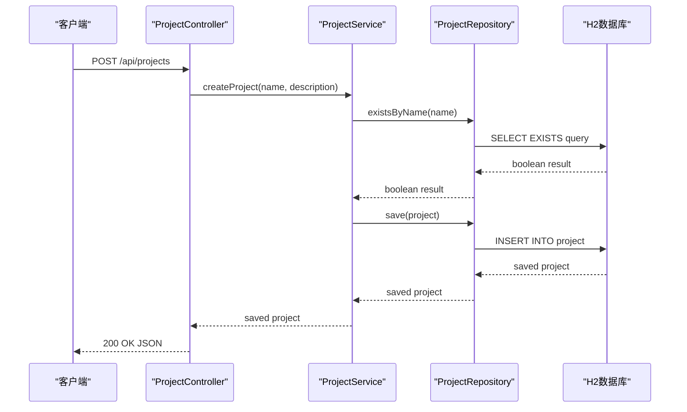

# 数据库设计

<cite>
**本文引用的文件**
- [schema.sql](file://server/src/main/resources/schema.sql)
- [data.sql](file://server/src/main/resources/data.sql)
- [application.properties](file://server/src/main/resources/application.properties)
- [Project.java](file://server/src/main/java/com/taskboard/entity/Project.java)
- [ProjectRepository.java](file://server/src/main/java/com/taskboard/repository/ProjectRepository.java)
- [ProjectController.java](file://server/src/main/java/com/taskboard/controller/ProjectController.java)
- [ProjectService.java](file://server/src/main/java/com/taskboard/service/ProjectService.java)
- [HealthController.java](file://server/src/main/java/com/taskboard/controller/HealthController.java)
- [HealthControllerTest.java](file://server/src/test/java/com/taskboard/controller/HealthControllerTest.java)
- [ProjectControllerTest.java](file://server/src/test/java/com/taskboard/controller/ProjectControllerTest.java)
- [build.gradle.kts](file://server/build.gradle.kts)
- [README.md](file://README.md)
</cite>

## 更新摘要
**变更内容**
- 新增project表结构定义和索引策略
- 添加项目实体的JPA映射和生命周期管理
- 增强初始数据包含示例项目种子数据
- 完善事务管理机制和业务验证逻辑
- 扩展数据库关系设计和外键约束规划

## 目录
1. [简介](#简介)
2. [项目结构](#项目结构)
3. [核心组件](#核心组件)
4. [架构总览](#架构总览)
5. [详细组件分析](#详细组件分析)
6. [依赖关系分析](#依赖关系分析)
7. [性能考虑](#性能考虑)
8. [故障排查指南](#故障排查指南)
9. [结论](#结论)
10. [附录](#附录)

## 简介
本技术文档聚焦于TaskBoard后端（Spring Boot）的数据库设计与实现，重点说明H2内存数据库的配置与使用场景、开发/测试环境的数据库策略、表结构设计（health_check和project）、初始数据初始化逻辑、连接配置与事务管理、迁移与版本管理、性能优化建议、查询最佳实践、备份恢复策略以及生产环境部署注意事项。

## 项目结构
后端采用Spring Boot 4 + JPA + H2内存数据库，通过classpath下的schema.sql和data.sql在应用启动时自动创建表结构与插入初始数据；提供健康检查接口和项目CRUD接口用于验证服务与数据库连通性；测试基于MockMvc进行HTTP层断言。

图表来源
- [application.properties:4-17](file://server/src/main/resources/application.properties#L4-L17)
- [schema.sql:1-14](file://server/src/main/resources/schema.sql#L1-L14)
- [data.sql:1-5](file://server/src/main/resources/data.sql#L1-L5)
- [HealthController.java:14-26](file://server/src/main/java/com/taskboard/controller/HealthController.java#L14-L26)
- [ProjectController.java:14-78](file://server/src/main/java/com/taskboard/controller/ProjectController.java#L14-L78)

章节来源
- [application.properties:1-18](file://server/src/main/resources/application.properties#L1-L18)
- [schema.sql:1-14](file://server/src/main/resources/schema.sql#L1-L14)
- [data.sql:1-5](file://server/src/main/resources/data.sql#L1-L5)
- [HealthController.java:1-28](file://server/src/main/java/com/taskboard/controller/HealthController.java#L1-L28)
- [ProjectController.java:1-78](file://server/src/main/java/com/taskboard/controller/ProjectController.java#L1-L78)
- [README.md:56-63](file://README.md#L56-L63)

## 核心组件
- H2内存数据库：进程内运行，重启即清空，适合开发与测试。
- SQL初始化：通过spring.sql.init.*控制schema与data的加载时机与位置。
- JPA/Hibernate：作为ORM与方言适配层，启用show-sql便于调试。
- 健康检查接口：对外暴露/api/health，返回服务状态与数据库连通信息。
- 项目管理接口：提供完整的CRUD操作，支持项目创建、查询、更新、删除。
- 测试用例：基于MockMvc对健康接口和项目接口进行端到端断言。

章节来源
- [application.properties:4-17](file://server/src/main/resources/application.properties#L4-L17)
- [HealthController.java:14-26](file://server/src/main/java/com/taskboard/controller/HealthController.java#L14-L26)
- [ProjectController.java:24-78](file://server/src/main/java/com/taskboard/controller/ProjectController.java#L24-L78)
- [HealthControllerTest.java:16-36](file://server/src/test/java/com/taskboard/controller/HealthControllerTest.java#L16-L36)
- [ProjectControllerTest.java:43-115](file://server/src/test/java/com/taskboard/controller/ProjectControllerTest.java#L43-L115)

## 架构总览
下图展示了从应用启动到数据库初始化、再到健康检查和项目管理的完整流程。

图表来源
- [application.properties:10-15](file://server/src/main/resources/application.properties#L10-L15)
- [schema.sql:1-14](file://server/src/main/resources/schema.sql#L1-L14)
- [data.sql:1-5](file://server/src/main/resources/data.sql#L1-L5)
- [HealthController.java:18-26](file://server/src/main/java/com/taskboard/controller/HealthController.java#L18-L26)
- [ProjectController.java:27-78](file://server/src/main/java/com/taskboard/controller/ProjectController.java#L27-L78)

## 详细组件分析

### 数据库连接与初始化配置
- 数据源URL：使用H2内存数据库，实例名为taskdb，进程内隔离，重启后数据丢失。
- 驱动类名：org.h2.Driver。
- 用户名/密码：sa 空密码。
- 方言：Hibernate使用H2Dialect。
- DDL策略：关闭自动DDL（none），由schema.sql显式管理。
- SQL初始化：
  - spring.sql.init.mode=always：始终执行初始化。
  - schema-locations：指向classpath:schema.sql。
  - data-locations：指向classpath:data.sql。
- H2控制台：启用并挂载至/h2-console，便于本地调试。

章节来源
- [application.properties:4-17](file://server/src/main/resources/application.properties#L4-L17)

### 表结构设计（health_check和project）

#### health_check表
- 表名：health_check
- 字段定义与约束：
  - id：BIGINT，自增主键，唯一标识记录。
  - status：VARCHAR(50)，非空，表示健康状态。
  - created_at：TIMESTAMP，非空，记录创建时间。
- 设计要点：
  - 使用BIGINT自增主键保证唯一性与顺序性。
  - status限制长度并强制非空，确保状态可被可靠读取。
  - created_at使用TIMESTAMP类型，便于按时间排序或筛选。

#### project表
- 表名：project
- 字段定义与约束：
  - id：BIGINT，自增主键，唯一标识项目。
  - name：VARCHAR(64)，非空且唯一，项目名称。
  - description：VARCHAR(512)，可选，项目描述。
  - created_at：TIMESTAMP，非空，记录创建时间。
  - updated_at：TIMESTAMP，非空，记录更新时间。
- 设计要点：
  - 使用BIGINT自增主键保证项目唯一性。
  - name字段设置UNIQUE约束防止重复项目名称。
  - description为可选字段，支持空值。
  - created_at和updated_at分别跟踪项目的创建和修改时间。
  - 为后续扩展预留了外键关系空间（如任务表等）。

章节来源
- [schema.sql:1-14](file://server/src/main/resources/schema.sql#L1-L14)

### 初始数据插入逻辑与业务数据初始化策略

#### health_check初始数据
- data.sql在应用启动时向health_check插入一条初始记录：id=1，status='UP'，created_at为当前时间戳。
- 作用：
  - 快速验证表结构正确性与SQL初始化流程。
  - 为健康检查等轻量级功能提供基础数据。

#### project初始数据
- 新增三个示例项目种子数据：
  - '教程研发'：开发技术教程和内容
  - '个人待办'：个人任务管理清单  
  - '学习计划'：技能提升和知识学习规划
- 策略建议：
  - 将幂等性要求高的初始化脚本放在独立文件中，避免重复执行冲突。
  - 对于需要幂等的插入，可使用MERGE/UPSERT或先删后插（注意并发）。
  - 将不同环境的种子数据与环境配置分离，便于多环境管理。
  - 示例数据应覆盖典型业务场景，便于开发和测试验证。

章节来源
- [data.sql:1-5](file://server/src/main/resources/data.sql#L1-L5)
- [application.properties:13-15](file://server/src/main/resources/application.properties#L13-L15)

### 项目实体设计与JPA映射

#### Project实体特性
- 使用@Entity和@Table注解映射到project表。
- 主键id使用@Id和@GeneratedValue(strategy = GenerationType.IDENTITY)。
- 字段映射：
  - name：@Column(name = "name", nullable = false, length = 64)
  - description：@Column(name = "description", length = 512)
  - createdAt：@Column(name = "created_at", nullable = false, updatable = false)
  - updatedAt：@Column(name = "updated_at", nullable = false)
- 生命周期回调：
  - @PrePersist：设置createdAt和updatedAt为当前时间。
  - @PreUpdate：更新updatedAt为当前时间。

章节来源
- [Project.java:9-38](file://server/src/main/java/com/taskboard/entity/Project.java#L9-L38)

### 项目数据访问层设计

#### ProjectRepository接口
- 继承JpaRepository<Project, Long>获得基础CRUD能力。
- 自定义查询方法：
  - findAllByOrderByCreatedAtDesc()：按创建时间倒序获取所有项目。
  - existsByName(String name)：检查项目名称是否存在。
- 利用Spring Data JPA的方法命名约定自动生成查询。

章节来源
- [ProjectRepository.java:12-24](file://server/src/main/java/com/taskboard/repository/ProjectRepository.java#L12-L24)

### 项目业务逻辑与事务管理

#### ProjectService业务逻辑
- 提供完整的项目CRUD业务方法：
  - getAllProjects()：获取所有项目列表。
  - getProjectById(Long id)：根据ID获取项目。
  - createProject(String name, String description)：创建新项目。
  - updateProject(Long id, String name, String description)：更新项目信息。
  - deleteProject(Long id)：删除项目。
- 业务验证：
  - 项目名称不能为空。
  - 项目名称必须唯一。
  - 项目名称长度不超过64字符。
  - 项目描述长度不超过512字符。
- 事务管理：
  - 写操作方法使用@Transactional注解声明事务边界。
  - 确保数据一致性和完整性。

章节来源
- [ProjectService.java:15-116](file://server/src/main/java/com/taskboard/service/ProjectService.java#L15-L116)

### REST API接口设计

#### ProjectController接口
- 提供RESTful风格的API端点：
  - GET /api/projects：获取所有项目。
  - POST /api/projects：创建新项目。
  - GET /api/projects/{id}：根据ID获取项目。
  - PUT /api/projects/{id}：更新项目信息。
  - DELETE /api/projects/{id}：删除项目。
- 统一的响应格式：使用ApiResponse封装成功响应。
- 参数验证：支持可选的描述参数和必填的名称参数。

章节来源
- [ProjectController.java:14-78](file://server/src/main/java/com/taskboard/controller/ProjectController.java#L14-L78)

### 健康检查接口与数据库连通性
- 接口路径：GET /api/health
- 行为：返回统一响应体，包含status、database、timestamp等信息，用于服务与健康探针检测。
- 与数据库的关系：
  - 当前实现未直接访问数据库，但可通过扩展查询health_check表以反映真实数据库状态。
  - 建议在后续版本中增加对数据库连接的主动探测（如执行简单SELECT）。

章节来源
- [HealthController.java:14-26](file://server/src/main/java/com/taskboard/controller/HealthController.java#L14-L26)
- [HealthControllerTest.java:29-36](file://server/src/test/java/com/taskboard/controller/HealthControllerTest.java#L29-L36)

### 事务管理机制
- ProjectService中的写操作方法使用@Transactional注解声明事务边界。
- 事务传播行为：默认REQUIRED，在当前事务中执行或创建新事务。
- 异常处理：业务异常通过ResponseStatusException抛出，触发事务回滚。
- 读操作方法无需事务注解，使用默认只读事务。

章节来源
- [ProjectService.java:45-116](file://server/src/main/java/com/taskboard/service/ProjectService.java#L45-L116)

### 数据库迁移策略与数据版本管理
- 现状：使用schema.sql与data.sql在启动时执行，属于"全量脚本"方式。
- 风险：
  - 多次启动可能因重复DDL或重复插入导致错误。
  - 难以追踪历史变更与回滚。
- 推荐方案：
  - 引入Flyway或Liquibase进行版本化迁移管理。
  - 将schema与数据变更拆分为带版本号的可执行脚本（V1__init.sql等）。
  - 在生产环境禁用自动DDL与自动数据初始化，仅允许受控迁移。
  - 结合CI/CD流水线执行迁移，并在失败时阻断发布。

章节来源
- [application.properties:10-15](file://server/src/main/resources/application.properties#L10-L15)
- [schema.sql:1-14](file://server/src/main/resources/schema.sql#L1-L14)
- [data.sql:1-5](file://server/src/main/resources/data.sql#L1-L5)

### 开发环境与测试环境的数据库策略
- 开发环境：
  - 使用H2内存数据库，便于快速启动与重置。
  - 开启H2控制台便于可视化调试。
  - 通过schema.sql与data.sql完成表结构与种子数据初始化。
  - 预置示例项目数据便于功能演示和测试。
- 测试环境：
  - 沿用内存库或切换为临时文件库（如jdbc:h2:mem;DB_CLOSE_DELAY=-1）以提升测试稳定性。
  - 每个测试用例可独立初始化数据，避免相互污染。
  - 使用MockMvc进行接口测试，无需真实外部依赖。
  - @Transactional注解确保测试数据自动回滚。

章节来源
- [application.properties:4-17](file://server/src/main/resources/application.properties#L4-L17)
- [HealthControllerTest.java:16-36](file://server/src/test/java/com/taskboard/controller/HealthControllerTest.java#L16-L36)
- [ProjectControllerTest.java:26-115](file://server/src/test/java/com/taskboard/controller/ProjectControllerTest.java#L26-L115)
- [README.md:56-63](file://README.md#L56-L63)

### 构建与依赖
- 使用Spring Boot Starter Data JPA与H2运行时依赖。
- Java工具链版本为25，Spring Boot版本为4.0.1。
- 测试框架使用JUnit Platform。

章节来源
- [build.gradle.kts:20-37](file://server/build.gradle.kts#L20-L37)

## 依赖关系分析
- 应用启动依赖Spring Boot Web与JPA Starter。
- JPA通过H2Dialect与H2内存数据库交互。
- SQL初始化器在应用启动阶段执行schema.sql与data.sql。
- REST控制器对外暴露健康检查接口和项目CRUD接口，返回统一响应格式。
- Service层负责业务逻辑和事务管理。
- Repository层提供数据访问抽象。

图表来源
- [build.gradle.kts:22-31](file://server/build.gradle.kts#L22-L31)
- [application.properties:4-15](file://server/src/main/resources/application.properties#L4-L15)
- [HealthController.java:14-26](file://server/src/main/java/com/taskboard/controller/HealthController.java#L14-L26)
- [ProjectController.java:14-78](file://server/src/main/java/com/taskboard/controller/ProjectController.java#L14-L78)
- [ProjectService.java:15-116](file://server/src/main/java/com/taskboard/service/ProjectService.java#L15-L116)
- [ProjectRepository.java:12-24](file://server/src/main/java/com/taskboard/repository/ProjectRepository.java#L12-L24)

章节来源
- [build.gradle.kts:1-42](file://server/build.gradle.kts#L1-L42)
- [application.properties:1-18](file://server/src/main/resources/application.properties#L1-L18)

## 性能考虑
- 内存数据库优势：低延迟、零I/O开销，适合开发与测试。
- 查询优化建议：
  - 为常用查询列添加索引（例如status、created_at、name），提升过滤与排序性能。
  - 避免N+1查询，合理使用JOIN与批量操作。
  - 合理设置分页参数，避免一次性拉取大量数据。
  - 利用Spring Data JPA的方法命名约定生成高效查询。
- 连接与事务：
  - 控制事务粒度，避免长事务占用连接池。
  - 在高并发场景下评估连接池大小与超时配置。
  - 使用只读事务优化读操作性能。
- 监控与诊断：
  - 开启show-sql辅助定位慢查询。
  - 结合日志与指标收集（如QPS、P99延迟）持续优化。
  - 定期分析查询计划优化SQL性能。

[本节为通用性能指导，不直接引用具体文件]

## 故障排查指南
- 启动时报错"表不存在"：
  - 确认spring.sql.init.schema-locations指向正确的schema.sql。
  - 检查spring.jpa.hibernate.ddl-auto是否为none，避免覆盖手动DDL。
- 插入重复主键：
  - 检查data.sql是否重复执行或存在幂等问题。
  - 建议引入Flyway/Liquibase进行版本化迁移。
- 项目名称冲突：
  - 检查name字段的UNIQUE约束是否正确配置。
  - 验证业务层的唯一性检查逻辑。
- 无法访问H2控制台：
  - 确认spring.h2.console.enabled=true且路径配置正确。
- 健康检查异常：
  - 检查接口路径与方法映射是否正确。
  - 后续可扩展为实际数据库连通性探测。
- 项目CRUD操作失败：
  - 检查事务配置和异常处理逻辑。
  - 验证输入参数的业务规则验证。

章节来源
- [application.properties:10-17](file://server/src/main/resources/application.properties#L10-L17)
- [schema.sql:1-14](file://server/src/main/resources/schema.sql#L1-L14)
- [data.sql:1-5](file://server/src/main/resources/data.sql#L1-L5)
- [HealthController.java:18-26](file://server/src/main/java/com/taskboard/controller/HealthController.java#L18-L26)
- [ProjectService.java:45-116](file://server/src/main/java/com/taskboard/service/ProjectService.java#L45-L116)

## 结论
本项目在当前阶段采用H2内存数据库配合schema.sql与data.sql进行表结构与初始数据的快速初始化，满足开发与测试需求。新增了project表结构和完整的项目管理功能，提供了健康检查接口和项目CRUD接口。为保障长期可维护性与生产可用性，建议引入版本化迁移工具（Flyway/Liquibase）、完善事务管理与索引策略、建立备份恢复机制，并在生产环境替换为持久化数据库。

[本节为总结性内容，不直接引用具体文件]

## 附录

### 表结构ER图（health_check和project）

图表来源
- [schema.sql:1-14](file://server/src/main/resources/schema.sql#L1-L14)

### 项目CRUD接口调用序列

图表来源
- [ProjectController.java:36-44](file://server/src/main/java/com/taskboard/controller/ProjectController.java#L36-L44)
- [ProjectService.java:45-63](file://server/src/main/java/com/taskboard/service/ProjectService.java#L45-L63)
- [ProjectRepository.java:12-24](file://server/src/main/java/com/taskboard/repository/ProjectRepository.java#L12-L24)

### 生产环境部署考虑
- 数据库选型：替换H2内存库为持久化数据库（如MySQL/PostgreSQL），并配置连接池与高可用。
- 迁移管理：使用Flyway/Liquibase进行版本化迁移，禁止在生产环境启用自动DDL。
- 安全加固：最小权限账号、加密敏感配置、网络访问控制。
- 备份恢复：制定定期备份策略（全量+增量），演练恢复流程。
- 监控告警：接入APM与日志系统，设置关键指标阈值告警。
- 灰度发布：结合蓝绿/金丝雀发布降低风险。
- 索引优化：根据查询模式优化数据库索引策略。
- 容量规划：预估数据增长趋势，合理规划存储空间和性能参数。

[本节为通用部署指导，不直接引用具体文件]