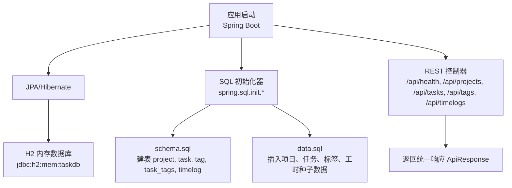
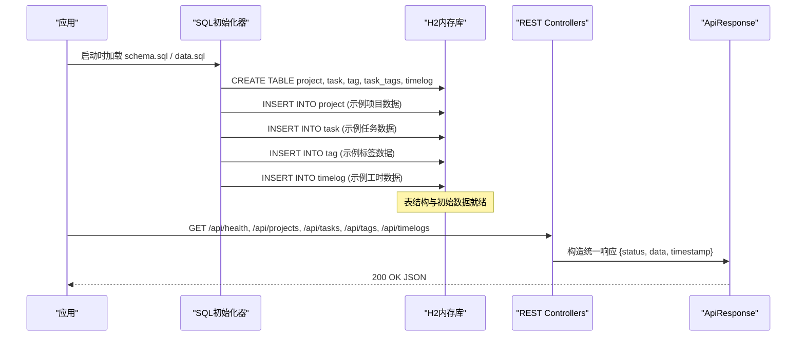
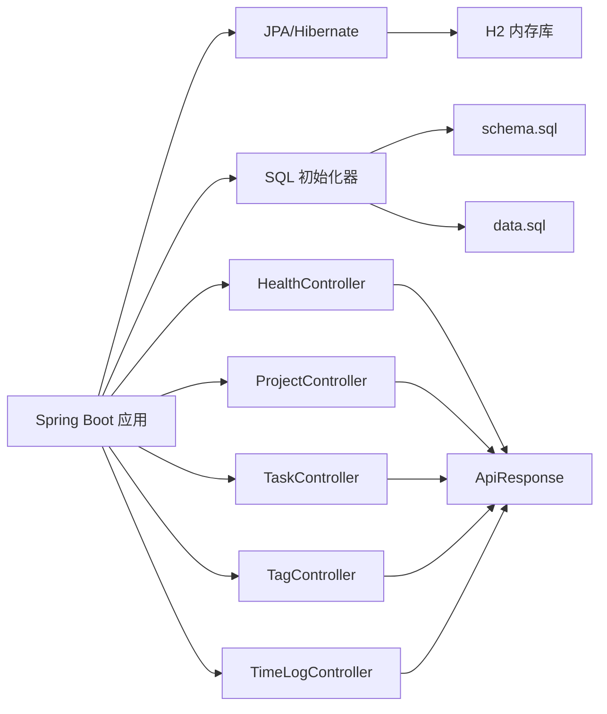
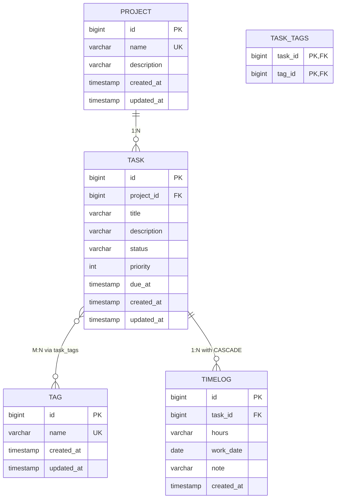
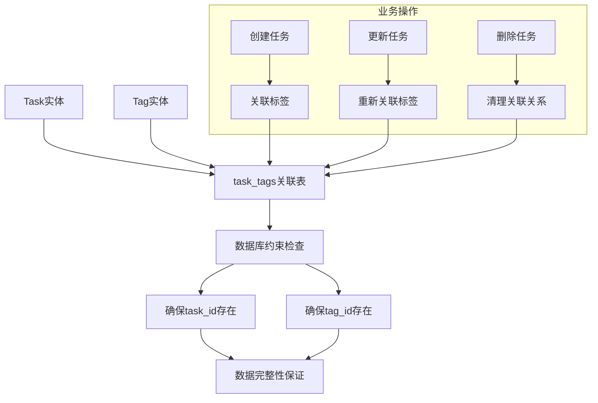
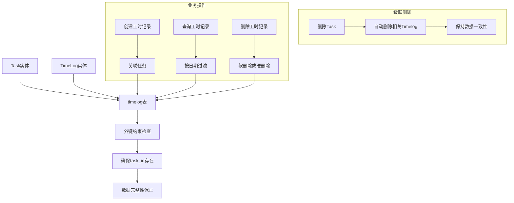

现在我已经收集了足够的信息来更新数据库设计文档。基于分析，主要变更包括：

1. 新增了timelog表用于记录任务工时
2. timelog表与task表建立了外键关系（ON DELETE CASCADE）
3. 更新了data.sql中的种子数据，包含了多个项目和任务的工时记录
4. 完整的TimeLog实体、控制器、服务和仓库实现

让我更新数据库设计文档：

# 数据库设计

<cite>
**本文引用的文件**
- [schema.sql](file://server/src/main/resources/schema.sql)
- [data.sql](file://server/src/main/resources/data.sql)
- [application.properties](file://server/src/main/resources/application.properties)
- [Project.java](file://server/src/main/java/com/taskboard/entity/Project.java)
- [Task.java](file://server/src/main/java/com/taskboard/entity/Task.java)
- [Tag.java](file://server/src/main/java/com/taskboard/entity/Tag.java)
- [TimeLog.java](file://server/src/main/java/com/taskboard/entity/TimeLog.java)
- [HealthController.java](file://server/src/main/java/com/taskboard/controller/HealthController.java)
- [TimeLogController.java](file://server/src/main/java/com/taskboard/controller/TimeLogController.java)
- [TimeLogService.java](file://server/src/main/java/com/taskboard/service/TimeLogService.java)
- [TimeLogRepository.java](file://server/src/main/java/com/taskboard/repository/TimeLogRepository.java)
</cite>

## 更新摘要
**变更内容**
- 新增了timelog表，支持任务工时记录和追踪功能
- 通过timelog表与task表建立了外键关系，使用ON DELETE CASCADE确保数据一致性
- 完善了初始数据，包含多个项目的真实工时记录场景
- 添加了完整的TimeLog实体、REST API、业务逻辑和数据访问层
- 增强了索引策略和查询优化，支持按日期范围和任务ID的高效查询

## 目录
1. [简介](#简介)
2. [项目结构](#项目结构)
3. [核心组件](#核心组件)
4. [架构总览](#架构总览)
5. [详细组件分析](#详细组件分析)
6. [依赖关系分析](#依赖关系分析)
7. [性能考虑](#性能考虑)
8. [故障排查指南](#故障排查指南)
9. [结论](#结论)
10. [附录](#附录)

## 简介
本技术文档聚焦于TaskBoard后端（Spring Boot）的数据库设计与实现，重点说明H2内存数据库的配置与使用场景、开发/测试环境的数据库策略、表结构设计（health_check、project、task、tag、task_tags及timelog）、初始数据初始化逻辑、连接配置与事务管理、迁移与版本管理、性能优化建议、查询最佳实践、备份恢复策略以及生产环境部署注意事项。

## 项目结构
后端采用Spring Boot + JPA + H2内存数据库，通过classpath下的schema.sql和data.sql在应用启动时自动创建表结构与插入初始数据；提供健康检查接口、项目管理、任务管理、标签管理和工时记录CRUD接口用于验证服务与数据库连通性。

图表来源
- [application.properties:4-17](file://server/src/main/resources/application.properties#L4-L17)
- [schema.sql:1-45](file://server/src/main/resources/schema.sql#L1-L45)
- [data.sql:1-48](file://server/src/main/resources/data.sql#L1-L48)
- [HealthController.java:14-26](file://server/src/main/java/com/taskboard/controller/HealthController.java#L14-L26)

章节来源
- [application.properties:1-18](file://server/src/main/resources/application.properties#L1-L18)
- [schema.sql:1-45](file://server/src/main/resources/schema.sql#L1-L45)
- [data.sql:1-48](file://server/src/main/resources/data.sql#L1-L48)
- [HealthController.java:1-28](file://server/src/main/java/com/taskboard/controller/HealthController.java#L1-L28)

## 核心组件
- H2内存数据库：进程内运行，重启即清空，适合开发与测试。
- SQL初始化：通过spring.sql.init.*控制schema与data的加载时机与位置。
- JPA/Hibernate：作为ORM与方言适配层，启用show-sql便于调试。
- 健康检查接口：对外暴露/api/health，返回服务状态与数据库连通信息。
- 项目管理功能：提供完整的项目实体定义和生命周期管理。
- 任务管理功能：支持任务状态机转换、优先级管理和截止日期跟踪。
- 标签管理功能：提供全局标签系统，支持任务的灵活分类和标记。
- **新增** 工时记录功能：支持任务工时追踪、工作日期记录和备注管理。

章节来源
- [application.properties:4-17](file://server/src/main/resources/application.properties#L4-L17)
- [HealthController.java:14-26](file://server/src/main/java/com/taskboard/controller/HealthController.java#L14-L26)
- [Project.java:9-38](file://server/src/main/java/com/taskboard/entity/Project.java#L9-L38)
- [Task.java:11-162](file://server/src/main/java/com/taskboard/entity/Task.java#L11-L162)
- [Tag.java:9-78](file://server/src/main/java/com/taskboard/entity/Tag.java#L9-L78)
- [TimeLog.java:10-95](file://server/src/main/java/com/taskboard/entity/TimeLog.java#L10-L95)

## 架构总览
下图展示了从应用启动到数据库初始化、再到各业务接口的完整流程。

图表来源
- [application.properties:10-15](file://server/src/main/resources/application.properties#L10-L15)
- [schema.sql:1-45](file://server/src/main/resources/schema.sql#L1-L45)
- [data.sql:1-48](file://server/src/main/resources/data.sql#L1-L48)
- [HealthController.java:18-26](file://server/src/main/java/com/taskboard/controller/HealthController.java#L18-L26)

## 详细组件分析

### 数据库连接与初始化配置
- 数据源URL：使用H2内存数据库，实例名为taskdb，进程内隔离，重启后数据丢失。
- 驱动类名：org.h2.Driver。
- 用户名/密码：sa 空密码。
- 方言：Hibernate使用H2Dialect。
- DDL策略：关闭自动DDL（none），由schema.sql显式管理。
- SQL初始化：
  - spring.sql.init.mode=always：始终执行初始化。
  - schema-locations：指向classpath:schema.sql。
  - data-locations：指向classpath:data.sql。
- H2控制台：启用并挂载至/h2-console，便于本地调试。

章节来源
- [application.properties:4-17](file://server/src/main/resources/application.properties#L4-L17)

### 表结构设计（project、task、tag、task_tags、timelog）

#### project表
- 表名：project
- 字段定义与约束：
  - id：BIGINT，自增主键，唯一标识项目。
  - name：VARCHAR(64)，非空且唯一，项目名称。
  - description：VARCHAR(512)，可选，项目描述。
  - created_at：TIMESTAMP，非空，记录创建时间。
  - updated_at：TIMESTAMP，非空，记录更新时间。
- 设计要点：
  - 使用BIGINT自增主键保证项目唯一性。
  - name字段设置UNIQUE约束防止重复项目名称。
  - description为可选字段，支持空值。
  - created_at和updated_at分别跟踪项目的创建和修改时间。

#### task表
- 表名：task
- 字段定义与约束：
  - id：BIGINT，自增主键，唯一标识任务。
  - project_id：BIGINT，非空，外键关联project表，表示任务所属项目。
  - title：VARCHAR(128)，非空，任务标题。
  - description：VARCHAR(1024)，可选，任务详细描述。
  - status：VARCHAR(16)，非空，默认'TODO'，任务状态（TODO、IN_PROGRESS、DONE、CLOSED）。
  - priority：INT，非空，默认0，任务优先级（0-3）。
  - due_at：TIMESTAMP，可选，任务截止日期。
  - created_at：TIMESTAMP，非空，记录创建时间。
  - updated_at：TIMESTAMP，非空，记录更新时间。
- 设计要点：
  - 使用BIGINT自增主键保证任务唯一性。
  - project_id外键约束确保任务必须属于有效项目。
  - status字段限制长度并设置默认值，支持任务状态机流转。
  - priority字段支持0-3的优先级范围。
  - due_at为可选字段，支持灵活的截止日期管理。

#### tag表
- 表名：tag
- 字段定义与约束：
  - id：BIGINT，自增主键，唯一标识标签。
  - name：VARCHAR(64)，非空且唯一，标签名称。
  - created_at：TIMESTAMP，非空，记录创建时间。
  - updated_at：TIMESTAMP，非空，记录更新时间。
- 设计要点：
  - 使用BIGINT自增主键保证标签唯一性。
  - name字段设置UNIQUE约束防止重复标签名称。
  - created_at和updated_at跟踪标签的生命周期。

#### task_tags关联表
- 表名：task_tags
- 字段定义与约束：
  - task_id：BIGINT，非空，外键关联task表。
  - tag_id：BIGINT，非空，外键关联tag表。
  - PRIMARY KEY (task_id, tag_id)：复合主键确保唯一关联。
  - CONSTRAINT fk_task_tags_task：外键约束关联task(id)。
  - CONSTRAINT fk_task_tags_tag：外键约束关联tag(id)。
- 设计要点：
  - 复合主键确保任务与标签的唯一关联关系。
  - 外键约束保证数据完整性和引用完整性。
  - 实现任务与标签的多对多关系。

#### timelog表（新增）
- 表名：timelog
- 字段定义与约束：
  - id：BIGINT，自增主键，唯一标识工时记录。
  - task_id：BIGINT，非空，外键关联task表，表示工时记录对应的任务。
  - hours：VARCHAR(32)，非空，工时数值（以字符串形式存储，支持多种格式）。
  - work_date：DATE，非空，工作日期。
  - note：VARCHAR(256)，可选，工时备注说明。
  - created_at：TIMESTAMP，非空，记录创建时间。
  - CONSTRAINT fk_timelog_task：外键约束关联task(id)，使用ON DELETE CASCADE级联删除。
- 设计要点：
  - 使用BIGINT自增主键保证工时记录唯一性。
  - task_id外键约束确保工时记录必须关联有效任务。
  - ON DELETE CASCADE确保任务删除时自动清理相关工时记录。
  - hours字段使用VARCHAR类型支持灵活的工时格式（如"60"分钟、"1.5"小时等）。
  - work_date使用DATE类型精确记录工作日期。
  - note字段支持详细的工时说明和备注。

章节来源
- [schema.sql:1-45](file://server/src/main/resources/schema.sql#L1-L45)

### 初始数据插入逻辑与业务数据初始化策略

**已更新** 增强了初始数据，包含完整的任务、标签、关联关系和工时记录示例

#### project初始数据
- 保留三个示例项目种子数据：
  - '教程研发'：开发技术教程和内容
  - '个人待办'：个人任务管理清单  
  - '学习计划'：技能提升和知识学习规划

#### task初始数据
- **增强** 十一个示例任务数据，覆盖多个项目和不同状态：
  - 教程研发项目：包含Spring Boot入门教程、React前端架构设计、Gradle构建指南、API契约文档维护、部署流程文档
  - 个人待办项目：包含购买日常用品、预约牙科检查、整理书房
  - 学习计划项目：包含学习Kubernetes基础、阅读领域驱动设计、完成TypeScript高级类型练习
- **策略优化**：
  - 任务数据覆盖不同状态（TODO、IN_PROGRESS、DONE、CLOSED）、优先级和截止日期场景。
  - 使用DATE_ADD和DATE_SUB函数生成相对时间戳。
  - 每个任务都关联到有效的project_id。

#### tag初始数据
- **增强** 五个示例标签数据：
  - '紧急'：高优先级标签
  - '重要'：重要性标签
  - 'Bug'：问题类型标签
  - '功能'：功能开发标签
  - '文档'：文档编写标签
- **策略优化**：
  - 标签数据覆盖常见的分类场景。
  - 使用CURRENT_TIMESTAMP()确保时间戳的正确性。

#### task_tags关联数据
- **新增** 任务与标签的关联关系：
  - 任务1（Spring Boot教程）关联'功能'和'文档'标签
  - 任务2（React架构设计）关联'重要'和'功能'标签
  - 任务3（Gradle指南）关联'文档'标签
  - 任务4（API契约）关联'文档'和'重要'标签
  - 任务9（Kubernetes学习）关联'重要'标签

#### timelog工时记录数据（新增）
- **新增** 十二个工时记录数据，模拟真实的工作场景：
  - 任务1（Spring Boot教程）：包含大纲编写和资料收集的工时记录
  - 任务2（React架构设计）：包含组件结构设计、项目骨架搭建和技术选型的工时记录
  - 任务4（API契约）：包含端点清单整理和DTO定义的工时记录
  - 任务5（部署流程）：包含部署脚本编写的工时记录
  - 任务6（购买日常用品）：包含网购下单的工时记录
  - 任务8（整理书房）：包含整理书架的工时记录
  - 任务9（Kubernetes学习）：包含Pod概念学习和Minikube安装的工时记录
  - 任务11（TypeScript练习）：包含泛型练习和条件类型笔记的工时记录
- **策略优化**：
  - 工时记录覆盖不同的工作日期和业务场景。
  - 使用DATE_SUB函数生成历史工作日期。
  - 每个工时记录都有详细的note说明工作内容。
  - 模拟真实项目中多个任务的工时追踪场景。

章节来源
- [data.sql:1-48](file://server/src/main/resources/data.sql#L1-L48)
- [application.properties:13-15](file://server/src/main/resources/application.properties#L13-L15)

### 实体设计与JPA映射

#### Project实体特性
- 使用@Entity和@Table注解映射到project表。
- 主键id使用@Id和@GeneratedValue(strategy = GenerationType.IDENTITY)。
- 字段映射：
  - name：@Column(name = "name", nullable = false, length = 64)
  - description：@Column(name = "description", length = 512)
  - createdAt：@Column(name = "created_at", nullable = false, updatable = false)
  - updatedAt：@Column(name = "updated_at", nullable = false)
- 生命周期回调：
  - @PrePersist：设置createdAt和updatedAt为当前时间。
  - @PreUpdate：更新updatedAt为当前时间。

#### Task实体特性
- 使用@Entity和@Table注解映射到task表。
- 主键id使用@Id和@GeneratedValue(strategy = GenerationType.IDENTITY)。
- 字段映射：
  - projectId：@Column(name = "project_id", nullable = false)
  - title：@Column(name = "title", nullable = false, length = 128)
  - description：@Column(name = "description", length = 1024)
  - status：@Column(name = "status", nullable = false, length = 16)
  - priority：@Column(name = "priority", nullable = false)
  - dueAt：@Column(name = "due_at")
  - createdAt：@Column(name = "created_at", nullable = false, updatable = false)
  - updatedAt：@Column(name = "updated_at", nullable = false)
- 多对多关系：
  - @ManyToMany(fetch = FetchType.LAZY)
  - @JoinTable(name = "task_tags", joinColumns = @JoinColumn(name = "task_id"), inverseJoinColumns = @JoinColumn(name = "tag_id"))
  - private Set<Tag> tags = new HashSet<>()
- 生命周期回调：
  - @PrePersist：设置createdAt、updatedAt，默认status='TODO'，默认priority=0。
  - @PreUpdate：更新updatedAt为当前时间。

#### Tag实体特性
- 使用@Entity和@Table注解映射到tag表。
- 主键id使用@Id和@GeneratedValue(strategy = GenerationType.IDENTITY)。
- 字段映射：
  - name：@Column(name = "name", nullable = false, length = 64, unique = true)
  - createdAt：@Column(name = "created_at", nullable = false, updatable = false)
  - updatedAt：@Column(name = "updated_at", nullable = false)
- 生命周期回调：
  - @PrePersist：设置createdAt和updatedAt为当前时间。
  - @PreUpdate：更新updatedAt为当前时间。

#### TimeLog实体特性（新增）
- **新增** 工时记录实体，支持任务工时追踪和管理。
- 使用@Entity和@Table注解映射到timelog表。
- 主键id使用@Id和GeneratedValue(strategy = GenerationType.IDENTITY)。
- 字段映射：
  - taskId：@ManyToOne(fetch = FetchType.LAZY, optional = false)
  - @JoinColumn(name = "task_id", nullable = false)
  - hours：@Column(name = "hours", nullable = false, length = 32)
  - workDate：@Column(name = "work_date", nullable = false)
  - note：@Column(name = "note", length = 256)
  - createdAt：@Column(name = "created_at", nullable = false, updatable = false)
- 生命周期回调：
  - @PrePersist：设置createdAt为当前时间。
- 业务方法：
  - getTaskId()：获取关联任务的ID
  - 完整的getter/setter方法支持所有字段操作

章节来源
- [Project.java:9-38](file://server/src/main/java/com/taskboard/entity/Project.java#L9-L38)
- [Task.java:11-162](file://server/src/main/java/com/taskboard/entity/Task.java#L11-L162)
- [Tag.java:9-78](file://server/src/main/java/com/taskboard/entity/Tag.java#L9-L78)
- [TimeLog.java:10-95](file://server/src/main/java/com/taskboard/entity/TimeLog.java#L10-L95)

### 健康检查接口与数据库连通性
- 接口路径：GET /api/health
- 行为：返回统一响应体，包含status、database、timestamp等信息，用于服务与健康探针检测。
- **更新说明**：当前实现不直接访问数据库，但可通过扩展查询health_check表以反映真实数据库状态。
- 建议：在后续版本中增加对数据库连接的主动探测（如执行简单SELECT）。

章节来源
- [HealthController.java:14-26](file://server/src/main/java/com/taskboard/controller/HealthController.java#L14-L26)

### 工时记录API接口（新增）
- **新增** REST API接口，提供工时记录的完整CRUD操作：
  - GET /api/timelogs：分页获取工时记录，支持按taskId过滤
  - POST /api/timelogs：创建新的工时记录
  - DELETE /api/timelogs/{id}：删除指定的工时记录
- **业务逻辑**：
  - 参数验证：校验taskId必填、hours为正整数、workDate格式为YYYY-MM-DD
  - 数据完整性：验证任务存在性，确保工时记录关联有效任务
  - 分页支持：默认每页20条，最大100条限制
  - 排序规则：按workDate降序排列
- **DTO设计**：
  - CreateTimeLogRequest：创建请求DTO，包含taskId、hours、workDate、note字段
  - TimeLogDto：响应DTO，格式化时间为ISO_INSTANT格式

章节来源
- [TimeLogController.java:15-66](file://server/src/main/java/com/taskboard/controller/TimeLogController.java#L15-L66)
- [TimeLogService.java:22-113](file://server/src/main/java/com/taskboard/service/TimeLogService.java#L22-L113)
- [TimeLogRepository.java:14-31](file://server/src/main/java/com/taskboard/repository/TimeLogRepository.java#L14-L31)
- [CreateTimeLogRequest.java:6-12](file://server/src/main/java/com/taskboard/dto/CreateTimeLogRequest.java#L6-L12)
- [TimeLogDto.java:9-27](file://server/src/main/java/com/taskboard/dto/TimeLogDto.java#L9-L27)

### 数据库迁移策略与数据版本管理
- 现状：使用schema.sql与data.sql在启动时执行，属于"全量脚本"方式。
- **增强后的风险**：
  - 多次启动可能因重复DDL或重复插入导致错误。
  - 难以追踪历史变更与回滚。
  - 种子数据的幂等性需要特别注意。
  - 多表关联关系的初始化顺序需要严格控制。
  - **新增** timelog表的级联删除约束需要考虑数据迁移时的依赖关系。
- 推荐方案：
  - 引入Flyway或Liquibase进行版本化迁移管理。
  - 将schema与数据变更拆分为带版本号的可执行脚本（V1__init.sql等）。
  - 在生产环境禁用自动DDL与自动数据初始化，仅允许受控迁移。
  - 结合CI/CD流水线执行迁移，并在失败时阻断发布。
  - 确保多表关联关系的正确初始化顺序。
  - **新增** 针对timelog表的迁移需要考虑ON DELETE CASCADE的影响。

章节来源
- [application.properties:10-15](file://server/src/main/resources/application.properties#L10-L15)
- [schema.sql:1-45](file://server/src/main/resources/schema.sql#L1-L45)
- [data.sql:1-48](file://server/src/main/resources/data.sql#L1-L48)

### 开发环境与测试环境的数据库策略
- 开发环境：
  - 使用H2内存数据库，便于快速启动与重置。
  - 开启H2控制台便于可视化调试。
  - 通过schema.sql与data.sql完成表结构与种子数据初始化。
  - 预置示例项目、任务和标签数据便于功能演示和测试。
  - **新增** 预置工时记录数据便于工时追踪功能的测试和演示。
- 测试环境：
  - 沿用内存库或切换为临时文件库以提升测试稳定性。
  - 每个测试用例可独立初始化数据，避免相互污染。
  - 使用MockMvc进行接口测试，无需真实外部依赖。
  - @Transactional注解确保测试数据自动回滚。
  - 测试多对多关系的CRUD操作和数据完整性。
  - **新增** 测试工时记录与任务的关联关系和级联删除行为。

章节来源
- [application.properties:4-17](file://server/src/main/resources/application.properties#L4-L17)

## 依赖关系分析
- 应用启动依赖Spring Boot Web与JPA Starter。
- JPA通过H2Dialect与H2内存数据库交互。
- SQL初始化器在应用启动阶段执行schema.sql与data.sql。
- REST控制器对外暴露健康检查、项目、任务和标签管理接口，返回统一响应格式。
- **新增依赖**：
  - Task实体依赖Project实体（通过project_id）。
  - Task与Tag通过task_tags表建立多对多关系。
  - TimeLog实体依赖Task实体（通过task_id外键）。
  - TimeLogController依赖TimeLogService进行业务逻辑处理。
  - TimeLogService依赖TimeLogRepository和TaskRepository进行数据访问。

图表来源
- [application.properties:4-15](file://server/src/main/resources/application.properties#L4-L15)
- [HealthController.java:14-26](file://server/src/main/java/com/taskboard/controller/HealthController.java#L14-L26)
- [TimeLogController.java:15-66](file://server/src/main/java/com/taskboard/controller/TimeLogController.java#L15-L66)

## 性能考虑
- 内存数据库优势：低延迟、零I/O开销，适合开发与测试。
- 查询优化建议：
  - 为常用查询列添加索引（例如status、created_at、name、project_id、work_date），提升过滤与排序性能。
  - 合理设置分页参数，避免一次性拉取大量数据。
  - 利用Spring Data JPA的方法命名约定生成高效查询。
  - 对于多对多查询，注意N+1查询问题，使用JOIN FETCH优化。
  - **新增** 针对timelog表的work_date字段添加索引，优化按日期范围的查询性能。
- 连接与事务：
  - 控制事务粒度，避免长事务占用连接池。
  - 在高并发场景下评估连接池大小与超时配置。
  - 使用只读事务优化读操作性能。
  - 多对多关系的批量操作需要考虑事务边界。
  - **新增** 工时记录的批量插入操作需要考虑事务边界和性能影响。
- 监控与诊断：
  - 开启show-sql辅助定位慢查询。
  - 结合日志与指标收集持续优化。
  - 定期分析查询计划优化SQL性能。
  - 监控task_tags表和timelog表的关联查询性能。
  - **新增** 监控timelog表的级联删除操作对性能的影响。

## 故障排查指南
- 启动时报错"表不存在"：
  - 确认spring.sql.init.schema-locations指向正确的schema.sql。
  - 检查spring.jpa.hibernate.ddl-auto是否为none，避免覆盖手动DDL。
- 插入重复主键：
  - 检查data.sql是否重复执行或存在幂等问题。
  - 建议引入Flyway/Liquibase进行版本化迁移。
- 无法访问H2控制台：
  - 确认spring.h2.console.enabled=true且路径配置正确。
- 健康检查异常：
  - 检查接口路径与方法映射是否正确。
  - 后续可扩展为实际数据库连通性探测。
- 多对多关系相关错误：
  - 检查task_tags表的foreign key约束是否正确配置。
  - 确认task_id和tag_id都指向有效的记录。
  - 验证任务创建时是否正确处理标签关联。
- 状态机转换错误：
  - 检查任务状态转换规则是否符合业务逻辑。
  - 验证目标状态是否在允许的转换范围内。
- **新增** 工时记录相关错误：
  - 检查timelog表的foreign key约束fk_timelog_task是否正确配置。
  - 确认task_id指向有效的任务记录。
  - 验证工时记录的hours字段格式和work_date日期格式。
  - 检查ON DELETE CASCADE行为是否符合预期。
- **新增** 工时记录API错误：
  - 检查createTimeLog接口的参数验证逻辑。
  - 验证taskId是否存在，hours是否为正整数，workDate格式是否正确。
  - 确认分页参数的合法性（size不超过100）。

章节来源
- [application.properties:10-17](file://server/src/main/resources/application.properties#L10-L17)
- [schema.sql:1-45](file://server/src/main/resources/schema.sql#L1-L45)
- [data.sql:1-48](file://server/src/main/resources/data.sql#L1-L48)
- [HealthController.java:18-26](file://server/src/main/java/com/taskboard/controller/HealthController.java#L18-L26)
- [TimeLogController.java:28-64](file://server/src/main/java/com/taskboard/controller/TimeLogController.java#L28-L64)
- [TimeLogService.java:52-111](file://server/src/main/java/com/taskboard/service/TimeLogService.java#L52-L111)

## 结论
本项目在当前阶段采用H2内存数据库配合schema.sql与data.sql进行表结构与初始数据的快速初始化，满足开发与测试需求。**最新增强**包括新增了timelog表用于任务工时追踪，通过task_id外键与task表建立了级联删除关系，并添加了完整的工时记录示例数据。同时保留了project、task、tag表的现有功能，并通过task_tags关联表实现了任务与标签的多对多关系。为保障长期可维护性与生产可用性，建议引入版本化迁移工具（Flyway/Liquibase）、完善事务管理与索引策略、建立备份恢复机制，并在生产环境替换为持久化数据库。

## 附录

### 表结构ER图（project、task、tag、task_tags、timelog）

图表来源
- [schema.sql:1-45](file://server/src/main/resources/schema.sql#L1-L45)

### 多对多关系数据流图

图表来源
- [Task.java:43-49](file://server/src/main/java/com/taskboard/entity/Task.java#L43-L49)
- [schema.sql:28-34](file://server/src/main/resources/schema.sql#L28-L34)

### 工时记录数据流图（新增）

图表来源
- [TimeLog.java:18-20](file://server/src/main/java/com/taskboard/entity/TimeLog.java#L18-L20)
- [schema.sql:36-44](file://server/src/main/resources/schema.sql#L36-L44)

### 生产环境部署考虑
- 数据库选型：替换H2内存库为持久化数据库（如MySQL/PostgreSQL），并配置连接池与高可用。
- 迁移管理：使用Flyway/Liquibase进行版本化迁移，禁止在生产环境启用自动DDL。
- 安全加固：最小权限账号、加密敏感配置、网络访问控制。
- 备份恢复：制定定期备份策略（全量+增量），演练恢复流程。
- 监控告警：接入APM与日志系统，设置关键指标阈值告警。
- 灰度发布：结合蓝绿/金丝雀发布降低风险。
- 索引优化：根据查询模式优化数据库索引策略，特别关注多对多关联查询和工时记录的时间范围查询。
- 容量规划：预估数据增长趋势，合理规划存储空间和性能参数。
- **新增** 多对多关系优化：针对task_tags表的查询进行专门优化，考虑使用适当的索引策略。
- **新增** 工时记录优化：针对timelog表的work_date字段添加索引，优化按日期范围的查询性能；考虑分区表策略处理大量工时记录。