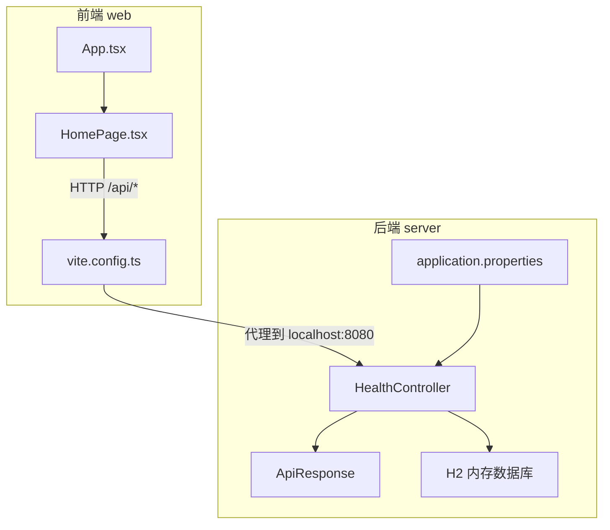
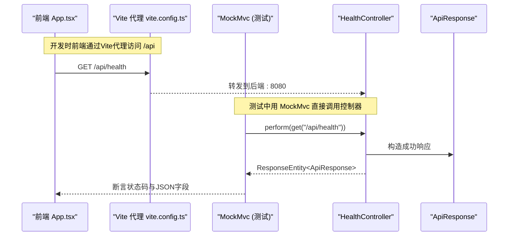
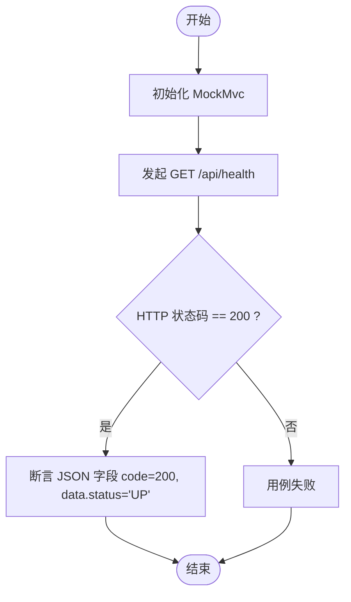
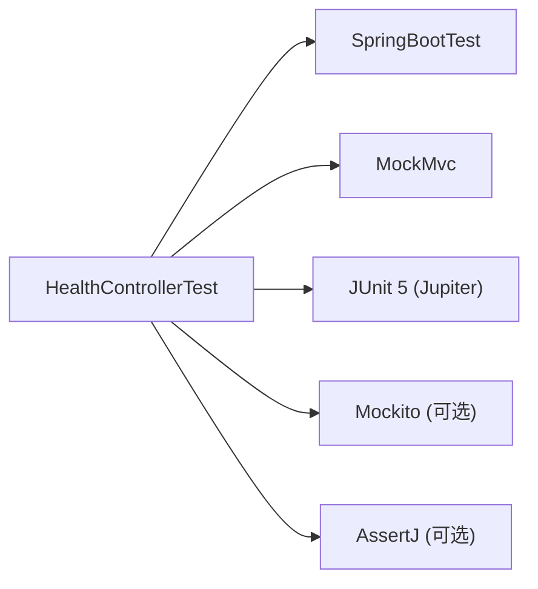

# 测试指南

<cite>
**本文引用的文件**
- [HealthController.java](file://server/src/main/java/com/taskboard/controller/HealthController.java)
- [ApiResponse.java](file://server/src/main/java/com/taskboard/dto/ApiResponse.java)
- [HealthControllerTest.java](file://server/src/test/java/com/taskboard/controller/HealthControllerTest.java)
- [build.gradle.kts](file://server/build.gradle.kts)
- [application.properties](file://server/src/main/resources/application.properties)
- [schema.sql](file://server/src/main/resources/schema.sql)
- [data.sql](file://server/src/main/resources/data.sql)
- [App.tsx](file://web/src/App.tsx)
- [HomePage.tsx](file://web/src/pages/HomePage.tsx)
- [vite.config.ts](file://web/vite.config.ts)
- [package.json](file://web/package.json)
- [README.md](file://README.md)
</cite>

## 目录
1. [简介](#简介)
2. [项目结构](#项目结构)
3. [核心组件](#核心组件)
4. [架构总览](#架构总览)
5. [详细组件分析](#详细组件分析)
6. [依赖分析](#依赖分析)
7. [性能考虑](#性能考虑)
8. [故障排查指南](#故障排查指南)
9. [结论](#结论)
10. [附录](#附录)

## 简介
本指南面向TaskBoard项目的测试策略与最佳实践，覆盖后端Spring Boot控制器单元测试、API集成测试、前端React组件测试、测试覆盖率要求以及持续集成中的自动化测试配置。以HealthController的现有测试为示例，说明如何编写可维护、可复用的测试用例；同时给出前后端测试环境隔离、测试数据准备和CI流水线集成的建议。

## 项目结构
- 后端（server）：基于Spring Boot 4.0.1、Java 25、Gradle Kotlin DSL，使用H2内存数据库，提供REST API并通过统一响应体封装。
- 前端（web）：基于React 19、TypeScript、Vite、antd，开发时通过Vite代理将/api请求转发到后端。

图表来源
- [HealthController.java:1-28](file://server/src/main/java/com/taskboard/controller/HealthController.java#L1-L28)
- [ApiResponse.java:1-53](file://server/src/main/java/com/taskboard/dto/ApiResponse.java#L1-L53)
- [vite.config.ts:1-14](file://web/vite.config.ts#L1-L14)
- [App.tsx:1-19](file://web/src/App.tsx#L1-L19)
- [HomePage.tsx:1-42](file://web/src/pages/HomePage.tsx#L1-L42)

章节来源
- [README.md:1-63](file://README.md#L1-L63)
- [build.gradle.kts:1-42](file://server/build.gradle.kts#L1-L42)

## 核心组件
- HealthController：提供健康检查接口，返回统一的 ApiResponse 包装体，包含状态码、消息和数据。
- ApiResponse：统一响应模型，便于前后端契约一致。
- HealthControllerTest：基于SpringBootTest + MockMvc的控制器集成测试，验证HTTP状态码与JSON响应结构。

章节来源
- [HealthController.java:1-28](file://server/src/main/java/com/taskboard/controller/HealthController.java#L1-L28)
- [ApiResponse.java:1-53](file://server/src/main/java/com/taskboard/dto/ApiResponse.java#L1-L53)
- [HealthControllerTest.java:1-38](file://server/src/test/java/com/taskboard/controller/HealthControllerTest.java#L1-L38)

## 架构总览
下图展示了从前端发起请求到后端控制器处理并返回统一响应的完整流程，以及测试如何通过MockMvc模拟HTTP调用进行断言。

图表来源
- [HealthController.java:18-26](file://server/src/main/java/com/taskboard/controller/HealthController.java#L18-L26)
- [ApiResponse.java:20-26](file://server/src/main/java/com/taskboard/dto/ApiResponse.java#L20-L26)
- [HealthControllerTest.java:29-36](file://server/src/test/java/com/taskboard/controller/HealthControllerTest.java#L29-L36)
- [vite.config.ts:6-13](file://web/vite.config.ts#L6-L13)

## 详细组件分析

### 后端单元测试与API集成测试（以HealthController为例）
- 测试框架与工具
  - JUnit 5（Jupiter）：通过Spring Boot Starter Test引入，并在构建脚本中启用JUnit Platform。
  - SpringBootTest：加载应用上下文，支持Web层测试。
  - MockMvc：在内存中模拟Servlet容器，发送HTTP请求并断言响应。
- 测试要点
  - 使用WebApplicationContext初始化MockMvc，避免启动真实Tomcat。
  - 断言HTTP状态码为200。
  - 断言统一响应体的code与data.status字段符合预期。
- 扩展建议
  - 对错误路径或异常分支补充用例（如参数校验失败、服务不可用）。
  - 如需验证数据库连通性，可在测试类中使用@Sql或@DirtiesContext管理测试数据。

图表来源
- [HealthControllerTest.java:24-36](file://server/src/test/java/com/taskboard/controller/HealthControllerTest.java#L24-L36)
- [HealthController.java:18-26](file://server/src/main/java/com/taskboard/controller/HealthController.java#L18-L26)

章节来源
- [HealthControllerTest.java:1-38](file://server/src/test/java/com/taskboard/controller/HealthControllerTest.java#L1-L38)
- [build.gradle.kts:33-41](file://server/build.gradle.kts#L33-L41)

### 前端组件测试指导（React + TypeScript）
- 现状与建议
  - 当前前端未包含测试依赖与测试文件。建议在web目录引入测试框架（如Vitest或Jest + React Testing Library），并创建对应的测试配置文件。
  - 针对App.tsx与HomePage.tsx等无副作用的展示型组件，优先进行快照测试与渲染断言。
  - 对于涉及路由、状态或网络请求的组件，使用合适的Provider与Mock进行隔离。
- 推荐实践
  - 组件单元测试：验证渲染结果、事件触发、条件渲染。
  - 组件集成测试：验证路由跳转、上下文消费、表单交互。
  - 端到端测试（可选）：使用Playwright/Cypress验证关键用户流程。

[本节为概念性指导，不直接分析具体代码文件]

### API接口的集成测试策略
- 目标
  - 在不启动真实服务器的情况下，验证控制器的输入输出契约。
- 方法
  - 使用SpringBootTest + MockMvc进行控制器级集成测试。
  - 通过@Sql或@DirtiesContext管理测试数据，确保每次测试的数据一致性。
  - 对复杂场景（如事务、异步）使用适当的测试注解与等待策略。
- 断言要点
  - HTTP状态码、响应头、JSON结构、业务字段值。
  - 边界条件与异常路径的响应格式一致性。

章节来源
- [HealthControllerTest.java:16-36](file://server/src/test/java/com/taskboard/controller/HealthControllerTest.java#L16-L36)
- [HealthController.java:18-26](file://server/src/main/java/com/taskboard/controller/HealthController.java#L18-L26)

## 依赖分析
- 后端测试依赖
  - spring-boot-starter-test：包含JUnit 5、Mockito、AssertJ、Spring Test等。
  - 已排除junit-vintage-engine，仅使用JUnit 5平台。
- 前端测试依赖
  - 当前未配置测试依赖，需按需添加Vitest/Jest及React Testing Library。

图表来源
- [build.gradle.kts:33-41](file://server/build.gradle.kts#L33-L41)
- [HealthControllerTest.java:3-14](file://server/src/test/java/com/taskboard/controller/HealthControllerTest.java#L3-L14)

章节来源
- [build.gradle.kts:22-41](file://server/build.gradle.kts#L22-L41)

## 性能考虑
- 测试执行效率
  - 使用MockMvc避免启动真实服务器，显著缩短测试时间。
  - 合理拆分测试类，减少不必要的上下文共享与数据污染。
- 数据库测试
  - H2内存数据库适合快速测试，注意在需要持久化数据的场景下使用@DirtiesContext或事务回滚策略。
- 前端测试
  - 组件测试尽量轻量，避免全量DOM渲染；必要时使用沙箱与Mock替代外部依赖。

[本节提供通用指导，不直接分析具体代码文件]

## 故障排查指南
- 常见问题
  - 端口冲突：确保测试期间没有占用8080端口。
  - 数据库初始化：确认schema.sql与data.sql正确加载，或在测试中使用@Sql指定SQL脚本。
  - 代理问题：前端开发时若无法访问后端，检查vite.config.ts的代理配置是否正确。
- 定位步骤
  - 查看控制台日志，确认测试上下文是否成功加载。
  - 逐步缩小范围：先验证控制器返回结构，再扩展到数据库与服务层。
  - 使用断点调试MockMvc请求与响应对象。

章节来源
- [vite.config.ts:6-13](file://web/vite.config.ts#L6-L13)
- [HealthControllerTest.java:24-36](file://server/src/test/java/com/taskboard/controller/HealthControllerTest.java#L24-L36)

## 结论
本项目已具备基础的Spring Boot控制器集成测试能力，采用JUnit 5与MockMvc实现了对健康检查接口的契约验证。建议在此基础上完善错误路径测试、数据库相关用例，并为前端引入组件测试与必要的集成测试。结合合理的测试数据管理与CI自动化，可显著提升交付质量与回归效率。

[本节为总结性内容，不直接分析具体代码文件]

## 附录

### 测试框架选择与配置
- 后端
  - 使用spring-boot-starter-test，默认集成JUnit 5、Mockito、AssertJ与Spring Test。
  - 在构建脚本中启用JUnit Platform，确保测试运行器正确识别。
- 前端
  - 推荐Vitest（与Vite生态契合）或Jest + React Testing Library。
  - 配置测试入口、匹配器与覆盖率报告插件。

章节来源
- [build.gradle.kts:33-41](file://server/build.gradle.kts#L33-L41)
- [package.json:1-25](file://web/package.json#L1-L25)

### API集成测试最佳实践
- 使用MockMvc模拟HTTP请求，断言状态码与JSON结构。
- 通过@Sql或@DirtiesContext管理测试数据，保证用例独立性与可重复性。
- 对异常分支与边界条件补充用例，确保契约稳定。

章节来源
- [HealthControllerTest.java:29-36](file://server/src/test/java/com/taskboard/controller/HealthControllerTest.java#L29-L36)
- [HealthController.java:18-26](file://server/src/main/java/com/taskboard/controller/HealthController.java#L18-L26)

### 前端组件测试最佳实践
- 组件单元测试：聚焦渲染与交互，避免耦合外部依赖。
- 组件集成测试：验证路由、上下文与组合行为。
- 端到端测试：覆盖关键用户旅程，保障整体体验。

[本节为概念性指导，不直接分析具体代码文件]

### 测试覆盖率要求
- 后端
  - 建议核心业务逻辑与方法行覆盖率≥80%，分支覆盖率≥70%。
  - 控制器与DTO的契约测试应覆盖主要路径与异常路径。
- 前端
  - 建议关键组件行覆盖率≥70%，重点覆盖交互与条件渲染分支。
- 报告生成
  - 后端可使用JaCoCo生成覆盖率报告。
  - 前端可使用Vitest或Jest内置覆盖率功能。

[本节为通用指导，不直接分析具体代码文件]

### 持续集成中的测试自动化
- 后端
  - 在CI中执行gradle test，收集测试报告与覆盖率。
  - 缓存依赖与构建产物，提升流水线速度。
- 前端
  - 在CI中执行npm run build与测试命令，生成覆盖率报告。
  - 将测试结果与报告上传至CI平台以便追踪。

[本节为通用指导，不直接分析具体代码文件]

### 测试数据准备与环境隔离
- 后端
  - 使用H2内存数据库，配合schema.sql与data.sql初始化数据。
  - 通过@Sql或@DirtiesContext隔离不同测试用例的数据。
- 前端
  - 使用Mock或本地数据模拟API响应，避免依赖真实后端。
  - 在测试环境中关闭不必要的网络请求与第三方服务。

章节来源
- [application.properties](file://server/src/main/resources/application.properties)
- [schema.sql](file://server/src/main/resources/schema.sql)
- [data.sql](file://server/src/main/resources/data.sql)