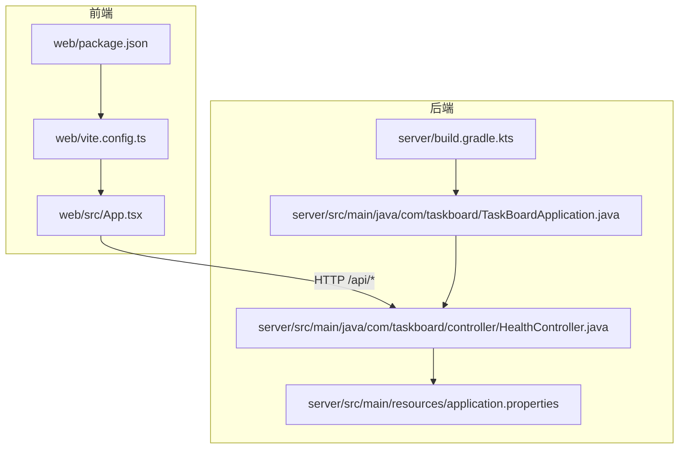
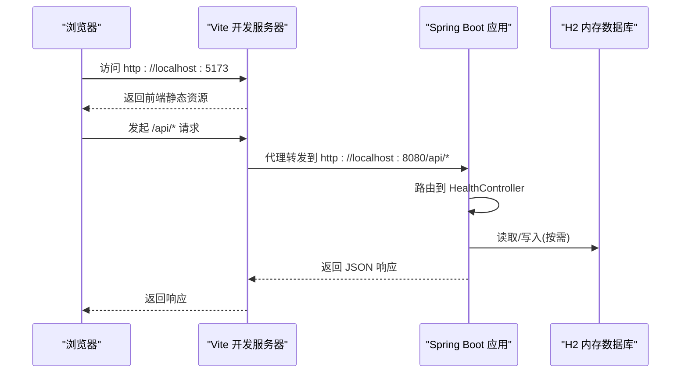
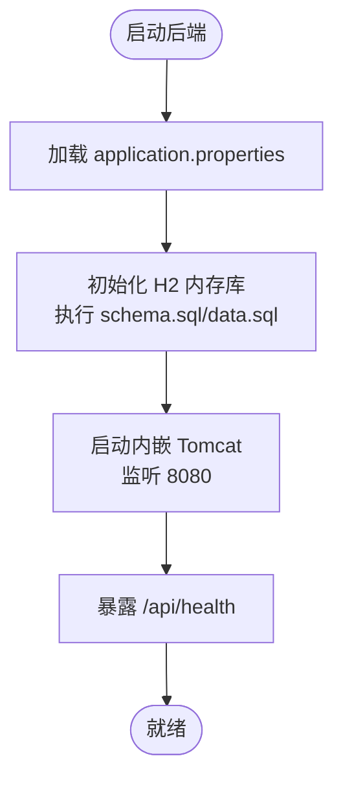
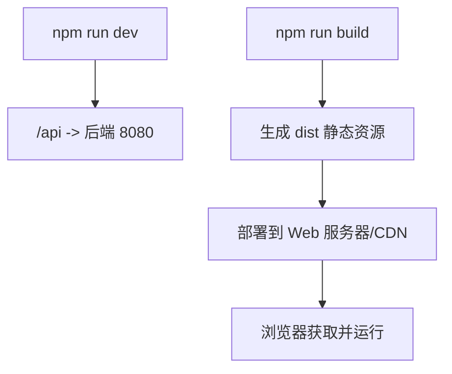
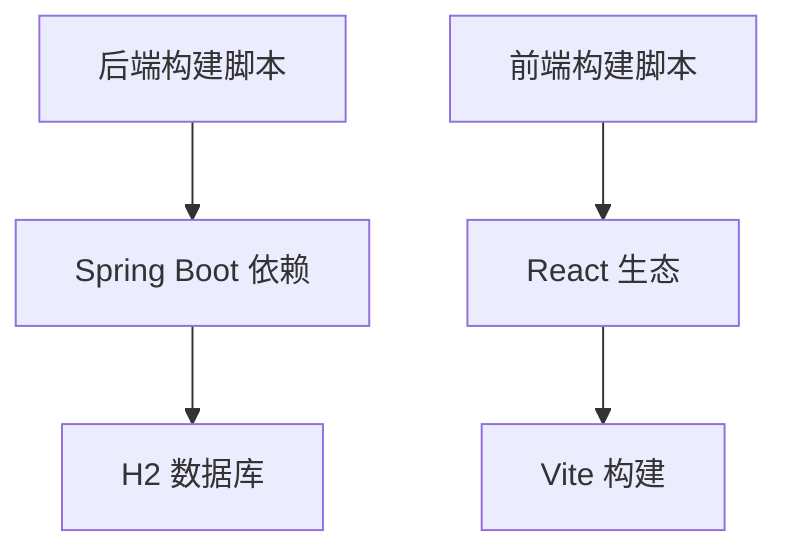

# 部署指南

<cite>
**本文引用的文件**
- [README.md](file://README.md)
- [server/build.gradle.kts](file://server/build.gradle.kts)
- [server/src/main/resources/application.properties](file://server/src/main/resources/application.properties)
- [server/src/main/java/com/taskboard/TaskBoardApplication.java](file://server/src/main/java/com/taskboard/TaskBoardApplication.java)
- [server/src/main/java/com/taskboard/controller/HealthController.java](file://server/src/main/java/com/taskboard/controller/HealthController.java)
- [web/package.json](file://web/package.json)
- [web/vite.config.ts](file://web/vite.config.ts)
- [web/src/App.tsx](file://web/src/App.tsx)
</cite>

## 目录
1. [简介](#简介)
2. [项目结构](#项目结构)
3. [核心组件](#核心组件)
4. [架构总览](#架构总览)
5. [详细组件分析](#详细组件分析)
6. [依赖分析](#依赖分析)
7. [性能考虑](#性能考虑)
8. [故障排查指南](#故障排查指南)
9. [结论](#结论)
10. [附录](#附录)

## 简介
本指南面向 TaskBoard 应用的部署与运维，覆盖后端 Spring Boot 应用打包与运行、前端构建与静态资源部署、容器化方案（镜像构建与编排）、多环境配置管理、监控与日志收集建议、性能调优与故障排查，以及云平台部署最佳实践与自动化流水线设计思路。文档基于仓库现有代码与配置进行说明，确保可落地执行。

## 项目结构
TaskBoard 采用前后端分离的 Monorepo 结构：
- server：Spring Boot 后端，使用 Gradle Kotlin DSL 构建，内置 Tomcat，默认端口 8080，API 前缀 /api，H2 内存数据库，提供健康检查接口。
- web：React + TypeScript + Vite 前端，开发时通过代理转发到后端，生产构建输出静态资源。

图表来源
- [web/package.json:1-25](file://web/package.json#L1-L25)
- [web/vite.config.ts:1-15](file://web/vite.config.ts#L1-L15)
- [web/src/App.tsx:1-19](file://web/src/App.tsx#L1-L19)
- [server/build.gradle.kts:1-42](file://server/build.gradle.kts#L1-L42)
- [server/src/main/resources/application.properties:1-18](file://server/src/main/resources/application.properties#L1-L18)
- [server/src/main/java/com/taskboard/TaskBoardApplication.java:1-12](file://server/src/main/java/com/taskboard/TaskBoardApplication.java#L1-L12)
- [server/src/main/java/com/taskboard/controller/HealthController.java:1-28](file://server/src/main/java/com/taskboard/controller/HealthController.java#L1-L28)

章节来源
- [README.md:1-63](file://README.md#L1-L63)

## 核心组件
- 后端启动入口：Spring Boot 主类负责应用启动与自动装配。
- 健康检查控制器：对外暴露 /api/health，用于存活与健康探测。
- 构建脚本：Gradle 脚本定义 Java 工具链、依赖与任务；Vite 脚本定义开发与构建流程。
- 运行时配置：application.properties 指定服务端口、上下文路径、H2 数据源与 SQL 初始化策略。

章节来源
- [server/src/main/java/com/taskboard/TaskBoardApplication.java:1-12](file://server/src/main/java/com/taskboard/TaskBoardApplication.java#L1-L12)
- [server/src/main/java/com/taskboard/controller/HealthController.java:1-28](file://server/src/main/java/com/taskboard/controller/HealthController.java#L1-L28)
- [server/build.gradle.kts:1-42](file://server/build.gradle.kts#L1-L42)
- [web/package.json:1-25](file://web/package.json#L1-L25)
- [web/vite.config.ts:1-15](file://web/vite.config.ts#L1-L15)
- [server/src/main/resources/application.properties:1-18](file://server/src/main/resources/application.properties#L1-L18)

## 架构总览
下图展示了请求从浏览器到后端的调用链路，以及前后端在开发与生产环境的交互方式。

图表来源
- [web/vite.config.ts:6-13](file://web/vite.config.ts#L6-L13)
- [server/src/main/java/com/taskboard/controller/HealthController.java:14-26](file://server/src/main/java/com/taskboard/controller/HealthController.java#L14-L26)
- [server/src/main/resources/application.properties:1-18](file://server/src/main/resources/application.properties#L1-L18)

## 详细组件分析

### 后端打包与运行（Spring Boot）
- 构建产物：通过 Gradle 构建生成可执行的 JAR 包，包含内嵌 Tomcat，可直接运行。
- 运行方式：使用 java -jar 启动，或通过 Gradle 任务运行。
- 关键配置：
  - 服务端口与上下文路径由配置文件控制。
  - H2 内存数据库随进程生命周期存在，重启会清空。
  - SQL 初始化策略为始终执行 schema 与 data 脚本。
- 健康检查：/api/health 返回统一封装的成功响应，便于探针检测。

图表来源
- [server/src/main/resources/application.properties:1-18](file://server/src/main/resources/application.properties#L1-L18)
- [server/src/main/java/com/taskboard/controller/HealthController.java:14-26](file://server/src/main/java/com/taskboard/controller/HealthController.java#L14-L26)

章节来源
- [server/build.gradle.kts:1-42](file://server/build.gradle.kts#L1-L42)
- [server/src/main/resources/application.properties:1-18](file://server/src/main/resources/application.properties#L1-L18)
- [server/src/main/java/com/taskboard/controller/HealthController.java:14-26](file://server/src/main/java/com/taskboard/controller/HealthController.java#L14-L26)

### 前端构建优化与静态资源部署
- 开发模式：Vite 提供热更新，并通过代理将 /api 请求转发至后端 8080。
- 生产构建：执行构建命令生成静态资源（HTML/CSS/JS），适合放置于 Nginx/Apache 或对象存储。
- 构建脚本：TypeScript 编译与 Vite 构建串联执行，支持预览。
- 部署策略：
  - 将构建产物作为静态站点托管。
  - 若后端与前端同域部署，可将静态资源与后端静态目录合并，减少跨域问题。
  - 若独立部署，需确保前端对后端的 API 地址可通过域名或反向代理访问。

图表来源
- [web/vite.config.ts:6-13](file://web/vite.config.ts#L6-L13)
- [web/package.json:6-9](file://web/package.json#L6-L9)

章节来源
- [web/package.json:1-25](file://web/package.json#L1-L25)
- [web/vite.config.ts:1-15](file://web/vite.config.ts#L1-L15)
- [web/src/App.tsx:1-19](file://web/src/App.tsx#L1-L19)

### 容器化部署方案
- 后端镜像：基于官方 JDK 基础镜像，复制构建出的 JAR，暴露 8080 端口，设置健康检查。
- 前端镜像：基于轻量 Web 服务器（如 Nginx），复制构建产物，配置反向代理将 /api 转发到后端服务。
- 编排建议：使用容器编排工具将前后端服务组合，通过环境变量注入不同环境配置，实现解耦与可移植性。

图表来源
- [server/src/main/resources/application.properties:1-18](file://server/src/main/resources/application.properties#L1-L18)
- [web/vite.config.ts:6-13](file://web/vite.config.ts#L6-L13)

### 多环境部署的配置管理
- 当前配置：application.properties 定义了默认的开发配置（端口、H2、SQL 初始化等）。
- 差异化策略：
  - 通过外部配置文件或环境变量覆盖默认值，例如端口、数据源、日志级别等。
  - 在容器环境中，以环境变量注入的方式区分开发、测试、生产配置。
  - 生产环境建议替换 H2 为持久化数据库，并关闭调试特性。
- 安全建议：敏感信息（如数据库凭证）不应硬编码，应通过密钥管理服务或环境变量注入。

章节来源
- [server/src/main/resources/application.properties:1-18](file://server/src/main/resources/application.properties#L1-L18)

### 监控与日志收集
- 健康检查：/api/health 可用于存活与就绪探针。
- 日志建议：
  - 开发环境开启 SQL 打印以便调试。
  - 生产环境建议调整日志级别，并将日志输出到标准输出，交由容器平台采集。
- 指标与追踪：可在后续扩展引入指标与链路追踪能力，配合平台监控面板。

章节来源
- [server/src/main/resources/application.properties:10-17](file://server/src/main/resources/application.properties#L10-L17)
- [server/src/main/java/com/taskboard/controller/HealthController.java:18-26](file://server/src/main/java/com/taskboard/controller/HealthController.java#L18-L26)

### 性能调优与故障排查
- 性能要点：
  - 合理设置 JVM 参数（堆大小、GC 策略）以适应负载。
  - 生产环境避免不必要的调试开关，减少开销。
  - 前端构建产物启用缓存与压缩，提升首屏速度。
- 常见故障：
  - 端口冲突：修改服务端口或释放占用端口。
  - 数据库初始化失败：检查 SQL 脚本与权限。
  - 前端代理失败：确认后端可达性与代理规则。
  - 健康检查不通过：检查应用启动状态与依赖服务。

章节来源
- [server/src/main/resources/application.properties:1-18](file://server/src/main/resources/application.properties#L1-L18)
- [web/vite.config.ts:6-13](file://web/vite.config.ts#L6-L13)

## 依赖分析
- 后端依赖：Spring Boot Web、JPA、Validation、H2、Test Starter。
- 前端依赖：React、antd、react-router-dom；开发依赖包括 Vite、TypeScript、React 插件。
- 构建关系：Gradle 管理后端依赖与打包；Vite 管理前端构建与代理。

图表来源
- [server/build.gradle.kts:22-36](file://server/build.gradle.kts#L22-L36)
- [web/package.json:11-23](file://web/package.json#L11-L23)

章节来源
- [server/build.gradle.kts:1-42](file://server/build.gradle.kts#L1-L42)
- [web/package.json:1-25](file://web/package.json#L1-L25)

## 性能考虑
- 后端：
  - 选择合适的 JVM 版本与参数，结合容器资源限制进行调优。
  - 生产环境关闭不必要的调试输出，降低 I/O 压力。
  - 根据业务量评估连接池与线程池参数。
- 前端：
  - 构建产物启用压缩与缓存策略。
  - 合理使用路由懒加载与资源分割，减少首屏体积。
  - 通过 CDN 加速静态资源分发。

[本节为通用指导，不直接分析具体文件]

## 故障排查指南
- 启动失败：
  - 检查端口占用与上下文路径配置。
  - 查看应用日志定位异常堆栈。
- 健康检查异常：
  - 确认 /api/health 是否可达。
  - 检查数据库初始化与连接是否正常。
- 前端无法调用后端：
  - 开发环境检查代理配置与后端可达性。
  - 生产环境检查反向代理与域名解析。

章节来源
- [server/src/main/resources/application.properties:1-18](file://server/src/main/resources/application.properties#L1-L18)
- [web/vite.config.ts:6-13](file://web/vite.config.ts#L6-L13)
- [server/src/main/java/com/taskboard/controller/HealthController.java:18-26](file://server/src/main/java/com/taskboard/controller/HealthController.java#L18-L26)

## 结论
本指南基于现有代码与配置，提供了 TaskBoard 应用的完整部署与运维方案，涵盖后端打包运行、前端构建与静态资源部署、容器化与编排、多环境配置、监控日志、性能调优与故障排查，以及云平台部署与自动化流水线的思路。按此指南实施，可实现稳定、可观测、可扩展的交付与运行。

## 附录

### 快速部署清单
- 后端
  - 构建：执行构建任务生成可执行 JAR。
  - 运行：使用 java -jar 启动，或通过 Gradle 任务运行。
  - 验证：访问 /api/health 确认服务可用。
- 前端
  - 开发：安装依赖后启动开发服务器，代理到后端。
  - 构建：执行构建命令生成静态资源。
  - 部署：将静态资源部署到 Web 服务器或 CDN。

章节来源
- [README.md:25-48](file://README.md#L25-L48)
- [web/package.json:6-9](file://web/package.json#L6-L9)
- [server/build.gradle.kts:1-42](file://server/build.gradle.kts#L1-L42)