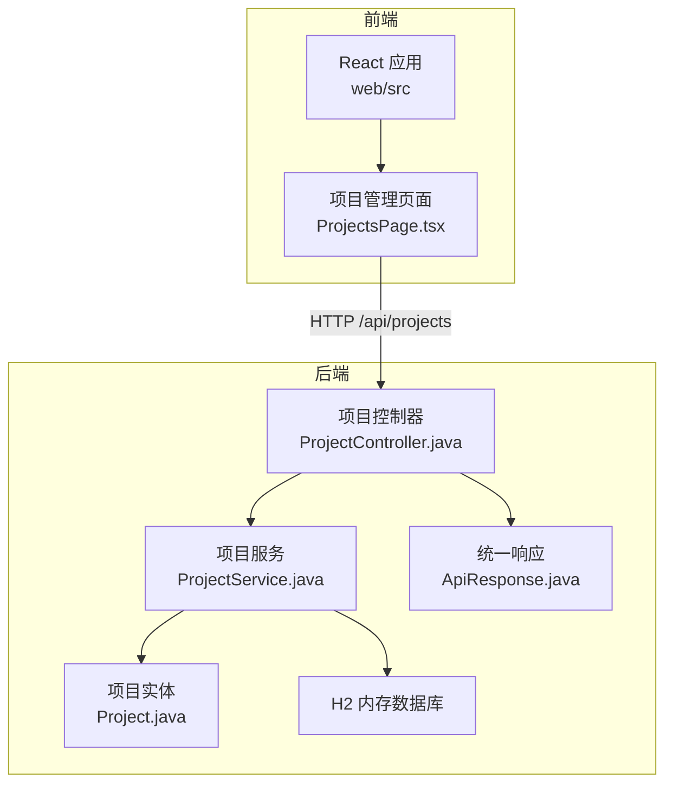
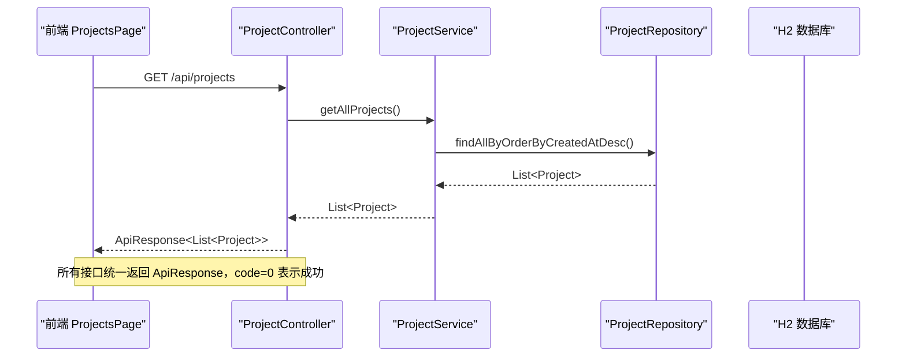
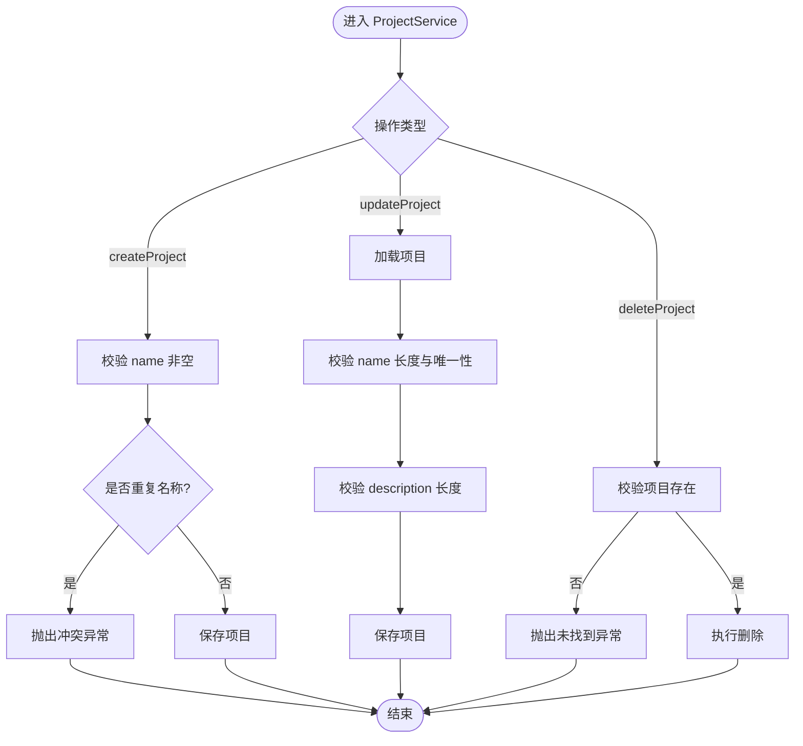
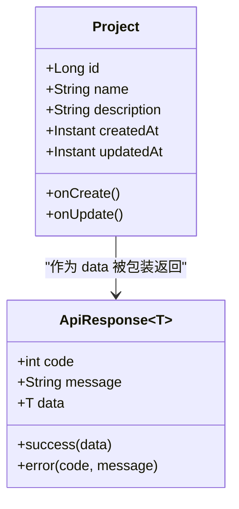
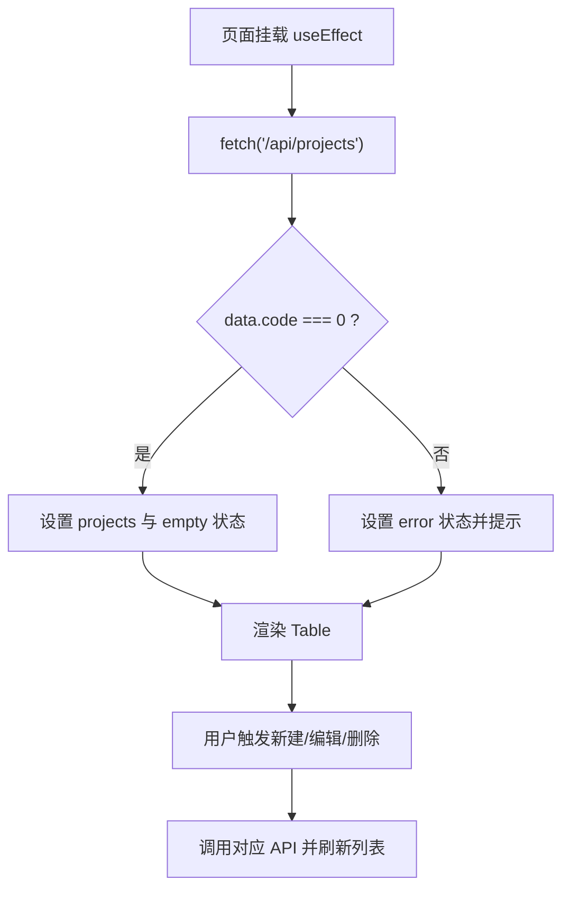
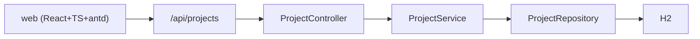

# 技能审计报告

<cite>
**本文引用的文件**   
- [README.md](file://README.md)
- [docs/decisions.md](file://docs/decisions.md)
- [docs/rule-audit.md](file://docs/rule-audit.md)
- [docs/defect-ledger.md](file://docs/defect-ledger.md)
- [server/src/main/java/com/taskboard/controller/ProjectController.java](file://server/src/main/java/com/taskboard/controller/ProjectController.java)
- [server/src/main/java/com/taskboard/service/ProjectService.java](file://server/src/main/java/com/taskboard/service/ProjectService.java)
- [server/src/main/java/com/taskboard/entity/Project.java](file://server/src/main/java/com/taskboard/entity/Project.java)
- [server/src/main/java/com/taskboard/dto/ApiResponse.java](file://server/src/main/java/com/taskboard/dto/ApiResponse.java)
- [web/src/pages/ProjectsPage.tsx](file://web/src/pages/ProjectsPage.tsx)
</cite>

## 目录
1. [引言](#引言)
2. [项目结构](#项目结构)
3. [核心组件](#核心组件)
4. [架构总览](#架构总览)
5. [详细组件分析](#详细组件分析)
6. [依赖关系分析](#依赖关系分析)
7. [性能与可维护性](#性能与可维护性)
8. [故障排查指南](#故障排查指南)
9. [结论](#结论)
10. [附录：技能审计要点与修复建议](#附录技能审计要点与修复建议)

## 引言
本“技能审计报告”聚焦 TaskBoard 项目的代码质量、契约一致性、规则合规性与缺陷治理情况，并结合现有文档（规则审计、缺陷账本、架构决策记录）给出可执行的改进建议。报告同时覆盖后端 Spring Boot 项目管理能力与前端 React 页面实现，确保从端到端视角评估技能落地效果。

## 项目结构
TaskBoard 是一个前后端分离的单体仓库：
- server：Spring Boot 4 + Java 25 + Gradle Kotlin DSL，提供 REST API，使用 H2 内存数据库。
- web：React 19 + TypeScript + Vite + antd 6，提供项目管理页面。
- docs：包含架构契约、规则审计、缺陷账本、架构决策记录等工程化文档。



**图表来源**
- [web/src/pages/ProjectsPage.tsx:1-283](file://web/src/pages/ProjectsPage.tsx#L1-L283)
- [server/src/main/java/com/taskboard/controller/ProjectController.java:1-78](file://server/src/main/java/com/taskboard/controller/ProjectController.java#L1-L78)
- [server/src/main/java/com/taskboard/service/ProjectService.java:1-117](file://server/src/main/java/com/taskboard/service/ProjectService.java#L1-L117)
- [server/src/main/java/com/taskboard/entity/Project.java:1-90](file://server/src/main/java/com/taskboard/entity/Project.java#L1-L90)
- [server/src/main/java/com/taskboard/dto/ApiResponse.java:1-53](file://server/src/main/java/com/taskboard/dto/ApiResponse.java#L1-L53)

**章节来源**
- [README.md:1-63](file://README.md#L1-L63)

## 核心组件
- 项目控制器：暴露项目增删改查接口，统一返回 ApiResponse。
- 项目服务：封装业务校验、唯一性检查、事务操作与异常抛出。
- 项目实体：定义数据库映射、字段长度约束与时间戳自动填充。
- 统一响应：code=0 表示成功，message 描述信息，data 承载数据。
- 前端页面：实现项目列表展示、新建/编辑、删除确认与三态处理。

**章节来源**
- [server/src/main/java/com/taskboard/controller/ProjectController.java:1-78](file://server/src/main/java/com/taskboard/controller/ProjectController.java#L1-L78)
- [server/src/main/java/com/taskboard/service/ProjectService.java:1-117](file://server/src/main/java/com/taskboard/service/ProjectService.java#L1-L117)
- [server/src/main/java/com/taskboard/entity/Project.java:1-90](file://server/src/main/java/com/taskboard/entity/Project.java#L1-L90)
- [server/src/main/java/com/taskboard/dto/ApiResponse.java:1-53](file://server/src/main/java/com/taskboard/dto/ApiResponse.java#L1-L53)
- [web/src/pages/ProjectsPage.tsx:1-283](file://web/src/pages/ProjectsPage.tsx#L1-L283)

## 架构总览
后端采用 Controller → Service → Repository → Entity 的分层架构；前端通过 fetch 调用后端 REST API，统一解析 ApiResponse.code。



**图表来源**
- [server/src/main/java/com/taskboard/controller/ProjectController.java:27-31](file://server/src/main/java/com/taskboard/controller/ProjectController.java#L27-L31)
- [server/src/main/java/com/taskboard/service/ProjectService.java:27-29](file://server/src/main/java/com/taskboard/service/ProjectService.java#L27-L29)
- [server/src/main/java/com/taskboard/dto/ApiResponse.java:20-22](file://server/src/main/java/com/taskboard/dto/ApiResponse.java#L20-L22)
- [web/src/pages/ProjectsPage.tsx:38-51](file://web/src/pages/ProjectsPage.tsx#L38-L51)

## 详细组件分析

### 后端：项目控制器
- 职责：接收 HTTP 请求，委托 Service 执行业务逻辑，返回 ApiResponse。
- 关键路径：
  - 获取项目列表：GET /api/projects
  - 创建项目：POST /api/projects
  - 查询项目：GET /api/projects/{id}
  - 更新项目：PUT /api/projects/{id}
  - 删除项目：DELETE /api/projects/{id}

```mermaid
flowchart TD
Start(["请求进入 ProjectController"]) --> Route{"路由匹配"}
Route --> |GET /api/projects| GetAll["调用 ProjectService.getAllProjects()"]
Route --> |POST /api/projects| Create["调用 ProjectService.createProject(name, description)"]
Route --> |GET /{id}| GetById["调用 ProjectService.getProjectById(id)"]
Route --> |PUT /{id}| Update["调用 ProjectService.updateProject(id, name, description)"]
Route --> |DELETE /{id}| Delete["调用 ProjectService.deleteProject(id)"]
GetAll --> Wrap["封装为 ApiResponse.success(...)"]
Create --> Wrap
GetById --> Wrap
Update --> Wrap
Delete --> Wrap
Wrap --> End(["返回统一响应"])
```

**图表来源**
- [server/src/main/java/com/taskboard/controller/ProjectController.java:27-76](file://server/src/main/java/com/taskboard/controller/ProjectController.java#L27-L76)
- [server/src/main/java/com/taskboard/dto/ApiResponse.java:20-26](file://server/src/main/java/com/taskboard/dto/ApiResponse.java#L20-L26)

**章节来源**
- [server/src/main/java/com/taskboard/controller/ProjectController.java:1-78](file://server/src/main/java/com/taskboard/controller/ProjectController.java#L1-L78)

### 后端：项目服务
- 职责：业务校验（非空、长度、唯一性）、事务控制、异常抛出。
- 关键行为：
  - 创建时校验 name 非空且唯一。
  - 更新时对 name 和 description 做长度限制，并仅在变更时检查唯一性。
  - 删除前校验存在性，随后执行删除。



**图表来源**
- [server/src/main/java/com/taskboard/service/ProjectService.java:45-115](file://server/src/main/java/com/taskboard/service/ProjectService.java#L45-L115)

**章节来源**
- [server/src/main/java/com/taskboard/service/ProjectService.java:1-117](file://server/src/main/java/com/taskboard/service/ProjectService.java#L1-L117)

### 后端：项目实体与统一响应
- 实体字段：id、name、description、createdAt、updatedAt；时间戳由 JPA 生命周期回调自动填充。
- 统一响应：success(code=0)、error(code,message)。



**图表来源**
- [server/src/main/java/com/taskboard/entity/Project.java:9-38](file://server/src/main/java/com/taskboard/entity/Project.java#L9-L38)
- [server/src/main/java/com/taskboard/dto/ApiResponse.java:6-26](file://server/src/main/java/com/taskboard/dto/ApiResponse.java#L6-L26)

**章节来源**
- [server/src/main/java/com/taskboard/entity/Project.java:1-90](file://server/src/main/java/com/taskboard/entity/Project.java#L1-L90)
- [server/src/main/java/com/taskboard/dto/ApiResponse.java:1-53](file://server/src/main/java/com/taskboard/dto/ApiResponse.java#L1-L53)

### 前端：项目管理页面
- 功能：列表展示、新建/编辑、删除确认、三态处理（loading/empty/error）。
- 契约：统一判断 data.code === 0 为成功。
- 已知问题：手写 interface ProjectItem，违反 charter 红线第 8 条（应由契约生成类型）。



**图表来源**
- [web/src/pages/ProjectsPage.tsx:33-59](file://web/src/pages/ProjectsPage.tsx#L33-L59)
- [web/src/pages/ProjectsPage.tsx:84-138](file://web/src/pages/ProjectsPage.tsx#L84-L138)
- [web/src/pages/ProjectsPage.tsx:202-244](file://web/src/pages/ProjectsPage.tsx#L202-L244)

**章节来源**
- [web/src/pages/ProjectsPage.tsx:1-283](file://web/src/pages/ProjectsPage.tsx#L1-L283)

## 依赖关系分析
- 后端依赖：spring-boot-starter-web、spring-boot-starter-data-jpa、spring-boot-starter-validation、spring-boot-starter-test、H2。
- 前端依赖：React、TypeScript、antd、Vite。
- 架构决策：引入 Zod 用于前端运行时类型校验（见架构决策记录），但当前页面仍手写接口类型，需后续对齐。



**图表来源**
- [README.md:5-8](file://README.md#L5-L8)
- [docs/decisions.md:1-14](file://docs/decisions.md#L1-L14)

**章节来源**
- [README.md:5-8](file://README.md#L5-L8)
- [docs/decisions.md:1-14](file://docs/decisions.md#L1-L14)

## 性能与可维护性
- 分层清晰：Controller 仅负责路由与响应包装，Service 承担业务校验与事务，符合可维护性要求。
- 命名一致：数据库列名蛇形、Java 属性驼峰，Jackson/Hibernate 自动映射，前后端 JSON 字段一致。
- 时间类型：后端 Instant，前端 string（ISO-8601），无需手动转换。
- 构建与依赖：starter 精确引入，无冗余依赖，符合 charter 红线第 3 条。

[本节为通用指导，不直接分析具体文件]

## 故障排查指南
- 全局异常处理缺失：当前依赖 ResponseStatusException 手动抛出，错误响应可能不走统一 ApiResponse，前端需兼容两种错误格式。
- 后端参数校验不完整：Controller 缺少 Bean Validation 注解（如 @NotBlank），建议在参数入口处快速失败。
- 前端类型不一致风险：存在手写 interface ProjectItem，应改为由 OpenAPI/Swagger 生成的类型，避免前后端字段漂移。
- 三态处理：已补充 empty 与 closable error，但仍需确保错误消息与网络异常场景下的用户体验一致。

**章节来源**
- [docs/defect-ledger.md:56-69](file://docs/defect-ledger.md#L56-L69)
- [docs/defect-ledger.md:114-139](file://docs/defect-ledger.md#L114-L139)
- [docs/defect-ledger.md:199-239](file://docs/defect-ledger.md#L199-L239)

## 结论
- 整体架构与分层合理，统一响应与时间类型遵循 charter。
- 主要风险集中在前端类型契约（手写 interface）与后端全局异常处理。
- 建议优先解决前端类型生成与后端参数校验注解，提升契约一致性与健壮性。

[本节为总结性内容，不直接分析具体文件]

## 附录：技能审计要点与修复建议
- 规则合规：
  - starter 依赖以 charter 清单为准，当前仅使用 web/jpa/validation/test，符合红线第 3 条。
  - 前端禁止使用 v5 补丁包与已移除组件，当前未发现违规。
  - 前端禁止手写接口类型，当前存在违规（D13），需通过契约生成解决。
- 缺陷治理：
  - 已修复 ApiResponse code 与前端响应码检查不一致的问题。
  - 已清理 data.sql 中固定 ID 的种子数据，避免 H2 内存库主键冲突。
  - 已完善三态处理（empty/error）。
- 待办项：
  - 引入 OpenAPI/Swagger 规范并自动生成前端类型，消除手写 interface。
  - 增加全局异常处理器，统一错误响应格式。
  - 在 Controller 层补充 Bean Validation 注解，实现快速失败。

**章节来源**
- [docs/rule-audit.md:5-24](file://docs/rule-audit.md#L5-L24)
- [docs/defect-ledger.md:270-354](file://docs/defect-ledger.md#L270-L354)
- [docs/defect-ledger.md:356-399](file://docs/defect-ledger.md#L356-L399)