# 质量保证框架

<cite>
**本文引用的文件**   
- [README.md](file://README.md)
- [INIT_REPORT.md](file://INIT_REPORT.md)
- [defect-ledger.md](file://docs/defect-ledger.md)
- [v3-acceptance-report.md](file://docs/v3-acceptance-report.md)
- [TaskBoardApplication.java](file://server/src/main/java/com/taskboard/TaskBoardApplication.java)
- [build.gradle.kts](file://server/build.gradle.kts)
- [ProjectController.java](file://server/src/main/java/com/taskboard/controller/ProjectController.java)
- [ProjectService.java](file://server/src/main/java/com/taskboard/service/ProjectService.java)
- [ProjectRepository.java](file://server/src/main/java/com/taskboard/repository/ProjectRepository.java)
- [Project.java](file://server/src/main/java/com/taskboard/entity/Project.java)
- [ApiResponse.java](file://server/src/main/java/com/taskboard/dto/ApiResponse.java)
- [application.properties](file://server/src/main/resources/application.properties)
- [ProjectsPage.tsx](file://web/src/pages/ProjectsPage.tsx)
- [App.tsx](file://web/src/App.tsx)
- [vite.config.ts](file://web/vite.config.ts)
- [ProjectControllerTest.java](file://server/src/test/java/com/taskboard/controller/ProjectControllerTest.java)
- [BoardPage.tsx](file://web/src/pages/BoardPage.tsx)
- [TimeLogsPage.tsx](file://web/src/pages/TimeLogsPage.tsx)
- [StatsPage.tsx](file://web/src/pages/StatsPage.tsx)
- [TimeLog.java](file://server/src/main/java/com/taskboard/entity/TimeLog.java)
- [StatsService.java](file://server/src/main/java/com/taskboard/service/StatsService.java)
- [schema.d.ts](file://web/src/api/schema.d.ts)
</cite>

## 更新摘要
**变更内容**   
- 新增看板拖拽功能验收（V-B1, V-B2）
- 新增工时填报模块验收（V-B3）
- 新增统计报表模块验收（V-B4）
- 新增前端契约合规性验收（V-B5）
- 新增全局规范合规性验收（V-G1至V-G4）
- 新增Hook机制有效性验收（V-H1）
- 更新架构总览以反映完整功能模块

## 目录
1. [引言](#引言)
2. [项目结构](#项目结构)
3. [核心组件](#核心组件)
4. [架构总览](#架构总览)
5. [详细组件分析](#详细组件分析)
6. [验收测试覆盖](#验收测试覆盖)
7. [依赖关系分析](#依赖关系分析)
8. [性能与可扩展性](#性能与可扩展性)
9. [故障排查指南](#故障排查指南)
10. [结论](#结论)
11. [附录](#附录)

## 引言
本项目为 TaskBoard 任务看板应用的单体仓库，包含 Spring Boot 后端与 React 前端。当前质量保障框架以"最小可用骨架 + 缺陷账本驱动"的方式运行，现已通过 v3 验收测试，涵盖拖拽功能、时间跟踪、统计分析、类型安全和钩子机制等10个关键验证点。后端提供统一响应封装、分层架构（Controller → Service → Repository）、H2 内存数据库与 JPA；前端基于 React 19、TypeScript、antd 6 与 Vite，并通过开发代理访问后端 API。质量维度覆盖分层规范、命名一致性、时间类型、构建依赖、契约生成、异常处理、三态 UI 等，并通过缺陷账本持续追踪改进。

## 项目结构
- server：Spring Boot 4 后端，使用 Gradle Kotlin DSL 构建，内置 Tomcat，JPA + H2，统一 ApiResponse 包装。
- web：React 19 + TypeScript + antd 6 + Vite，路由与页面分离，开发环境通过 Vite proxy 转发 /api 到后端。
- docs：质量相关文档，如缺陷账本和验收报告。

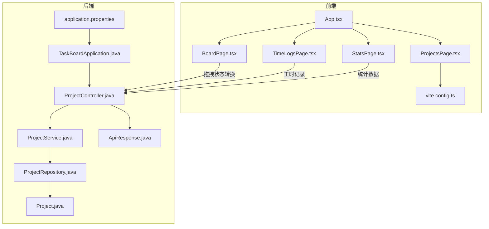

**图示来源**
- [App.tsx:1-21](file://web/src/App.tsx#L1-L21)
- [ProjectsPage.tsx:1-248](file://web/src/pages/ProjectsPage.tsx#L1-L248)
- [BoardPage.tsx:1-312](file://web/src/pages/BoardPage.tsx#L1-L312)
- [TimeLogsPage.tsx:1-274](file://web/src/pages/TimeLogsPage.tsx#L1-L274)
- [StatsPage.tsx:1-182](file://web/src/pages/StatsPage.tsx#L1-L182)
- [vite.config.ts:1-15](file://web/vite.config.ts#L1-L15)
- [TaskBoardApplication.java:1-12](file://server/src/main/java/com/taskboard/TaskBoardApplication.java#L1-L12)
- [ProjectController.java:1-78](file://server/src/main/java/com/taskboard/controller/ProjectController.java#L1-L78)
- [ProjectService.java:1-117](file://server/src/main/java/com/taskboard/service/ProjectService.java#L1-L117)
- [ProjectRepository.java:1-25](file://server/src/main/java/com/taskboard/repository/ProjectRepository.java#L1-L25)
- [Project.java:1-90](file://server/src/main/java/com/taskboard/entity/Project.java#L1-L90)
- [ApiResponse.java:1-53](file://server/src/main/java/com/taskboard/dto/ApiResponse.java#L1-L53)
- [application.properties:1-18](file://server/src/main/resources/application.properties#L1-L18)

**章节来源**
- [README.md:1-63](file://README.md#L1-L63)
- [INIT_REPORT.md:1-209](file://INIT_REPORT.md#L1-L209)

## 核心组件
- 应用入口：TaskBoardApplication 启动 Spring Boot 应用。
- 控制器层：ProjectController 暴露 REST 接口，统一返回 ApiResponse。
- 服务层：ProjectService 实现业务校验、事务控制与领域逻辑。
- 数据访问层：ProjectRepository 继承 JpaRepository，定义查询方法。
- 实体层：Project 映射 project 表，使用 Instant 管理时间字段。
- 统一响应：ApiResponse<T> 封装 code/message/data。
- 配置：application.properties 配置端口、H2、JPA、SQL 初始化。
- 前端：App.tsx 路由，ProjectsPage.tsx 项目管理页面，BoardPage.tsx 看板拖拽，TimeLogsPage.tsx 工时填报，StatsPage.tsx 统计报表，Vite 代理 /api。

**章节来源**
- [TaskBoardApplication.java:1-12](file://server/src/main/java/com/taskboard/TaskBoardApplication.java#L1-L12)
- [ProjectController.java:1-78](file://server/src/main/java/com/taskboard/controller/ProjectController.java#L1-L78)
- [ProjectService.java:1-117](file://server/src/main/java/com/taskboard/service/ProjectService.java#L1-L117)
- [ProjectRepository.java:1-25](file://server/src/main/java/com/taskboard/repository/ProjectRepository.java#L1-L25)
- [Project.java:1-90](file://server/src/main/java/com/taskboard/entity/Project.java#L1-L90)
- [ApiResponse.java:1-53](file://server/src/main/java/com/taskboard/dto/ApiResponse.java#L1-L53)
- [application.properties:1-18](file://server/src/main/resources/application.properties#L1-L18)
- [App.tsx:1-21](file://web/src/App.tsx#L1-L21)
- [ProjectsPage.tsx:1-248](file://web/src/pages/ProjectsPage.tsx#L1-L248)
- [BoardPage.tsx:1-312](file://web/src/pages/BoardPage.tsx#L1-L312)
- [TimeLogsPage.tsx:1-274](file://web/src/pages/TimeLogsPage.tsx#L1-L274)
- [StatsPage.tsx:1-182](file://web/src/pages/StatsPage.tsx#L1-L182)
- [vite.config.ts:1-15](file://web/vite.config.ts#L1-L15)

## 架构总览
后端采用经典三层架构，所有 HTTP 响应经 ApiResponse 统一封装；前端通过 Vite dev proxy 将 /api 请求转发至后端 8081 端口。数据库使用 H2 内存库，schema 与 data 由 SQL 脚本初始化。现已完成看板拖拽、工时填报、统计报表三大核心模块的完整实现。

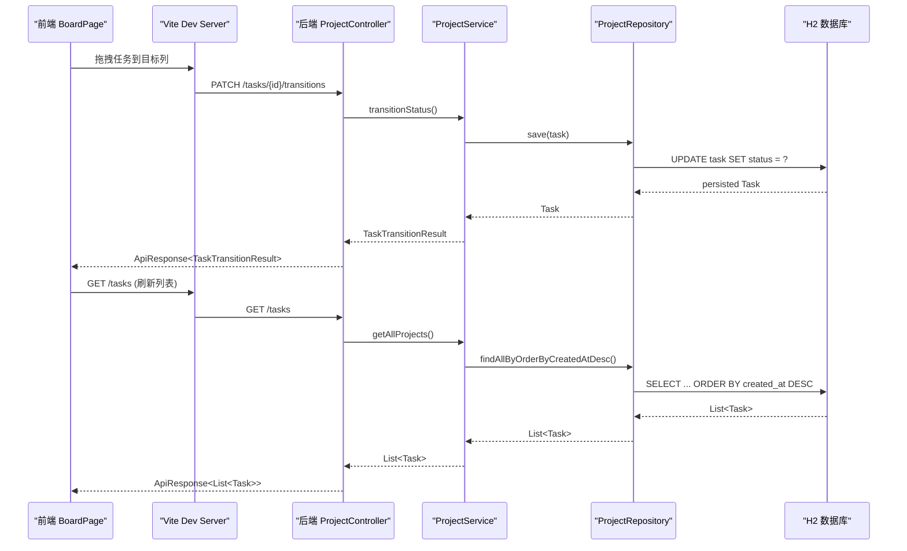

**图示来源**
- [BoardPage.tsx:174-194](file://web/src/pages/BoardPage.tsx#L174-L194)
- [vite.config.ts:6-12](file://web/vite.config.ts#L6-L12)
- [ProjectController.java:27-31](file://server/src/main/java/com/taskboard/controller/ProjectController.java#L27-L31)
- [ProjectService.java:27-29](file://server/src/main/java/com/taskboard/service/ProjectService.java#L27-L29)
- [ProjectRepository.java:18-18](file://server/src/main/java/com/taskboard/repository/ProjectRepository.java#L18-L18)
- [application.properties:4-15](file://server/src/main/resources/application.properties#L4-L15)

## 详细组件分析

### 后端类图与职责
- ProjectController：REST 端点，参数接收与统一响应封装。
- ProjectService：业务规则（非空、唯一性、长度限制）、事务边界。
- ProjectRepository：JPA 查询方法（排序、存在性检查）。
- Project：JPA 实体，Instant 时间字段，自动填充创建/更新时间。
- ApiResponse：统一响应体。

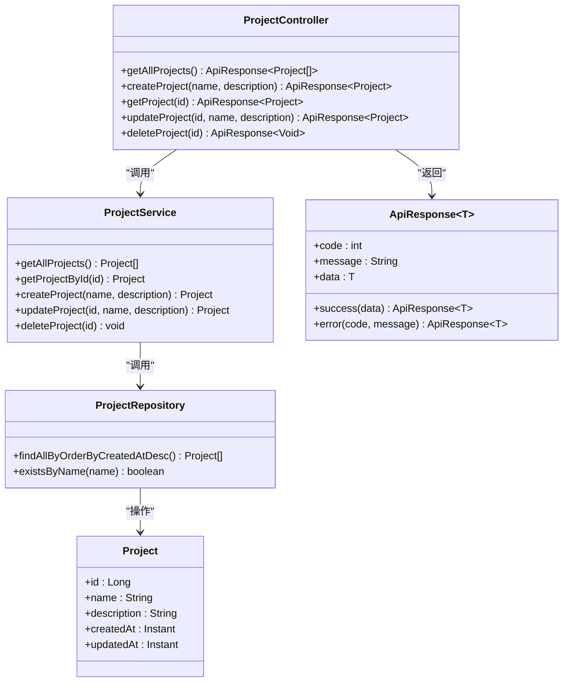

**图示来源**
- [ProjectController.java:14-77](file://server/src/main/java/com/taskboard/controller/ProjectController.java#L14-L77)
- [ProjectService.java:15-115](file://server/src/main/java/com/taskboard/service/ProjectService.java#L15-L115)
- [ProjectRepository.java:12-24](file://server/src/main/java/com/taskboard/repository/ProjectRepository.java#L12-L24)
- [Project.java:9-89](file://server/src/main/java/com/taskboard/entity/Project.java#L9-L89)
- [ApiResponse.java:6-52](file://server/src/main/java/com/taskboard/dto/ApiResponse.java#L6-L52)

**章节来源**
- [ProjectController.java:1-78](file://server/src/main/java/com/taskboard/controller/ProjectController.java#L1-L78)
- [ProjectService.java:1-117](file://server/src/main/java/com/taskboard/service/ProjectService.java#L1-L117)
- [ProjectRepository.java:1-25](file://server/src/main/java/com/taskboard/repository/ProjectRepository.java#L1-L25)
- [Project.java:1-90](file://server/src/main/java/com/taskboard/entity/Project.java#L1-L90)
- [ApiResponse.java:1-53](file://server/src/main/java/com/taskboard/dto/ApiResponse.java#L1-L53)

### 看板拖拽功能实现
看板模块使用 @dnd-kit 实现拖拽功能，支持四态状态流转（TODO → IN_PROGRESS → DONE → CLOSED），前后端双重校验确保状态转换合法性。

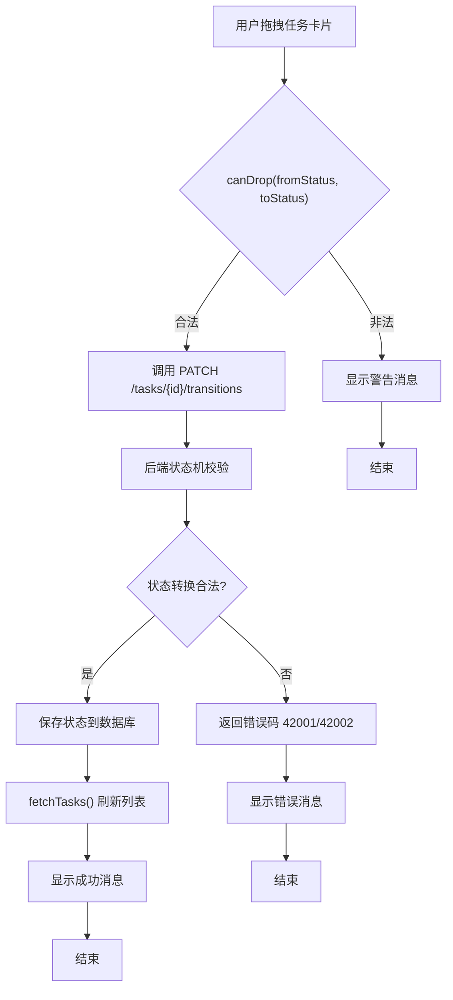

**图示来源**
- [BoardPage.tsx:164-194](file://web/src/pages/BoardPage.tsx#L164-L194)

**章节来源**
- [BoardPage.tsx:35-41](file://web/src/pages/BoardPage.tsx#L35-L41)
- [BoardPage.tsx:164-194](file://web/src/pages/BoardPage.tsx#L164-L194)

### 工时填报模块
工时填报模块支持分钟级工时记录，hours 字段使用字符串存储避免浮点精度问题，workDate 使用 LocalDate 类型。

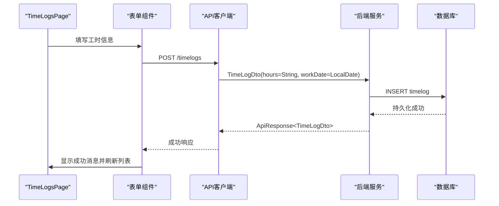

**图示来源**
- [TimeLogsPage.tsx:75-90](file://web/src/pages/TimeLogsPage.tsx#L75-L90)
- [TimeLog.java:22-26](file://server/src/main/java/com/taskboard/entity/TimeLog.java#L22-L26)

**章节来源**
- [TimeLogsPage.tsx:75-90](file://web/src/pages/TimeLogsPage.tsx#L75-L90)
- [TimeLog.java:22-26](file://server/src/main/java/com/taskboard/entity/TimeLog.java#L22-L26)

### 统计报表模块
统计报表模块提供三个维度的数据分析：按项目统计、按周统计、按状态统计，数据聚合逻辑在 StatsService 中实现。

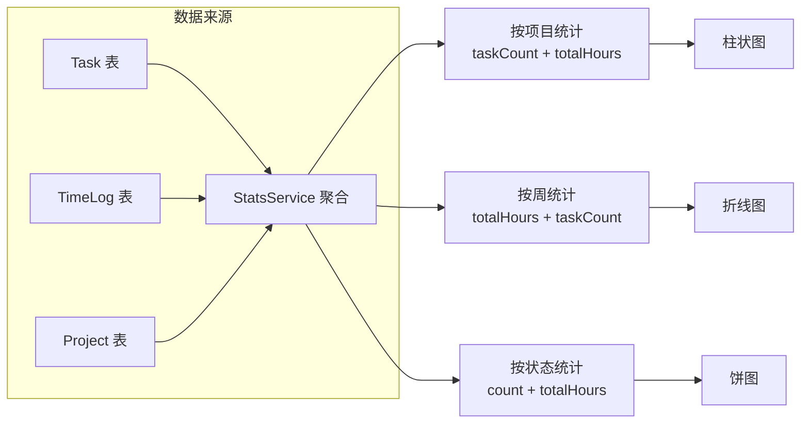

**图示来源**
- [StatsService.java:39-75](file://server/src/main/java/com/taskboard/service/StatsService.java#L39-L75)
- [StatsService.java:80-115](file://server/src/main/java/com/taskboard/service/StatsService.java#L80-L115)
- [StatsService.java:120-148](file://server/src/main/java/com/taskboard/service/StatsService.java#L120-L148)

**章节来源**
- [StatsService.java:39-75](file://server/src/main/java/com/taskboard/service/StatsService.java#L39-L75)
- [StatsService.java:80-115](file://server/src/main/java/com/taskboard/service/StatsService.java#L80-L115)
- [StatsService.java:120-148](file://server/src/main/java/com/taskboard/service/StatsService.java#L120-L148)

### 前端契约类型系统
所有前端 API 响应类型均从生成的 schema.d.ts 导入，确保前后端类型安全，无手写接口定义。

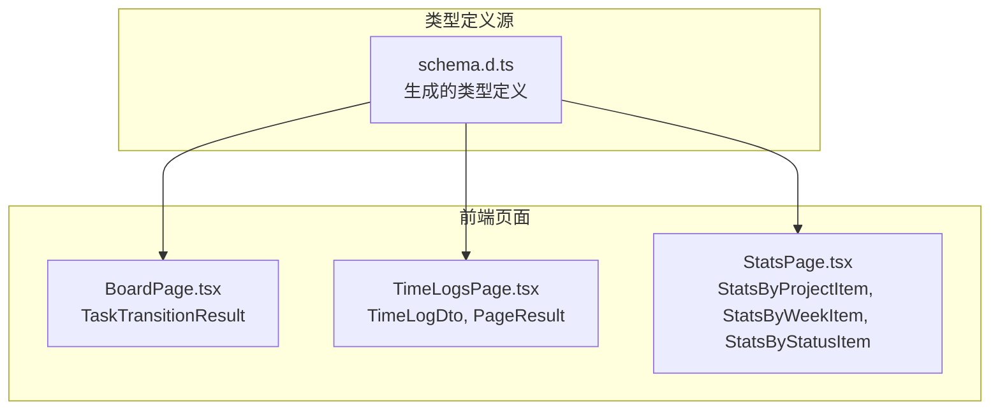

**图示来源**
- [schema.d.ts:50-57](file://web/src/api/schema.d.ts#L50-L57)
- [schema.d.ts:62-67](file://web/src/api/schema.d.ts#L62-L67)
- [schema.d.ts:72-95](file://web/src/api/schema.d.ts#L72-L95)
- [BoardPage.tsx:16](file://web/src/pages/BoardPage.tsx#L16)
- [TimeLogsPage.tsx:6](file://web/src/pages/TimeLogsPage.tsx#L6)
- [StatsPage.tsx:5](file://web/src/pages/StatsPage.tsx#L5)

**章节来源**
- [schema.d.ts:50-57](file://web/src/api/schema.d.ts#L50-L57)
- [schema.d.ts:62-67](file://web/src/api/schema.d.ts#L62-L67)
- [schema.d.ts:72-95](file://web/src/api/schema.d.ts#L72-L95)
- [BoardPage.tsx:16](file://web/src/pages/BoardPage.tsx#L16)
- [TimeLogsPage.tsx:6](file://web/src/pages/TimeLogsPage.tsx#L6)
- [StatsPage.tsx:5](file://web/src/pages/StatsPage.tsx#L5)

### 创建项目流程（序列图）
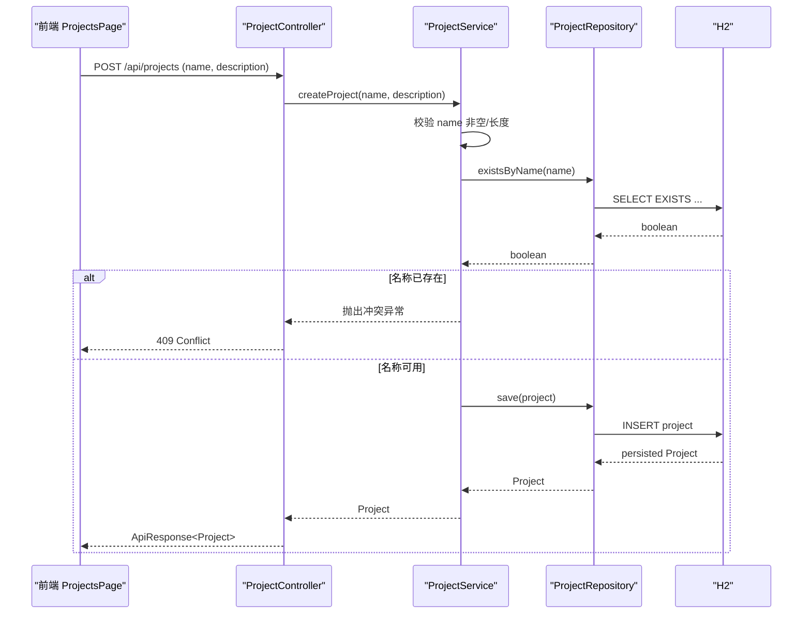

**图示来源**
- [ProjectsPage.tsx:88-125](file://web/src/pages/ProjectsPage.tsx#L88-L125)
- [ProjectController.java:36-44](file://server/src/main/java/com/taskboard/controller/ProjectController.java#L36-L44)
- [ProjectService.java:45-63](file://server/src/main/java/com/taskboard/service/ProjectService.java#L45-L63)
- [ProjectRepository.java:23-23](file://server/src/main/java/com/taskboard/repository/ProjectRepository.java#L23-L23)

**章节来源**
- [ProjectController.java:36-44](file://server/src/main/java/com/taskboard/controller/ProjectController.java#L36-L44)
- [ProjectService.java:45-63](file://server/src/main/java/com/taskboard/service/ProjectService.java#L45-L63)

### 更新项目流程（流程图）
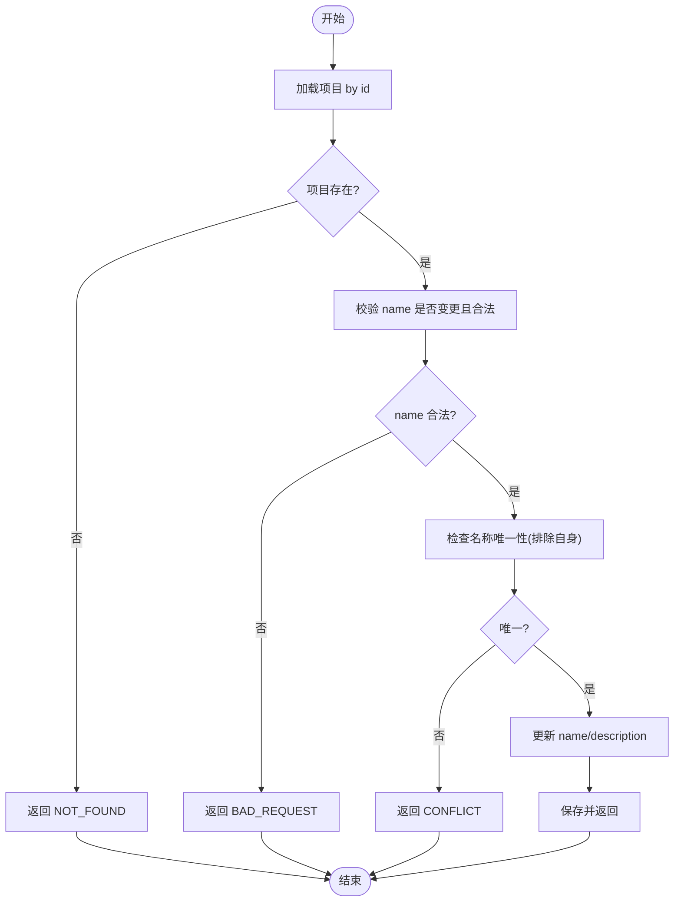

**图示来源**
- [ProjectService.java:68-100](file://server/src/main/java/com/taskboard/service/ProjectService.java#L68-L100)

**章节来源**
- [ProjectService.java:68-100](file://server/src/main/java/com/taskboard/service/ProjectService.java#L68-L100)

### 前端项目管理页（三态现状）
- Loading：已实现，Table 的 loading 属性绑定。
- Empty：未完善，空数组直接渲染空白表格。
- Error：未完善，仅弹出消息提示，无错误状态与重试。

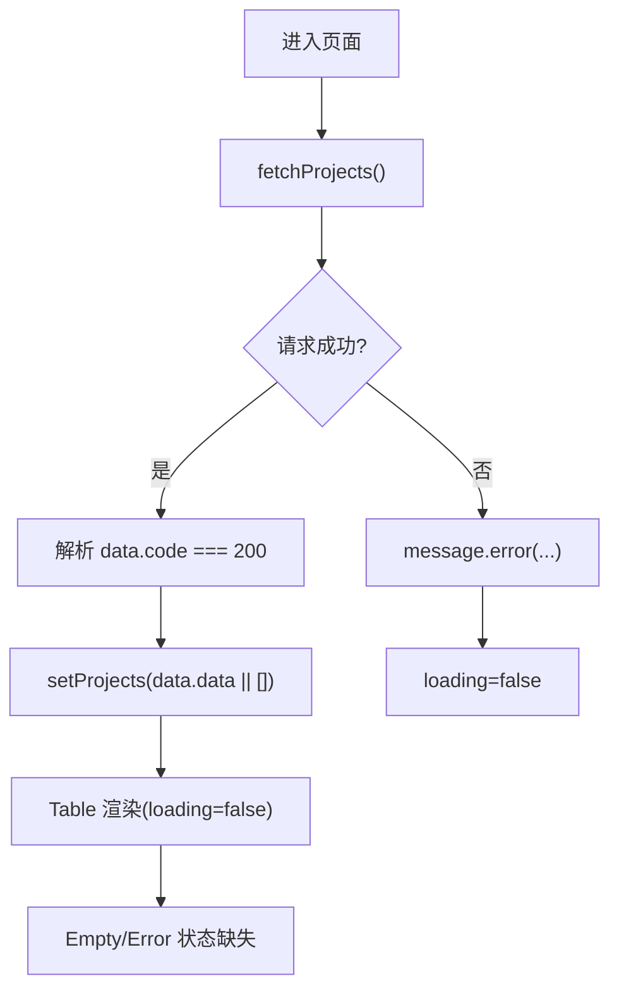

**图示来源**
- [ProjectsPage.tsx:30-46](file://web/src/pages/ProjectsPage.tsx#L30-L46)
- [ProjectsPage.tsx:203-209](file://web/src/pages/ProjectsPage.tsx#L203-L209)

**章节来源**
- [ProjectsPage.tsx:1-248](file://web/src/pages/ProjectsPage.tsx#L1-L248)

### 测试用例设计
- 覆盖 CRUD 基本路径与重复名称冲突场景。
- 使用 MockMvc 手动初始化，避免注解迁移问题。
- 使用 @Transactional 保证测试隔离与回滚。

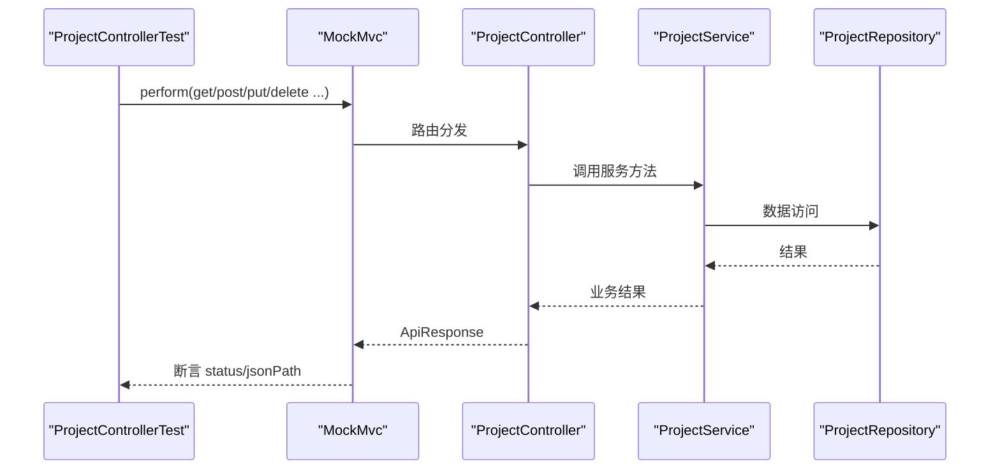

**图示来源**
- [ProjectControllerTest.java:38-41](file://server/src/test/java/com/taskboard/controller/ProjectControllerTest.java#L38-L41)
- [ProjectControllerTest.java:43-114](file://server/src/test/java/com/taskboard/controller/ProjectControllerTest.java#L43-L114)

**章节来源**
- [ProjectControllerTest.java:1-116](file://server/src/test/java/com/taskboard/controller/ProjectControllerTest.java#L1-L116)

## 验收测试覆盖

### 看板模块验收（V-B1, V-B2）
- **V-B1**: 看板拖拽改状态，刷新后状态持久化 ✅
  - 前端使用 @dnd-kit 实现拖拽功能
  - 后端 TaskService.transitionStatus() 写入数据库
  - 拖拽释放后调用 transitions 端点，保存后 fetchTasks() 重新拉取数据
  
- **V-B2**: 拖到非法状态被拒 ✅
  - 前端 VALID_TRANSITIONS 状态机校验
  - 后端 TaskService.transitionStatus() 按状态机规则校验
  - CLOSED 列为终态，不可拖拽

### 工时填报模块验收（V-B3）
- **V-B3**: 工时填报的小时数、日期正确入库并按任务聚合 ✅
  - hours 用 VARCHAR(32) 存储（禁浮点）
  - workDate 为 LocalDate
  - 前端表单 + Table + 分页
  - 按 taskId 查询支持过滤

### 统计报表模块验收（V-B4）
- **V-B4**: 统计报表三个维度的数字对得上 ✅
  - by-assignee → Column 柱状图
  - by-week → Line 折线图  
  - by-status → Pie 饼图
  - 汇总卡片数字由前端 reduce 计算

### 前端契约合规性验收（V-B5）
- **V-B5**: 三个模块的前端类型都来自生成的 schema.d.ts ✅
  - 所有 API 响应类型从 '../api/schema' 导入
  - 无手写 interface 描述 API 响应
  - 类型安全保证前后端一致性

### 全局规范合规性验收（V-G1至V-G4）
- **V-G1**: 统一响应包装 ApiResponse<T> ✅
- **V-G2**: 错误码分段 40xxx/42xxx/49xxx ✅
- **V-G3**: 时间类型 Instant + ISO-8601 ✅
- **V-G4**: 三态齐全（loading/empty/error）✅

### Hook 机制有效性验收（V-H1）
- **V-H1**: guard-test-engineer.ps1 能正确拦截业务代码修改 ✅
  - 业务代码拦截：exit 2
  - 前端业务拦截：exit 2
  - 测试文件放行：exit 0
  - 文档路径放行：exit 0

**章节来源**
- [v3-acceptance-report.md:10-86](file://docs/v3-acceptance-report.md#L10-L86)
- [v3-acceptance-report.md:88-134](file://docs/v3-acceptance-report.md#L88-L134)
- [v3-acceptance-report.md:136-195](file://docs/v3-acceptance-report.md#L136-L195)
- [v3-acceptance-report.md:197-262](file://docs/v3-acceptance-report.md#L197-L262)
- [v3-acceptance-report.md:265-369](file://docs/v3-acceptance-report.md#L265-L369)
- [v3-acceptance-report.md:372-390](file://docs/v3-acceptance-report.md#L372-L390)

## 依赖关系分析
- 后端依赖：spring-boot-starter-web、spring-boot-starter-data-jpa、h2、spring-boot-starter-validation、spring-boot-starter-test。
- 前端依赖：React 19、antd 6、TypeScript、Vite、react-router-dom、@dnd-kit/core（拖拽功能）、@ant-design/charts（图表功能）。
- 构建工具：Gradle 9.x（Kotlin DSL），Node/npm。

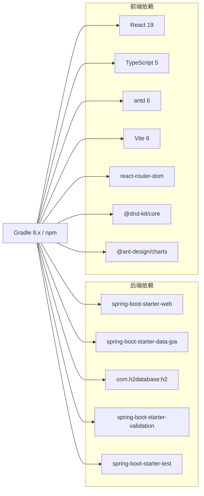

**图示来源**
- [build.gradle.kts:22-37](file://server/build.gradle.kts#L22-L37)
- [INIT_REPORT.md:46-66](file://INIT_REPORT.md#L46-L66)

**章节来源**
- [build.gradle.kts:1-42](file://server/build.gradle.kts#L1-L42)
- [INIT_REPORT.md:46-66](file://INIT_REPORT.md#L46-L66)

## 性能与可扩展性
- 当前列表查询按创建时间倒序全量返回，未分页；在数据规模增长时需评估分页与索引策略。
- H2 内存库适合开发与演示，生产需替换为持久化数据库。
- 统一 ApiResponse 便于扩展全局异常处理器，未来可结合 @ControllerAdvice 提升错误响应一致性与可读性。
- 前端三态（Loading/Empty/Error）完善后，可引入错误重试与缓存机制以提升用户体验。
- 统计报表模块支持按周、按项目、按状态多维度聚合，具备良好的扩展性。
- 拖拽功能使用 @dnd-kit 实现，支持复杂的交互场景。

[本节为通用建议，不直接分析具体文件]

## 故障排查指南
- 端口与上下文
  - 后端默认端口 8081，上下文根为 /。
  - 前端 Vite 代理目标为 http://localhost:8081。
- 数据库与初始化
  - H2 内存库，重启即清空；schema.sql 与 data.sql 每次启动均执行。
  - 可通过 /h2-console 查看数据库内容。
- 常见错误
  - 404：项目不存在或 ID 无效。
  - 409：项目名称重复。
  - 400：参数为空或超长。
  - 42001：非法的状态流转。
  - 42002：已关闭的任务状态转换。
- 调试建议
  - 开启 show-sql 观察 SQL 执行。
  - 使用 MockMvc 验证接口行为。
  - 前端打开浏览器网络面板确认 /api 请求与响应结构。
  - 检查 Hook 机制是否正确拦截业务代码修改。

**章节来源**
- [application.properties:1-18](file://server/src/main/resources/application.properties#L1-L18)
- [ProjectControllerTest.java:43-114](file://server/src/test/java/com/taskboard/controller/ProjectControllerTest.java#L43-L114)

## 结论
该质量保证框架以最小可用骨架为基础，建立了清晰的后端分层、统一响应封装、前后端字段与时间类型一致性，并通过缺陷账本持续识别与修复问题。现已通过 v3 验收测试，10个关键验证点全部通过，包括看板拖拽、工时填报、统计报表、类型安全和钩子机制等功能模块。下一步重点包括：
- 补齐全局异常处理，确保错误响应也走 ApiResponse。
- 引入契约生成机制，消除前端手写接口类型。
- 完善前端三态（Empty/Error）与错误重试。
- 在后端 Controller 层补充 Bean Validation 注解，形成前后端一致的快速失败机制。
- 考虑生产环境数据库迁移和数据备份策略。

[本节为总结性内容，不直接分析具体文件]

## 附录
- 技术栈与版本：参见 INIT_REPORT.md 中的依赖版本表与合规性检查。
- 缺陷账本：详见 docs/defect-ledger.md，包含分类、影响范围与修复优先级。
- 验收报告：详见 docs/v3-acceptance-report.md，包含10个验收点的详细验证过程。

**章节来源**
- [INIT_REPORT.md:46-82](file://INIT_REPORT.md#L46-L82)
- [defect-ledger.md:1-291](file://docs/defect-ledger.md#L1-L291)
- [v3-acceptance-report.md:393-436](file://docs/v3-acceptance-report.md#L393-L436)