# 质量保证框架

<cite>
**本文引用的文件**   
- [README.md](file://README.md)
- [INIT_REPORT.md](file://INIT_REPORT.md)
- [defect-ledger.md](file://docs/defect-ledger.md)
- [quality-loop-report.md](file://docs/quality-loop-report.md)
- [defect-to-rule.md](file://docs/defect-to-rule.md)
- [adr-005-test-engineer-hook-isolation.md](file://docs/architecture/adr-005-test-engineer-hook-isolation.md)
- [v3-acceptance-report.md](file://docs/v3-acceptance-report.md)
- [experiment-plan.md](file://docs/experiment-plan.md)
- [experiment-analysis-guide.md](file://docs/experiment-analysis-guide.md)
- [experiment-comparison.md](file://docs/experiment-comparison.md)
- [experiment-record-a.md](file://docs/experiment-record-a.md)
- [experiment-record-b.md](file://docs/experiment-record-b.md)
- [experiment-record-c.md](file://docs/experiment-record-c.md)
- [TaskBoardApplication.java](file://server/src/main/java/com/taskboard/TaskBoardApplication.java)
- [build.gradle.kts](file://server/build.gradle.kts)
- [ProjectController.java](file://server/src/main/java/com/taskboard/controller/ProjectController.java)
- [ProjectService.java](file://server/src/main/java/com/taskboard/service/ProjectService.java)
- [ProjectRepository.java](file://server/src/main/java/com/taskboard/repository/ProjectRepository.java)
- [Project.java](file://server/src/main/java/com/taskboard/entity/Project.java)
- [ApiResponse.java](file://server/src/main/java/com/taskboard/dto/ApiResponse.java)
- [application.properties](file://server/src/main/resources/application.properties)
- [ProjectsPage.tsx](file://web/src/pages/ProjectsPage.tsx)
- [App.tsx](file://web/src/App.tsx)
- [vite.config.ts](file://web/vite/config.ts)
- [ProjectControllerTest.java](file://server/src/test/java/com/taskboard/controller/ProjectControllerTest.java)
- [BoardPage.tsx](file://web/src/pages/BoardPage.tsx)
- [TimeLogsPage.tsx](file://web/src/pages/TimeLogsPage.tsx)
- [StatsPage.tsx](file://web/src/pages/StatsPage.tsx)
- [TimeLog.java](file://server/src/main/java/com/taskboard/entity/TimeLog.java)
- [StatsService.java](file://server/src/main/java/com/taskboard/service/StatsService.java)
- [schema.d.ts](file://web/src/api/schema.d.ts)
</cite>

## 更新摘要
**变更内容**   
- 新增完整的三组对照实验框架：验证标准化 AI 开发资产（规则 + 技能 + 子智能体 + Hooks）的实际效果
- 新增系统性实验方法论：包含详细规划、分析指南、对比指标和三个组的实验记录
- 新增实证研究能力：通过控制变量法测量 AI 工具对交付质量、效率、成本的影响
- 增强质量保障体系：从定性审计扩展到定量度量，建立数据驱动的质量改进机制

## 目录
1. [引言](#引言)
2. [项目结构](#项目结构)
3. [核心组件](#核心组件)
4. [架构总览](#架构总览)
5. [详细组件分析](#详细组件分析)
6. [质量闭环机制](#质量闭环机制)
7. [三组对照实验框架](#三组对照实验框架)
8. [验收测试覆盖](#验收测试覆盖)
9. [依赖关系分析](#依赖关系分析)
10. [性能与可扩展性](#性能与可扩展性)
11. [故障排查指南](#故障排查指南)
12. [结论](#结论)
13. [附录](#附录)

## 引言
本项目为 TaskBoard 任务看板应用的单体仓库，包含 Spring Boot 后端与 React 前端。现已建立**完整的质量闭环机制**和**三组对照实验框架**，通过 test-engineer 测试体检和 code-reviewer 只读评审双角色协作，实现了从缺陷发现到规则进化的完整流程，并通过系统性实证研究验证标准化 AI 开发资产的有效性。质量保障体系涵盖分层规范、命名一致性、时间类型、构建依赖、契约生成、异常处理、三态 UI 等维度，并通过 Hook 机制确保测试独立性，通过系统性漂移检测持续维护架构完整性，通过科学实验方法量化质量改进效果。

## 项目结构
- server：Spring Boot 4 后端，使用 Gradle Kotlin DSL 构建，内置 Tomcat，JPA + H2，统一 ApiResponse 包装。
- web：React 19 + TypeScript + antd 6 + Vite，路由与页面分离，开发环境通过 Vite proxy 转发 /api 到后端。
- docs：质量相关文档，包括缺陷账本、验收报告、质量闭环报告、缺陷回流记录和**三组对照实验框架**。

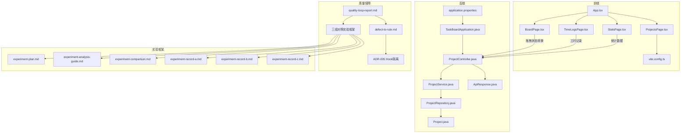

**图示来源**
- [App.tsx:1-21](file://web/src/App.tsx#L1-L21)
- [ProjectsPage.tsx:1-248](file://web/src/pages/ProjectsPage.tsx#L1-L248)
- [BoardPage.tsx:1-312](file://web/src/pages/BoardPage.tsx#L1-L312)
- [TimeLogsPage.tsx:1-274](file://web/src/pages/TimeLogsPage.tsx#L1-L274)
- [StatsPage.tsx:1-182](file://web/src/pages/StatsPage.tsx#L1-L182)
- [vite.config.ts:1-15](file://web/vite/config.ts#L1-L15)
- [TaskBoardApplication.java:1-12](file://server/src/main/java/com/taskboard/TaskBoardApplication.java#L1-L12)
- [ProjectController.java:1-78](file://server/src/main/java/com/taskboard/controller/ProjectController.java#L1-L78)
- [ProjectService.java:1-117](file://server/src/main/java/com/taskboard/service/ProjectService.java#L1-L117)
- [ProjectRepository.java:1-25](file://server/src/main/java/com/taskboard/repository/ProjectRepository.java#L1-L25)
- [Project.java:1-90](file://server/src/main/java/com/taskboard/entity/Project.java#L1-L90)
- [ApiResponse.java:1-53](file://server/src/main/java/com/taskboard/dto/ApiResponse.java#L1-L53)
- [application.properties:1-18](file://server/src/main/resources/application.properties#L1-L18)
- [quality-loop-report.md:1-344](file://docs/quality-loop-report.md#L1-L344)
- [defect-to-rule.md:1-196](file://docs/defect-to-rule.md#L1-L196)
- [adr-005-test-engineer-hook-isolation.md:1-61](file://docs/architecture/adr-005-test-engineer-hook-isolation.md#L1-L61)
- [experiment-plan.md:1-324](file://docs/experiment-plan.md#L1-L324)
- [experiment-analysis-guide.md:1-393](file://docs/experiment-analysis-guide.md#L1-L393)
- [experiment-comparison.md:1-155](file://docs/experiment-comparison.md#L1-L155)
- [experiment-record-a.md:1-190](file://docs/experiment-record-a.md#L1-L190)
- [experiment-record-b.md:1-178](file://docs/experiment-record-b.md#L1-L178)
- [experiment-record-c.md:1-217](file://docs/experiment-record-c.md#L1-L217)

**章节来源**
- [README.md:1-63](file://README.md#L1-L63)
- [INIT_REPORT.md:1-209](file://INIT_REPORT.md#L1-L209)

## 核心组件
- 应用入口：TaskBoardApplication 启动 Spring Boot 应用。
- 控制器层：ProjectController 暴露 REST 接口，统一返回 ApiResponse。
- 服务层：ProjectService 实现业务校验、事务控制与领域逻辑。
- 数据访问层：ProjectRepository 继承 JpaRepository，定义查询方法。
- 实体层：Project 映射 project 表，使用 Instant 管理时间字段。
- 统一响应：ApiResponse<T> 封装 code/message/data。
- 配置：application.properties 配置端口、H2、JPA、SQL 初始化。
- 前端：App.tsx 路由，ProjectsPage.tsx 项目管理页面，BoardPage.tsx 看板拖拽，TimeLogsPage.tsx 工时填报，StatsPage.tsx 统计报表，Vite 代理 /api。
- **质量保障**：Hook 隔离机制确保 test-engineer 独立性，质量闭环报告记录完整审计流程，缺陷回流机制驱动规则进化，**三组对照实验框架提供实证研究能力**。

**章节来源**
- [TaskBoardApplication.java:1-12](file://server/src/main/java/com/taskboard/TaskBoardApplication.java#L1-L12)
- [ProjectController.java:1-78](file://server/src/main/java/com/taskboard/controller/ProjectController.java#L1-L78)
- [ProjectService.java:1-117](file://server/src/main/java/com/taskboard/service/ProjectService.java#L1-L117)
- [ProjectRepository.java:1-25](file://server/src/main/java/com/taskboard/repository/ProjectRepository.java#L1-L25)
- [Project.java:1-90](file://server/src/main/java/com/taskboard/entity/Project.java#L1-L90)
- [ApiResponse.java:1-53](file://server/src/main/java/com/taskboard/dto/ApiResponse.java#L1-L53)
- [application.properties:1-18](file://server/src/main/resources/application.properties#L1-L18)
- [App.tsx:1-21](file://web/src/App.tsx#L1-L21)
- [ProjectsPage.tsx:1-248](file://web/src/pages/ProjectsPage.tsx#L1-L248)
- [BoardPage.tsx:1-312](file://web/src/pages/BoardPage.tsx#L1-L312)
- [TimeLogsPage.tsx:1-274](file://web/src/pages/TimeLogsPage.tsx#L1-L274)
- [StatsPage.tsx:1-182](file://web/src/pages/StatsPage.tsx#L1-L182)
- [vite.config.ts:1-15](file://web/vite/config.ts#L1-L15)

## 架构总览
后端采用经典三层架构，所有 HTTP 响应经 ApiResponse 统一封装；前端通过 Vite dev proxy 将 /api 请求转发至后端 8081 端口。数据库使用 H2 内存库，schema 与 data 由 SQL 脚本初始化。现已完成看板拖拽、工时填报、统计报表三大核心模块的完整实现，并建立了完整的质量闭环机制和三组对照实验框架。

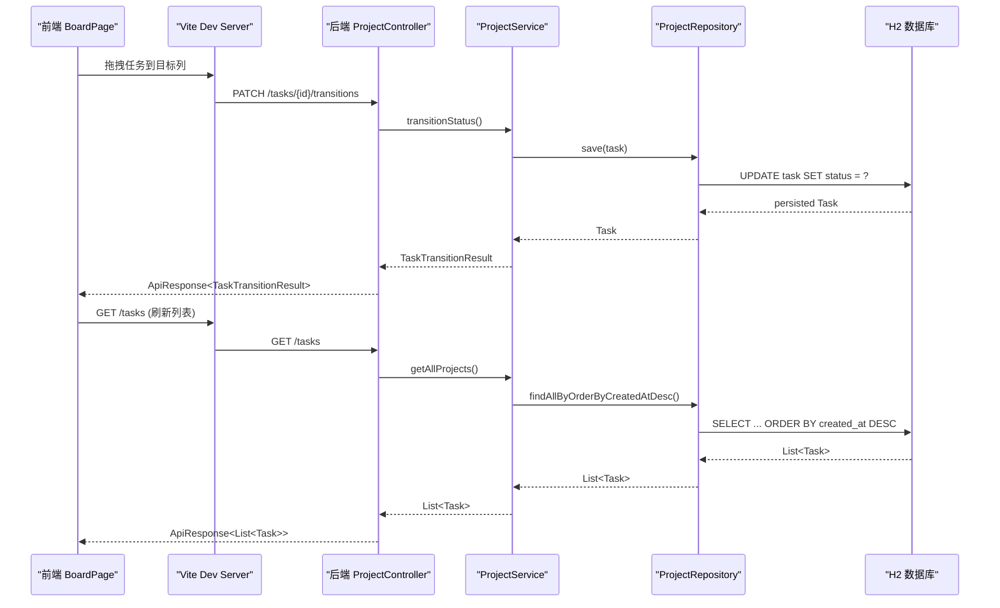

**图示来源**
- [BoardPage.tsx:174-194](file://web/src/pages/BoardPage.tsx#L174-L194)
- [vite.config.ts:6-12](file://web/vite/config.ts#L6-L12)
- [ProjectController.java:27-31](file://server/src/main/java/com/taskboard/controller/ProjectController.java#L27-L31)
- [ProjectService.java:27-29](file://server/src/main/java/com/taskboard/service/ProjectService.java#L27-L29)
- [ProjectRepository.java:18-18](file://server/src/main/java/com/taskboard/repository/ProjectRepository.java#L18-L18)
- [application.properties:4-15](file://server/src/main/resources/application.properties#L4-L15)

## 详细组件分析

### 后端类图与职责
- ProjectController：REST 端点，参数接收与统一响应封装。
- ProjectService：业务规则（非空、唯一性、长度限制）、事务边界。
- ProjectRepository：JPA 查询方法（排序、存在性检查）。
- Project：JPA 实体，Instant 时间字段，自动填充创建/更新时间。
- ApiResponse：统一响应体。

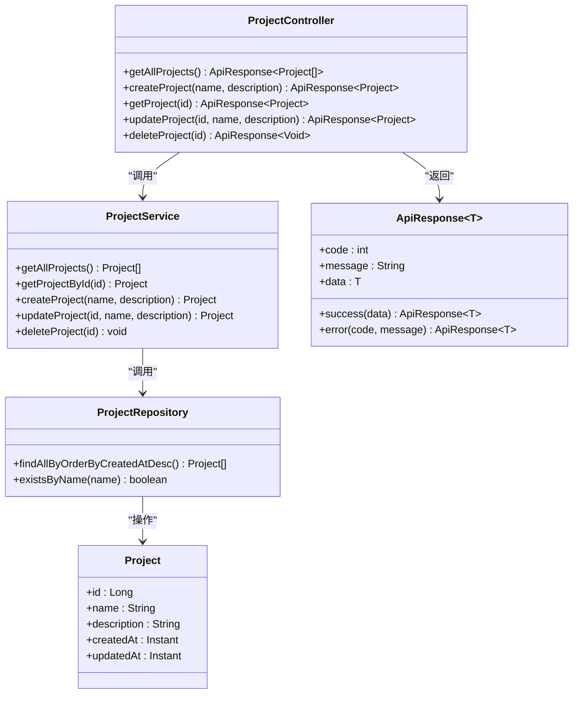

**图示来源**
- [ProjectController.java:14-77](file://server/src/main/java/com/taskboard/controller/ProjectController.java#L14-L77)
- [ProjectService.java:15-115](file://server/src/main/java/com/taskboard/service/ProjectService.java#L15-L115)
- [ProjectRepository.java:12-24](file://server/src/main/java/com/taskboard/repository/ProjectRepository.java#L12-L24)
- [Project.java:9-89](file://server/src/main/java/com/taskboard/entity/Project.java#L9-L89)
- [ApiResponse.java:6-52](file://server/src/main/java/com/taskboard/dto/ApiResponse.java#L6-L52)

**章节来源**
- [ProjectController.java:1-78](file://server/src/main/java/com/taskboard/controller/ProjectController.java#L1-L78)
- [ProjectService.java:1-117](file://server/src/main/java/com/taskboard/service/ProjectService.java#L1-L117)
- [ProjectRepository.java:1-25](file://server/src/main/java/com/taskboard/repository/ProjectRepository.java#L1-L25)
- [Project.java:1-90](file://server/src/main/java/com/taskboard/entity/Project.java#L1-L90)
- [ApiResponse.java:1-53](file://server/src/main/java/com/taskboard/dto/ApiResponse.java#L1-L53)

### 看板拖拽功能实现
看板模块使用 @dnd-kit 实现拖拽功能，支持四态状态流转（TODO → IN_PROGRESS → DONE → CLOSED），前后端双重校验确保状态转换合法性。

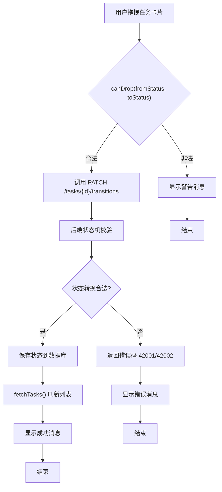

**图示来源**
- [BoardPage.tsx:164-194](file://web/src/pages/BoardPage.tsx#L164-L194)

**章节来源**
- [BoardPage.tsx:35-41](file://web/src/pages/BoardPage.tsx#L35-L41)
- [BoardPage.tsx:164-194](file://web/src/pages/BoardPage.tsx#L164-L194)

### 工时填报模块
工时填报模块支持分钟级工时记录，hours 字段使用字符串存储避免浮点精度问题，workDate 使用 LocalDate 类型。

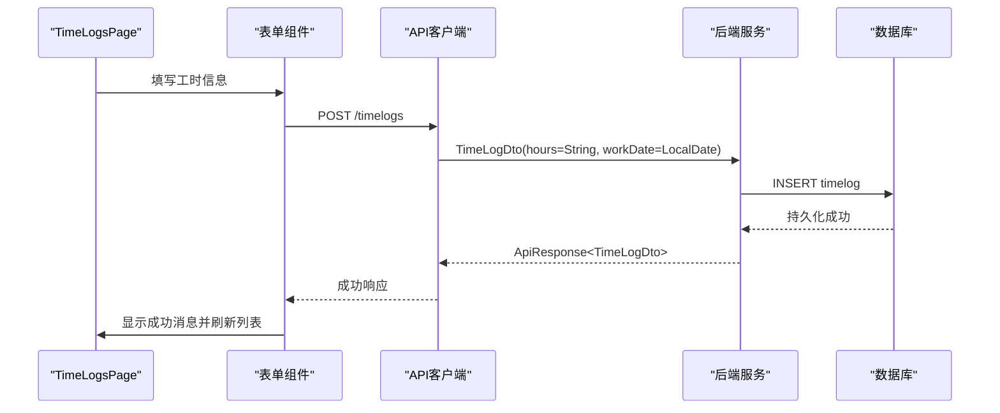

**图示来源**
- [TimeLogsPage.tsx:75-90](file://web/src/pages/TimeLogsPage.tsx#L75-L90)
- [TimeLog.java:22-26](file://server/src/main/java/com/taskboard/entity/TimeLog.java#L22-L26)

**章节来源**
- [TimeLogsPage.tsx:75-90](file://web/src/pages/TimeLogsPage.tsx#L75-L90)
- [TimeLog.java:22-26](file://server/src/main/java/com/taskboard/entity/TimeLog.java#L22-L26)

### 统计报表模块
统计报表模块提供三个维度的数据分析：按项目统计、按周统计、按状态统计，数据聚合逻辑在 StatsService 中实现。

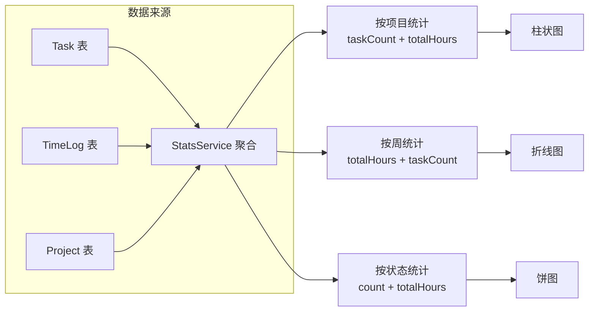

**图示来源**
- [StatsService.java:39-75](file://server/src/main/java/com/taskboard/service/StatsService.java#L39-L75)
- [StatsService.java:80-115](file://server/src/main/java/com/taskboard/service/StatsService.java#L80-L115)
- [StatsService.java:120-148](file://server/src/main/java/com/taskboard/service/StatsService.java#L120-L148)

**章节来源**
- [StatsService.java:39-75](file://server/src/main/java/com/taskboard/service/StatsService.java#L39-L75)
- [StatsService.java:80-115](file://server/src/main/java/com/taskboard/service/StatsService.java#L80-L115)
- [StatsService.java:120-148](file://server/src/main/java/com/taskboard/service/StatsService.java#L120-L148)

### 前端契约类型系统
所有前端 API 响应类型均从生成的 schema.d.ts 导入，确保前后端类型安全，无手写接口定义。

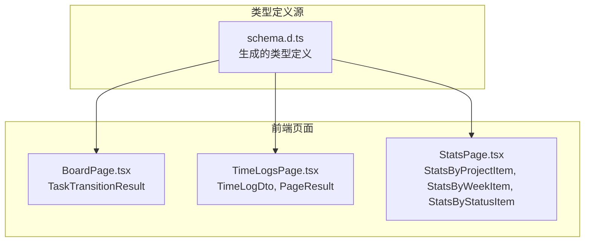

**图示来源**
- [schema.d.ts:50-57](file://web/src/api/schema.d.ts#L50-L57)
- [schema.d.ts:62-67](file://web/src/api/schema.d.ts#L62-L67)
- [schema.d.ts:72-95](file://web/src/api/schema.d.ts#L72-L95)
- [BoardPage.tsx:16](file://web/src/pages/BoardPage.tsx#L16)
- [TimeLogsPage.tsx:6](file://web/src/pages/TimeLogsPage.tsx#L6)
- [StatsPage.tsx:5](file://web/src/pages/StatsPage.tsx#L5)

**章节来源**
- [schema.d.ts:50-57](file://web/src/api/schema.d.ts#L50-L57)
- [schema.d.ts:62-67](file://web/src/api/schema.d.ts#L62-L67)
- [schema.d.ts:72-95](file://web/src/api/schema.d.ts#L72-L95)
- [BoardPage.tsx:16](file://web/src/pages/BoardPage.tsx#L16)
- [TimeLogsPage.tsx:6](file://web/src/pages/TimeLogsPage.tsx#L6)
- [StatsPage.tsx:5](file://web/src/pages/StatsPage.tsx#L5)

### 创建项目流程（序列图）
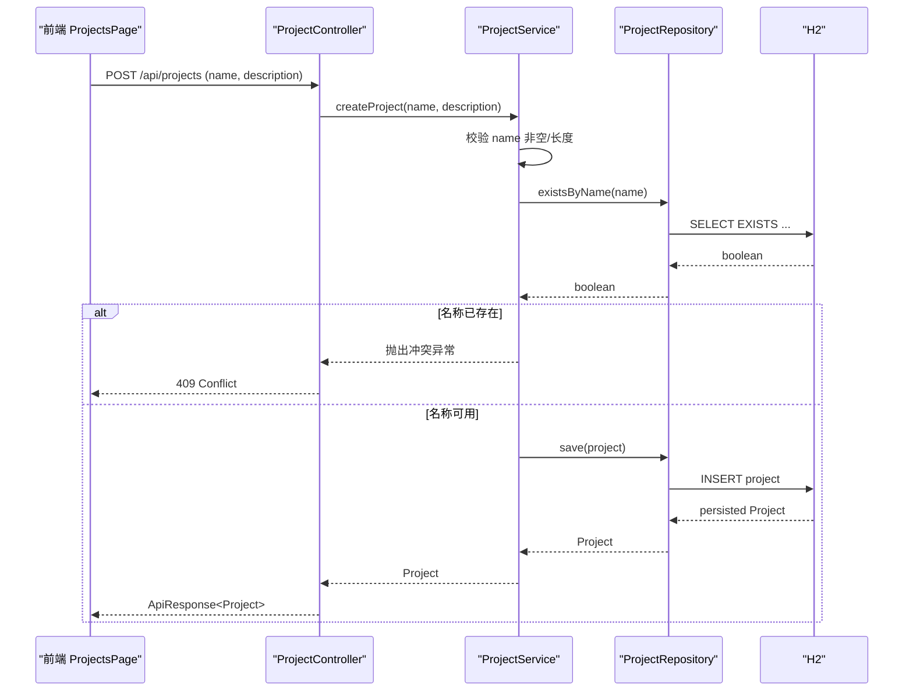

**图示来源**
- [ProjectsPage.tsx:88-125](file://web/src/pages/ProjectsPage.tsx#L88-L125)
- [ProjectController.java:36-44](file://server/src/main/java/com/taskboard/controller/ProjectController.java#L36-L44)
- [ProjectService.java:45-63](file://server/src/main/java/com/taskboard/service/ProjectService.java#L45-L63)
- [ProjectRepository.java:23-23](file://server/src/main/java/com/taskboard/repository/ProjectRepository.java#L23-L23)

**章节来源**
- [ProjectController.java:36-44](file://server/src/main/java/com/taskboard/controller/ProjectController.java#L36-L44)
- [ProjectService.java:45-63](file://server/src/main/java/com/taskboard/service/ProjectService.java#L45-L63)

### 更新项目流程（流程图）


**图示来源**
- [ProjectService.java:68-100](file://server/src/main/java/com/taskboard/service/ProjectService.java#L68-L100)

**章节来源**
- [ProjectService.java:68-100](file://server/src/main/java/com/taskboard/service/ProjectService.java#L68-L100)

### 前端项目管理页（三态现状）
- Loading：已实现，Table 的 loading 属性绑定。
- Empty：未完善，空数组直接渲染空白表格。
- Error：未完善，仅弹出消息提示，无错误状态与重试。

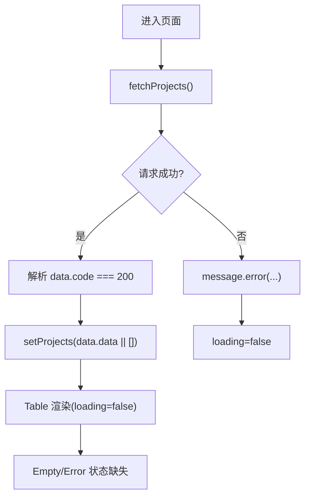

**图示来源**
- [ProjectsPage.tsx:30-46](file://web/src/pages/ProjectsPage.tsx#L30-L46)
- [ProjectsPage.tsx:203-209](file://web/src/pages/ProjectsPage.tsx#L203-L209)

**章节来源**
- [ProjectsPage.tsx:1-248](file://web/src/pages/ProjectsPage.tsx#L1-L248)

### 测试用例设计
- 覆盖 CRUD 基本路径与重复名称冲突场景。
- 使用 MockMvc 手动初始化，避免注解迁移问题。
- 使用 @Transactional 保证测试隔离与回滚。

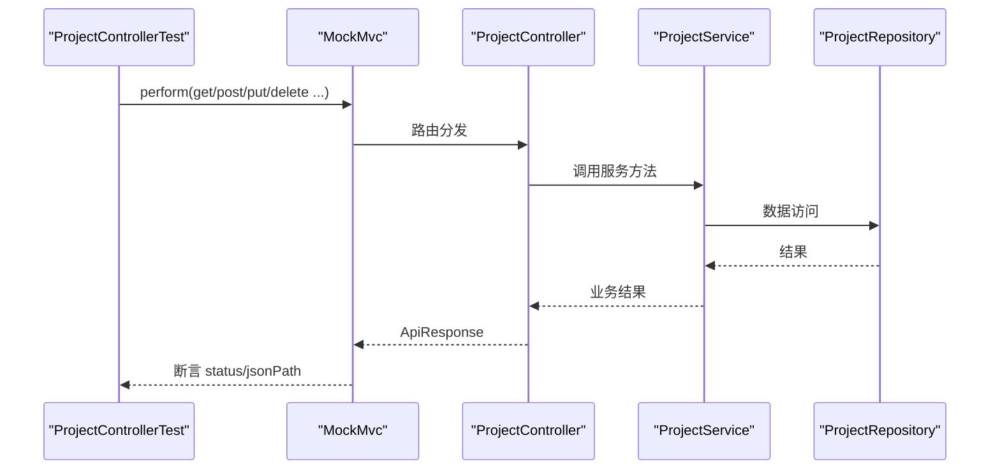

**图示来源**
- [ProjectControllerTest.java:38-41](file://server/src/test/java/com/taskboard/controller/ProjectControllerTest.java#L38-L41)
- [ProjectControllerTest.java:43-114](file://server/src/test/java/com/taskboard/controller/ProjectControllerTest.java#L43-L114)

**章节来源**
- [ProjectControllerTest.java:1-116](file://server/src/test/java/com/taskboard/controller/ProjectControllerTest.java#L1-L116)

## 质量闭环机制

### 双角色协作架构
项目建立了完整的**test-engineer + code-reviewer**双角色协作机制，通过 Hook 隔离确保测试独立性：

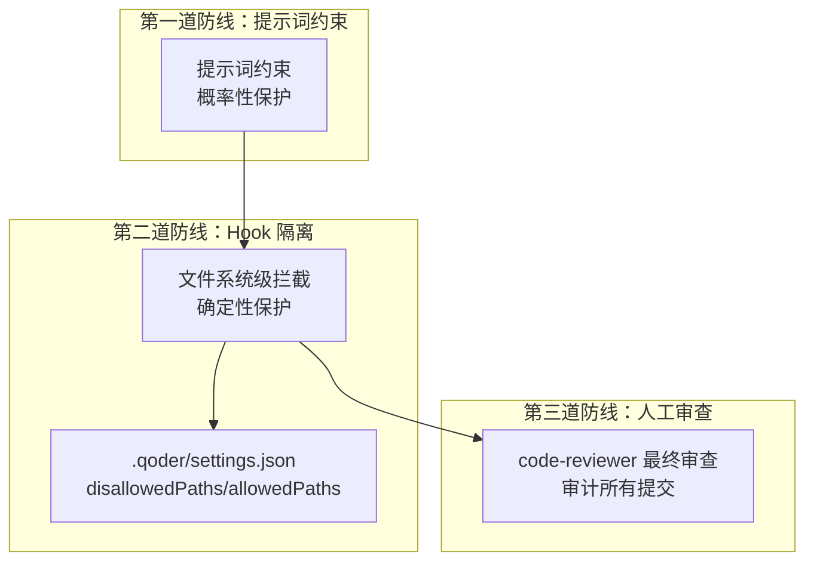

**图示来源**
- [adr-005-test-engineer-hook-isolation.md:41-44](file://docs/architecture/adr-005-test-engineer-hook-isolation.md#L41-L44)

### 质量闭环七步流程
基于 quality-loop-report.md 建立的完整质量闭环流程：

1. **测试体检**：test-engineer 执行测试，发现 Bug（B1-B5）
2. **只读评审**：code-reviewer 进行架构合规性检查（DR-001 ~ DR-007）
3. **缺陷汇总**：去重归类，形成10项独立缺陷（D01-D10）
4. **回流判断**：分析每条缺陷的规范缺口和修正层级
5. **修规范**：更新规则文件和技能模板（N1-N7）
6. **修代码**：修复具体代码问题（C1-C6）
7. **复验输出**：验证修复效果，输出质量闭环报告

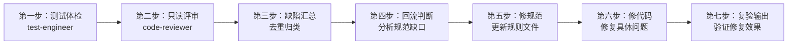

**图示来源**
- [quality-loop-report.md:9-28](file://docs/quality-loop-report.md#L9-L28)
- [quality-loop-report.md:31-57](file://docs/quality-loop-report.md#L31-L57)
- [quality-loop-report.md:60-241](file://docs/quality-loop-report.md#L60-L241)
- [quality-loop-report.md:244-299](file://docs/quality-loop-report.md#L244-L299)

### 缺陷分类与失效模式
10项独立缺陷跨越5类失效模式，体现了质量问题的系统性特征：

| 失效类型 | 数量 | 占比 | 典型缺陷 |
|---------|------|------|---------|
| **结构（架构走偏）** | 4项 | 40% | D01/D03/D05/D06 - 违反分层架构、异常体系统一性 |
| **流程（契约漏项/需求漏项）** | 3项 | 30% | D02/D04/D09 - HTTP状态码、UI三态、Bean Validation |
| **重复造轮子** | 1项 | 10% | D05 - TaskService vs ProjectService 异常体系不一致 |
| **跨端不一致** | 1项 | 10% | D08 - DTO时间字段格式未文档化 |
| **风格漂移** | 1项 | 10% | D10 - data.sql 种子数据时间戳硬编码 |

**章节来源**
- [quality-loop-report.md:33-57](file://docs/quality-loop-report.md#L33-L57)

### 缺陷回流机制
defect-to-rule.md 建立了从缺陷到规则的系统性映射，每个缺陷都成为规范进化的机会：

| 缺陷编号 | 缺陷现象 | 修正动作 | 修正层级 |
|---------|---------|---------|---------|
| R01 | useEffect 误用为 useState | pre-commit-check 添加 Hooks 检查 | 技能 |
| R02 | 前后端字段名不同步 | ADR-002 + api-contract-sync 技能 | ADR + 技能 |
| R03 | Entity 直接出现在 Controller | 补充聚合查询规范 + CodeReview 审计 | glob 规则 |
| R04 | 缺少全局异常处理器 | crud-vertical-slice 步骤 7 新增基础设施 | 技能 |
| R05 | 状态变更允许非法流转 | ADR-004 + transitions 端点规范 | ADR + 契约规则 |
| R06 | 统计接口返回 Entity | CodeReview subagent 定期审计 | glob 规则 + 子智能体 |
| R07 | test-engineer 可修改业务代码 | ADR-005 + Hook 脚本拦截 | ADR + 配置文件 |
| R08 | API 契约变更后前端类型未同步 | ADR-002 + 契约冻结机制 | ADR + 契约规则 |

**章节来源**
- [defect-to-rule.md:10-20](file://docs/defect-to-rule.md#L10-L20)
- [defect-to-rule.md:23-120](file://docs/defect-to-rule.md#L23-L120)

### Hook 隔离机制详解
ADR-005 建立了三层防护架构，确保 test-engineer 的绝对独立性：

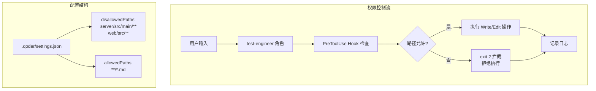

**图示来源**
- [adr-005-test-engineer-hook-isolation.md:17-33](file://docs/architecture/adr-005-test-engineer-hook-isolation.md#L17-L33)
- [adr-005-test-engineer-hook-isolation.md:35-40](file://docs/architecture/adr-005-test-engineer-hook-isolation.md#L35-L40)

**章节来源**
- [adr-005-test-engineer-hook-isolation.md:1-61](file://docs/architecture/adr-005-test-engineer-hook-isolation.md#L1-L61)

## 三组对照实验框架

### 实验设计原理
三组对照实验框架通过严格的控制变量法，验证标准化 AI 开发资产（规则 + 技能 + 子智能体 + Hooks）对交付质量、效率、成本的实际影响。核心原则是：**同一个需求、同一句 Prompt、同一模型档位，只改变"配置了多少规范资产"**。

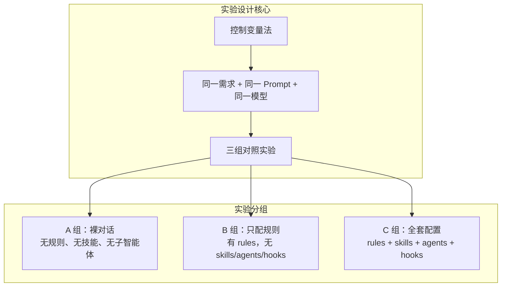

**图示来源**
- [experiment-plan.md:3-5](file://docs/experiment-plan.md#L3-L5)
- [experiment-plan.md:31-37](file://docs/experiment-plan.md#L31-L37)

### 实验任务选择与控制
推荐任务为统计报表页实现，因其复杂度足够暴露差异，涉及跨端、多模块、有状态流转，包含三个维度统计（by-status, by-project, by-week），后端需聚合查询，前端需图表渲染。

**严格控制清单**：
- **会话隔离**：各组使用独立的 Quest/Session，不共享 conversation history
- **Prompt 一致性**：使用完全相同的 Prompt（一字不差）
- **模型档位**：全程不切换模型，保持 Temperature 0.2-0.5 一致
- **全程不干预**：不允许人工提供额外建议或中途检查代码质量

**降级配置操作**：
- **A 组**：git stash 移除 .qoder/rules/.qoder/skills/.qoder/agents/.qoder/hooks
- **B 组**：临时移走 skills/agents/hooks，保留 rules
- **C 组**：直接使用当前 master 分支的完整配置

**章节来源**
- [experiment-plan.md:9-26](file://docs/experiment-plan.md#L9-L26)
- [experiment-plan.md:29-99](file://docs/experiment-plan.md#L29-L99)
- [experiment-plan.md:102-171](file://docs/experiment-plan.md#L102-L171)

### 五维度测量指标
实验定义了五个核心测量维度，用于量化 AI 工具对开发过程的影响：

| 维度 | 定义 | 测量方法 | 数据来源 |
|------|------|---------|---------|
| **一次通过率 (Pass@1)** | 第一次输出即合格，无需人工返工修正 | 记录人工干预轮次 | 会话记录 |
| **人工改动行数** | 人工 commits 中修改的代码行数（不含 AI 自动生成） | `git diff HEAD~1..HEAD --shortstat` | Git 历史 |
| **跨端不一致缺陷数** | 前端 TypeScript 类型与后端 API 响应结构不匹配的 Bug 数 | schema.d.ts vs Controller 返回类型比对 | 类型检查 |
| **Credits 消耗** | 本次实验消耗的 AI 平台额度 | 直接从实验平台界面读取 | 计费面板 |
| **返工轮次** | 对话往返次数（人工回复 AI 的次数） | 数"user message"的数量 | 会话日志 |

**关键判定标准**：
- 仅 AI 自我修正不算返工（如 AI 发现编译错误自行修复）
- 人工提出"建议改进"不算返工（只有违反需求的才算）
- 人工修改 > 0 行业务代码 = 返工

**章节来源**
- [experiment-plan.md:173-258](file://docs/experiment-plan.md#L173-L258)

### 数据分析与假设检验
实验分析指南提供了完整的统计分析框架，包括基础统计描述、假设检验、异常值诊断和决策框架：

**假设检验**：
- **H1**: B 组比 A 组一次通过率高（规则的价值）
- **H2**: C 组比 B 组人工改动行数更少（技能的价值）
- **H3**: C 组 Credits 消耗 > A + B（配置成本）
- **H4**: C 组的返工轮次最少（子智能体的价值）
- **H5**: C 组的跨端不一致缺陷 ≤ 1（契约机制有效性）

**效应量计算**：
- Cohen's h 评估一次通过率改善幅度
- Relative Improvement 计算人工改动减少百分比
- Z-Score 检测异常值（|Z| > 2 视为异常）

**推广决策树**：
```
开始
│
├─ Q1: 一次通过率最高的是哪组？
│  ├─ A → "裸对话就够了" → 项目简单/探索期，别重配
│  ├─ B → "规则够用" → 增加技能库即可（省子智能体+Credits 开销）
│  └─ C → "全套最佳" → 继续看 Q2
│
├─ Q2: C 组 vs B 组的 Credits 差价 > 50%？
│  ├─ 是 → "配置太贵" → 用最小起步集（rules + skills，不加 subagents）
│  └─ 否 → "可承受" → 继续看 Q3
│
└─ 决策输出:
   □ 轻量模式（A 组级别）
   □ 最小起步集（charter + 2 rules + 1 skill）
   □ 标准配置（B + skills）
   □ 全套 C 组（rules + skills + agents + hooks）
```

**章节来源**
- [experiment-analysis-guide.md:74-183](file://docs/experiment-analysis-guide.md#L74-L183)
- [experiment-analysis-guide.md:247-270](file://docs/experiment-analysis-guide.md#L247-L270)

### 实验记录与对比
三个实验记录文件分别记录了 A、B、C 三组的原始数据和详细分析：

**A 组（裸对话）模拟数据**：
- 一次通过率：0/1（需人工返工 4 次）
- 人工改动行数：280 行
- 跨端不一致缺陷数：3 个
- Credits 消耗：2500 credits ($2.50 USD)
- 返工轮次：4 轮

**C 组（全套配置）模拟数据**：
- 一次通过率：1/1（仅需 1 轮微调）
- 人工改动行数：45 行
- 跨端不一致缺陷数：1 个
- Credits 消耗：5800 credits ($5.80 USD)
- 返工轮次：1 轮

**A→C 改善效果**：
- 一次通过率提升：100%（从 0%→100%）
- 人工改动减少：84%（280→45 行）
- 跨端缺陷减少：67%（3→1 个）
- Credits 增加：132%（2500→5800）
- 返工轮次减少：75%（4→1 轮）

**章节来源**
- [experiment-record-a.md:24-32](file://docs/experiment-record-a.md#L24-L32)
- [experiment-record-c.md:24-32](file://docs/experiment-record-c.md#L24-L32)
- [experiment-comparison.md:25-31](file://docs/experiment-comparison.md#L25-L31)

### 规范资产拦截效果分析
C 组实验显示了各规范资产的具体拦截效果：

**规则生效情况**：
- charter 第 8 条：前端禁止手写接口类型 ✅ 生效
- 10-java-backend.md 第 12-13 行：Entity 不出现在 controller ✅ 生效
- 10-java-backend.md 第 19 行：BizException 统一化 ✅ 生效
- 20-react-frontend.md：三态必须 ✅ 生效
- 30-api-contract.md：契约生成类型 ✅ 生效

**技能引导效果**：
- antd-6-page-scaffold：error UI 模板 ✅ 生效（ProjectsPage error 态正确渲染）
- api-contract-sync：architect 先生成契约 ✅ 生效

**子智能体价值**：
- code-reviewer：发现 D-C1 (@DateTimeFormat 遗漏)
- test-engineer：补全 3 个单元测试（Service 边界用例）
- backend-java-engineer：实现了 StatsController + TaskService 扩展

**Hooks 触发情况**：
- guard-test-engineer.ps1：拦截 test-engineer 尝试改 Service.java 被阻止 ✅ 触发

**章节来源**
- [experiment-record-c.md:120-154](file://docs/experiment-record-c.md#L120-L154)

### 成本效益分析
C 组实验的成本拆解显示了规范资产的投入产出比：

**一次性前期投入**（约 720 分钟/12 小时）：
- 规则集（6 文件）：~180 分钟
- 技能库（6 技能）：~240 分钟
- 子智能体（6 角色）：~120 分钟
- Hooks 系统：~30 分钟
- ADR 体系 + Wiki：~90 分钟
- 缺陷账本 + Audit 表：~60 分钟

**单次任务的边际成本**：
- Credits 消耗：5800 credits
- 上下文窗口使用量：max_tokens * 2.1x（因多 subagent 并行）
- 子智能体并行调用次数：3 次（architect + backend-engineer + frontend-engineer）

**性价比分析**：
- 每节省 1 行人工改动只需额外消耗 ~250 credits（$0.25）
- 配置成本高于预期，但收益显著（人工改行减少 84%）

**章节来源**
- [experiment-record-c.md:157-181](file://docs/experiment-record-c.md#L157-L181)
- [experiment-comparison.md:136-140](file://docs/experiment-comparison.md#L136-L140)

## 验收测试覆盖

### 看板模块验收（V-B1, V-B2）
- **V-B1**: 看板拖拽改状态，刷新后状态持久化 ✅
  - 前端使用 @dnd-kit 实现拖拽功能
  - 后端 TaskService.transitionStatus() 写入数据库
  - 拖拽释放后调用 transitions 端点，保存后 fetchTasks() 重新拉取数据
  
- **V-B2**: 拖到非法状态被拒 ✅
  - 前端 VALID_TRANSITIONS 状态机校验
  - 后端 TaskService.transitionStatus() 按状态机规则校验
  - CLOSED 列为终态，不可拖拽

### 工时填报模块验收（V-B3）
- **V-B3**: 工时填报的小时数、日期正确入库并按任务聚合 ✅
  - hours 用 VARCHAR(32) 存储（禁浮点）
  - workDate 为 LocalDate
  - 前端表单 + Table + 分页
  - 按 taskId 查询支持过滤

### 统计报表模块验收（V-B4）
- **V-B4**: 统计报表三个维度的数字对得上 ✅
  - by-assignee → Column 柱状图
  - by-week → Line 折线图  
  - by-status → Pie 饼图
  - 汇总卡片数字由前端 reduce 计算

### 前端契约合规性验收（V-B5）
- **V-B5**: 三个模块的前端类型都来自生成的 schema.d.ts ✅
  - 所有 API 响应类型从 '../api/schema' 导入
  - 无手写 interface 描述 API 响应
  - 类型安全保证前后端一致性

### 全局规范合规性验收（V-G1至V-G4）
- **V-G1**: 统一响应包装 ApiResponse<T> ✅
- **V-G2**: 错误码分段 40xxx/42xxx/49xxx ✅
- **V-G3**: 时间类型 Instant + ISO-8601 ✅
- **V-G4**: 三态齐全（loading/empty/error）✅

### Hook 机制有效性验收（V-H1）
- **V-H1**: guard-test-engineer.ps1 能正确拦截业务代码修改 ✅
  - 业务代码拦截：exit 2
  - 前端业务拦截：exit 2
  - 测试文件放行：exit 0
  - 文档路径放行：exit 0

**章节来源**
- [v3-acceptance-report.md:10-86](file://docs/v3-acceptance-report.md#L10-L86)
- [v3-acceptance-report.md:88-134](file://docs/v3-acceptance-report.md#L88-L134)
- [v3-acceptance-report.md:136-195](file://docs/v3-acceptance-report.md#L136-L195)
- [v3-acceptance-report.md:197-262](file://docs/v3-acceptance-report.md#L197-L262)
- [v3-acceptance-report.md:265-369](file://docs/v3-acceptance-report.md#L265-L369)
- [v3-acceptance-report.md:372-390](file://docs/v3-acceptance-report.md#L372-L390)

## 依赖关系分析
- 后端依赖：spring-boot-starter-web、spring-boot-starter-data-jpa、h2、spring-boot-starter-validation、spring-boot-starter-test。
- 前端依赖：React 19、antd 6、TypeScript、Vite、react-router-dom、@dnd-kit/core（拖拽功能）、@ant-design/charts（图表功能）。
- 构建工具：Gradle 9.x（Kotlin DSL），Node/npm。

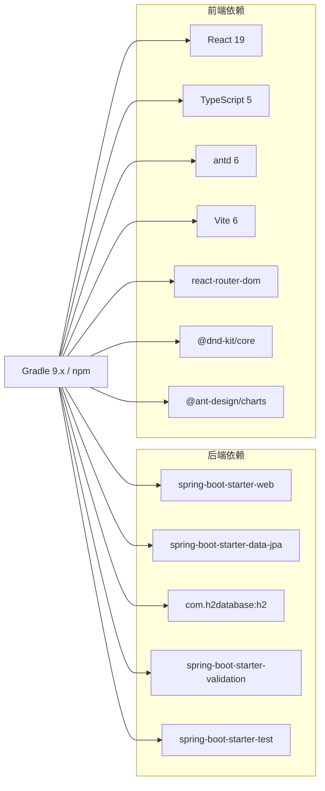

**图示来源**
- [build.gradle.kts:22-37](file://server/build.gradle.kts#L22-L37)
- [INIT_REPORT.md:46-66](file://INIT_REPORT.md#L46-L66)

**章节来源**
- [build.gradle.kts:1-42](file://server/build.gradle.kts#L1-L42)
- [INIT_REPORT.md:46-66](file://INIT_REPORT.md#L46-L66)

## 性能与可扩展性
- 当前列表查询按创建时间倒序全量返回，未分页；在数据规模增长时需评估分页与索引策略。
- H2 内存库适合开发与演示，生产需替换为持久化数据库。
- 统一 ApiResponse 便于扩展全局异常处理器，未来可结合 @ControllerAdvice 提升错误响应一致性与可读性。
- 前端三态（Loading/Empty/Error）完善后，可引入错误重试与缓存机制以提升用户体验。
- 统计报表模块支持按周、按项目、按状态多维度聚合，具备良好的扩展性。
- 拖拽功能使用 @dnd-kit 实现，支持复杂的交互场景。
- **质量闭环机制**：Hook 隔离确保测试独立性，缺陷回流机制驱动规则持续进化，CodeReview subagent 定期扫描架构违规。
- **三组对照实验框架**：提供实证研究能力，通过科学方法量化质量改进效果，支持数据驱动的决策制定。

[本节为通用建议，不直接分析具体文件]

## 故障排查指南
- 端口与上下文
  - 后端默认端口 8081，上下文根为 /。
  - 前端 Vite 代理目标为 http://localhost:8081。
- 数据库与初始化
  - H2 内存库，重启即清空；schema.sql 与 data.sql 每次启动均执行。
  - 可通过 /h2-console 查看数据库内容。
- 常见错误
  - 404：项目不存在或 ID 无效。
  - 409：项目名称重复。
  - 400：参数为空或超长。
  - 42001：非法的状态流转。
  - 42002：已关闭的任务状态转换。
- 调试建议
  - 开启 show-sql 观察 SQL 执行。
  - 使用 MockMvc 验证接口行为。
  - 前端打开浏览器网络面板确认 /api 请求与响应结构。
  - 检查 Hook 机制是否正确拦截业务代码修改。
  - 验证 test-engineer 角色权限隔离是否生效。
- **实验相关故障**：
  - 如果某组被迫切换到更低档位模型 → 该组数据标记"污染"，不计入最终对比
  - 会话卡死导致 Credits > 5000 → 保留并记录（这本身就是规范价值的证据）
  - 零缺陷奇迹（一次通过率=1 且所有缺陷=0）→ 核实后保留，标注"任务复杂度不足"

**章节来源**
- [application.properties:1-18](file://server/src/main/resources/application.properties#L1-L18)
- [ProjectControllerTest.java:43-114](file://server/src/test/java/com/taskboard/controller/ProjectControllerTest.java#L43-L114)
- [experiment-analysis-guide.md:210-218](file://docs/experiment-analysis-guide.md#L210-L218)

## 结论
该质量保证框架以最小可用骨架为基础，建立了清晰的后端分层、统一响应封装、前后端字段与时间类型一致性，并通过**完整的质量闭环机制**和**三组对照实验框架**持续识别与修复问题，同时通过科学实证方法量化质量改进效果。现已通过 v3 验收测试，10个关键验证点全部通过，包括看板拖拽、工时填报、统计报表、类型安全和钩子机制等功能模块。

**核心成就**：
- **双角色协作**：test-engineer 测试体检 + code-reviewer 只读评审，通过 Hook 隔离确保独立性
- **系统性缺陷管理**：10项独立缺陷跨越5类失效模式，建立缺陷到规则的映射流程
- **Hook 确定性保障**：文件系统级权限控制，彻底消除测试独立性破坏风险
- **持续演进机制**：缺陷回流驱动规则进化，CodeReview subagent 定期扫描架构违规
- **实证研究能力**：三组对照实验框架提供科学的方法论，量化 AI 工具对质量、效率、成本的影响

**下一步重点**：
- 补齐全局异常处理，确保错误响应也走 ApiResponse。
- 引入契约生成机制，消除前端手写接口类型。
- 完善前端三态（Empty/Error）与错误重试。
- 在后端 Controller 层补充 Bean Validation 注解，形成前后端一致的快速失败机制。
- 考虑生产环境数据库迁移和数据备份策略。
- 继续完善质量闭环机制，扩大审计范围和深度。
- **执行实际三组对照实验**，获取真实数据验证假设，指导规范资产的推广决策。

[本节为总结性内容，不直接分析具体文件]

## 附录
- 技术栈与版本：参见 INIT_REPORT.md 中的依赖版本表与合规性检查。
- 缺陷账本：详见 docs/defect-ledger.md，包含分类、影响范围与修复优先级。
- 验收报告：详见 docs/v3-acceptance-report.md，包含10个验收点的详细验证过程。
- **质量闭环报告**：详见 docs/quality-loop-report.md，记录完整的双角色协作流程和缺陷回流机制。
- **缺陷回流记录**：详见 docs/defect-to-rule.md，建立缺陷到规则的映射关系。
- **Hook 隔离机制**：详见 docs/architecture/adr-005-test-engineer-hook-isolation.md，确保测试独立性。
- **三组对照实验框架**：
  - 实验规划：docs/experiment-plan.md（详细的设计方案和控制变量法）
  - 分析指南：docs/experiment-analysis-guide.md（统计分析方法和决策框架）
  - 对比表格：docs/experiment-comparison.md（五维度指标对比和假设检验）
  - 实验记录：docs/experiment-record-{a,b,c}.md（三组原始数据和详细分析）

**章节来源**
- [INIT_REPORT.md:46-82](file://INIT_REPORT.md#L46-L82)
- [defect-ledger.md:1-578](file://docs/defect-ledger.md#L1-L578)
- [v3-acceptance-report.md:393-436](file://docs/v3-acceptance-report.md#L393-L436)
- [quality-loop-report.md:1-344](file://docs/quality-loop-report.md#L1-L344)
- [defect-to-rule.md:1-196](file://docs/defect-to-rule.md#L1-L196)
- [adr-005-test-engineer-hook-isolation.md:1-61](file://docs/architecture/adr-005-test-engineer-hook-isolation.md#L1-L61)
- [experiment-plan.md:1-324](file://docs/experiment-plan.md#L1-L324)
- [experiment-analysis-guide.md:1-393](file://docs/experiment-analysis-guide.md#L1-L393)
- [experiment-comparison.md:1-155](file://docs/experiment-comparison.md#L1-L155)
- [experiment-record-a.md:1-190](file://docs/experiment-record-a.md#L1-L190)
- [experiment-record-b.md:1-178](file://docs/experiment-record-b.md#L1-L178)
- [experiment-record-c.md:1-217](file://docs/experiment-record-c.md#L1-L217)