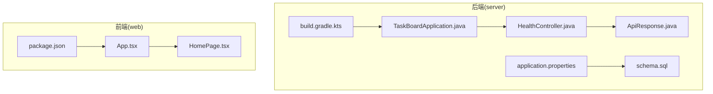
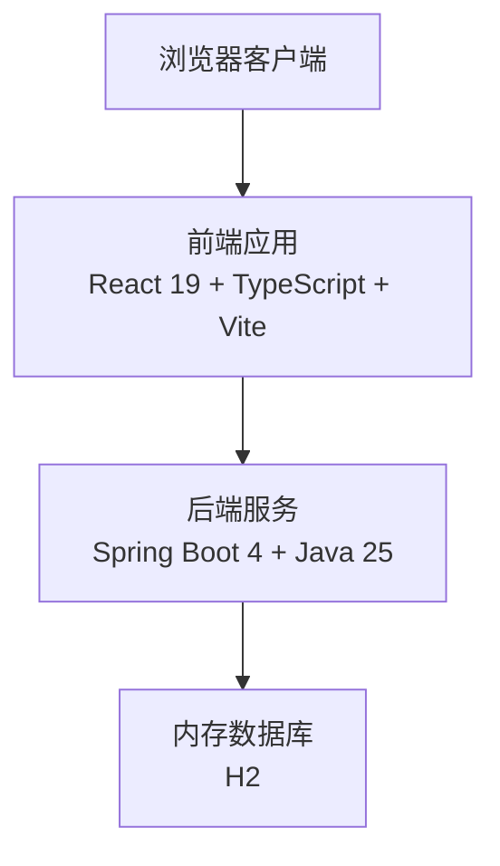
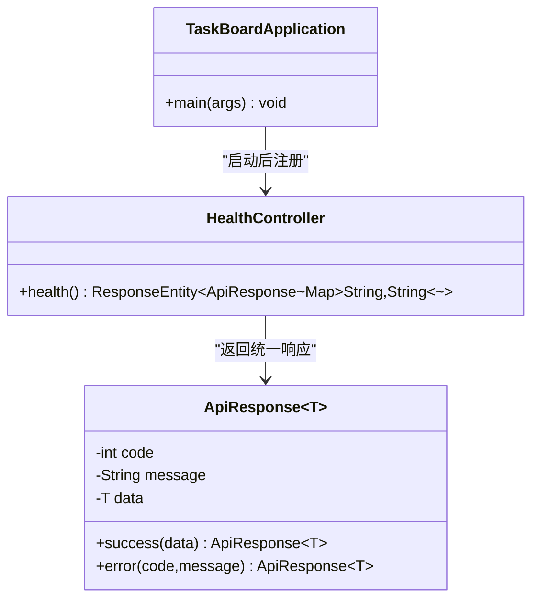
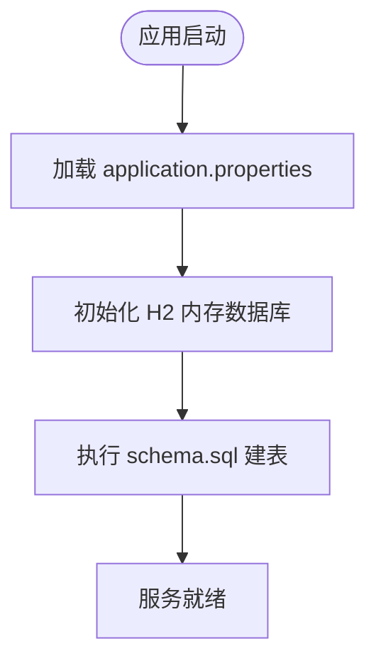
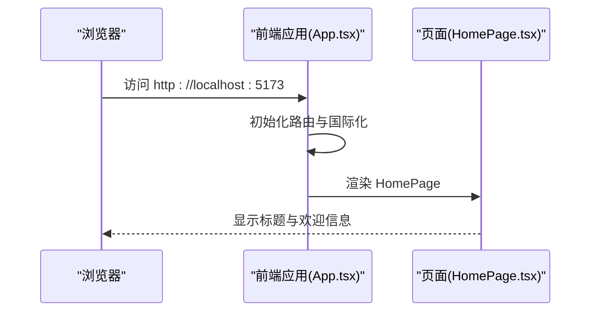
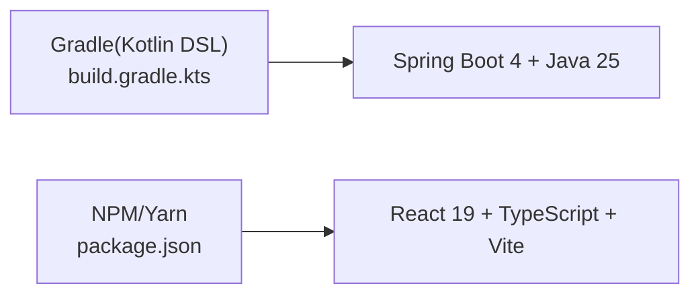
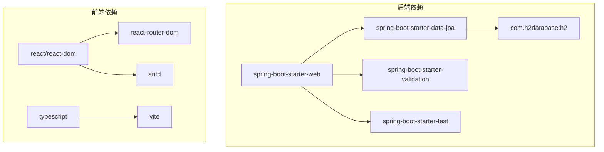

# 项目概述

<cite>
**本文引用的文件**   
- [README.md](file://README.md)
- [TaskBoardApplication.java](file://server/src/main/java/com/taskboard/TaskBoardApplication.java)
- [HealthController.java](file://server/src/main/java/com/taskboard/controller/HealthController.java)
- [ApiResponse.java](file://server/src/main/java/com/taskboard/dto/ApiResponse.java)
- [application.properties](file://server/src/main/resources/application.properties)
- [schema.sql](file://server/src/main/resources/schema.sql)
- [build.gradle.kts](file://server/build.gradle.kts)
- [App.tsx](file://web/src/App.tsx)
- [HomePage.tsx](file://web/src/pages/HomePage.tsx)
- [package.json](file://web/package.json)
</cite>

## 目录
1. [简介](#简介)
2. [项目结构](#项目结构)
3. [核心组件](#核心组件)
4. [架构总览](#架构总览)
5. [详细组件分析](#详细组件分析)
6. [依赖关系分析](#依赖关系分析)
7. [性能与可扩展性](#性能与可扩展性)
8. [故障排查指南](#故障排查指南)
9. [结论](#结论)
10. [附录](#附录)

## 简介
TaskBoard 是一个任务看板管理系统的原型应用，采用前后端分离架构：后端基于 Spring Boot 4（Java 25），前端基于 React 19 + TypeScript。项目提供轻量级的健康检查接口、统一的 API 响应封装、内存数据库 H2 的初始化脚本，以及一个可运行的前端首页骨架。该项目的核心价值在于为团队提供一个直观的任务可视化与管理入口，帮助团队成员跟踪任务状态、协作推进工作流，并通过看板视图提升效率与透明度。

技术选型要点：
- Java 25 + Spring Boot 4.0.x：利用最新语言特性与框架能力，获得更好的性能、并发模型与开发体验。
- H2 内存数据库：便于本地开发与演示，启动即用、数据随进程重启清空，适合原型阶段快速迭代。
- React 19 + TypeScript + Vite + antd：现代前端工具链，类型安全、构建速度快、UI 组件丰富，利于快速搭建高质量界面。
- Gradle Kotlin DSL：以声明式方式管理依赖与构建流程，可读性强且易于扩展。

业务价值与主要用例：
- 任务创建、编辑、删除与状态流转（待办、进行中、已完成等）。
- 看板视图展示任务卡片，支持拖拽或点击切换状态。
- 团队协作与进度可视化，提升沟通效率与交付质量。
- 通过统一 API 响应格式与标准化接口，降低前后端集成成本。

[本节不直接分析具体代码文件]

## 项目结构
仓库采用 monorepo 组织方式，后端与前端分别位于 server 与 web 目录：
- server：Spring Boot 后端，包含控制器、DTO、配置与数据库初始化脚本。
- web：React 前端，使用 Vite 构建，antd 作为 UI 库，react-router 进行路由管理。

图表来源
- [TaskBoardApplication.java:1-12](file://server/src/main/java/com/taskboard/TaskBoardApplication.java#L1-L12)
- [HealthController.java:1-28](file://server/src/main/java/com/taskboard/controller/HealthController.java#L1-L28)
- [ApiResponse.java:1-53](file://server/src/main/java/com/taskboard/dto/ApiResponse.java#L1-L53)
- [application.properties:1-18](file://server/src/main/resources/application.properties#L1-L18)
- [schema.sql:1-6](file://server/src/main/resources/schema.sql#L1-L6)
- [build.gradle.kts:1-42](file://server/build.gradle.kts#L1-L42)
- [App.tsx:1-19](file://web/src/App.tsx#L1-L19)
- [HomePage.tsx:1-42](file://web/src/pages/HomePage.tsx#L1-L42)
- [package.json:1-25](file://web/package.json#L1-L25)

章节来源
- [README.md:1-63](file://README.md#L1-L63)

## 核心组件
- 后端启动器：TaskBoardApplication 作为 Spring Boot 应用的入口，启用自动配置与组件扫描。
- 健康检查控制器：HealthController 暴露 /api/health 接口，返回统一 ApiResponse 包装的健康状态。
- 统一响应体：ApiResponse<T> 定义标准 code/message/data 结构，保证前后端交互一致性。
- 应用配置：application.properties 配置端口、H2 数据库、JPA/Hibernate 行为与 SQL 初始化脚本路径。
- 数据库初始化：schema.sql 定义 health_check 表结构，data.sql 用于填充初始数据（当前仓库未包含 data.sql 内容）。
- 前端应用壳：App.tsx 使用 react-router-dom 与 antd ConfigProvider 设置中文本地化，并挂载 HomePage。
- 前端首页：HomePage.tsx 使用 antd Layout 与 Typography 渲染标题与欢迎信息。
- 前端依赖：package.json 声明 React 19、TypeScript、Vite、antd、react-router-dom 等依赖与脚本命令。

章节来源
- [TaskBoardApplication.java:1-12](file://server/src/main/java/com/taskboard/TaskBoardApplication.java#L1-L12)
- [HealthController.java:1-28](file://server/src/main/java/com/taskboard/controller/HealthController.java#L1-L28)
- [ApiResponse.java:1-53](file://server/src/main/java/com/taskboard/dto/ApiResponse.java#L1-L53)
- [application.properties:1-18](file://server/src/main/resources/application.properties#L1-L18)
- [schema.sql:1-6](file://server/src/main/resources/schema.sql#L1-L6)
- [App.tsx:1-19](file://web/src/App.tsx#L1-L19)
- [HomePage.tsx:1-42](file://web/src/pages/HomePage.tsx#L1-L42)
- [package.json:1-25](file://web/package.json#L1-L25)

## 架构总览
系统采用前后端分离的双端架构：
- 前端通过浏览器访问 React 应用，由 Vite 提供开发服务器与生产构建。
- 后端运行在独立进程中，对外暴露 RESTful API，默认端口 8080，API 前缀 /api。
- 开发时前端可通过代理将 API 请求转发至后端；生产环境通常通过反向代理或网关统一接入。

图表来源
- [App.tsx:1-19](file://web/src/App.tsx#L1-L19)
- [package.json:1-25](file://web/package.json#L1-L25)
- [TaskBoardApplication.java:1-12](file://server/src/main/java/com/taskboard/TaskBoardApplication.java#L1-L12)
- [application.properties:1-18](file://server/src/main/resources/application.properties#L1-L18)

## 详细组件分析

### 后端启动器与控制器
- TaskBoardApplication：使用 @SpringBootApplication 注解，启动 Spring 容器并加载 Web 层组件。
- HealthController：提供 GET /api/health，返回 ApiResponse<Map<String, String>>，包含 status、database 连接状态与时间戳。

图表来源
- [TaskBoardApplication.java:1-12](file://server/src/main/java/com/taskboard/TaskBoardApplication.java#L1-L12)
- [HealthController.java:1-28](file://server/src/main/java/com/taskboard/controller/HealthController.java#L1-L28)
- [ApiResponse.java:1-53](file://server/src/main/java/com/taskboard/dto/ApiResponse.java#L1-L53)

章节来源
- [TaskBoardApplication.java:1-12](file://server/src/main/java/com/taskboard/TaskBoardApplication.java#L1-L12)
- [HealthController.java:1-28](file://server/src/main/java/com/taskboard/controller/HealthController.java#L1-L28)
- [ApiResponse.java:1-53](file://server/src/main/java/com/taskboard/dto/ApiResponse.java#L1-L53)

### 统一响应体设计
ApiResponse<T> 定义了标准化的 API 响应结构：
- code：业务状态码（例如成功 200）。
- message：人类可读的消息。
- data：泛型数据载荷。
提供 success 与 error 静态工厂方法，简化构造逻辑，确保前后端契约一致。

章节来源
- [ApiResponse.java:1-53](file://server/src/main/java/com/taskboard/dto/ApiResponse.java#L1-L53)

### 应用配置与数据库初始化
- application.properties：
  - 服务端口 8080，上下文路径 /。
  - H2 内存数据库 URL、驱动、用户名与密码。
  - JPA/Hibernate 方言、DDL 策略关闭（由脚本管理）、SQL 打印开启。
  - SQL 初始化模式 always，指定 schema.sql 与 data.sql 位置。
  - 启用 H2 Console，路径 /h2-console。
- schema.sql：
  - 定义 health_check 表，包含 id、status、created_at 字段。

图表来源
- [application.properties:1-18](file://server/src/main/resources/application.properties#L1-L18)
- [schema.sql:1-6](file://server/src/main/resources/schema.sql#L1-L6)

章节来源
- [application.properties:1-18](file://server/src/main/resources/application.properties#L1-L18)
- [schema.sql:1-6](file://server/src/main/resources/schema.sql#L1-L6)

### 前端应用壳与页面
- App.tsx：
  - 使用 BrowserRouter 与 Routes 定义路由，根路径映射到 HomePage。
  - 使用 antd ConfigProvider 设置中文本地化。
- HomePage.tsx：
  - 使用 antd Layout 与 Typography 渲染标题与欢迎文本，构成基础页面骨架。

图表来源
- [App.tsx:1-19](file://web/src/App.tsx#L1-L19)
- [HomePage.tsx:1-42](file://web/src/pages/HomePage.tsx#L1-L42)

章节来源
- [App.tsx:1-19](file://web/src/App.tsx#L1-L19)
- [HomePage.tsx:1-42](file://web/src/pages/HomePage.tsx#L1-L42)

### 构建与依赖管理
- 后端 build.gradle.kts：
  - 使用 Spring Boot 4.0.1 插件与依赖管理插件。
  - 指定 Java 工具链版本为 25。
  - 引入 spring-boot-starter-web、spring-boot-starter-data-jpa、H2、validation 与 test starter。
- 前端 package.json：
  - 依赖 React 19、react-dom、react-router-dom、antd。
  - 开发依赖包括 TypeScript、Vite 与 React 插件。
  - 脚本命令 dev/build/preview 对应 Vite 生命周期。

图表来源
- [build.gradle.kts:1-42](file://server/build.gradle.kts#L1-L42)
- [package.json:1-25](file://web/package.json#L1-L25)

章节来源
- [build.gradle.kts:1-42](file://server/build.gradle.kts#L1-L42)
- [package.json:1-25](file://web/package.json#L1-L25)

## 依赖关系分析
- 后端依赖：
  - Spring Boot Web Starter：提供嵌入式 Tomcat 与 MVC 能力。
  - Spring Data JPA：ORM 抽象与 Repository 支持。
  - H2：内存数据库，便于本地开发与测试。
  - Validation：参数校验能力。
  - Test Starter：单元测试与集成测试支撑。
- 前端依赖：
  - React 19：UI 框架核心。
  - react-router-dom：客户端路由。
  - antd：企业级 UI 组件库。
  - TypeScript：类型系统与开发体验增强。
  - Vite：现代化构建工具，提供快速热更新与高效打包。

图表来源
- [build.gradle.kts:22-37](file://server/build.gradle.kts#L22-L37)
- [package.json:11-23](file://web/package.json#L11-L23)

章节来源
- [build.gradle.kts:1-42](file://server/build.gradle.kts#L1-L42)
- [package.json:1-25](file://web/package.json#L1-L25)

## 性能与可扩展性
- 后端性能：
  - Spring Boot 4 与 Java 25 带来更好的运行时优化与并发处理能力。
  - H2 内存数据库在本地开发场景下具备极低延迟，但需注意数据非持久化。
  - 建议在生产环境替换为持久化数据库（如 PostgreSQL/MySQL），并引入连接池与缓存层。
- 前端性能：
  - Vite 提供快速的模块解析与增量构建，显著提升开发体验。
  - React 19 的新特性有助于减少重渲染与提升交互流畅度。
  - 建议按需引入 antd 组件与样式，减小包体积。
- 可扩展性：
  - 后端建议分层架构（Controller/Service/Repository），引入领域模型与 DTO 转换。
  - 前端建议按功能域拆分模块与页面，使用状态管理（如 Zustand/Redux）管理复杂状态。
  - 引入 API 客户端封装与错误处理中间件，提高健壮性与可维护性。

[本节提供通用指导，不直接分析具体代码文件]

## 故障排查指南
- 后端无法启动或端口占用：
  - 检查 application.properties 中 server.port 是否被其他进程占用。
  - 确认 Java 25 已正确安装且环境变量可用。
- H2 控制台不可用：
  - 确认 spring.h2.console.enabled=true 且访问路径 /h2-console。
  - 检查 schema.sql 与 data.sql 是否存在且语法正确。
- 健康检查接口异常：
  - 调用 GET /api/health，确认返回 ApiResponse 结构与状态码。
  - 若数据库连接失败，检查 spring.datasource.url 与驱动类名。
- 前端构建失败：
  - 检查 Node.js 版本是否符合要求（Node.js 18+）。
  - 清理 node_modules 后重新安装依赖，再执行 npm run build。
- 路由不生效：
  - 确认 App.tsx 中 BrowserRouter 与 Routes 配置正确。
  - 检查 HomePage 是否正确导出并在路由中注册。

章节来源
- [application.properties:1-18](file://server/src/main/resources/application.properties#L1-L18)
- [HealthController.java:1-28](file://server/src/main/java/com/taskboard/controller/HealthController.java#L1-L28)
- [App.tsx:1-19](file://web/src/App.tsx#L1-L19)

## 结论
TaskBoard 项目以 Spring Boot 4 与 React 19 为核心，构建了现代化的前后端分离架构。通过统一响应体、内存数据库与简洁的前端骨架，项目在保持低门槛的同时具备良好的扩展潜力。随着业务演进，建议逐步完善领域建模、API 设计与前端状态管理，并引入更稳健的数据存储与监控体系，以提升系统的稳定性与可维护性。

[本节为总结性内容，不直接分析具体代码文件]

## 附录
- 快速启动参考：
  - 后端：cd server，使用 Gradle wrapper 或本地 Gradle 运行 bootRun。
  - 前端：cd web，npm install 后 npm run dev。
  - 健康检查：curl http://localhost:8080/api/health。
- 术语说明：
  - Monorepo：多模块仓库，统一管理前后端代码。
  - DTO：数据传输对象，用于接口间数据传递。
  - H2 Console：H2 数据库提供的 Web 管理界面。

章节来源
- [README.md:18-63](file://README.md#L18-L63)