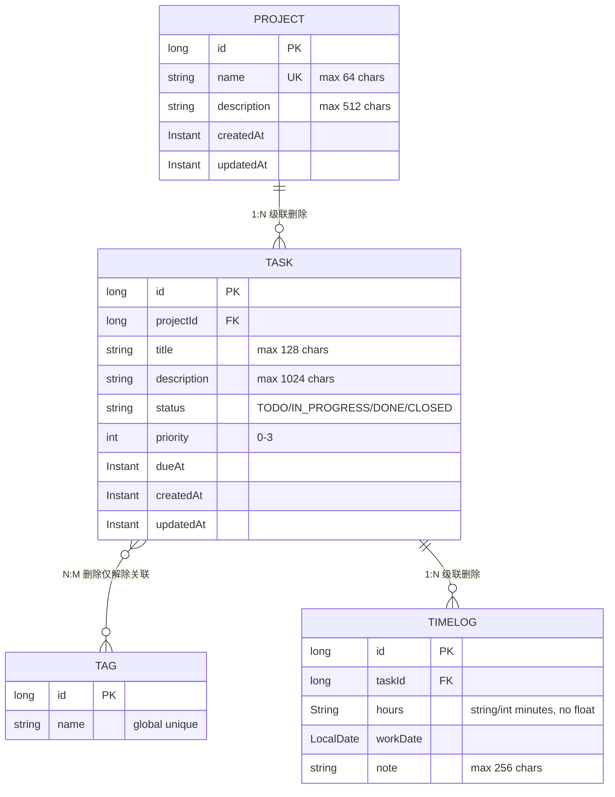
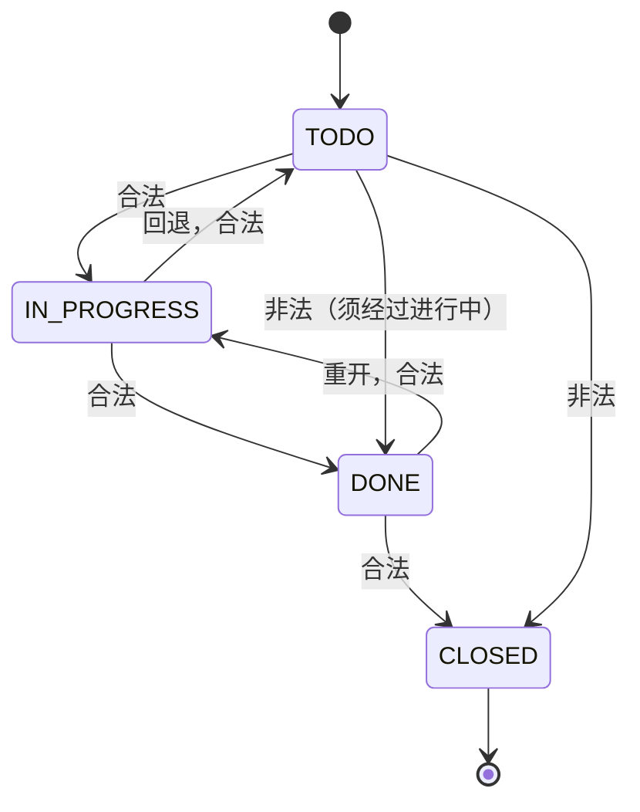

# TaskBoard 领域模型（Domain Model）

> 对应 PRD B.3 实体定义，受章程红线 9/10 约束。  
> 所有删除策略来自 PRD B.3 description 声明，未经裁决不得修改。

## 实体关系总览（ER 图）

## 实体职责

### Project — 项目看板容器
**一句话职责**：项目管理看板的顶层容器，承载任务分组与生命周期，删除时级联清除其下所有任务及时长记录。

**字段说明**：
| 字段 | 类型 | 约束 | 来源依据 |
| --- | --- | --- | --- |
| `id` | `Long` | PK, 自增 | PRD B.3 |
| `name` | `String` | 必填, 唯一, ≤64 字符 | PRD B.3; 章程红线 10 |
| `description` | `String` | 可选, ≤512 字符 | PRD B.3 |
| `createdAt` | `Instant` | 不可变 | PRD B.3; 章程第 7 条 |
| `updatedAt` | `Instant` | 自动更新 | PRD B.3; 章程第 7 条 |

**关联关系**：
- **一对多 → Task**：一个项目包含多个任务
- **删除策略（PRD B.3）**：删除 Project 时级联删除其所有 Task，Task 的 TimeLog 随 Task 级联删除  
  **引用契约条款**：PRD B.3 "删除 Project 级联删除其 Task、Task 的 TimeLog"

---

### Task — 任务卡片
**一句话职责**：看板上的可执行单元，通过状态机驱动流转并支持标签归类，删除时级清时长记录。

**字段说明**：
| 字段 | 类型 | 约束 | 来源依据 |
| --- | --- | --- | --- |
| `id` | `Long` | PK, 自增 | PRD B.3 |
| `projectId` | `Long` | FK → Project.id | PRD B.3 |
| `title` | `String` | 必填, ≤128 字符 | PRD B.3 |
| `description` | `String` | 可选, ≤1024 字符 | PRD B.3 |
| `status` | `String` | 四态状态机 (TODO/IN_PROGRESS/DONE/CLOSED) | PRD B.4 |
| `priority` | `int` | 0-3 (0 最低, 3 最高) | 最佳实践推断（PRD 表格提及优先级但字段未详述） |
| `dueAt` | `Instant` | 可选到期时间 | 最佳实践推断（PRD 表格提及 but 字段类型按章程用 Instant） |
| `createdAt` | `Instant` | 不可变 | PRD B.3; 章程第 7 条 |
| `updatedAt` | `Instant` | 自动更新 | PRD B.3; 章程第 7 条 |

**关联关系**：
- **多对一 → Project**：任务归属某个项目
- **多对多 ↔ Tag**：任务可打上多个全局标签（Tag 不属于项目）  
  **删除策略（PRD B.3）**：删除 Task 时级联删除其 TimeLog，并通过 JPA `REMOVE` 操作解绑 Tag-Task 关联记录  
  **引用契约条款**：PRD B.3 "删除 Task 级联删除其 TimeLog 并解除与 Tag 的关联"
- **一对多 → TimeLog**：任务可有多条工时记录  
  **删除策略**：同上，级联删除

**状态机约束（PRD B.4）**：

---

### Tag — 全局标签词表
**一句话职责**：提供跨项目的统一标签词表，用于任务的分类检索，删除时仅解除与任务的关联而不影响任务本身。

**字段说明**：
| 字段 | 类型 | 约束 | 来源依据 |
| --- | --- | --- | --- |
| `id` | `Long` | PK, 自增 | PRD B.3 |
| `name` | `String` | 必填, 全局唯一 | PRD B.3 "跨项目共享" |

**关联关系**：
- **多对多 ↔ Task**：标签属于全局词表，被多个任务复用  
  **删除策略（PRD B.3）**：删除 Tag 仅解除与其关联的 Task-Tag 映射记录，不删除关联的任务  
  **引用契约条款**：PRD B.3 "删除 Tag 仅解除关联"

---

### TimeLog — 工时记录
**一句话职责**：记录任务投入的工作时长与日期，支撑统计报表的聚合计算。

**字段说明**：
| 字段 | 类型 | 约束 | 来源依据 |
| --- | --- | --- | --- |
| `id` | `Long` | PK, 自增 | PRD B.3 |
| `taskId` | `Long` | FK → Task.id | PRD B.3 |
| `hours` | `String` | 工时值（字符串或整数分钟，禁止浮点） | PRD B.3 "禁浮点"; 契约"金额/数量禁浮点" |
| `workDate` | `LocalDate` | 工作日期（最佳实践：无需时刻信息） | 最佳实践推断（PRD 用 `workDate` 语义，非 Instant） |
| `note` | `String` | 可选备注, ≤256 字符 | PRD B.3 |

**关联关系**：
- **多对一 → Task**：工时记录归属某个任务  
  **删除策略**：删除 Task 时级联删除其 TimeLog  
  **引用契约条款**：PRD B.3 "删除 Task 级联删除其 TimeLog"

---

## 关键领域决策

### D01 - 删除采用物理级联而非软删除
**决策**：Project / Task 删除使用 JPA `@OnDelete(action = OnDeleteAction.CASCADE)` 物理删除子实体。  
**理由**：
- PRD B.3 明确使用"级联删除"术语而非"软删除"
- 教学项目无审计合规需求，物理删除简化实现
- H2 内存库重启即清空，软删除无业务价值

**风险**：误删不可恢复；前端删除二次确认已缓解此风险（PRD B.2 前端页面清单）

### D02 - Tag 全局共享不属于项目
**决策**：Tag 是独立顶级实体，Task-Tag 通过中间表 `task_tags` 关联。  
**理由**：
- PRD B.3 明确"Tag 不属于某个 Project，是全局词表"
- 避免数据冗余（同一标签名在不同项目中不会重复存储）
- 支持跨项目任务筛选

**影响**：创建 Tag 时无需传入 `projectId`；查询标签列表接口 `/api/tags` 返回全局集合

### D03 - TimeLog.hours 使用 String 存储工时分
**决策**：工时字段不采用 `double`/`float`，改用 `String` 或 `Integer`（分钟数）。  
**理由**：
- PRD B.3 "工时禁浮点"
- 契约规则"金额/数量禁浮点"（呼应 30 号契约）
- 避免 0.1 + 0.2 ≠ 0.3 精度问题

**推荐**：优先使用 `Integer`（整数分钟），次选 `String`（保留原始输入）

### D04 - workDate 使用 LocalDate 非 Instant
**决策**：工作日期字段采用 `java.time.LocalDate`，不含时刻信息。  
**理由**：
- 字段命名 `workDate`（非 `workAt`）暗示仅日期粒度
- 工时填报通常按天记录，无需精确到小时/分钟
- `LocalDate` 与 ISO-8601 日期格式 (`yyyy-MM-dd`) 天然对齐

---

## 代码位置映射（供章程红线 10 变更审计使用）

| 实体 | 后端 Entity | Repository | Service | Controller | DTO (待生成) |
| --- | --- | --- | --- | --- | --- |
| Project | `server/src/main/java/com/taskboard/entity/Project.java` | `ProjectRepository.java` | `ProjectService.java` | `ProjectController.java` | `project.dto.*` |
| Task | `server/src/main/java/com/taskboard/entity/Task.java` | `TaskRepository.java` | `TaskService.java` | `TaskController.java` | `task.dto.*` (已生成: `web/src/api/schema.d.ts`) |
| Tag | *(待创建)* | *(待创建)* | *(待创建)* | *(待创建)* | `tag.dto.*` |
| TimeLog | *(待创建)* | *(待创建)* | *(待创建)* | *(待创建)* | `timelog.dto.*` |

> **注意**：当前仓库已实现了 Project 和 Task 实体（见 [Project.java](file:///d:/test/test1-qoder/server/src/main/java/com/taskboard/entity/Project.java)、[Task.java](file:///d:/test/test1-qoder/server/src/main/java/com/taskboard/entity/Task.java)），其他两类实体待后续任务实现。  
> 每次修改实体字段前，必须列出三处引用点并等待确认（章程红线 10）。
