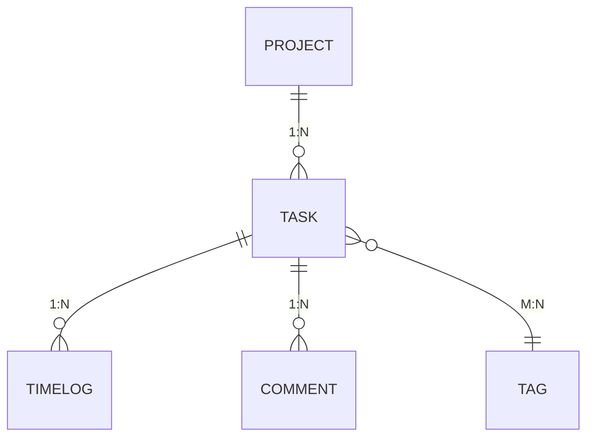

# TaskBoard 规范资产清单

> **创建时间**: 2026-10-03  
> **目的**: 独立列出所有规范资产（不含代码），便于审查、维护和复用

---

## 一、规则集（`.qoder/rules/`）

| # | 文件 | 类型 | 职责 | 行数 | 更新频率 |
|---|------|------|------|------|---------|
| 1 | [00-project-charter.md](./00-project-charter.md) | 章程 | 环境基线 + 红线规则（最高优先级） | ~100 | 需求变更时 |
| 2 | [10-java-backend.md](./10-java-backend.md) | 编码规范 | Java 后端分层约束、命名约定、依赖白名单 | ~80 | 技术栈升级时 |
| 3 | [20-react-frontend.md](./20-react-frontend.md) | 编码规范 | React/TypeScript/antd 前端的组件结构、路由、主题 | ~70 | UI 框架升级时 |
| 4 | [30-api-contract.md](./30-api-contract.md) | 契约模式 | API 响应包装、分页标准、HTTP 状态码速查表 | ~50 | 接口协议变更时 |

**总计**: 4 个文件，约 300 行

---

## 二、技能库（`.qoder/skills/`）

| # | 文件 | 类型 | 触发场景 | 核心功能 |
|---|------|------|---------|---------|
| 1 | `crud-vertical-slice/SKILL.md` | 全栈技能 | 新增实体的增删改查 | 从数据库到前端页面的完整脚手架生成 |
| 2 | `api-contract-sync/SKILL.md` | 同步技能 | 后端字段/分页/错误码变更 | 自动同步 schema.d.ts 与前端消费代码 |
| 3 | `jpa-h2-bootstrap/SKILL.md` | 后端技能 | 新增数据表 | 生成 Entity + Repository + DTO |
| 4 | `antd-6-page-scaffold/SKILL.md` | 前端技能 | 新建展示/表单页面 | antd 6 页面骨架（含三态、契约类型接入） |
| 5 | `test-writer/SKILL.md` | 测试技能 | 模块实现完成后 | 编写 Service 单测 / 组件测试 |
| 6 | `code-reviewer/SKILL.md` | 评审技能 | 代码提交前 | 只读评审，Checklist 式扫描 |

**总计**: 6 个技能文件

---

## 三、子智能体（`.qoder/agents/`）

| # | 文件 | 角色 | 权限 | 职责 |
|---|------|------|------|------|
| 1 | `architect.md` | 架构师 | Read + Write (docs/) | 设计领域模型、API 契约、ADR |
| 2 | `backend-java-engineer.md` | 后端工程师 | Read + Write (server/) | 实现 Entity → Repository → Service → Controller |
| 3 | `frontend-react-engineer.md` | 前端工程师 | Read + Write (web/) | 实现页面、组件、数据获取 |
| 4 | `test-engineer.md` | 测试工程师 | Read + Write (server/test/, web/src/) | 编写单元测试、组件测试 |
| 5 | `code-reviewer.md` | Code Review 员 | **Read Only** | 代码风格、 Charter 合规性评审 |
| 6 | `contract-reviewer.md` | 接口合约评审员 | **Read Only** | 核对 API 实现是否符合契约文档 |
| 7 | `researcher.md` | 技术事实核查员 | **Read Only** | 确认依赖/注解/API 兼容性 |

**总计**: 7 个子智能体（3 个写权限 + 4 个只读）

---

## 四、Hooks 系统（`.qoder/hooks/`）

| # | 脚本名 | 触发时机 | 执行内容 |
|---|--------|---------|---------|
| 1 | `pre-commit-check.ps1` / `.sh` | `git commit` 前 | 执行 charter 红线检查 + 构建验证 |
| 2 | `guard-test-engineer.ps1` / `.sh` | AI 试图直接修改代码时 | 拦截 test-engineer 对业务代码的非法写入 |

**总计**: 2 套跨平台脚本

---

## 五、架构决策记录（`docs/architecture/adr-*.md`）

| # | 文件 | 决策主题 | 决定 | 影响范围 |
|---|------|---------|------|---------|
| 1 | [adr-001-h2-inmemory.md](./architecture/adr-001-h2-inmemory.md) | H2 内存库选择 | 使用 H2，不用 Flyway/Liquibase | 数据库层 |
| 2 | [adr-002-contract-first.md](./architecture/adr-002-contract-first.md) | 契约优先开发 | 先写 API Contract，再生成前端类型 | 前后端协作 |
| 3 | [adr-003-zod-runtime-validation.md](./architecture/adr-003-zod-runtime-validation.md) | Zod 运行时校验 | 前端用 zod 校验用户输入 | 前端层 |
| 4 | [adr-004-transitions-actions.md](./architecture/adr-004-transitions-actions.md) | 任务状态转换 | PATCH `/tasks/{id}/transitions` 动作端点 | 任务模块 |
| 5 | [adr-005-test-engineer-hook-isolation.md](./architecture/adr-005-test-engineer-hook-isolation.md) | Hook 隔离测试 | test-engineer 不污染主代码 | 测试体系 |
| 6 | [adr-006-comment-entity.md](./architecture/adr-006-comment-entity.md) | Comment 实体设计 | 单向 ManyToOne + 物理删除 + 作者文本字段 | 评论模块 |

**总计**: 6 份 ADR

---

## 六、API 契约（`docs/architecture/api-contract-*.yaml`）

| # | 文件 | 覆盖范围 | 版本 |
|---|------|---------|------|
| 1 | [api-contract-v1.yaml](./architecture/api-contract-v1.yaml) | Project / Task / Tag / TimeLog / Health / Stats | v1.0 |
| 2 | [api-contract-comment-supplement.yaml](./architecture/api-contract-comment-supplement.yaml) | Comment（新增 3 个端点） | v1.1 |

**总计**: 2 份契约文档

---

## 七、领域模型（`docs/architecture/domain-model.md`）

定义四大核心实体的关系、状态机、字段约束：



---

## 八、PRD 与验收标准（`docs/prd.md`）

产品需求规格基线，包含：
- 实体定义（Project / Task / Tag / TimeLog / Comment）
- 状态机（Task Status）
- API 端点清单
- 前端页面清单
- **V1-V6 验收标准**

---

## 九、缺陷账本与审计报告（`docs/`）

### 缺陷账本
| 文件 | 内容 |
|------|------|
| [defect-ledger.md](./defect-ledger.md) | D01-D20+ 缺陷追踪（现象 / 类型 / 影响 / 修复状态） |

### 审计报告
| 文件 | 审计对象 | 方法 |
|------|---------|------|
| [rule-audit.md](./rule-audit.md) | 规则集一致性 | 26 条规则逐条核对 |
| [agent-audit.md](./agent-audit.md) | 子智能体合规性 | contract-reviewer 扫描 |
| [skill-audit.md](./skill-audit.md) | 技能库有效性 | 横向检查 |
| [wiki-rule-audit.md](./wiki-rule-audit.md) | Wiki ↔ 代码漂移检测 | ADR 五步演练 |
| [quality-loop-report.md](./quality-loop-report.md) | 质量闭环报告 | 体检 + 修复 + 回流 |
| [v1-v6-acceptance-report.md](./v1-v6-acceptance-report.md) | V1-V6 验收报告 | 实际证据判定 |

**总计**: 6 份审计报告

---

## 十、其他关键文档

| 文件 | 用途 |
|------|------|
| [decisions.md](./decisions.md) | 架构决策总表（引用 adr-index） |
| [decisions-index.md](./architecture/decisions-index.md) | ADR 索引与模板 |
| [prd.md](./prd.md) | 产品需求规格 |
| [README.md](../README.md) | 项目概述 + 一键启动指引（引用 charter） |

---

## 📊 资产统计汇总

| 类别 | 文件数 | 总行数估算 | 维护频率 |
|------|--------|-----------|---------|
| 规则集（rules/） | 4 | ~300 | 月检 |
| 技能库（skills/） | 6 | ~500 | 流程变更时 |
| 子智能体（agents/） | 7 | ~350 | rarely |
| Hooks 系统（hooks/） | 2 | ~100 | rarely |
| ADR（adr-*/） | 6 | ~400 | 架构变更时 |
| API 契约（api-contract-*/） | 2 | ~600 | 接口变更时 |
| 领域模型 + PRD | 2 | ~400 | 需求变更时 |
| 缺陷账本 + 审计 | 6 | ~800 | 迭代末 |
| 其他文档 | 3 | ~200 | 偶尔 |
| **总计** | **38** | **~3650** | — |

---

## 🔗 交叉引用关系

```
prd.md ──────────────────→ V1-V6 验收标准
  │
  ├─→ architecture/domain-model.md ─→ 实体关系、状态机
  │     │
  │     ├─→ adr-001 ~ adr-006 ─→ 架构决策依据
  │     │
  │     └─→ api-contract-v1.yaml + comment-supplement.yaml
  │           │
  │           ├─→ schema.d.ts（自动生成，web/src/api/）
  │           │
  │           └─→ api-contract-sync 技能
  │
  ├─→ defect-ledger.md ─→ D01-D20+ 缺陷追踪
  │
  ├─→ rule-audit.md ─→ 26 条规则核对结果
  ├─→ agent-audit.md ─→ 子智能体合规性
  ├─→ skill-audit.md ─→ 技能库有效性
  └─→ quality-loop-report.md ─→ 质量闭环

00-project-charter.md ──→ 红线规则（最高优先级）
  │
  ├─→ 10-java-backend.md ─→ 后端规范
  ├─→ 20-react-frontend.md ─→ 前端规范
  └─→ 30-api-contract.md ─→ 契约模式

.qoder/skills/crud-vertical-slice/ ─→ 新模块生成骨架
.qoder/skills/jpa-h2-bootstrap/ ────→ 建表脚手架
.qoder/skills/antd-6-page-scaffold/ ─→ 页面骨架

.hooks/pre-commit-check/ ──→ git commit 触发 charter 红线检查
.hooks/guard-test-engineer/ ──→ 拦截 AI 直接修改业务代码
```

---

## ✅ 规范资产使用指南

### 新手入门阅读顺序
1. **README.md** → 了解项目是什么、如何启动
2. **00-project-charter.md** → 理解红线规则（不可违反）
3. **prd.md** → 理解需求和验收标准
4. **architecture/domain-model.md** → 理解实体关系
5. **10-java-backend.md + 20-react-frontend.md** → 按角色阅读对应编码规范

### 开发工作流
1. **新需求分析**：prd.md → domain-model.md → api-contract-v1.yaml
2. **设计阶段**：architect 生成 ADR + 补充 API Contract
3. **实现阶段**：
   - crud-vertical-slice 技能生成骨架
   - backend / frontend engineer 各自遵循 10 / 20 号规范
   - gen:api 自动生成 schema.d.ts
4. **评审阶段**：
   - pre-commit-check 自动触发 charter 红线检查
   - code-reviewer 只读扫描
   - contract-reviewer 核对 API 实现
5. **测试阶段**：test-writer 编写单测
6. **闭环阶段**：quality-loop-report 记录缺陷回流

### 维护者须知
- **规则集**：每迭代末例行审计（rule-audit.md）
- **技能库**：流程变更后更新
- **ADR**：每次架构决策后追加
- **API 契约**：接口变更后手动同步或运行 api-contract-sync 技能
- **Wiki/Knowledge**：通过 ADR 正式化流程保持代码 ↔ 文档一致性

---

## 🚀 下次迭代计划

1. **V6 clean-room 验证**：全新 clone + `start.bat` 一键启动测试
2. **Comment 端到端冒烟测试**：启动后端 + 前端 → 发表评论 → 查看列表 → 删除评论
3. **V3 高严重度项修复**（P0）：
   - ProjectService/TagService 迁移到 BizException
   - TaskController/TimeLogController DELETE 端点返回 ApiResponse<Void>
4. **规范资产增量更新**：将 Comment 相关资产纳入日常维护
