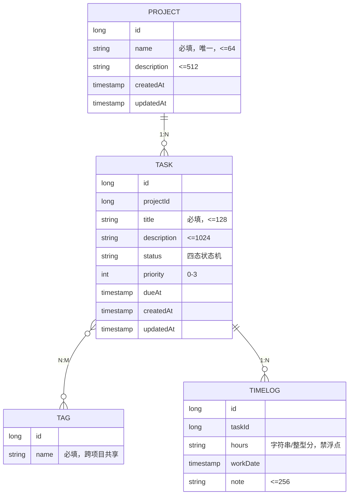
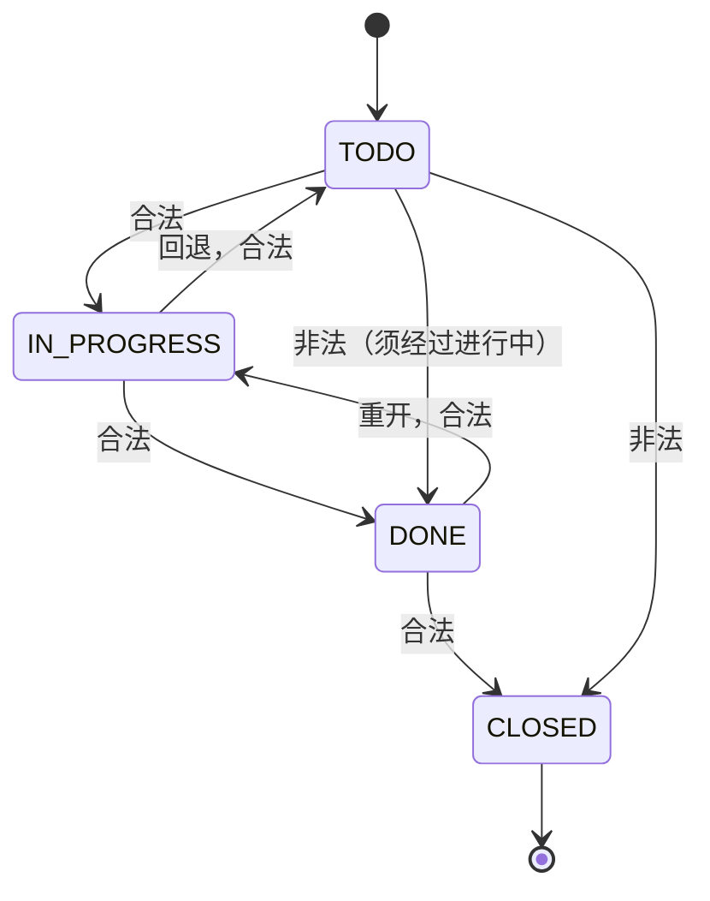

功能范围

模块	后端	前端
项目管理	Project 实体 CRUD、删除级联策略	项目列表、新建/编辑表单、删除二次确认
任务管理	Task 实体 CRUD、标签多对多	任务看板（拖拽换状态）、详情抽屉
状态流转	状态机校验（待办→进行中→已完成→已关闭）	拖拽交互、非法流转的前端禁用
工时记录	TimeLog 实体、按任务聚合	工时填报表单
统计报表	按人/周/状态聚合接口	报表页 + 图表
全局	统一响应包、错误码分段、参数校验、全局异常、OpenAPI 契约	布局路由、主题与深色模式

# 附录 B TaskBoard 完整规格

> 本附录是教学项目 TaskBoard 的完整需求规格，对应正文各处引用的 `docs/prd.md`。第 2 章把它写入仓库，第 10 章的 Spec 驱动、第 14 章的验收都以它为准。
>
> **定位重申**：TaskBoard 是讲解智能体规范方案的**载体**。它的功能复杂度是刻意选定的——足够暴露四类失效模式、足以撑起子智能体并行拆解，但绝不引入鉴权/多租户/缓存等与"规范化编程"无关的噪音。

## B.1 项目定位

一个极简的任务看板系统，前后端分离：

- 后端 Spring Boot 4 + H2 内存库，提供 REST API；
- 前端 React 19 + antd 6，提供看板式管理界面；
- 数据进程内存活，重启回到种子数据（教学特性，非缺陷）。

## B.2 功能范围

| 模块 | 后端 | 前端 | 教学承载 |
| --- | --- | --- | --- |
| 项目管理 | Project CRUD、删除级联策略 | 项目列表、新建/编辑表单、删除二次确认 | 第一个纵切（实战一）、契约建立 |
| 任务管理 | Task CRUD、状态字段、标签多对多 | 任务列表、任务表单 | 复用实验（风格一致性） |
| 状态流转 | 状态机校验、transitions 动作端点 | 看板拖拽换状态、非法流转禁用 | 复杂功能（Spec 驱动实战） |
| 工时记录 | TimeLog CRUD、按任务聚合 | 工时填报表单、任务工时列表 | 并行开发（多实体） |
| 统计报表 | 按人/周/状态聚合接口 | 报表页 + 图表 | 对照实验（度量对象） |
| 全局 | ApiResponse、错误码分段、参数校验、全局异常、OpenAPI | 布局路由、主题与深色模式 | 贯穿各章 |

**明确不做**：真实登录鉴权、多租户、缓存、消息队列、分页性能优化、国际化。这些对讲解智能体规范无益，只会稀释焦点。

## B.3 领域模型

四类实体 + 关系（对应 `docs/architecture/domain-model.md`）：

**关键领域决策**（各有一条 ADR 支撑，见附录 A 的 decisions 目录）：

- **删除策略**（PRD 必须定义，否则 AI 会自行发明——D07）：删除 Project 级联删除其 Task、Task 的 TimeLog；删除 Task 级联删除其 TimeLog 并解除与 Tag 的关联；删除 Tag 仅解除关联。所有级联在接口 description 声明。
- **状态机**（ADR-004）：状态变更是动作不是字段赋值，走 `transitions` 端点，合法性只在 service 判定。
- **标签跨项目共享**：Tag 不属于某个 Project，是全局词表，Task 与 Tag 多对多。此点 PRD 明确定义，避免 AI 自行决定"标签属于项目"。
- **工时无浮点**：hours 用字符串或整型分存储，避免浮点精度问题（呼应 30 号契约"金额/数量禁浮点"）。

## B.4 任务状态机

- 四态：`TODO`（待办）、`IN_PROGRESS`（进行中）、`DONE`（已完成）、`CLOSED`（已关闭）。
- 非法流转返回 `42xxx` 错误码，前端拖拽时禁用非法目标列。
- `CLOSED` 为终态，不可再流转。

## B.5 API 契约 v1（端点清单）

对应 `docs/architecture/api-contract-v1.yaml`。全部响应包 `ApiResponse<T>`，分页用 `PageResult<T>`，时间 ISO-8601。

| 方法 | 路径 | 说明 |
| --- | --- | --- |
| GET | /api/health | 健康检查 |
| GET | /api/projects | 项目列表（分页） |
| POST | /api/projects | 新建项目 |
| GET | /api/projects/{id} | 项目详情 |
| PUT | /api/projects/{id} | 更新项目 |
| DELETE | /api/projects/{id} | 删除项目（级联任务，description 声明） |
| GET | /api/tasks | 任务列表（可按 project/status 过滤，分页） |
| POST | /api/tasks | 新建任务 |
| GET | /api/tasks/{id} | 任务详情 |
| PUT | /api/tasks/{id} | 更新任务（不含 status） |
| PATCH | /api/tasks/{id}/transitions | 状态流转，body `{to}`，非法返回 42xxx |
| DELETE | /api/tasks/{id} | 删除任务（级联工时） |
| GET | /api/tags | 标签列表 |
| POST | /api/tags | 新建标签 |
| PUT | /api/tasks/{id}/tags | 设置任务标签（全量替换） |
| GET | /api/timelogs | 工时列表（可按 task 过滤） |
| POST | /api/timelogs | 填报工时 |
| DELETE | /api/timelogs/{id} | 删除工时 |
| GET | /api/stats/by-assignee | 按人统计（预留：无指派人时按项目） |
| GET | /api/stats/by-week | 按周统计 |
| GET | /api/stats/by-status | 按状态统计 |

**契约要点**：

- 统一响应包：`ApiResponse<T> { code, message, data }`，`code=0` 成功；
- 分页：`page`（从 1 起）、`size`（默认 20，上限 100），响应 `PageResult<T> { items, total, page, size }`；
- 错误码分段：40xxx 参数/校验、42xxx 状态流转、49xxx 内部错误；
- 动作型端点用 `/api/<资源>/<id>/<动作>`（transitions 是范例）。

## B.6 数据字典（种子）

`data.sql` 预置：

- 3 个项目：「教程研发」「个人待办」「学习计划」；
- 每项目 3-5 条任务，覆盖四态各若干（便于统计页演示）；
- 5 个标签：紧急、重要、Bug、功能、文档；
- 若干工时记录，跨最近两周（便于"按周"统计）。

## B.7 前端页面清单

| 页面 | 路由 | 核心组件 | 三态 |
| --- | --- | --- | --- |
| 项目列表 | /projects | Table + Modal 表单 | 必 |
| 任务看板 | /projects/:id/board | 四列拖拽（antd + dnd） | 必 |
| 任务详情 | 抽屉 | Form + transitions | — |
| 工时填报 | /timelogs | Form + Table | 必 |
| 统计报表 | /stats | 三图表（按人/周/状态） | 必 |

全局：Layout + 侧边导航 + 主题切换（antd 6 CSS Variables，深色模式）。

## B.8 验收标准 V1-V6（第 14 章逐条判定）

| 编号 | 标准 | 判定方法 |
| --- | --- | --- |
| **V1** | 一条命令启动前后端，无手工干预 | 干净环境跑 start 脚本，健康检查可访问 |
| **V2** | 接口与契约一致，前端类型全部生成，无手写接口类型 | grep 前端无手写 API interface；gen:api 后 tsc 零错 |
| **V3** | 模块实现风格可互换 | 第 7 章一致性对比；遮文件名分不出哪次生成 |
| **V4** | 跨端字段改动能在编译期暴露 | 故意改字段名，tsc 报错定位 |
| **V5** | 新增第五类实体 ≤ 数轮对话可运行、无需逐条教规范 | 第 14 章加 Comment 实体 |
| **V6** | 规范资产随仓库提交，同事 clone 可直接复现 | 第 14 章全新 clone 演练 |

**V5、V6 是全书价值锚点**：V5 检验"能力是否真沉淀下来了"，V6 检验"这套方案属于团队而不属于个人"。

## B.9 为什么选这个体量

| 如果太小（单表 CRUD） | 如果太大（真实企业系统） | TaskBoard 的甜区 |
| --- | --- | --- |
| 撑不起并行拆解，子智能体无从演示 | 鉴权/部署等噪音稀释规范主题 | 四实体 + 状态机 + 统计，够拆解又够聚焦 |
| 跨端契约太简单，D02 类问题不易出现 | 迭代周期长，教学节奏拖沓 | 六模块，正好走完 v0→v3 递进 |

它被刻意设计成"规则、技能、子智能体三层机制各自都有不可替代的用武之地"——每一篇都有非它不能演示的东西。

